我们曾经学过 BST 这个数据结构，虽然其平均时间复杂度为 $O(\log N)$，但在最坏情况下，BST 可能退化成线性的，此时树的高度为 $O(N)$，我们希望有某种平衡机制将树的高度保持在 $O(\log N)$，这一讲我们会提出两种高级的数据结构——AVL Trees 和 Splay Trees

## AVL Trees

### AVL Trees Definition

我们给出 AVL Trees 的定义：

首先我们规定空树的高度为 $-1$，并且空二叉树是高度平衡的，对于一颗非空树 T（记其左子树为 TL，右子树为 TR），如果它满足以下几个条件：

- TL 和 TR 均为高度平衡的
- $|h_L-h_R|\leq 1$，这里 $h_L$ 和 $h_R$ 分别为 $T_L$ 和 $T_R$ 的高度

则称该树 $T$ 是高度平衡的。

并且为了辅助树平衡的判断，我们定义**平衡因子** $BF(node)=h_L-h_R$，对于 AVL Trees ，有 $BF(node)\in \{-1,0,1\}$

### AVL Trees Rotation

AVL Trees 的特点在于 rotation 操作，其能在保持二叉搜索树性质的同时，使得失衡节点（我们将平衡因子绝对值$>1$的节点称为失衡节点）重新恢复平衡，根据节点失衡情况的不同，旋转操作可以分为四种：RR rotation、LL rotation、LR rotation、RL rotation

#### RR rotation

我们来看这样一种场景，插入十二月份的名字，按照字典序排序

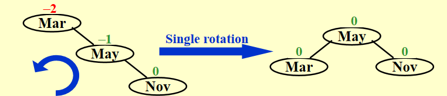

The trouble maker `Nov` is in the right subtree's right subtree of the trouble finder `Mar`. Hence it is called an **RR rotation**（新节点插在了失衡节点的右子树的右子树）

RR rotation的旋转比较简单，我们只需要让 `Mar`（失衡节点）左旋一次即可。

一般情况如下图：

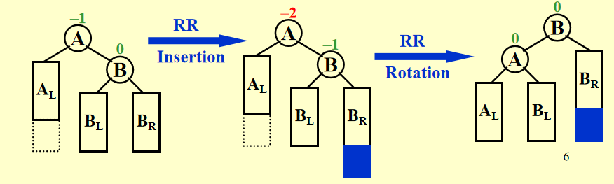

需要注意的是，当失衡节点的 `child` 节点有左子节点（不妨记其为 `grand_child`，在图中也即 $B_L$ 节点）的时候，我们需要将 `grand_child` 作为原失衡节点的右子节点。

#### LL rotation

LL rotation 是 RR rotation 的镜像操作，这里就不赘述

#### LR rotation

如下图所示，新插入的节点 `Jan` 在失衡节点 `May` 的左子树的右子树中，故称为 **LR rotation**

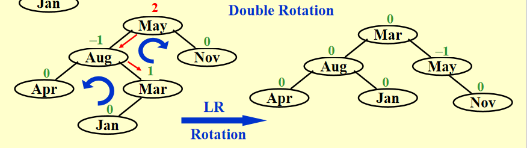

对于 `LR rotation` 来说，需要做两次旋转，首先是 `Aug` 左旋，其次是 `May` 右旋

!!! tip "说明"

    这里对旋转的理解似乎有两种，比如对于 `Aug-Mar` 这条边，我们知道是左旋，一种理解是以 `Mar` 为中心，将 `Aug` 左旋下来；另一种理解是将 `Aug` 作为中心，将 `Mar` 左旋上去，实际上效果是一样的，但是我个人比较喜欢第一种说法。

一般情况如下图：

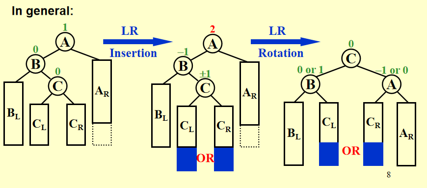

需要注意的是，我们要把插入的 `C` 的左子节点/右子节点挪给 `B` 或 `A`

#### RL rotation

如下图所示，新插入的节点 `Feb` 在 失衡节点 `Aug` 的右子树的左子树中，故称为 **RL rotation**

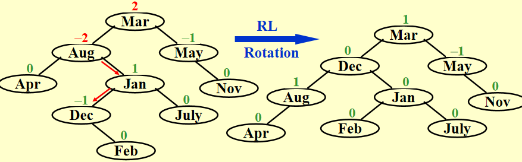

对于 RL rotation 来说，也需要做两次旋转，首先是 `Jan` 右旋，其次是 `Aug` 左旋。

!!! note "Tip"

    在上图中，我们能发现 `Aug` 和 `Mar` 都是失衡节点，我们应该对**首个失衡节点**进行旋转，这里的**首个失衡节点**意指从新插入的节点向上遍历父节点，最先找到的失衡节点，毕竟 AVL Trees 本就是递归定义的。

    由于实际的代码中我们往往通过计算节点的平衡因子，以判断选择哪种旋转，下面我们给出平衡因子与旋转方法的对应关系：

    | 失衡节点的平衡因子 | 子树较高一侧子节点的平衡因子 | 应当采用的旋转方法        |
    | ------------------ | ---------------------------- | ------------------------- |
    | $> 1$，左偏树      | $\geq 0$                     | LL rotation，右旋         |
    | $>1$，左偏树       | $<0$                         | LR rotation，先左旋后右旋 |
    | $<-1$，右偏树      | $\geq 0$                     | RL rotation，先右旋后左旋 |
    | $<-1$，右偏树      | $<0$                         | RR rotation，左旋         |

### AVL Trees 高度分析

我们知道，平衡二叉树的操作时间复杂度取决于树的高度 $h$，也即 $T_p=O(h)$，对于 AVL Trees，我们当然希望 $h\approx \log N$，以确保操作的高效性，但在最坏的情况下，$h$ 究竟有多大呢？下面我们进行分析。

如果我们直接从 $N$ 出发求最大的 $h$，就需要构造一个节点数正好为 $N$，但高度尽可能大的 AVL Tree，这时候我们需要确保每层都尽可能的不平衡，且不违反 BF 规则。而因为 AVL Trees 的构造时递归的，边界条件和归纳并不容易处理，我们很容易陷入“鸡生蛋蛋生鸡”的循环，即我们需要知道子树的最大高度，才能推根的高度，但子树又依赖于整体的 $N$。我们从逆向的角度出发就会容易很多，记 $n_h$ 表示高度为 $h$ 的平衡树的最小可能节点数。要达到高度 $h$，AVL Trees 至少需要 $n_h$ 个节点；反过来，如果 AVL Trees 有 $n_h$ 个节点，则最高能达到高度 $h$。

分析 AVL Trees 的特征，我们可以得到这样的递推关系式
$$
n_h=n_{h-1}+n_{h-2}+1\\
n_{-1}=0,n_0=1
$$
这是因为为了最小化节点数/最大化高度，我们需要让树尽可能的“不平衡”同时仍然满足BF规则，所以一侧子树高度为 $h-1$，另一侧子树高度为 $h-2$，再加上根节点的 $1$，就得到了上述递推式，观察此公式，我们应该能联想到著名的 Fibonacci 数列
$$
F_0=0,F_1=1,F_{i}=F_{i-1}+F_{i-2}\qquad \text{for} \ i>1
$$
且 Fibonacci 数列的通项公式我们知道，即
$$
F_n=\frac{\sqrt{5}}{5}[(\frac{1+\sqrt{5}}{2})^n-(\frac{1-\sqrt{5}}{2})^n]\approx \frac{\sqrt{5}}{5}(\frac{1+\sqrt{5}}{2})^n
$$
所以我们希望找到 $n_h$ 和 $F_k$ 的等量关系，以找到 $n_h$ 与 $h$ 的关系。猜测 $n_h=F_{h+m}-c$，代入得到
$$
F_{h+m}-c=(F_{h+m-1}-c)+(F_{h+m-2}-c)+1
$$
也即
$$
F_{h+m}-c=F_{h+m-1}+F_{h+m-2}-2c+1
$$
又因 $F_{h+m}=F_{h+m-1}+F_{h+m-2}$，所以 $-c=-2c+1$，可得 $c=1$

考虑边界 $n_{-1}=F_{m-1}-1=0$，得到 $F_{m-1}=1$，$n_0=F_{m}-1=1$，得到 $F_{m}=2$，所以 $m=3$，也即我们得到了 $n_h=F_{h+3}-1$，并且可以由数学归纳法对该结论进行进一步的证明。于是我们得到
$$
n_h=\frac{\sqrt{5}}{5}(\frac{1+\sqrt{5}}{2})^{h+3}-1
$$
于是 $h=O(\ln n)$

## Splay Trees

### Splay Trees 的理念

Splay Trees 的目标是确保从空树开始，任意的连续 $M$ 个操作的总时间复杂度为 $O(M\log N)$，其中 $N$ 是当前树中的节点数，这是一种摊销分析(Amortized analysis)的策略。

而与 AVL Trees 不同的是，Splay Trees 并不强制保持严格的平衡，而是在每次操作后将访问的节点提升到根(splay)来动态调整树结构(After a node is accessed, it is pushed to the root by a series of AVL tree rotations)，在长期内通过摊销保证平均 $O(\log N)$ 的性能，以解决单一操作可能退化为 $O(N)$ 的问题。

Here are some insights of Splay Trees:

- Main idea: $O(N)$ access for a Binary Search Tree is not so bad if it happens infrequently. Splay Trees guarantee that repeated bad accesses don't occur.（对于二叉树， $O(N)$ 的访问在频率不高的情况下是可接受的，而 Splay Trees 能够保证 $O(N)$ 的访问不会重复发生）
- How it works: once we find a bad access, we move the bad node up the tree so it won't happen again.（一旦我们产生了一次 $O(N)$ 的访问，我们就将这个节点向上移动）
- What we do: take a bad node, and through a series of AVL like rotations, we move the offending node to the root of the tree. Then, future access to that node are efficient. The tree also gets better balanced as a side effect.（将该节点移动到树的根节点，未来对该节点的访问就会变得高效，并且作为副作用，树也会因此变得更加平衡）
- In real world, pratical situations, a node is often accessed more than once, making this strategy payoff.（在现实世界中，一个节点通常会被访问多次，这使得这种策略能够奏效）
- Splay Trees do not require maintaining height into for rebalancing as AVL trees do.（Splay Trees 不需要像 AVL Trees 那样维护高度来重新保持平衡）

### Splaying（伸展操作）

#### Naive Splaying

一个 Naive 的策略是，我们将被访问的节点连同其父节点进行类似 AVL Tree rotation 的操作，一直旋转到该节点称为根节点(take the node that was accessed and do single AVL-like rotations with its parent all the way up the tree until it is the root.)。事实上，这并不是一个好的策略，因为我们虽然将访问的节点推到了根节点，使其访问变得高效，但副作用是它也会将其他的节点推得更深，使得它们的访问变得非常耗时。可以参考下面的示例：

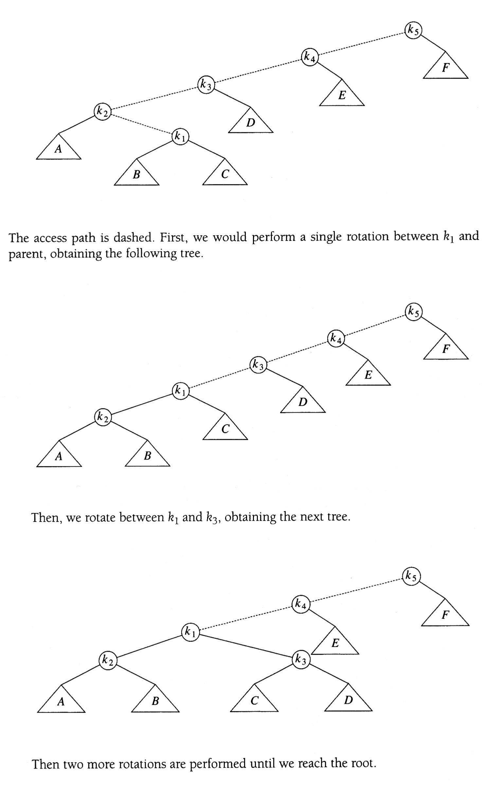

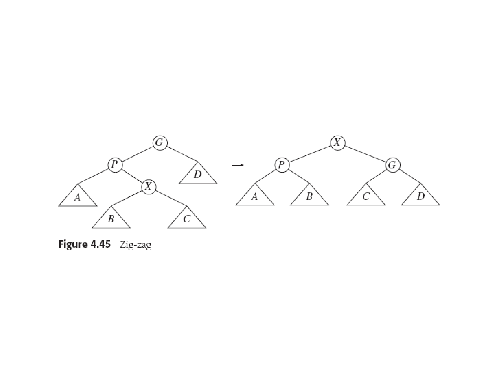

node $k_1$ is pushed to the root but at the same time it drives another node $k_3$ down deeper into the tree and not really imporving the height of the tree for future accesses.

并且我们甚至可以构造一个更加病态的案例，其 $M$ 次访问的复杂度为 $O(M\times N)$，而不是我们所期望的 $O(M\log N)$，如下面这个例子：

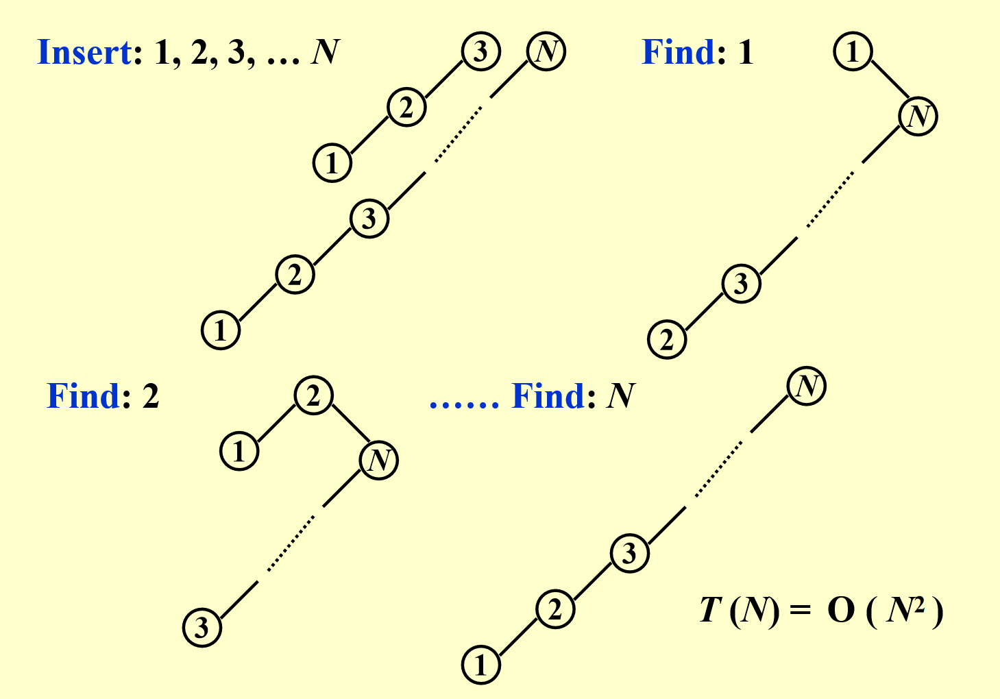

我们按顺序插入 $1,2,3$ 后形成线性树，通过 `find` 操作访问节点时，采用的旋转策略未能有效地平衡树的结构，反而最终使得树回到了线性结构，总的时间复杂度退化到 $O(N^2)$。

这是因为单旋转的策略只关注访问节点，不涉及祖父节点等等更高层，没有考虑整个访问路径的整体平衡，所以尽管访问节点被优化了，但是路径上的其他节点反而可能被恶化。

#### Improved Splaying

我们需要对 Splay 策略进行优化，设 `X` 是待访问的节点，改进的 Splay 策略如下：

- if X's parent is the root, just do a simple single rotation
- Otherwise, X has a parent `P` and a grandparent `G` along the access path.
    - **Case 1 Zig-Zag：** X is a right child and P is a left child(or vice versa). Perform a double AVL rotation on the three nodes.（X 是右子节点，P 是左子节点，反之亦然，对着三个节点执行两次 AVL rotation）
    - **Case 2 Zig-Zig：**X and P are both left children(or right children in the symmetric case), perform a rotation to P-G, and then perform a rotation to X-P.（X 和 P都是左子节点，或者对称情况下都为右子节点，此时先旋转 P-G 边，再旋转 X-P 边，和传统的 AVL rotation 顺序不同）

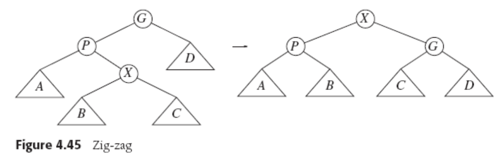

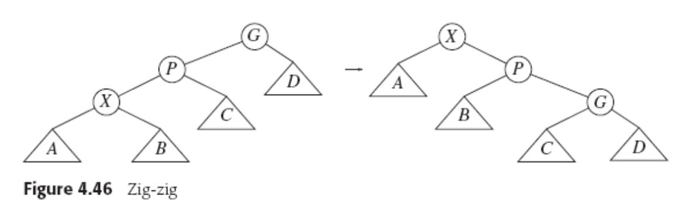

这样的好处是，我们不止将访问节点 `X` 移动到了根，还实现了 roughly halving the depth of nodes along the access（沿路径节点深度大约减半），树逐渐趋向于平衡，避免出现重复的坏访问。

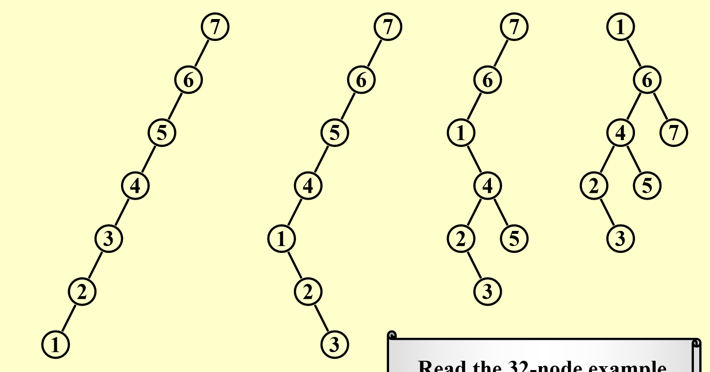

更复杂的例子可以参考哥伦比亚大学讲义（似乎就是从后面那本书上取下来的图？）或者Data structures and algorithm in C	

### Splay Trees Deletions

- Find X
- Remove X，记得到的子树分别为 $T_L$ 和 $T_R$
- FindMax($T_L$)
- Make $T_R$ the right child of the root of $T_L$

!!! note "Tip"

    和 BST 的删除类似

## Amortized Analysis

摊还分析用于评估数据结构中操作序列的平均性能，尤其适用于“偶尔昂贵但整体高效”的场景。

### Amortized Time Bound

摊还界限(amortized bound)介于最坏情况界限(worst-case bound)和平均情况界限(average-case bound)之间，也即 
$$
\text{worst-case bound} \geq \text{amortized bound}\geq \text{average-case bound}
$$
对三种界限的比较可以参考下面这个表格

| Type               | Description             | Feature                                  |
| ------------------ | ----------------------- | ---------------------------------------- |
| worst-case bound   | 单个操作的最坏时间      | 过于悲观                                 |
| amortized bound    | 序列 $M$ 操作的平均时间 | 不涉及概率，比最坏情况小，但比平均情况大 |
| average-case bound | 基于输入分布的期望时间  | 设计概率，假设随机输入                   |

并且与平均情况不同的是，摊还分析并不涉及概率，而是基于确定性的方法分析操作序列的总成本。

### 摊还分析的三种方法

我们这里介绍三种等价的摊还分析的方法：**聚合分析(Aggregate Analysis)、记账法(Accounting Method)、势能函数法(Potential Method)**，它们都能够计算摊还成本(amortized cost)，并确保总实际成本 $\leq$ 总摊还成本。

#### 聚合分析(Aggregate Analysis)

聚合分析的核心思想是直接计算 $n$ 个操作序列的总最坏时间 $T(n)$，摊还成本即为 $\frac{T(n)}{n}$，但需要预先知道总成本的公式，不易处理复杂的结构

例如我们考虑一个栈，其支持 `Push`、`Pop`、和 `MultiPop(k)`（即弹出 $\min(k,栈大小)$ 个元素），从空栈开始，$n$ 次操作(Push、Pop、MultiPop)的总时间复杂度看似是 $O(n^2)$，但实际上总时间为 $O(n)$，摊还时间是 $O(1)$ 的，因为每个元素最多被 Push 一次，被 Pop/MultiPop 弹出一次。我们通过全局计数（每个对象贡献固定的成本）避免局部的高成本影响整体复杂度。

!!! tip "原文"

    由于担心考试考原话，这里把原文贴出来

    Show that for all $n$, a sequence of $n$ operations takes **worst-case** time $T(n)$ in total. In the worst case, the average cost, or **amortized cost**, per operation is therefore $\frac{T(n)}{n}$

#### 记账法(Accounting Method)

记账法的核心思想是为每个操作分配摊还成本(amortized cost)，并将高于实际成本的部分作为“信用”(credit)，用于支付未来的高成本操作。需要注意的是 $\text{credit}\geq 0$，因为我们需要摊还成本 $\geq $ 总实际成本。如果我们记每个操作的摊还成本为 $\hat{c_i}$，实际成本为 $c_i$，则有摊还时间 $T_{\text{amortized}}$ 满足下列公式
$$
T_{amortized} = \frac{\sum_{i=1}^n \hat{c_i}}{n}\geq \frac{\sum_{i=1}^n c_i}{n}
$$
仍然以空栈为例，我们可以这样设计每个操作的摊还成本

| Operations | Actual Cost      | Amortized Cost |
| ---------- | ---------------- | -------------- |
| Push       | 1                | 2              |
| Pop        | 1                | 0              |
| MultiPop   | $\min(栈大小,k)$ | 0              |

则产生的 credits 为，Push操作：1，Pop操作：-1，MultiPop：每弹出1个元素消耗该元素对应的1个 credit，也即每个元素-1

!!! note "Tip"

    我们需要证明，栈的 credits 始终没有透支，也即栈的 credits 始终 $\geq 0$：

    栈中的每个元素仅在被 Push 时产生一个 credit，且仅在被 Pop 时消耗一个 credit，栈的大小始终 $\geq 0$，这是因为我们不可能弹出不存在的元素，因此 已产生的总 credits $=$ 栈中当前的元素总数 $\geq $ 0

则对于任意 $n$ 个 Push、Pop、MultiPop 操作组成的序列有
$$
\text{总摊还成本}= (\text{每个 Push 的摊还成本}\times \text{Push 次数})+(\text{每个 Pop 的摊还成本}\times \text{Pop 次数})\\+(\text{每个 MultiPop 的摊还成本}\times \text{MultiPop 次数} )
$$
而根据我们设计的摊还成本，总摊还成本仅由 Push 决定，可以得到总摊还成本 $\leq 2n$，属于 $O(n)$，则有
$$
T_{amortized} = \frac{O(n)}{n}
$$

!!! tip "原文"

    When an operations' **amortized cost** $\hat{c_i}$ exceeds its **actual cost** $c_i$, we assign the difference to specific objects in the data structure as **credit**. Credit can help **pay** for later operations whose amortized cost is less than their actual cost.

#### 势能函数法(Potential Method)

势能函数法的思想是定义势能函数 $\Phi(D_i)$，$D_i$ 为第 $i$ 次操作后的数据结构状态，初始有 $\Phi(D_0)=0$，非负，摊还成本 $\hat{c_i}=c_i+\Phi(D_i)-\Phi(D_{i-1})$，这里 $c_i$ 为实际成本，则可以得到
$$
\text{总摊还成本}=\sum\hat{c_i}=\sum c_i+\Phi(D_n)-\Phi(D_0)
$$
通常来说，一个好的势能函数应该在序列开始的时候取得最小值。

!!! tip "原文"

    In general, a good potential function should always assume its minimum at the start of the sequence.
