## Red-Black Trees

### Red-Black Tree definition

红黑树也是一种二叉搜索树，其目标也是保持树的平衡，红黑树的高度为 $O(\log N)$。每个节点包含键值（key）、颜色（红/黑）、左子结点、右子节点和父节点。

!!! warning "注意"

    需要澄清的是，在红黑树中，**叶子节点是指 NIL 节点，也被称为外部节点(External Node)，这些节点是特殊的空节点（NULL），不包含任何键值**，仅仅作为树的终止点。相应的，实际存在的节点被称为内部节点(internal node)

红黑树必须满足以下五个特性：

- 每个节点的颜色是红色或者黑色
- 根节点为黑色
- 每个叶子节点（NIL）是黑色
- 如果一个节点是红色，则其两个子节点必须是黑色（也即不允许出现连续的红色节点）
- 对于每个节点，从该节点到起所有后代叶子节点的简单路径上，包含相同数量的黑色节点

下图是一个红黑树的示例

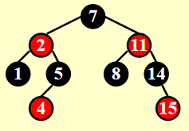

### Red-Black Tree Height

在讨论红黑树的高度之前，我们首先给出**黑高度(Black-Height)**的定义，我们定义函数 $bh(x)$ 表示从节点 `x`（不包括 `x` 自身）到叶子节点（指的也是 NIL 节点）的任意简单路径上的黑色节点数量，树的黑高度 $bh(Tree)$ 定义为 $bh(root)$。

下面我们给出一个引理：**具有 $n$ 个内部节点的红黑树的高度最高为 $2\log(n+1)$**

**证明** 我们首先用数学归纳法证明，对于任意的节点 `x`，其子树的大小（内部节点数）`sizeof(x)` 满足不等式 $sizeof(x)\geq 2^{bh(x)}-1$

- 若 $bh(x)=0$，则 $x$ 为叶子结点 NIL，$x$ 的子树的内部节点数为0，$sizeof(x)=0\geq 2^{0}-1$ 成立

- 归纳假设：$sizeof(x)\geq 2^{bh(x)}-1$ 对于 $bh(x)\leq k$ 的所有 $x$ 成立

- 当 $bh(x)=k+1$ 时，其子节点的两个 `child` 的 $bh(child)$ 都满足 $bh(child)\geq bh(x)-1$，且有
  $$
  sizeof(child)\geq 2^{bh(child)}-1\geq2^{bh(x)-1}-1
  $$
  所以有
  $$
  sizeof(x)=1+sizeof(child_1)+sizeof(child_2)\geq 1+2sizeof(child)\\
  \geq1+2\cdot [2^{bh(x)-1}-1]=2^{bh(x)}-1
  $$
- 所以我们得到了 $bh(x)\leq \log[sizeof(x)+1]$

接着我们证明 $bh(Tree)\geq \frac{h(Tree)}{2}$

这需要用的红黑树的性质，对于一个红色节点，其子节点一定均为黑色节点，所以我们不妨取出红黑树中最高的那条路径，记 $n_1$ 为红色节点数，$n_2$ 为黑色节点数，则有 $n_2\geq n_1$，且
$$
h(Tree)=n_2-1+n_1\leq 2n_2-1
$$
即得 $n_2\geq \frac{h(Tree)+1}{2}$

所以 $bh(Tree)\geq \frac{h(Tree)}{2}$ 得证，所以我们可以得到
$$
h(Tree)\leq 2\ bh(Tree)\leq 2\log(n+1)
$$

### Insertion of Red-Black Tree

与 AVL 树类似的，我们希望插入节点后能尽量维持 Red-Black Tree 的平衡，也即尽可能地不改变 Red-Black Tree 的 Black-Height，所以我们**新插入的节点应当是红色的**。

但插入红色节点可能会违反 Red-Black Tree 的属性，如果插入节点的父节点是黑色节点，那么我们可以直接插入；但如果插入节点的父节点是红色节点，那么就会出现连续的两个红色节点，违反了 Red-Black Tree 的性质，需要我们进行相应的调整。

!!! Tip "致谢"

    以下内容参考了[NoughtQ前辈的笔记](https://note.noughtq.top/algorithms/ads)、98下载的一位前辈的笔记(忘记是哪位前辈了，手上只有pdf，没有署名)

#### Case 1

新插入节点的父节点，以及父节点的兄弟节点都是红色（此时祖父节点一定是黑色），如下图所示

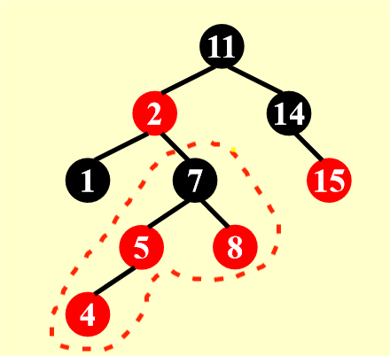

这种情况需要**将父节点及其兄弟节点染成黑色，祖父节点染成红色**。但不幸的是，我们**只是调整了局部使得其不违反红黑树的性质，祖父节点向上的部分仍然有可能违反红黑树性质**（因为祖父节点由黑变红了），所以我们需要递归地向上处理，可以参考 NoughtQ 前辈绘制的这个图：

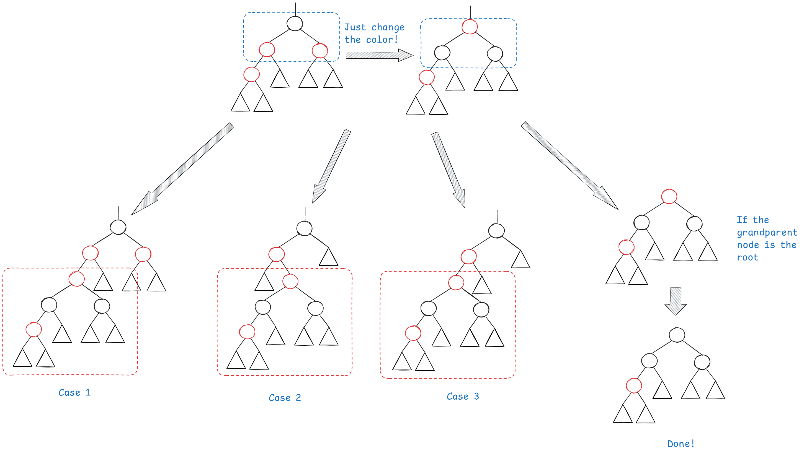

#### Case 2

新插入的节点是其祖父节点的 LR 或 RL 节点，父节点为红色，父节点的兄弟节点为黑色，如下图所示

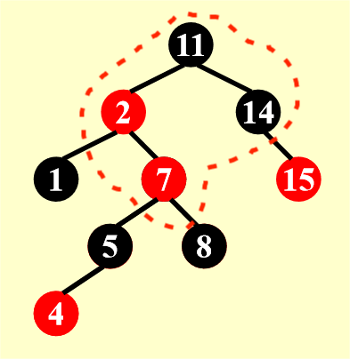

这种情况需要**将 7-2 这组边左旋一次，使得变为 LL 或 RR 情形**，变为 Case3，或者说，节点7 要从叔叔节点 14 的近侄子变为远侄子。参考 NoughtQ 前辈画的操作图：

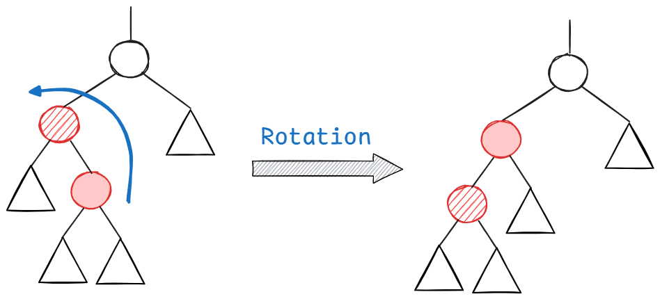

#### Case 3

新插入的节点是其祖父节点（黑色）的 LL 子节点或 RR 子节点，父节点为红色，父节点的兄弟节点为黑色，如下图所示：

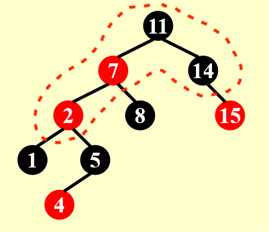

这种情况需要对 7-11 边进行一次旋转，并对 7-11 进行一次换色。


!!! note "Tip"

    值得一提的是，这里换色的顺序和旋转的顺序是不影响的，先旋转后换色与先换色后旋转能达到相同的效果，可以参考 NoughtQ 前辈画的这个图：

    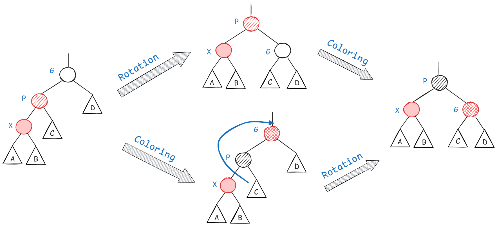

    可以发现，Case 2 和 Case 3 都只进行了常数次的旋转和染色操作，只有 Case 1 在完成 rotation 之后可能需要向上递归，所以我们可以得到时间复杂度满足
    $$
    T=O(h)=O(\log N)
    $$

    其实除开上述的三种比较复杂的 case，还有一些比较 Naive 的 case：

    - case4: The tree is empty, then insert the first node and dye it black.
    - case5: The newnode's parent is root and black, then just insert the newnode

### Deletion of Red-Black Trees

!!! tip "致谢"

    以下内容大部分参考于[NoughtQ前辈的笔记](https://note.noughtq.top/algorithms/ads/2)，感谢 NoughtQ 前辈完善的笔记🫡

- 删除树中的唯一节点，直接删除即可
- 被删除节点有两个子节点，我们可以用**左子树的最大节点或右子树的最小节点**去替代被删除节点（可以复制值），但要**保持颜色不变**，然后将用于替代的节点从原来位置删除（用于替代的节点至多只有一个子节点，可以转化为后面两种情况）
- 被删除节点没有子节点，直接用叶节点 NIL 替代该节点即可
- 被删除节点有一个子节点：
  - 如果子节点为红色，则被删除节点一定为黑色，用子节点替代该节点并将其染黑即可
  - 若子节点为黑色，则被删除节点可能为黑色也可能为红色：
    - 若该节点为红色，直接用子节点替代即可
    - 若该节点为黑色，删除后会打破红黑树的黑高相等的性质，需要继续进行下面的维护操作

下面我们来看最为复杂的红黑树黑高平衡维护，我们首先引入**双黑节点(Double Black Node)**的概念，双黑节点并不是指节点有两种黑色，而是标记该节点所在的路径”需要多算一个黑色节点“，以弥补删除黑色节点后丢失的黑色计数。

而红黑树失衡引入双黑节点的本质原因是路径黑色计数的缺口，我们的目标也就是消除这个缺口，让所有路径的黑色节点数恢复一致，消除双黑节点的核心思路是“转移缺口”或“填补缺口”。

下面我们讨论双黑节点可能出现的两种典型场景：

- 删除黑色叶节点：删除一个黑色叶子节点，用 NIL 替代它，此时 NIL 所在的路径少了一个黑色节点，我们就将这个 NIL 标记为双黑
- 删除只有一个黑色子节点的黑色节点：父节点是黑色，只有一个黑色子节点 X，当我们删除父节点之后，X 接替它的位置，标记为双黑，以维持其所在路径的黑色树不变，但其他路径少了一个黑色，这时候需要进行黑高维护。

在引入删除操作之前，我们约定 X 为当前双黑节点（也即需要修复的节点），P 为 X 的父节点，S 为 X 的兄弟节点（P 的另一个子节点），下面我们只考虑 X 是左子结点的情形，对称情况逻辑类似，仅旋转方向相反。

#### Case 1

S 是红色节点，此时有 S 的两个孩子，以及父节点 P 必然为黑色。如下图所示：

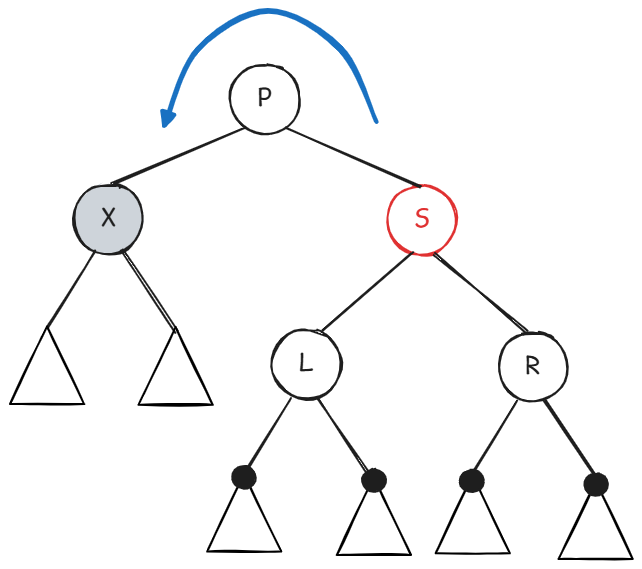

此时问题在于 S 是红色节点，我们无法通过直接染色转移缺口，需要先通过旋转将 S 变为黑色，缩小调整范围。具体处理逻辑如下：

- **旋转：**若 X 是左子结点，对 P-S 边左旋，让 S 成为新的父节点，P 成为 S 的左子结点，得到结果如下：

  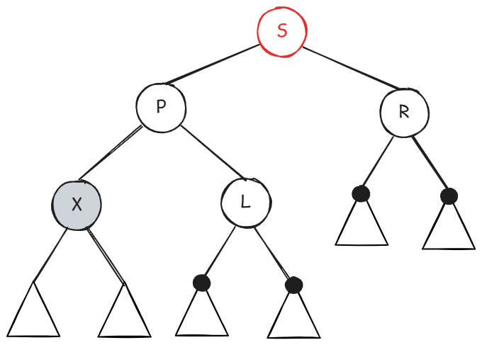

- **染色：**将 S 染为黑色，这是为了接替 P 原来的黑色位置，恢复路径的黑色计数，将 P 染为红色，保持黑高平衡。得到结果如下：

  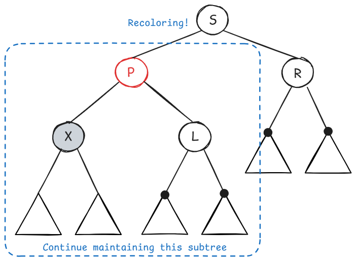

此时双黑节点 X 的兄弟节点变为 S 原来的左孩子（黑色），但仍然未能消除双黑节点，未达到平衡黑高的目的（以 P 为根节点的子树的黑高还是不平衡的，我们接着调整这棵子树），而是将 case1 转化为其他的 case

#### Case 2

X 的兄弟节点及其兄弟的两个子节点都为黑色，并且父节点的颜色可黑可红，如下图所示：

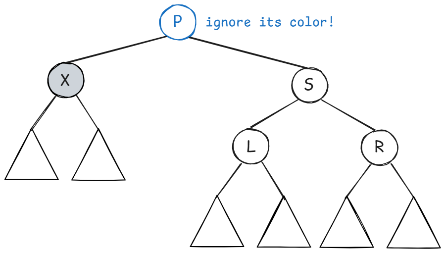

此时我们将 S 染为红色，染红后 S 所在的路径减少一个黑色节点，与 X 所在路径的双黑缺口抵销，但这两条路径相比于其他路径黑高小1，所以我们要考虑父节点 P 的情况：

- 若 P 原本是红色节点，则将 P 染为黑色节点，双黑节点 X 恢复为普通黑色即可
- 若 P 原本是黑色节点，则 P 需要继承黑色缺口，我们将双黑节点 X 恢复为普通节点，将父节点 P 标记为双黑节点继续向上调整，直至 P 是根节点的情况（根节点是双黑节点时，直接将其恢复为黑色节点即可，因为根节点的黑色计数辐射全局，不会影响黑高平衡）

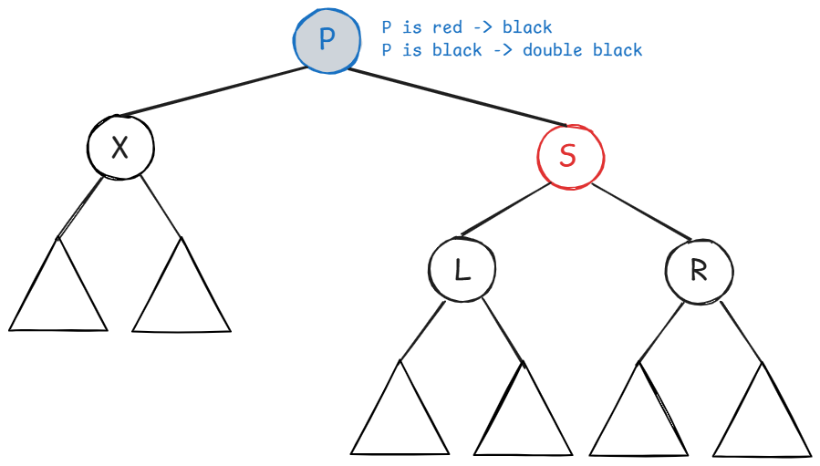

#### Case 3

S 是黑色节点，S 的内侧子节点（靠近 X 的子节点）是红色，外侧子节点是黑色，并且父节点的颜色可黑可红，如下图所示：

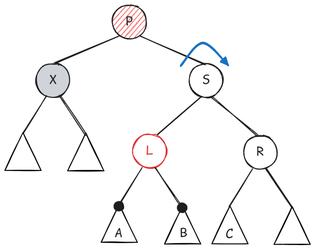

这里的处理逻辑是：

- **旋转：**将 S-L 边右旋，S 的内侧红色孩子成为新的 S ，原来的 S 成为其右子节点：

  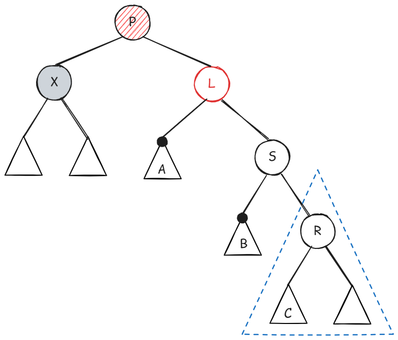

- **染色：**将 S 染为红色，L 染为黑色，这是为了保持路径黑高不变，仅调整结构

  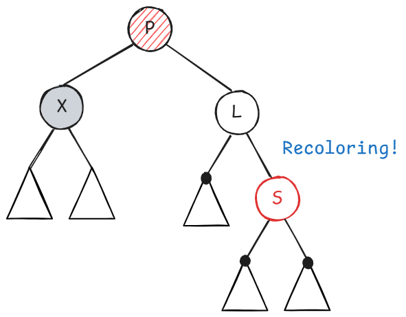

此时我们转化为 Case 4

#### Case 4

兄弟节点 S 是黑色，兄弟节点的内侧子节点可红可黑，兄弟节点的外侧子节点是红色，父节点 P 可红可黑，如下图所示：

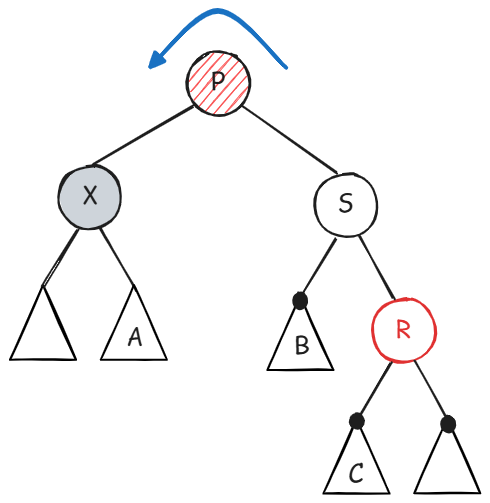

其操作流程如下：

- **旋转：**对 P-S 边左旋，让 S 成为新的父节点，P 成为 S 的左子结点，如下图所示：

  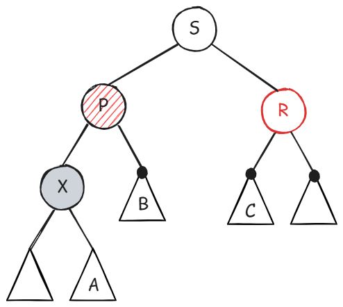

- **染色：**

  - 交换 P 和 S 的颜色
  - 将 S 的外侧红色子节点染为黑色，以弥补 X 的双黑缺口

  
  
  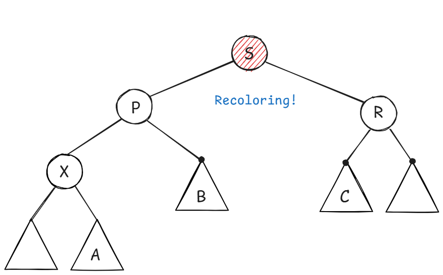

!!! note "Tip"

    这里的四种 case 我们可以这么去记忆：

    - X 的兄弟节点是红色（此时必然有父节点是黑色，兄弟节点的子节点是黑色）
    - X 的兄弟节点是黑色，兄弟节点的子节点还全是黑色
    - X 的兄弟节点是黑色，兄弟节点中的子节点中，内侧子节点是红色，**另一个是黑色**
    - X 的兄弟节点是黑色，兄弟节点的外侧子节点是红色，内侧子节点可以黑可以红     


Number of rotations

|           | AVL         | Red-Black Tree |
| --------- | ----------- | -------------- |
| Insertion | $\leq 2$    | $\leq 2$       |
| Deletion  | $O(\log N)$ | $\leq 3$       |

- AVL 树的最差高度略低于红黑树
- 但红黑树的单次删除所需旋转次数是 $O(1)$的，而 AVL Trees 的删除是 $O(\log n)$的

## B+ Trees

在引入 B+ Trees 之前，我们不妨先讨论讨论它的 motivation，红黑树其实是为了内存中的数据访问优化的平衡二叉树，而 B+ Trees 则是为磁盘/外存中的数据访问二优化的多路平衡树，为了解决“ 磁盘I/O 效率低下”的痛点。

需要明确的是，**磁盘的访问成本远高于内存，并且访问方式是“按块读取的”**，红黑树的设计完全适配内存，但是在磁盘场景下就会暴露致命的缺陷，其每个节点仅存 1 个 key，2 个孩子指针，1个父指针和1个颜色位，其单个节点极小，而一个磁盘块只能存少数几个节点，这导致树高很高，I/O 次数也非常多；而 B+ 树的内部节点仅存 key 和孩子指针，不存储实际数据，一个磁盘块能存数百甚至数千个 key，节点存储密度高，树高大幅度降低，I/O 次数少。

除此之外，在数据库、文件系统等等场景中，**范围查询**是非常高频的操作，而红黑树在这种场景下的效率很低，B+ 树的实际数据都存在叶子节点中，且叶子节点之间通过“指针”来组成有序链表，范围查询效率高。

###  B+ Trees Definition

A B+ tree of order M is a tree with the following structural properties:

- The root is either a leaf or has **between 2 and M children**（根节点要么是叶子节点，**要么有 $[2,M]$ 个子节点**）

- All **nonleaf nodes**(except the root) have **between $\lceil\frac{M}{2}\rceil$ and $M$ children**（所有非叶子节点，除了根节点，**都有 $[\lceil\frac{M}{2}\rceil,M]$ 个子节点**）

!!! note "Tip"

    需要说明的是，这里的 $\lceil\frac{M}{2}\rceil$ 是向上取整

- All leaves are at the same depth（所有的叶子的深度相同）
- 所有实际数据仅存储在叶子节点中，非叶节点不存储真实数据，仅存储“索引键”，用于引导查找方向
- 内部节点（非叶节点）满足以下几点：
  - 包含 $M$ 个指向孩子的指针
  - 包含 $M-1$ 个“索引键”，这些键是除了第一个子树之外，其余子树中的“最小键值”

### 典型的 B+ 树

阶为4和阶为3的B+树最为典型

#### 阶为4的B+树（2-3-4树）

- 根节点（非叶节点）的子节点数为2-4
- 非根非叶节点的子节点数为2-4
- 叶子节点的数据项有2-4个

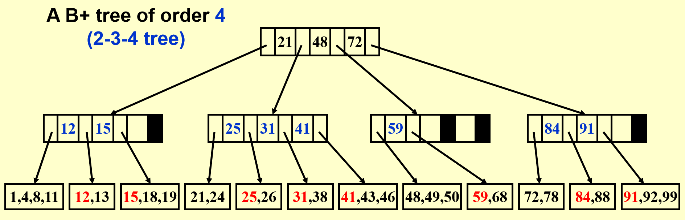

!!! note "Tip"

    在上图中，黑色方框是空指针，标红的数字是每个块对应的子树的最小值，会被存储到父节点中

#### 阶为3的B+树（2-3树）

- 根节点（非叶节点）的子节点数为2-3
- 非根非叶节点的子节点数为2-3
- 叶子结点的数据项有2-3个

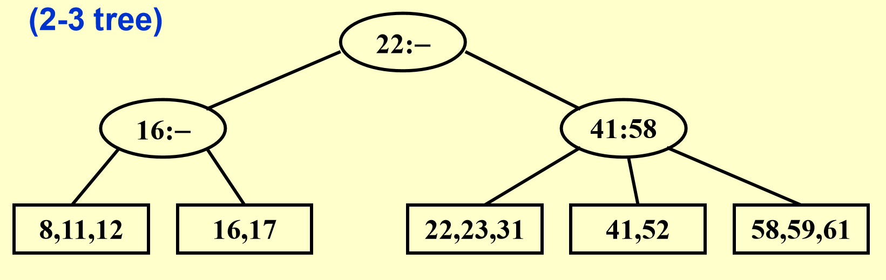

### B+ Trees Operations

#### Search

查找操作我们需要再次明确 B+ Trees 的一些逻辑：

- 所有查找最终终止于叶子结点（真实数据仅仅存储于叶子节点中，内部节点仅存储“索引键”，用于引导路径）
- 内部节点的索引键是“子树最小键”，用于判断查找方向（小于索引键则引进左子树，大于等于则引进右子树）

以下图为例，这样的一个 2-3 树

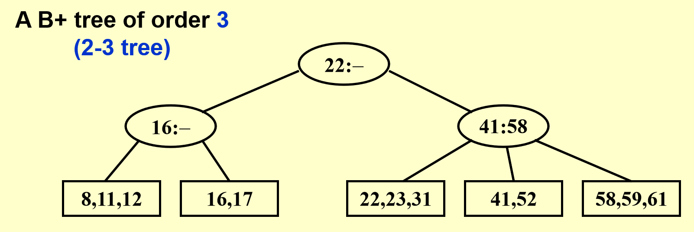

**Search 52:**

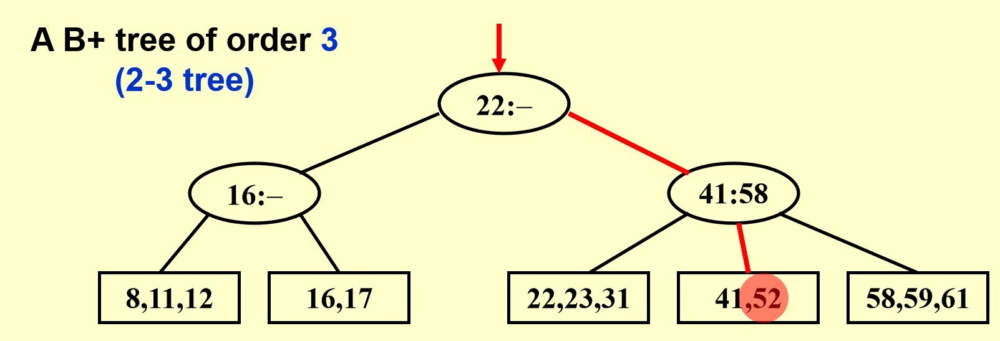

#### Insertion 

插入的**核心逻辑是“先插入叶子节点，再处理溢出”**，当叶子节点的数据项数 $>M$ 时，我们需要对叶子节点进行分裂；当非叶节点（内部节点）插入索引键后，键数 $>M-1$ 时，我们需要对非叶结点进行分裂，下面看几个例子：

**Insert 18：**插入18时并不需要进行分裂

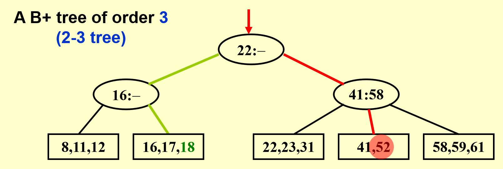

**Insert 1：**插入1的位置本应当是在8左侧，但是这个数据块已经满了，所以我们需要将数据块 `1,8,11,12` 一分为二成 `1,8` 和 `11,12`，并将父节点的索引键改为 `11,16`，如下图所示：

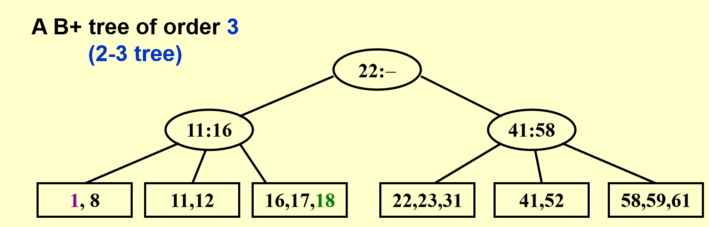

**Insert 19：**在上图的基础上继续插入19，应当插在18的右侧，但是该数据块变为 `16,17,18,19` 已经满了，并且其父节点的键索引 `11,16` 也已经满了，所以我们需要向祖父节点寻找空位，多分一个叔叔节点，将一分为二的数据放在叔叔节点身上，如下图所示：

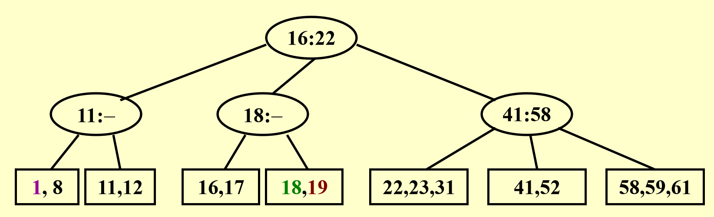

**Insert 28：**在上图的基础上插入28，我们能找到插入28的位置在23与31之间，但是由于 `22,23,31` 数据块已满，父节点 `41,58` 的键索引已满，祖父节点 `16,22` 的键索引仍然已满，所以我们只能再产生一个新的根节点，如下图所示：

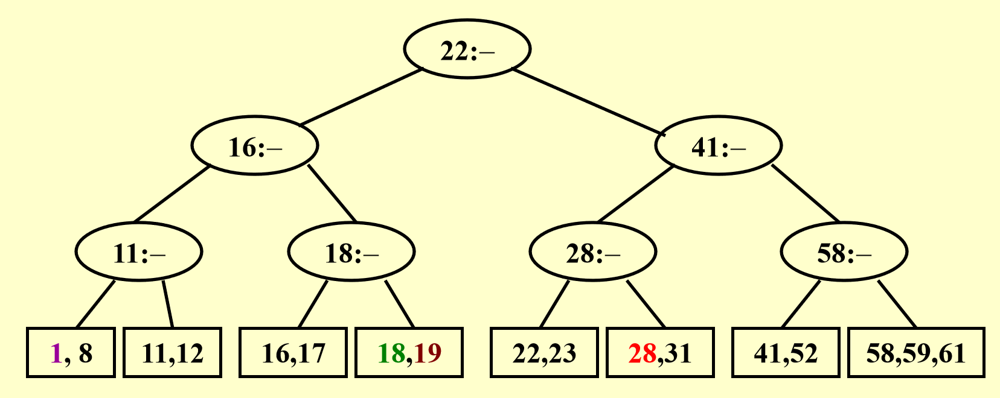

插入操作的伪代码如下：

```text
Btree Insert(ElementType X, Btree T) {
    Search from root to leaves for X and find the the proper leaf node;
    Insert X;
    while (this node has M+1 keys) {
        split it into 2 nodes with RoundUp((M+1) / 2) and RoundDown((M+1) / 2) keys respectively;
        if (this node is the root)
            create a new root with two children;
        check its parent;
    } 
}
```

#### Deletion

删除操作比插入操作更为复杂，其核心在于**“先删除叶子节点，再处理下溢”**，下溢也即节点键数 $<\lceil\frac{M}{2}\rceil-1$ 时，此时我们优先向兄弟节点借数据，如果借不到则与兄弟节点合并，此时可能触发父节点的连锁下溢，具体逻辑如下：

- 所有数据仅从叶子节点删除，非叶结点仅删除索引键
- 删除 后若叶子节点元素数小于 $[\frac{M}{2}]$，非叶节点键数低于下限($[\frac{M}{2}]-1$)，则触发下溢处理：
  - 优先向“相邻兄弟节点”借数据，这样效率更高，避免合并
  - 当兄弟节点的键数/元素数也达到下限时，则与兄弟节点合并，合并后需要删除父节点的对应索引键，再检查父节点是否下溢。

下面我们来看几个删除的例子：

**场景1：删除后叶子结点未发生下溢**，在下图中删除24


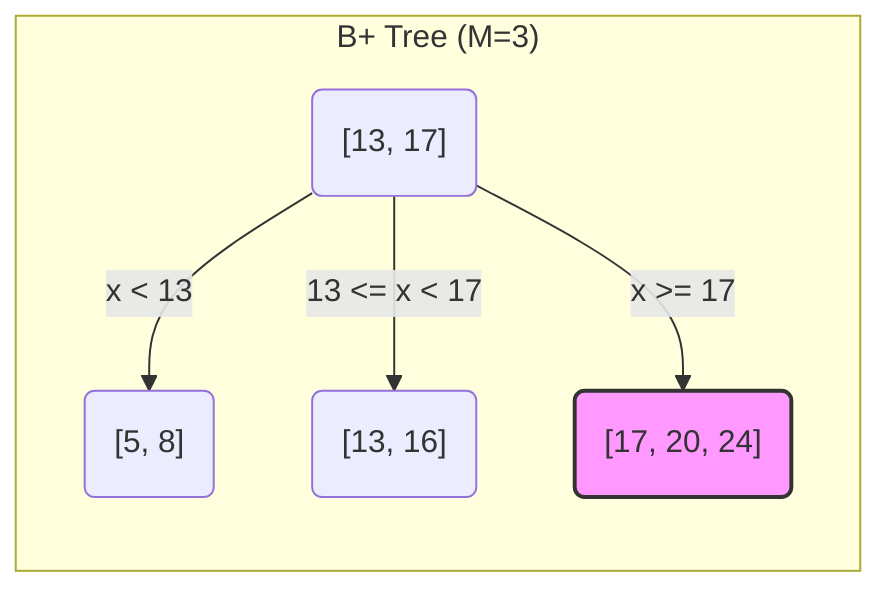
```mermaid
graph TD
    subgraph S1_Before ["B+ Tree (M=3)"]
        direction TB
        	Root("[13, 17]")
        	L1("[5, 8]")
        	L2("[13, 16]")
        	L3("[17, 20, 24]")

        style L3 fill:#f9f,stroke:#333,stroke-width:2px

        Root -- "x < 13" --> L1
        Root -- "13 <= x < 17" --> L2
        Root -- "x >= 17" --> L3
    end
```


删除后：

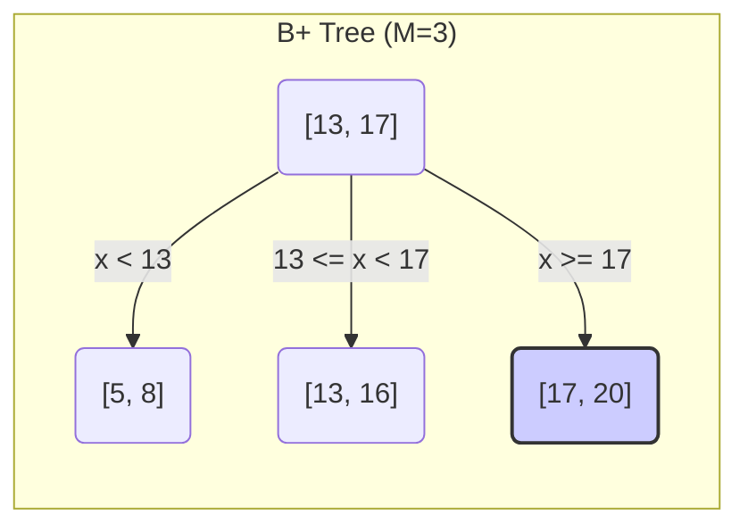
```mermaid
graph TD
    subgraph S1_After ["B+ Tree (M=3)"]
        direction TB
        Root("[13, 17]")
        L1("[5, 8]")
        L2("[13, 16]")
        L3("[17, 20]")

        style L3 fill:#ccf,stroke:#333,stroke-width:2px

        Root -- "x < 13" --> L1
        Root -- "13 <= x < 17" --> L2
        Root -- "x >= 17" --> L3
    end
```

**场景2：删除后叶子节点发生下溢，向兄弟节点借用，**在下图中删除16

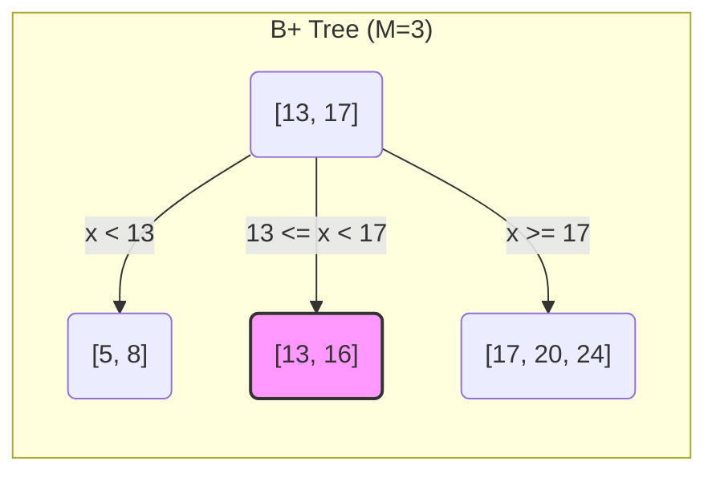
```mermaid
graph TD
    subgraph S2_Before ["B+ Tree (M=3)"]
        direction TB
        Root("[13, 17]")
        L1("[5, 8]")
        L2("[13, 16]")
        L3("[17, 20, 24]")
        
        style L2 fill:#f9f,stroke:#333,stroke-width:2px

        Root -- "x < 13" --> L1
        Root -- "13 <= x < 17" --> L2
        Root -- "x >= 17" --> L3
    end
```

删除后：

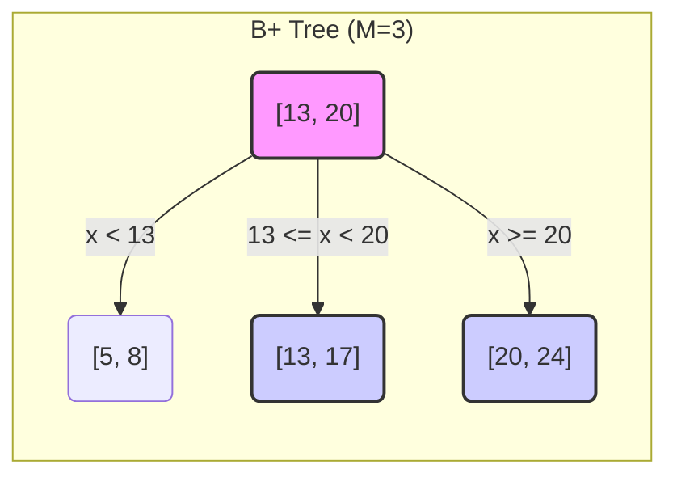
```mermaid
graph TD
    subgraph S2_After ["B+ Tree (M=3)"]
        direction TB
        Root("[13, 20]")
        L1("[5, 8]")
        L2("[13, 17]")
        L3("[20, 24]")
        
        style Root fill:#f9f,stroke:#333,stroke-width:2px
        style L2 fill:#ccf,stroke:#333,stroke-width:2px
        style L3 fill:#ccf,stroke:#333,stroke-width:2px

        Root -- "x < 13" --> L1
        Root -- "13 <= x < 20" --> L2
        Root -- "x >= 20" --> L3
    end
```

记得要更新父节点的索引键

**场景3：删除后叶子节点发生下溢，需要和兄弟节点合并**，在下图中删除8

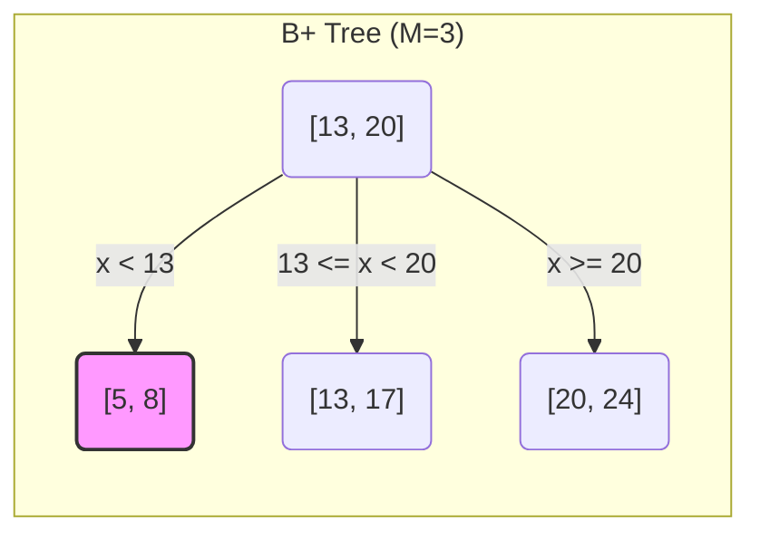
```mermaid
graph TD
    subgraph S3_Before ["B+ Tree (M=3)"]
        direction TB
        Root("[13, 20]")
        L1("[5, 8]")
        L2("[13, 17]")
        L3("[20, 24]")

        style L1 fill:#f9f,stroke:#333,stroke-width:2px

        Root -- "x < 13" --> L1
        Root -- "13 <= x < 20" --> L2
        Root -- "x >= 20" --> L3
    end
```

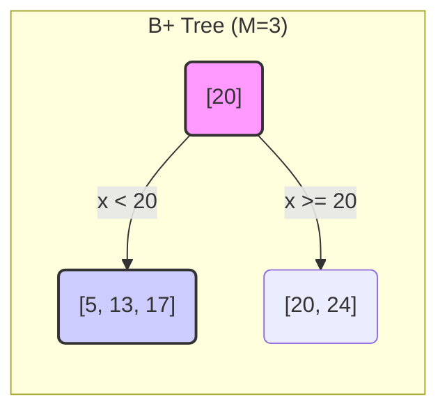
```mermaid
graph TD
    subgraph S3_After ["B+ Tree (M=3)"]
        direction TB
        Root("[20]")
        NewL1("[5, 13, 17]")
        L3("[20, 24]")
        
        style Root fill:#f9f,stroke:#333,stroke-width:2px
        style NewL1 fill:#ccf,stroke:#333,stroke-width:2px

        Root -- "x < 20" --> NewL1
        Root -- "x >= 20" --> L3
    end
```

删除8后，节点变为5，数据项数量为1，触发下溢，而其兄弟节点也只有2个数据项，无法借数据，此时必须执行合并操作，`5` 与 `13,17` 合并成一个新节点 `5,13,17`，并将父节点索引键中的 `13` 删除，根节点从 `13,20` 变为 `20`

**场景4：删除后递归下溢，**在下图中我们删除22

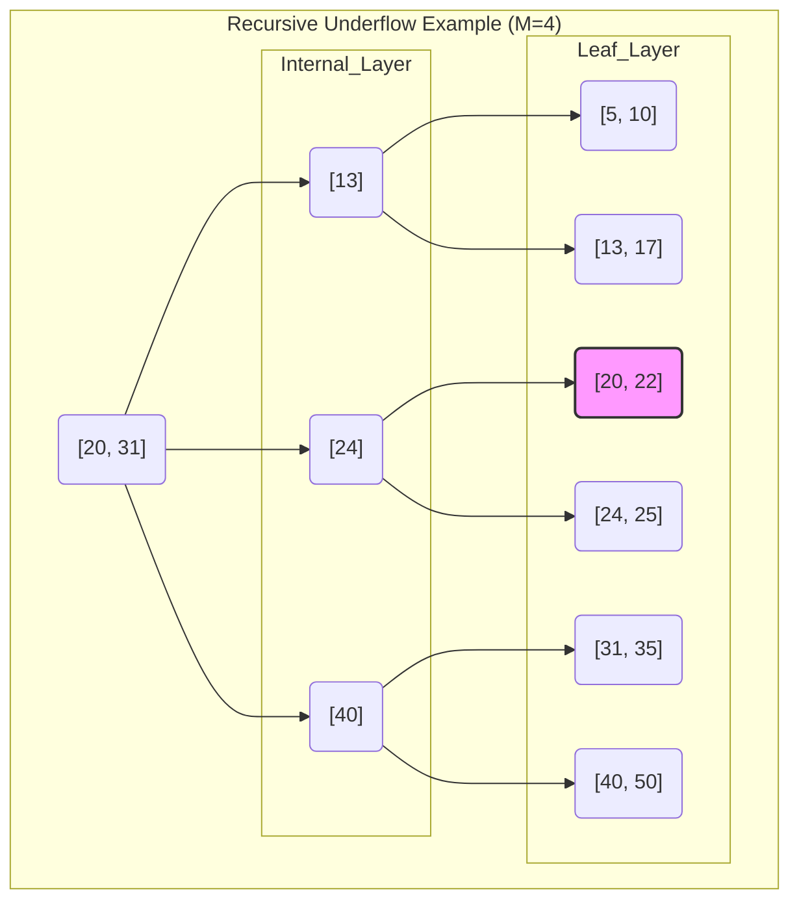
```mermaid
graph TD
    subgraph S4_Before ["Recursive Underflow Example (M=4)"]
        Root("[20, 31]")
        
        subgraph Internal_Layer
            direction LR
            I1("[13]")
            I2("[24]")
            I3("[40]")
        end

        subgraph Leaf_Layer
            direction TB
            L1("[5, 10]")
            L2("[13, 17]")
            L3("[20, 22]")
            L4("[24, 25]")
            L5("[31, 35]")
            L6("[40, 50]")
        end
        
        style L3 fill:#f9f,stroke:#333,stroke-width:2px

        Root --> I1
        Root --> I2
        Root --> I3
        
        I1 --> L1
        I1 --> L2
        I2 --> L3
        I2 --> L4
        I3 --> L5
        I3 --> L6
    end
```

删除22后，叶子节点变为 `20`，触发下溢，其兄弟节点 `24,25` 只有2个数据项，无法借出，只能执行合并，我们将 `20` 和 `24,25` 合并后得到下图：

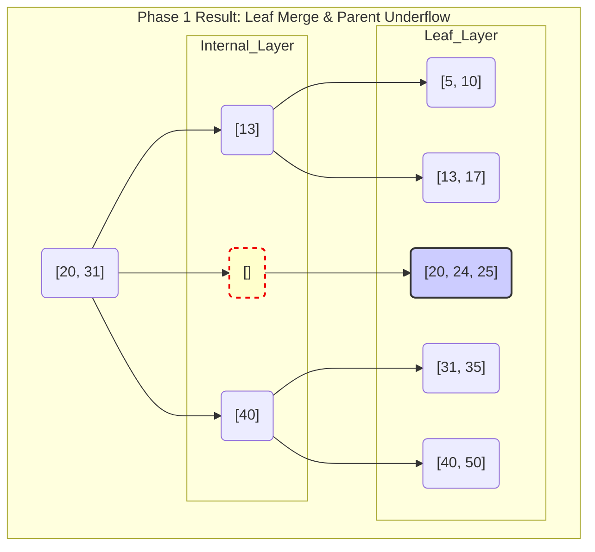
```mermaid
graph TD
    subgraph S4_Intermediate [Phase 1 Result: Leaf Merge & Parent Underflow]
        Root("[20, 31]")
        
        subgraph Internal_Layer
            direction TB
            I1("[13]")
            I2_underflow("[]")
            I3("[40]")
        end

        subgraph Leaf_Layer
            direction TB
            L1("[5, 10]")
            L2("[13, 17]")
            New_L34("[20, 24, 25]")
            L5("[31, 35]")
            L6("[40, 50]")
        end
        
        style I2_underflow fill:#ffc,stroke:#e00,stroke-width:2px,stroke-dasharray: 5 5
        style New_L34 fill:#ccf,stroke:#333,stroke-width:2px

        Root --> I1
        Root --> I2_underflow
        Root --> I3
        
        I1 --> L1
        I1 --> L2
        I2_underflow --> New_L34
        I3 --> L5
        I3 --> L6
    end
```

此时父节点失去了子节点指针24，需要移除，移除后父节点变为空，触发父节点下溢，而其左兄弟和右兄弟也都只有1个键，处于最低下限，无法出借，也只能合并，我们将其与左兄弟 `13` 合并，得到：


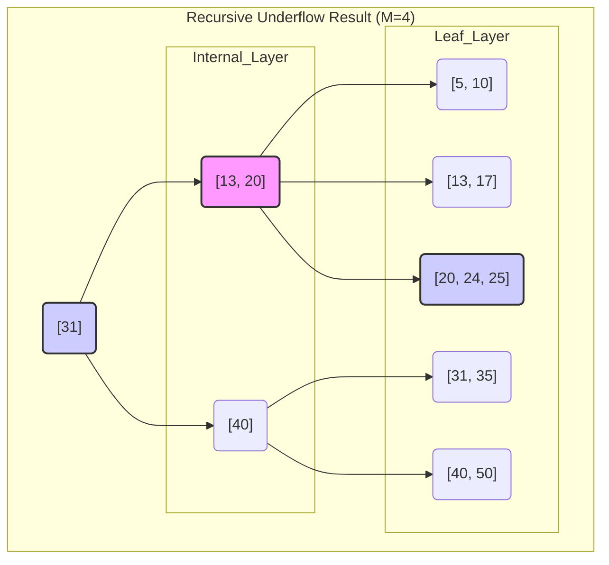
```mermaid
graph TD
    subgraph S4_After ["Recursive Underflow Result (M=4)"]
        Root("[31]")
        
        subgraph Internal_Layer
            direction TB
            New_I12("[13, 20]")
            I3("[40]")
        end

        subgraph Leaf_Layer
            direction TB
            L1("[5, 10]")
            L2("[13, 17]")
            New_L34("[20, 24, 25]")
            L5("[31, 35]")
            L6("[40, 50]")
        end
        
        style Root fill:#ccf,stroke:#333,stroke-width:2px
        style New_I12 fill:#f9f,stroke:#333,stroke-width:2px
        style New_L34 fill:#ccf,stroke:#333,stroke-width:2px

        Root --> New_I12
        Root --> I3
        
        New_I12 --> L1
        New_I12 --> L2
        New_I12 --> New_L34

        I3 --> L5
        I3 --> L6
    end
```

### Complexity Analysis

对于一颗有 $N$ 个数据的 $M$ 阶 B+ 树：

- 深度 $Depth(M,N)=O([\log_{[\frac{M}{2}]}N])$

- 插入时间 $T(M,N)=O(\frac{M\cdot \log N}{\log M})=O(M\log_M N)$

!!! note "Tip"

    所以阶数 $M$ 不是越大越好，最合适的取值为 3 或 4

- 查找时间 $T_{Find}(M,N)=O(\log _M N)\leq O(\log N)$
