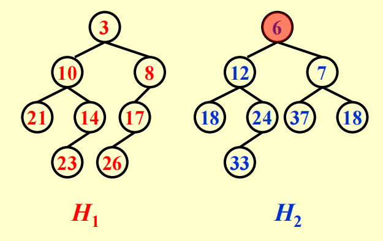
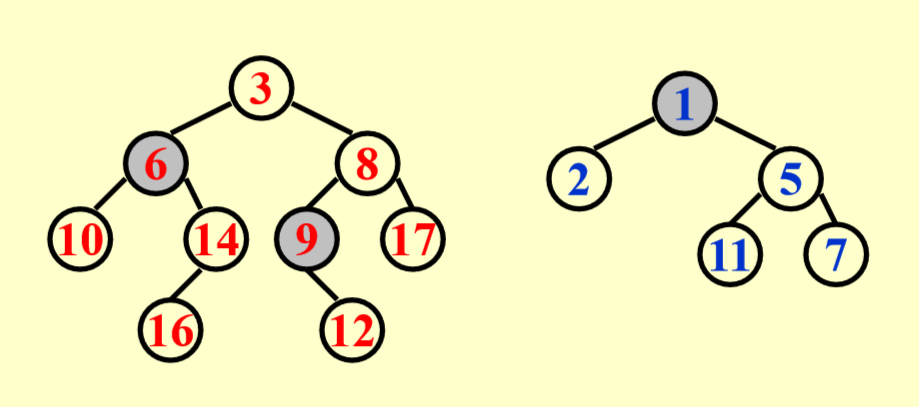
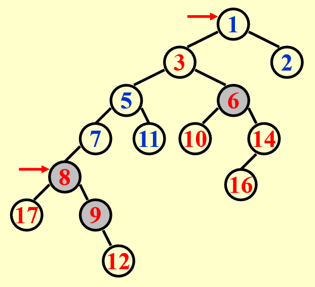

## Motivation

我们曾经学过堆(heap)这个数据结构，其能在 $O(1)$ 的时间找到最大值和最小值（对应最大堆和最小堆），insert，delete 的操作的时间复杂度为 $O(\log N)$，表现得也很好。但如若我们考虑合并两个堆的场景，对于一般的二叉堆而言，我们需要将一个堆的所有元素逐个插入到另一个堆中，然后再进行堆化操作，这需要 $O(N)$ 的时间，线性的时间复杂度是不可接受的，我们是否有一种改良的堆能够**更高效地合并**呢？这就引出了本章所讲的两种数据结构 leftist heaps(左倾堆) 和 skew heaps(斜堆)

## Leftist Heaps

左倾堆仍然保持堆元素的大小关系，即每个节点要小于/大于其子节点，但其不再是一棵完全二叉树，而是维持着“左倾”的结构性质，我们先引入一个核心概念——**Null Path Length（零路径长）**

### Leftist Heaps Definition

#### Null Path Length

我们将一个节点 `X` 的 null path length 记为 Npl(X)，指的是从节点 `X` 到一个**没有两个子节点的节点（也即叶子节点或者只有一个子节点的节点）**的**最短路径长度**。并且我们约定 $\text{Npl}(NULL) = -1$，则对于一般的节点 `X`，有如下的递推计算 Npl 的公式：
$$
\text{Npl}(X) = \min\{\text{Npl}(C)+1 \qquad \forall C\  \text{as children of X}\}
$$

#### Leftist Heaps Property

The leftist heap property is that for every node `X` in the heap, the null path length of the left child is at least as large as that of the right child.（对于左倾堆中的任意一个节点 `X`，其左儿子的 Npl 必须大于或等于右儿子的 Npl）

这个性质是左倾堆的关键，它导致了堆的节点会偏向左边，使得左倾堆的右路径(right path)非常短，对于右路径的长度和节点数，我们有以下重要的结论：

对于一个左倾堆，如果它的右路径上有 $r$ 个节点（包括根节点，也即根节点的 Npl 为 $r-1$），那么这个左倾堆至少有 $2^r-1$ 个节点。我们可以使用数学归纳法来证明这个结论：

当 $n=1$ 时，左倾堆只有 $1$ 个节点，显然符合结论；假设当 $n\leq k$ 时结论成立，则当 $n=k+1$ 时，我们分别考虑该左倾堆根节点的左子树和右子树，其右子树的右路径上有 $k$ 个节点，由归纳假设可知，其右子树至少有 $2^k-1$ 个节点；接着我们考虑左倾堆根节点左子树的节点数，有如下隐含的性质：**左倾堆根节点左孩子的右路径上也至少有 $k$ 个节点**，否则选取这条路径，就可以得到左倾堆的 Npl 比右路径要小，违反了左倾堆的定义，因此由归纳假设，左子树也至少有 $2^k-1$ 个节点，所以整个左倾堆有 $2^k-1+2^k-1+1=2^{k+1}-1$ 个节点

由这个结论我们可以得到，**对于一个具有 $N$ 个节点的左倾堆，它的右路径上至多有 $\lfloor\log (N+1)\rfloor$ 个节点**，其中 $\lfloor\rfloor$ 表示向下取整。因此如果我们就会有个自然地想法，既然左倾堆的右路径高度较低（对数级），我们不妨就将所有的操作在右路径上进行，这样就能够得到 $O(\log N)$ 的时间复杂度。

左倾堆这种数据类型的声明如下：

```c
typedef struct LeftListHeapNode* PriorityQueue;

struct LeftistHeapNode{
    ElementType Element;
    PriorityQueue Left;
    PriorityQueue Right;
    int Npl; // 需要维护节点的 Npl，这对后续的 operations 至关重要
};

// 这里我们的 PriorityQueue 是一个类型别名，等价于 struct LeftistHeapNode*，我们将接口变得更为抽象，不暴露实现细节，后面声明函数的时候可以类似下面这样
PriorityQueue merge(PriorityQueue H1, PriorityQueue H2);
PriorityQueue insert(ElementType X, PriorityQueue H);
ElementType findMin(PriorityQueue H);
int isEmpty(PriorityQueue H);
PriorityQueue deleteMin(PriorityQueue H);
// 而避免混用 struct LeftistHeapNode*, LeftistHeapNode*, Node* 等等不同写法，不过无关大雅
```

### Leftist Heaps Operations

#### Merge

合并两个左偏堆我们会讲解两种版本，分别是 Recursive version 和 Iterative version，也即递归实现和迭代实现，我们将以下面这个例子作讲解：



##### Recursive Version

递归版本的合并操作流程主要是三步：

- **合并：**`Merge(H1->Right, H2)`：将 `H1` 和 `H2` 进行合并，我们首先会比较两者的根节点`H1` 的根节点更小，我们将 `H1` 的根节点作为合并之后的堆的根节点，后续的任务就是将 `H1` 的右子树与 `H2` 进行合并，递归执行，直到某一个左倾堆是空堆。
- **依附：**`Attach(H2, H1->Right)`：在 `Merge(H1->Right, H2)` 之后，`H1` 的右子树和 `H2` 已经合并为同一个左倾堆，此时我们将这个左倾堆依附到 `H1` 的右子节点上，就暂时地将所有节点合并到同一个堆上了。
- **检查性质：**此时我们需要检查这个堆是否满足左倾堆的性质，如果右子树的 Npl 大于左子树的 Npl，就交换左右子树，也即 `Swap(H1->Right, H1->Left)`

PPT 提供了递归实现的代码：

```c
PriorityQueue Merge(PriorityQueue H1, PriorityQueue H2) {
    if (H1 == NULL) {  
        return H2;
    }
    if (H2 == NULL) {
        return H1;
    }
    // 将根节点更小的节点作为合成堆的根节点
    if (H1->Element < H2->Element) {
        return Merge1(H1, H2);
    } else {
        return Merge1(H2, H1);
    }
}

// 辅助函数，实现了主要的递归合并逻辑
static PriorityQueue Merge1(PriorityQueue H1, PriorityQueue H2) {
    if (H1->Left == NULL) {     // 递归终点，当 H1 是空堆的时候，直接合并
        H1->Left = H2;          /* H1->Right is already NULL
                                and H1->Npl is already 0*/
    } else {
        H1->Right = Merge(H1->Right, H2);  // Step 1 & 2
        if (H1->Left->Npl < H1->Right->Npl) {
            SwapChildren(H1);              // Step 3
        }
        H1->Npl = H1->Right->Npl + 1;      // 需要更新 Npl，因为如果不更新 Npl的话，初始化的时候我们将 Npl 设置为0，一直不更新，后续判断是否需要交换的时候就没法判断
    }
    return H1;
}
```

##### Iterative Version

!!! tip "致谢"

    感觉自己能懂意思，但是用文字描述出来总不太准确，于是借鉴了一些 [NoughtQ 前辈的笔记 ](https://note.noughtq.top/algorithms/ads/4)中的描述

首先要明确的是，整个左倾堆的合并操作我们都不改变左子树，只在 right path 上做文章，其详细步骤如下：

- 首先取定目标堆，我们比较两个堆的根节点，根节点较小的堆作为目标堆，记为 `H`，它的根就是最终合并堆的根，并且其左子树不变
- 将目标堆 `H` 的右子树拆出来，我们记为待比较堆 `A`，另一个即将被合并的堆我们记为待比较堆 `B`
- 接下来我们比较 `A` 和 `B` 的根节点，谁的根节点更小，我们就将**其根节点及其左子树**直接挂载**目标堆 `H` 的右子树位置**，胜出堆的右子树被留下作为新的待比较堆。
- 重复上述过程直至某个待比较堆为空，此时我们从最后一次挂载的位置开始，沿着右路径向上回溯到根，对每个节点更新 Npl，也即 `Npl = right->Npl + 1`，并检查是否满足 `left->Npl >= right->Npl`，如果不满足我们就交换左右子树

具体的例子可以参考 [示例](https://note.noughtq.top/algo/ads/4#__tabbed_1_1)

#### Insert

插入可以看成是一种特殊的合并操作，也即只有一个节点的堆与另一个堆进行合并，可以复用 Merge 部分的代码

#### DeleteMin

!!! note "Tip"

    这里我们默认是最小堆，所以对应 DeleteMin

也可以借助 Merge 来实现，直接删除根节点，然后合并根节点的两个子堆即可

## Skew Heaps

斜堆是左偏堆的一种简单形式，它不需要维护 Npl，其目标是 Any M consecutive operations take at most $O(M\log N)$ time. 其与 Leftist Heaps 的关系类似 AVL Trees 和 Splay Trees 的关系

### Merge

斜堆的 Merge 操作原理如下：Always swap the left and right children except that the largest of all the nodes on the right paths does not have its children swapped.

所以斜堆合并步骤如下：

- 比较两个堆的根，较小的根作为新根
- 将其右子树与另一个堆进行合并
- 从当前节点沿右路径向上，或者从根节点向下（这两者是等价的），对每个节点都交换其左右子树（即把合并后的结果挂到左子树，原来的左子树变成右子树）

需要说明的是，在最终合并路径上，值最大的那个节点，不需要交换它的左右子树

具体的例子可以参考 [例子](https://note.noughtq.top/algo/ads/4#__tabbed_2_1)，一定要理解思路，画对()

!!! note "Tip"

    - 斜堆无需维护 Npl 字段，节省了一定的内存空间，并且总是交换左右子树，也不需要根据 Npl 来判断何时需要交换
    - Worst case 中，斜堆的所有操作的时间复杂度均为 $O(N)$，但摊还复杂度还是 $O(\log N)$

### Amortized Analysis

前面提到，左倾堆的摊还复杂度是 $O(\log N)$，下面我们使用势能函数法进行证明：

势能函数法的难点在于选择一个好的势能函数，我们总是希望对于势能函数来说，有的时候势能增加，有的时候减少，从而达到摊还的目的。在这里有的人可能会选取右子树的节点个数作为势能函数，但这其实不是一个好的选择。因为斜堆会不停地交换左右子树，右子树的节点个数可能增加，这自然对应了那些 bad case，但问题是在 good case 时，我们也无法保证势能是减小的，所以以右子树的节点个数作为势能函数并不能满足摊还分析的要求。

记第 $i$ 次操作后得到的堆的根节点为 $D_i$，这里选取的势能函数 **$\Phi(D_i)$ 为这个堆上 heavy node 的个数**。heavy node 的定义是：A node p is heavy if the number of descendants of p's right subtree is at least half of the number of descendants of p, and light otherwise. Note that the number of descendants of a node includes the node itself.(一个节点 `p` 是重节点，当且仅当它的右子树的后代数量 $\geq$ `p` 的总后代数量的一半，否则它是轻节点，后代数量指的是以该节点为根的子树的总节点数)

!!! note "Tip"

    这里尤其要注意的是，这个定义不等价于 “右子树的节点数严格大于左子树的节点数”，这是一个充分条件，但不是充要条件

我们先来看这么一个例子：

| 合并前                                                       | 合并后                                                       |
| ------------------------------------------------------------ | ------------------------------------------------------------ |
|  |  |

在合并之前，重节点有 6 9 1，合并后 6 和 9 仍然保持重节点状态，1 变为了轻节点，8 变为了重节点。

这里有一个关键的结论：**合并后轻重状态发生变化的节点一定位于原来堆的右路径上**，这是因为在斜堆的合并过程中，只有右子树发生变化，如果一个节点不在右路径上，它的整个子树结构一定没有被改变过，所以它的轻重状态不变。

所以我们记 $H_i=l_i+h_i(i=1,2)$，这里 $H_i,l_i,h_i$ 分别指 right path 上的节点数，轻节点数，重节点数，我们考虑实际成本，在最坏情况下，有合并所需时间为
$$
T_{\text{worst}}=l_1+h_1+l_2+h_2
$$
在合并之前，势能函数 $\Phi(D_i)=h_1+h_2+h$，其中 $h$ 表示两个堆不在各自 right path 上的重节点数，这是不会发生变化的；在合并之后，我们需要来考虑原本的轻节点和重节点的变化


