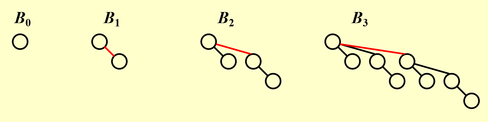
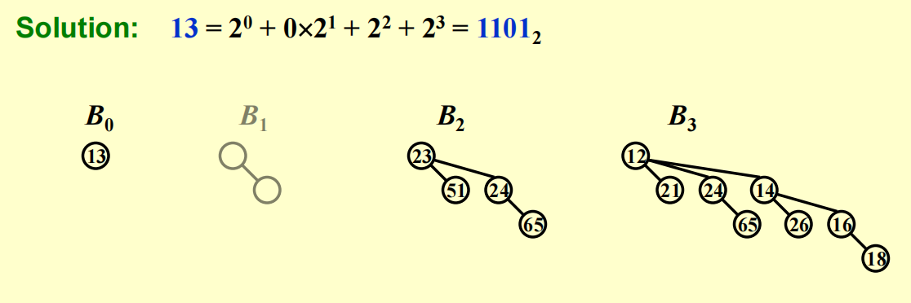

# Lecture5 Binomial Queue(二项队列)

## Binomial Queue's motivation

我们前面学习过左倾堆和斜堆两种数据结构，它们插入操作的平均时间复杂度为 $O(\log n)$，这似乎是一个不错的效率，但事实上，如果我们从空堆开始插入 $n$ 个元素，其总时间是 $O(n)$，从而得到平均时间复杂度为 $O(1)$，似乎 $O(\log n)$ 的插入操作还不够高效，那么是否有一种数据结构能够实现更快的插入（摊销意义上）呢？这就要引出我们这节课要学的**Binomial Queue（二项队列）**

!!! note "Tip"

    二项队列引入的时候就强调了说，我们希望插入的时间复杂度能够更好，强于左倾堆和斜堆的 $O(\log n)$，二项队列的插入的时间复杂度是 $O(1)$ 的

## Binomial Queue Definition

二项队列不是单一的堆有序树（比如像 BST、红黑树、Splay Tree 那样只有一个根节点），而是由多个有序堆树的集合（我们称之为森林），其中每个树都是二项树（binomial tree），并且整个队列满足最小堆性质（堆有序）。

二项树满足如下递归定义：

- 高度为 $0$ 的二项树是一棵单节点的树
- 高度为 $k$ 的二项树 $B_k$ 由两棵高度为 $k-1$ 的二项树 $B_{k-1}$ 构成，且其中一棵树（根节点较大的 $B_{k-1}$）附着在另一棵树（根节点较小的 $B_{k-1}$）的根节点上

一些二项树的例子如下图：

观察上图我们可以得到一些关键的规律，以及为什么叫“二项”：

- $B_k$ 的根节点有 $k$ 个子节点，并且分别对应 $B_0,B_1,\cdots,B_{k-1}$
- $B_k$ 一共有 $2^k$ 个节点
- 深度为 $d$ 的一层上有 $C_k^d$ 个节点

需要指出的是，任意大小的优先队列都可以用一个二项队列唯一表示（A priority queue of any size can be uniquely represented by a collection of binomial trees.），前面我们提到，二项队列可以表示为二项树的集合，我们可以利用二进制数来表示二项队列：第 $k-1$ 位数字上的数如果为 $1$，代表 $B_k$ 这个二项树存在；如果为 $0$，代表 $B_k$ 这个二项树不存在。

比如对于 $13$ 个节点的二项堆，我们将其转化为二进制，为 $1101_2$，也即代表 $B_0,B_2,B_3$ 存在，所以二项队列如下图所示：

## Binomial Queue Operation

### FindMin

首先因为每个二项树的最小节点都在根节点中，我们只需要去比较每个二项树的根节点即可，而二项队列至多有 $\lceil\log N\rceil$ 个根节点（这是因为十进制数转化为二进制数，即二进制数的位数），所以 FindMin 的时间复杂度为 $O(\log N)$。

!!! note "Tip"

    如果我们选择用字段记录最小值并随时更新的话，也能将时间复杂度提升至 $O(1)$

### Merge

我们首先将二项队列内的二项树按其高度排列，二项队列的合并类似于二进制的加法，我们按高度合并树，从较低高度的二项树开始，如果同高度有多个树，就合并成更高的树（根节点较大的树附加在根节点小的树上），并处理进位。Merge 操作的时间复杂度为 $O(\log N)$

!!! note "Tip"

    如果遇到三个规模相同的二项树，任意选择其中两个进行合并即可

### Insert

插入可以看做是一种特殊的合并操作，如果最小的，不存在的二项树为 $B_i$（相当于对应二进制上为 $0$，到这里 merge 一定会停止），那么插入操作的时间复杂度为 $\text{Const}\cdot(i+1)$；后面我们在均摊分析的部分会讲到，对一个空的二项队列执行 $N$ 次插入操作，最坏情况下的时间复杂度为 $O(N)$，平均时间为 $O(1)$

### DeleteMin

- 首先 `FindMin` 找到最小值所在的树 $B_k$，其时间复杂度为 $O(\log N)$
- 从二项队列 $H$ 中移除 $B_k$，得到新的二项队列 $H'$，其时间复杂度为 $O(1)$
- 将 $B_k$ 的根节点从 $B_k$ 中移除，留下二项树 $B_0,B_1,\cdots,B_{k-1}$，我们将该队列记为 $H''$，其时间复杂度为 $O(\log N)$
- 最后执行合并，合并 $H'$ 和 $H''$，也即 `Merge(H',H'')`，其时间复杂度为 $O(\log N)$

故 DeleteMin 的总的时间复杂度也为 $O(\log N)$

例子可以参考 PPT 或者 NoughtQ 前辈的笔记

## Implementation

在实现二项队列的时候，我们会用一个数组来存储二项树，将这个数组作为二项队列，其中 DeleteMin 操作我们可以将所有子树的根节点存在数组中，并且使用 `Leftchild` 和 `nextsibling` 分别维护子树和兄弟树；**Merge 操作需要将孩子按大小排序，我们按阶数降序对子树排序，因为这样当我们合并两棵二项树的时候，其中一颗就可以直接作为另一棵树的最左子树，而无需遍历所有的子树**。

!!! note "Tip"

    具体的代码实现可以参考 PPT

## Complexity Analysis

通过 $N$ 次连续插入来创建一个有 $N$ 个元素的二项堆所需要的时间为 $O(N)$，下面我们分别通过聚合法和势能函数法进行讲解

### 聚合分析法

我们记 `steps` 是每次插入一个新节点的基本操作，其成本为1；记 `links` 是合并两个等高树成更高树的次数，每次 `links` 的成本为 $O(1)$

则我们可以得到如下表格

| 插入序号 | Steps | Links | 总成本 ($C_i$) | 森林结构 | 树数 ($Φ_i$) |
| -------- | ----- | ----- | -------------- | -------- | ------------ |
| 1        | 1     | 0     | 1              | B0       | 1            |
| 2        | 1     | 1     | 2              | B1       | 1            |
| 3        | 1     | 0     | 1              | B1 B0    | 2            |
| 4        | 1     | 2     | 3              | B2       | 1            |
| 5        | 1     | 0     | 1              | B2 B0    | 2            |
| 6        | 1     | 1     | 2              | B2 B1    | 2            |
| 7        | 1     | 0     | 1              | B2 B1 B0 | 3            |
| 8        | 1     | 3     | 4              | B3       | 1            |

能够从上表中看出，`steps` 次数始终为1，`links` 次数不确定，所以我们主要讨论的就是 `links` 的分布规律。

二项队列的插入其实等价于从 $0$ 到 $N-1$ 的二进制计数，每次加1都有可能触发进位，`links` 就等于最低连续 $1$ 的位数，且 `links=k` 发生在二进制最低 $k$ 位为1，第 $k+1$ 位为 $0$ 的时刻，所以每 $2^{k+1}$ 次计数，`links=k` 就出现1次，故在 $N$ 次插入中，`links=k` 的出现次数近似为 $\frac{N}{2^{k+1}}$，所以有总的 `links` 为
$$
\sum_{k=0}^{\log N} k\cdot \frac{N}{2^{k+1}}\approx O(N)
$$
而 `steps` 也是 $O(N)$的，所以总成本也为 $O(N)$

### 势能函数法

我们记 $C_i$ 为第 $i$ 次插入的实际成本，包括创建新节点的成本 $1$ 和链接次数 $l_i$，也即有 $C_i\approx 1+l_i$；并记 $\Phi_i$ 为第 $i$ 次插入后的势能函数，**势能函数我们定义为二项队列中的二项树数量**，容易想到初始状态为空的队列，且 $\Phi_0=0$，这里有一个很关键的等式是：
$$
C_i+(\Phi_i-\Phi_{i-1})=2, \forall i=1,2,\cdots,N
$$
下面我们说明等式的正确性：

- 无链接情况：$C_i=1,\Delta\Phi_i=1$
- 有 $k$ 次链接的情况，$C_i=1+k$（创建+链接），$\Delta(\Phi_i)=1-k$（先创建了一棵二项树，链接 $k$ 次又减少了 $k$ 个二项树）

所以有摊还成本满足
$$
\sum_{i=1}^N C_i+\Phi_N=2N
$$
故
$$
\sum_{i=1}^NC_i=2N-\Phi_N\leq 2N=O(N)
$$
