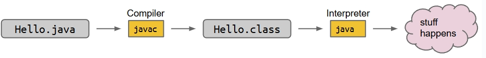

## Introduction to Java

!!! Tip "For C and C++ learners" 
    In my opinion, Java's basic rules are kind of similar to C and C++

### Basic Rules

1. All code in Java must be part of a class. Every Java file must contain a class declaration, all code lives inside a class, even helper functions, global constants, etc. 
2. We delimit the beginning and end of segments of code with `{}`
3. All statements in Java must end in a semi-colon（分号）
4. For code to run we need `public static void main()`
5. Before Java variables can be used, they must be declared
6. Java variables must have a specific type
7. Java variable types can never change
8. In Java, types are verified before the code runs! If there are type issues, the code will not compile

!!! note "Tip"

    Java has an important features——Static Typing, which gives us a number of important of advantages over languages without static typing:

    - Types are checked before the program is even run, allowing developers to catch type errors with ease
    - If we write a program and distribute the compiled version, it is guaranteed to be free of any type errors, which makes our code more reliable
    - Every variable, parameter, and function has a declared type, making it easier for a programmer to understand and reason about the code

### Functions

1. To declare a function in Java, use `pblic static`(which is similar to `def` in Python, but we still need a return type in Java)
2. All parameters of a function must have a type, and the function itself must have a return type, like `public static int larger(int x,int y)`
3. All functions must be part of a class, In programming language terminology（术语）, a function that is part of a class is called a "method", so all functions in Java are methods

### Compilation

to run `Hello.java`, we'd type the command `javac Hello.java` into the terminal, which asks the compiler to compile and generates a file `Hello.class`, then we type the command `java Hello` for interpreting



## Using and Defining Classes

### Defining and Instantiating Classes

Classes can be instantiated, and instances can hold data.

Some key observations and terminology:

- An object in Java is an instance of any class.
- class has its own variables, also known as instance variables or non-static variables. These must be declared inside the class.
- For the method in class which do not have the `static` keyword, we call it *instance methods* or *non-static methods*
- Members of a class are accessed using *dot(`.`)* notation

### Static vs. Non-Static

- Instance methods, a.k.a. non-static methods

- Class methods, a.k.a. static methods

Instance methods are actions that can be taken only by a specific instance of a class. Static methods are actions that are taken by the class itself.

The key differences between static and non-static methods are as follows:

- Static methods are invoked(调用) using the class name
- Instance methods are invoked using an instance name
- Static methods can't access "my" instance variables
- Static members are accessed using class name
- Non-static members cannot be invoked using class name
- Static methods must access instance variables via a specific instance

!!! note "Tip"

    `this` in Java is similar to `this` pointer in C++. The most significant difference is that `this` in Java is a reference but not pointer(There is no pointer in Java). So if we want to access members or methods using `this`, we should use *dot* notation but not `->` 

## Testing

We'll discuss how we can write tests to evaluate code correctness in this lecture. Along the way, we'll also discuss an algorithm for sorting called Selection Sort.

As a totally new way of thinking, we'll start by writing `testSort()` first, and only after we've finished the test, we'll move on to writing the actual sorting code.

### Ad Hoc Testing

To write a test for `Sort.sort`, we simply need to create an input, call `sort`, and check whether the output of the method is correct. If not, we print out the first mismatch and terminate（终止） the test. For instance, we might create a test class as follows:

```java
public class TestSort{
    public static void testSort(){
        String[] input = {"i", "have", "an", "egg"};
        String[] expected = {"an", "egg", "have", "i"};
        Sort.sort(input);
        for (int i = 0; i < input.length; i += 1) {
            if (!input[i].equals(expected[i])) {
                System.out.println("Mismatch in position " + i + ", expected: " + expected + ", but got: " + input[i] + ".");
                break;
            }
        }
    }

    public static void main(String[] args) {
        testSort();
    }
}
```

!!! warning "注意"

    When we test for equality of two objects, we cannot simply use the `==` operator. The `==` operator compares the literal bits in the memory boxes, in other words, the address.

An annoying fact is that writing such ad hoc tests would be very tedious, as we may write a bunch of different loops and print statements. So in the next section, we'll see how the `org.junit` library saves us a lot of work.

### JUnit Testing

The `org.junit` library provides a number of helpful methods and useful capabilities for simplifying the writing of tests. For example, we can replace our simple ad hoc test from above with:

```java
public static void testSort(){
    String[] input = {"i", "have", "an", "egg"};
    String[] expected = {"an","egg","have","i"};
    Sort.sort(input);
    org.junit.Assert.assertArrayEquals(expected,input);
}
```

The code is much simpler and does the same thing.

### Selection Sort

Selection sort consists of three steps:

- Find the smallest item
- Move it to the front(by swapping)
- Selection sort the remaining N-1 items(without touching the front item), similar to recursive to some extent

## References and Recursion

### Primitive Types

There are 8 primitive types in Java: byte, short, int, long, float, double, boolean, char

When we declare a variable of a certain type in Java, things will happen as follows:

- our computer sets aside exactly enough bits to hold a thing of that type
- Java creates an internal table that maps each variable name to a location
- Java does not write anything into the reserved boxes. In other words, there are not default values.
  - For safety, Java will not let access a variable which is uninitialized

**The Golden Rules of Equals**

- y = x copies all the bits from x into y

### Reference Types

Everything else(different from primitive types), including arrays, is a reference type

When we instantiate an Object using new(e.g. Dog, Walrus, Planet):

- Java first allocates a box of bits for each instance variable of the class and fills them with a default value(e.g. 0, null)
- The constructor then usually fills every such box with some other value

### Reference Variable Declaration

When we declare a variable of any reference type, Java allocates a box of 64 bits, no matter what type of object. The 64 bit box contains not the data about the object, but instead the address of the object in memory.

As an example, suppose we call:

```java
Walrus someWalrus;
someWalrus = new Walrus(1000,8.3);
```

The first line creates a box of 64 bits. The second line creates a new Walrus, and the address is returned by the `new` operator. These bits are then copied into the `someWalrus` box according to the GRoE

### Parameter Passing

We have mentioned *The Golden Rule of Equals* before, which says b = a copies all the bits from a into b. Passing parameters obeys the same rule: Simply copy the bits to the new scope.(Which is also called **pass by value**)

!!! Tip "Comment"

    ### Java vs. C++: Primitive Data Types and Object Assignment

    #### Primitive Data Types Assignment

    **For Java:**

    Assigning a primitive type simply copies its value. Changes to the new variable don't affect the original.

    **For C++:**

    Similar to Java, assigning a primitive type simply copies its value. Changes to the new variable don't affect the original.

    #### Object Assignment

    **For Java:**

    Assigning an object copies its reference(memory address), not the object itself. Both variables point to the same heap-allocated object, so changes affect all references.

    **For C++:**

    - **Value Passing(default):** Assigning an object copies the entire object(via copy constructor), creating a new instance. Changes to the new object don't affect the original.
    - **Reference/Pointer:** Using pointers or references mimics Java's reference passing, where both point to the same object.

    What needs to attach attention to is that when we use for-each loop in Java, it is kind of different to that in C++. In C++, we know that the for-each loop is read only, and we will use reference if we want to revise the value, such as `for(auto &i : vector)`. But in Java, its for-each loop always iterates over a copy(a copy of the array elements) and can not modify the array directly.


 


