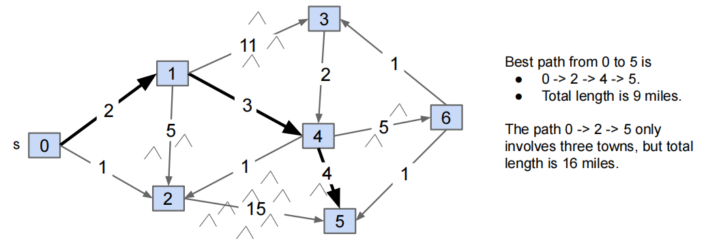
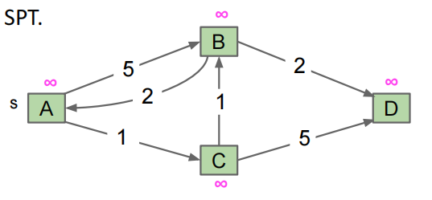
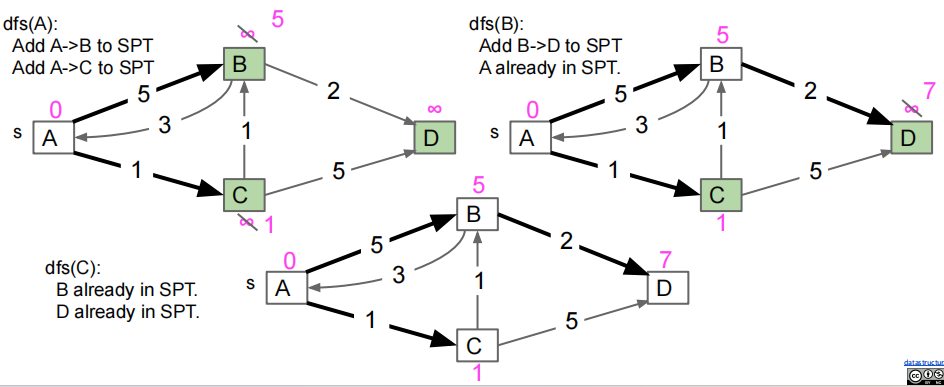
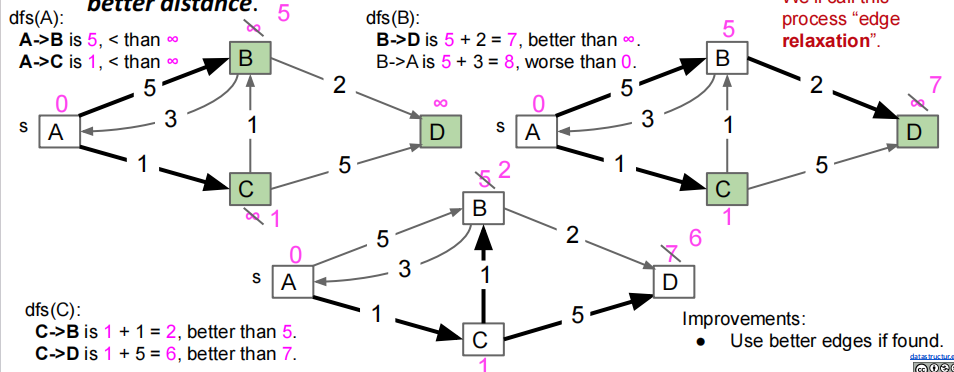
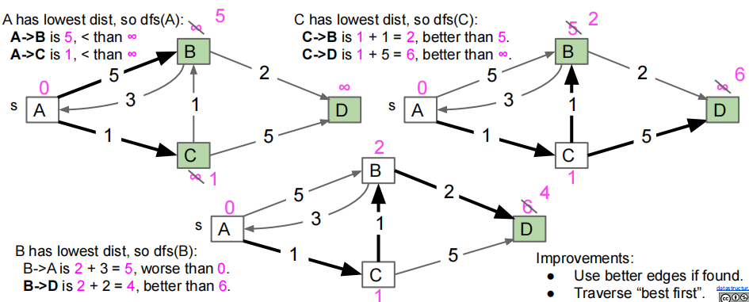
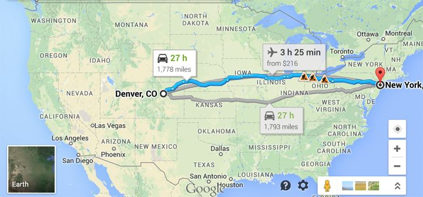
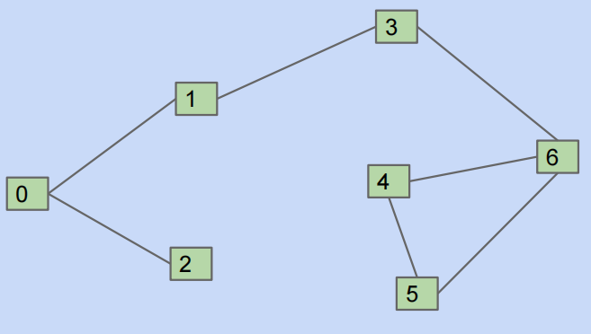
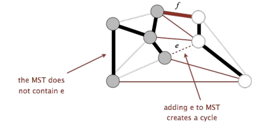
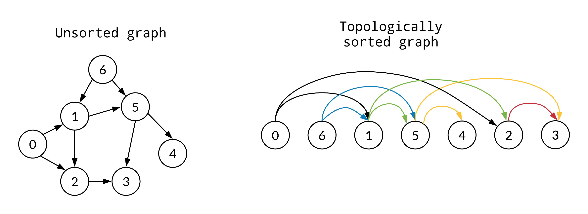
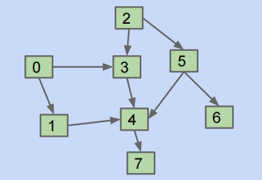

## Shortest Paths（最短路径问题）

首先回顾一下 BFS 和 DFS 在 Path Finding 上的表现：

- **Correctness：**Do both work for all graphs? Yes!
- **Output Quality：**Does one give better results?
  - BFS is a 2-for-1 deal, not only do we get paths, but our paths are also guaranteed to be shortest
- **Time Efficiency：**Is one more efficient than the other?
  - Should be very similar. Both consider all edges twice. Experiments or very careful analysis needed.
- **Space Efficiency：**Is one more efficient than the other?
  - DFS is worse for spindly graphs（细长图）
    - Its call stack gets very deep
    - Computer needs $\Theta(V)$ memory to remember recursive calls
  - BFS is worse for absurdly "bushy" graphs
    - Queue gets very large. In worst case, queue will require $\Theta(V)$ memory
    - Example: 1,000,000 vertices that are all connected. 999,999 will be enqueued at once.
  - Note: In our implementations, we have to spend $\Theta(V)$ memory anyway to track distTo and edgeTo arrays.(It can be optimized by storing distTo and edgeTo in a map instead of an array.)

总的来说，BFS 在无权图的最短路径问题表现更好，但是对于有权图，最短路径应当能够最小化权重总和，而不仅仅是边数，这时候 BFS 算法就不足以解决此问题。

### Dijkstra's Algorithm

在引入 Dijkstra 算法之前，我们首先讨论一下 Single Source Shortest Paths 问题，考虑从起点 $s$ 到每个其他顶点的最短路径：



这里我们直接给出一个关键的 observation：**我们的 solution 似乎总是一棵树**（没有负权边的情况），我们称之为 **Shortest Paths Tree**（SPT）。并且还会有这样一个结论，如果 $G$ 是一个连通的带权图，其有着 $V$ 个顶点和 $E$ 条边，则它对应的Shortest Paths Tree有多少条边？

答案是 $V-1$，这是由树结构的性质保证的，即**树的边的数量总是比顶点的数量少1**（如果忘了可以回忆一下离散数学的内容）。

那接下来我们就尝试设计一种算法去找到最小路径，我们可以从一个不良的算法开始，然后逐渐地取改进它。

我们的算法从如图所示的状态开始，所有的节点都尚未被标记，所有的距离都仍然为无穷，并且 SPT 也没有添加边



**Bad algorithm#1：**Perform a **depth first search**. When you visit v:

- For each edge from v to w, if w is not already part of SPT, add the edge.



从上图容易看出，这样生成的 SPT 是不正确的，原因在于我们使用了 DFS 遍历，没有更新已添加的更好边，我们尝试改进，如果找到了更好的边，我们就使用更好的边(Use better edges if found)

**Bad algorithm#2：**DFS + add edge to SPT **only if that edge yields better distance**(We call this process "edge relaxation").



可以看到，这样形成的 SPT 仍然是错误的，我们得到 $D$ 的最小路径长度为6，而实际应为4，错误在于 DFS 顺序错误，在 C 后访问 B 时我们未能重新遍历 B-D。

为了解决这个问题，我们还需要引入**最佳优先遍历**(Traverse "best first")，即优先处理 `distTo` 最小的顶点

**Dijkstra's Algorithm：**Perform a best first search(closest first). When you visit v:

- For each from v to w, relax that edge



这样我们可以看出，生成的 SPT 就是正确的了，执行 Dijkstra's Algorithm 的流程如下：

Insert all vertices into fringe PQ, storing vertices in order of distance from source. Repeat:

Remove (closet)vertex v from Priority Queue, and relax all edges pointing from v.

可以参考这个[demo](https://docs.google.com/presentation/d/1_bw2z1ggUkquPdhl7gwdVBoTaoJmaZdpkV6MoAgxlJc/pub?start=false&loop=false&delayms=3000)

### Dijkstra's Correctness and Runtime

#### Dijkstra's Algorithm Pseudocode

Dijkstra's:

- PQ.add(source,0)
- For other vertices v, PQ.add(v,infinity)
- While PQ is not empty:
  - p = PQ.removeSmallest()
  - Relax all edges from p

Relaxing an edge p -> q with weight w means:

- If distTo[p]+w<distTo[q]:
  - distTo[q] = distTo[p]+w
  - edgeTo[q] = p
  - PQ.changePriority(q, distTo[q])

!!! note "Tip"

    `PQ.changePriority(q, distTo[q])` 可能有点费解

    在 Dijkstra 算法中，我们使用 Priority Queue 来保证始终选择当前已知距离源最近的未访问定点 `removeSmallest()`。在松弛的过程中，当处理一个顶点 `p` 并松弛出其边 `p->q` 时，如果 `distTo[p] + w < distTo[q]`，说明 `p` 到达 `q` 的路径更短，这时候需要更新 `q` 的已知距离 `disTo[q]`，并相应地调整 `q` 在优先队列的优先级。而 `PQ.changePriority(q,distTo[q])` 则是将 `q` 的优先级更新为新的 `distTo[q]` 值。


Dijkstra's key invariants:

- edgeTo[v] is the best known predecessor of v（`edgeTo[v]` 是 v 的最佳已知前驱节点）
- distTo[v] is the best known total distance from source to v（`distTo[v]` 是从源到 `v` 的最佳已知总距离）
- PQ contains all unvisited vertices in order of distTo（我们在操作的时候总是选取优先队列中 distTo 最小的出队）

Important properties:

- Always visits vertices in order of total distance from source.（**总是按到源的总距离顺序来访问节点**）
- Relaxation always fails on edges to visited (white) vertices.（对于已访问的节点的松弛总是失败的）

#### Guaranteed Optimality（最优性保证）

如果所有边都是非负的，Dijkstra 保证返回正确结果，下面我们给出一个简化的使用数学归纳法的证明，假设所有边的权重非负。

The proof relies on the property that relaxation always fails on edges to visited vertices.（对于已访问的顶点的 relaxation 总是失败的）

Proof sketch:

- At start, distTo[source] = 0, which is optimal
- After relaxing all edges from source, assuming vertex v1 is the vertex with minimum weight, i.e. which is closet to the source. We claim that distTo[v1] is optimal, and thus future relaxations will fail.（这是因为对于其他的所有顶点 `p`，有 `distTo[p] ≥ distTo[v1] `，因此有 `distTo[p] + w ≥ distTo[v1] `，后续的松弛也就都会失败）
- We use induction to prove that this holds for all vertices after dequeuing.

#### Dijkstra' Runtime

假设我们使用的是二叉堆(binary heap)来实现优先队列(Priority Queue)：

- PQ `add`：$V$ 次，每次为 $O(\log V)$
- PQ `removeSmallest`：$V$ 次，每次为 $O(\log V)$，因为有堆化
- PQ `changePriority`：$E$ 次，每次为 $O(\log V)$，因为有堆化

所以总的运行时为 $O(V\log V+V\log V+E\log V)=O((E+V)\log V)$，假设图是连通的，此时有 $E>V$，则运行时可以简化为 $O(E\log V)$ 

#### Negative Edges

如果图有负权重的边，我们按最佳距离顺序访问并松弛的策略就可能会失效，这是因为对已访问节点的 relaxation 是有可能成功的。

### $A^{\star}$ 算法

#### Motivation

Dijkstra's algorithm 虽然能够找到最短路径树，但是对于**单源单目标场景**其实是有些低效的，因为 Dijkstra 事实上是以类似“同心圆”的方式探索的，其从源出发，按距离递增的顺序访问节点，我们可以看一个具体的例子：



假设源在 Denver，目标为 New York。Dijkstar 算法会先访问 Denver 附近的城市（比如1单位距离内所有节点），然后扩展到2单位、3单位，最终可能先探索了西部例如 Las Vegas, Los Angeles等等，后面才触及 New York（这是因为没有利用上 New York 在东方这个地理信息），这是相当浪费计算资源的。即使是短路，Dijkstra 仍然需要探索无关区域，直至“圆圈”大到足以包含目标。

这时候我们就会有一个 motivation，如果我们能够利用先验知识（比如目标方向），算法可以“引导”搜索优先东方节点，提高效率，所以我们考虑添加启发式算法来实现此优化。

#### $A^{\star}$ Introduction

$A^{\star}$ 是一种搜索算法，它是 Dijkstra 的变体，专门为单目标最短路径而设计，并引入已知距离和估计距离两个概念。仍然以上面的例子进行说明：

Simple idea:

- Visit vertices in order of d(Denver, v) + h(v,goal), where h(v,goal) is an estimate of the distance from v to our goal NYC.
- In other words, look at some location v if:
  - We know already know the fatest way to reach v.
  - And we suspect that v is also the fatest way to NYC taking into account the time to get v.

也即 Dijkstra 算法使用“真实”距离（从源到当前节点 `v` 的最佳已知距离，并且将 `bestKnownDistToV` 作为 PQ 的优先级）；而 $A^{\star}$ 添加从 $v$ 到目标的粗略估计（`estimateFromVToGoal`或`h(v,goal)`），优先级就变为了 `bestKnownDistToV + h(v,goal)`，这给出了从源到目标的“整体估计”

**算法步骤如下（与 Dijkstra 类似，但优先级不同）**：

- 初始化 Priority Queue：源节点`s` 的优先级为 `0+h(s,goal)`，其他节点的优先级为 `∞ + h(v, goal)`
- 当 PQ 非空时：
  - 优先级最小的节点 `p` 出队（当前从源到目标的“最佳估计”节点）
  - relax `p` 的所有出边，更新邻居的 `q` 的 `distTo[q]` 和 `edgeTo[q]`，如果更好，则修改其在优先队列中的优先级，`PQ.changePriority(q,distTo[q]+h(q,goal))`
- 短路：一旦目标 `t` 出队，即停止，并返回路径

**参考伪代码**

```
def a_star(source, target):
	PQ.add(source,0+h(source,target))
	for other vertices v:
		PQ.add(v,infinity + h(v,target))
	While PQ 非空:
		p = PQ.removeSmallest();
		if p == target:
			return reconstructPath(edgeTo,target)
		relax(p的所有出边)
```

可以参考这个[demo](https://docs.google.com/presentation/d/177bRUTdCa60fjExdr9eO04NHm0MRfPtCzvEup1iMccM/edit?slide=id.g771336078_0_180#slide=id.g771336078_0_180)

这时候就会有人问，我们要用到 `h(v,target)`，这怎么计算呢？事实上我们的 `h(v,target)` 是近似，而不是精确的计算。

#### 启发式函数(Heuristics)

启发式函数是 $A^{\star}$ 的核心，决定效率和正确性，良好的启发式函数需要满足以下几个要求：

- **Admissibility（可采纳性）：**`h(v,goal) ≤ trueDistance(v,goal) `，不高估真实距离，否则可能错过更好的路径
- **Consistency（一致性）：**对于每条边`(v,w)`有`h(v,goal)≤weight(v,w)+h(w,goal)`

比如说对于 Denver 到 New York，我们可以使用 GPS 的直线距离作为启发。

而坏的启发式函数会有什么后果呢？考虑这样的情况，假设最短路径经过城市 `C`，但 `h(C,goal)=∞`，这样对于 $A^{\star}$ 算法，其优先级为 `disTo[C]+∞=∞`，永不访问 `C`，导致忽略了最优路径，最终返回错误结果。

#### Comparison to Dijkstra

两者都用 PQ 和 relaxation，确保非负权重下是正确的，但 Dijkstra 优先级为 `distTo[v]`，即距离起始点的真实距离，更适合多目标 SPT；而 $A^{\star}$ 的优先级为 `distTo[v]+h(v,goal)`，即真实距离+估计距离，适合单目标，减少无关探索。效率上 $A^{\star}$ 在良好启发下访问更少节点，实际更快；最坏情况同 Dijkstra

两种算法的可视化[demo](http://qiao.github.io/PathFinding.js/visual/)

### Summarization

| Problem                 | Problem Description                                          | Solution             | Efficiency                                                   |
| ----------------------- | ------------------------------------------------------------ | -------------------- | ------------------------------------------------------------ |
| paths                   | Find a path from s to every reachable vertex                 | DFS                  | $O(V+E)$ time           $\Theta(V)$ space                    |
| shortest paths          | Find the shortest path from s to every reachable vertex      | BFS                  | $O(V+E)$ time                                  $\Theta(V)$ space |
| shortest weighted paths | Find the shortest path, considering weights, from s to every reachable vertex | Dijkstra's algorithm | $O(E\log V)$ time            $\Theta(V)$ space               |
| shortest weighted path  | Find the shortest path, considering weights, from s to some target vertex | $A^{\star}$          | Time depends on heuristic              $\Theta(V)$ space     |

## Minnimum Spanning Trees（最小生成树）

### Warmup Problem

给定一个无向图，如何判断其是否包含任何环？例如下面这个图：



这里介绍两种可能的思路：

- **深度优先搜索（DSF）：**我们从任意顶点（例如0）开始进行DFS，并继续遍历直至遇到已标记的节点，并且我们需要忽略已经走过的节点。最坏时间复杂度为 $O(V+E)$
- **加权快速并查集(WQU)：**我们对于每条边，都检查任意两个顶点是否连接，如果未连接，就进行 union 操作；如果已连接，则存在环。如果我们启用路径压缩，最坏时间复杂度为 $O(V+E\alpha(V))$，其中 $\alpha(V)$ 为逆 Ackermann 函数，增长极为缓慢

### Spanning Trees（生成树）

生成树的定义是这样的：给定一个无向图 $G$，如果 $G$ 的一个子图 $T$ 满足以下几点性质：

- 连通
- 无环（这是树的要求）
- 包含 $G$ 的所有顶点

我们就称 $T$ 是 $G$ 的生成树。

而最小生成树(MST)，顾名思义，就是使得（有权图）总权重最小的生成树。

!!! note "Tip"

    需要说明的是，MST 没有源顶点（也即从哪个顶点出发），仅仅是最小化总的权重，而 SPT（在本讲上方） 则是从特定源计算到所有顶点的最短路径，MST 有时候和特定源的 SPT 是相同的，但大部分时候，MST 和 SPT 不是同一棵树。

### A Useful Tool: Cut Property

我们先介绍 MST 的 Cut Property（切割属性），Cut 是指我们将图的顶点分为两个非空集合，Crossing Edge（跨越边）指的是连接两个集合的边。而 MST 的切割属性是说**在任何切割中，权重最小的 Crossing Edge 一定在 MST 中(Given any cut, minimum weight crossing edge is in the MST)**。我们可以使用反证法完成证明，如下图所示：



这里我们假设权重最小的 crossing edge 是边 `e`，如若它不在 MST 中，则我们添加边 `e` 形成环，此时环中的另一跨越边 `f` 的权重反而更高，我们删去 `f` 就得到了权重更小的 Spanning Trees，产生矛盾。

### Generic MST Finding Algorithm

根据 MST 的 Cut Property，我们可以得到一个通用的 MST 算法，从空的 MST 开始：

- 找到一个切割，是的当前 MST 中没有任何边跨越这个切割
- 添加最小跨越边
- 重复添加至 $V-1$ 条边（这是因为 MST 作为一棵树，有 $V$ 个顶点，由树的性质知其有 $V-1$ 条边）

!!! note "Tip"

    实际上我们要找很多次切割，对于每个切割，我们都只加了最小权重的 crossing edges。这种通用的 MST 算法当然是 work 的，但是问题在于，我们需要某些方法去高效地找到这样的切割，显然不能随机乱找。

那么接下来我们介绍两种特化的高效算法：Prim 算法和 Kruskal 算法

### Prim's Algorithm

Prim 算法从任意起始顶点（意味着我们可以任意选取起始顶点）开始生长 MST，我们**反复添加连接 MST 内顶点到 MST 外顶点的最短边**，直至 MST 中有 $V-1$ 条边。

具体示例可以参考这个[链接](https://docs.google.com/presentation/d/1NFLbVeCuhhaZAM1z3s9zIYGGnhT4M4PWwAc-TLmCJjc/edit#slide=id.g9a60b2f52_0_0)，其算法实现如下：

- **初始化：**
  - 首先任意选取一个起始顶点，不妨记为 `A`，将其加入已选顶点集合 `S`
  - 初始化一个优先队列（比如用最小堆实现），用于存储所有连接 `S` 和 `V-S` 的边，并按边的权重排序
  - 将起始顶点 `A` 的所有邻接边加入优先队列
- **循环执行：**
  - 从优先队列中取出权重最小的边 `(u,v)`
  - 检查这条边是否连接了 `S` 和 `V-S`（也即一端在 `S` 中，另一端不在 `S` 中）
    - 如果 `V` 不在 `S` 中，则将 `V` 加入 `S` ，并将边 `(u,v)` 加入 MST
    - 如果 `V` 已经在 `S` 中，就跳过这条边，避免形成环
  - 将新加入的顶点 `V` 的所有另一端不在 `S` 中的邻接边（也即从 MST 连向外侧的所有边）加入优先队列
  - 重复此过程，直至 `S` 包含了图中所有顶点
- **结束：**当所有的顶点被加入 `S` 时，算法结束，此时收集的边就构成了最小生成树。

!!! note "Tip"

    Prim 算法和 dijkstra 算法是比较类似的，但是 dijkstra 算法考虑的是到起始点的距离，而 Prim 算法考虑的是 MST 向外的最小距离，我们下面说明一下二者在 visit order 和 relaxation 上的不同：

    Visit order:

    - Djikstra's algorithm visits vertices in order of distance from the source.
    - Prim's algorithm visits vertices in order of distance from the MST under construction.

    Relaxation:

    - Relaxation in dijkstra's considers an edge better based on distance to source.
    - Relaxation in Prim's considers an edge better based on distance to tree.

#### Prim's Complexity

Priority Queue operation count, assuming binary heap based PQ:

- Insertion: $V$，each costing $O(\log V)$ time
- DeleteMin: $V$, each costing $O(\log V)$ time
- Decrease Priority: $O(E)$, each costing $O(\log V)$ time

so the overall runtime is $O(V\log V+V\log V+E \log V)$. If we assume that $E> V$, then the overall runtime is $O(E\log V)$. We can get a table as follows:

|                     | Operations | Cost per operation | Total cost   |
| ------------------- | ---------- | ------------------ | ------------ |
| PQ add              | $V$        | $O(\log V)$        | $O(V\log V)$ |
| PQ deleteMin        | $V$        | $O(\log V)$        | $O(V\log V)$ |
| PQ decreasePriority | $O(E)$     | $O(\log V)$        | $O(E\log V)$ |

!!! note "Tip"

    这里 `Decrease priority` 我已经有些遗忘了，在基于二叉堆实现的优先队列中，`Decrease priority` **是值将某个元素的优先级减小，并让堆重新调整以保持堆的性质**。在 Prim 算法中，当我们找到一条比之前记录的更短的边时，我们需要更新这个顶点的优先级，也即 Decrease priority. 其实就是堆化以保持堆的结构。这里我个人觉得 Decrease Priority 的 per operation cost 应该是 $O(\log E)$，不过好像因为 $V-1 \leq E\leq \frac{V(V-1)}{2}$，所以有$\log E = \Theta(\log V)$，无伤大雅？

### Kruskal's Algorithm

与 Prim 算法不同的是，Kruskal 算法按照权重来排序边，并依次尝试加入边，只要不形成环就保留，也即：

Initially mark all edges gray:

- Consider edges in increasing order of weight.
- Add edge to MST(mark black) unless doing so creates a cycle.
- Repeat until V-1 edges.

具体的例子可以参考这两个demo：[demo1](https://docs.google.com/presentation/d/1RhRSYs9Jbc335P24p7vR-6PLXZUl-1EmeDtqieL9ad8/edit)、[demo2](https://docs.google.com/presentation/d/1KpNiR7aLIEG9sm7HgX29nvf3yLD8_vdQEPa0ktQfuYc/edit)

其详细的算法步骤如下：

- **初始化：**
  - 将图中的所有边按权重从小到大排序，并初始化一个空集合 `MST` 用于存放最小生成树所在的边
  - 初始化一个并查集，用于判断两个顶点是否在同一个连通分量中
- **遍历每条边：**
  - 按照排序后的顺序依次取出当前权重最小的边 `(u,v)`
  - 使用并查集查询 `u` 和 `v` 是否属于同一个连通分量：
    - 如果不在同一个分量，加入这条边到 `MST`，并用 `union(u,v)` 合并这两个分量
    - 如果在同一个分量，就跳过这条边，避免形成环
- **结束条件：**
  - 当 `MST` 中包含 `V-1` 条边时，算法结束

#### Kruskal's Complexity

Kruskal 算法的时间复杂度如下表：

| Operation      | Number of Times1 | Time per Operation   | Total Time            |
| -------------- | ---------------- | -------------------- | --------------------- |
| Insert         | $E$              | $O(\log E)$          | $O(E\log E)$          |
| Delete minimum | $O(E)$           | $O(\log E)$          | $O(E\log E)$          |
| union          | $O(V)$           | $O(\log ^{\star} V)$ | $O(V\log ^{\star} V)$ |
| isConnected    | $O(E)$           | $O(\log^{\star} V)$  | $O(E\log ^{\star} V)$ |

!!! note "Tip"

    这里如果我们使用的是预先排好序的边列表，而非优先队列的话，我们就不需要 insert 和 Delete minimum 操作，直接遍历即可。

Insert 和 Delete minimum 是堆排序的代价，总共为 $O(E\log E)$，Union 最多只会执行 `V-1` 次，因为每次合并两个连通的分量，isConnected 则是将每条边都检查一次，共 $E$ 次，所以总的时间复杂度为
$$
O(E\log E)+O(V\log^{\star} V)+O(E\log^{\star} V)
$$
这里 $O(E\log E)$ 是主导项，也即总的时间复杂度为 $O(E\log E)$，如果使用的是排好序的边的话，总时间复杂度变为
$$
O(E\log ^{\star} V)+O(V\log^{\star} V) = O(E\log^{\star} V)
$$

## Topological Sorting（拓扑排序）

首先需要说明的是，拓扑排序是一种对**有向无环图**（Directed Acyclic Graph，简称 DAG）的顶点进行线性排序的算法，其核心思想是，对于图中的每一条有向边 `(u,v)`，在最终的排序结果中，起点 `u` 必须排在终点 `v` 之前。

!!! note "Tip"

    这里我们解释一下为什么叫“拓扑”，这是因为在排序后的序列中，如果我们将顶点从左到右排列，所有的边都会指向右侧，类似一个拓扑结构，如下图所示：

    

    并且需要说明的是，一个 DAG 可能有多个有效的拓扑序，拓扑排序并不是唯一的。

    并且根据定义，其实我们能得到拓扑排序有意义的一个条件：

    - **DAG：**如果图中有环，就不存在拓扑排序，因为环意味着相互依赖，我们无法决定先后顺序是怎样的

拓扑排序通常出现在具有依赖关系的调度问题中，比如课程之间有先修要求，例如学完 CS61A 再学 CS61B 再学 CS61C 等等，可以看下面这个具体的图的例子：



合法的拓扑排序是 `[0,2,1,3,5,4,7,6]` 和 `[2,0,3,5,1,4,6,7]` 等等，但我们怎么设计一种策略去找到拓扑排序的结果呢？这里我们介绍基于 DFS 的拓扑排序

### DFS-based Topological Sorting

基于 DFS 的拓扑排序的核心思想如下：选取每一个入度为 0 的顶点作为起点，分别通过 DFS 后序遍历整个图，记录后序遍历访问节点的顺序（可以通过栈来实现，访问一个顶点的所有邻接顶点后，我们就将这个订单压入栈中），**反转该顺序即得到拓扑序**。

在讲思想的时候，我们提到“将每一个入度为 0 的顶点作为起点，并实施 DFS”，但这实际上引入了额外的开销，我们需要预先找到所有入度为 0 的顶点，我们可以初始化一个数组 `indegree[V]`，将元素初始化为 0，然后遍历图的每条边，对于每条边 `u -> v`，执行 `indegree[v]++`，最后遍历所有顶点收集 `indegree[i] == 0` 的顶点，时间复杂度是 $O(V+E)$，这个复杂度并不高，但其实这个计算也不是必需的。

实际上，在基于 DFS 的拓扑排序中，我们并不需要去预先计算入度，也不需要显式地从入度为0的顶点开始。相反，我们可以从任意顶点开始 DFS，并通过 restarts 来覆盖整个图，restart 的逻辑是，在主循环中我们检查所有顶点，如果某个顶点未被标记，就从它开始一个新的 DFS。**由于 DAG 的无环性，无论从哪里开始，DFS 都会遵守依赖的顺序，正确性是有保障的**

其算法步骤如下：

- 初始化标记数组 `visited[V] = false`，并初始化 `postorder` 列表或以栈替代，用于记录后序遍历的顺序
- 对于所有的顶点 `V`，如果 `!visited[V]`，就从 `V` 开始 DFS
- 在 DFS 中
  - 标记 `v` 为 `visited`
  - 递归访问所有未访问的邻居
  - 递归返回后，将 `V` 添加到 postorder 中
- 返回 postorder 即可得到拓扑序

!!! note "Tip"

    如果 `postorder.size() != V`，则有环

这种版本算法的时间复杂度为 $O(V+E)$，入度 $0$ 的版本则是预先计算的 $O(V+E)$ + DFS的 $O(V+E)$，总的时间复杂度仍然为 $O(V+E)$，也即两种方法的时间复杂度是相同的。

总结一下，拓扑排序的时间复杂度是 $O(V+E)$，空间复杂度是 $\Theta(V)$，因为我们需要记录 `visited` 和 `postorder`

## DAG‘s shortest path and longest path

### shortest path

对于非负权重的最短路径问题，我们曾经学习过 Dijkstra 算法，其时间复杂度为 $O(E\log V)$，但当出现负权重的时候就会失效，我们是否有从源点 `s` 出发找到到其他最短路径，并且能够处理负权重的方法呢？这里我们就要介绍支持负权重的 DAG SPT 算法。

这种算法的核心思想是**利用拓扑顺序访问顶点**，并按照此顺序 relax 所有的出边。在拓扑许访问节点 `v` 的时候，我们能够保证所有通往 `v` 的路径已处理，前驱已经无法再 relax，所以负权重不会产生影响。并且与 Djikstra 算法不同的是，Dijkstra 算法用 PQ 动态旋转最小的 dist，这里我们使用固定的拓扑序，时间是线性的。

算法详细步骤如下：

- 首先计算拓扑序，时间复杂度为 $O(V+E)$
- 其次我们初始化 `distTo[s] = 0`，其他的 `distTo` 初始化为 $\infty$，并利用 `edgeTo[]` 来记录父边
- 按拓扑序遍历每个顶点 `v`，并 relax v 的所有出边

其时间复杂度为第一步的 $O(V+E)$ + 第三步的 $O(V+E)$，总的时间复杂度为 $O(V+E)$

具体的例子可以参考 [geeksforgeeks](https://www.geeksforgeeks.org/dsa/shortest-path-for-directed-acyclic-graphs/)

### longest path

Consider the problem of finding the longest path tree from s to every other vertex. And the path must be simple(with no cycles), there is some surprising facts:

- Best known algorithm is exponential(extremely bad)
- Perhaps the most important unsolved problem in mathematics

一般图的最长路径问题其实是非常困难的，我们这里只涉及 DAG 有向无环图的最长路径问题，并且我们希望有一个时间复杂度为 $O(V+E)$ 的算法，这是比较容易的，我们**只需要将该图的边翻转为原来的相反数，求新图的最短路径即可**，然后再将 distTo 翻转回来即可。

具体的例子可以参考 [Longest Path in a Directed Acyclic Graph - GeeksforGeeks](https://www.geeksforgeeks.org/dsa/find-longest-path-directed-acyclic-graph/)


总结一下我们可以得到如下表格

| Problem            | Problem Description                                         | Solution                                  | Efficiency                      |
| ------------------ | ----------------------------------------------------------- | ----------------------------------------- | ------------------------------- |
| topological sort   | Find an ordering of vertices that respects edges of our DAG |                                           | $O(V+E)$ time $\Theta(V)$ space |
| DAG shortest paths | Find a shortest paths tree on a DAG                         |                                           | $O(V+E)$ time $\Theta(V)$ space |
| longest paths      | Find a longest paths tree on a graph                        | No known efficient solution               |                                 |
| DAG longest paths  | Find a longest paths tree on a DAG                          | Flip signs, run DAG SPT, flip signs again | $O(V+E)$ time $\Theta(V)$ space |

