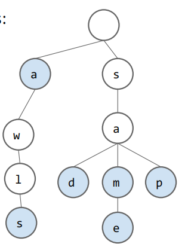
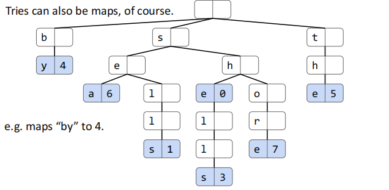
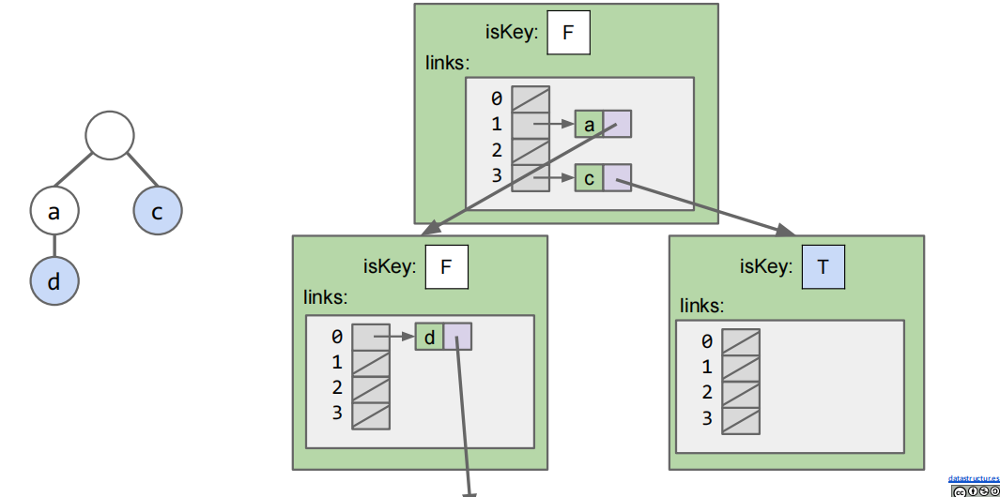
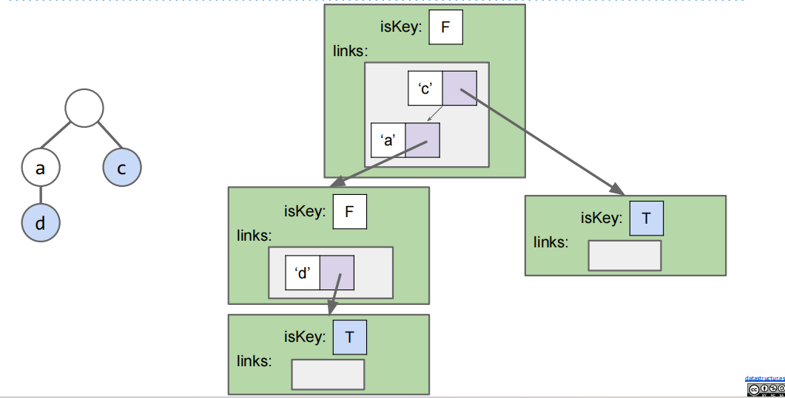
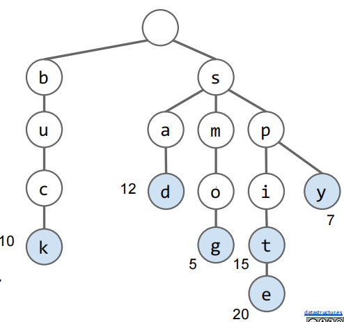

考虑集合(Set)和映射(Map)这两种抽象数据类型，过去我们主要使用 BST 和 Hash Table 来实现它们，BST 的 `contains` 和 `add` 操作的时间复杂度都为 $\Theta(\log N)$；如若分布均匀并考虑均摊代价，Hash Table 的 `contains` 操作和 `add` 操作的时间复杂度均为 $\Theta(1)$，这样的运行时是非常出色的。但如果我们知道一些 keys 的特殊性质，我们甚至可以有更好的实现，也就是我们这节课要讲的**Trie（前缀树）**

## Trie（前缀树）

Trie(Retrieval Tree，前缀树)是一种多叉树数据结构，用于实现 Set 或 Map，并且特别适合键位字符串或者其他可以分解为字符序列的类型，前缀树的核心思想如下：

- **每个节点只存储一个字符**：从根节点到叶节点的路径代表一个键（字符串）

- **前缀共享**：具有相同前缀的键共享节点，以避免冗余的存储。例如，当我们插入 `sam` 和 `sad` 时，`sa` 部分的节点就是被共享的

- **键结束标记：**为了区分完整的键和前缀，我们为每个节点设计一个标志（如 `isKey` 字段），以表示路径到此是否构成了一个有效键。本章节我们以蓝色节点表示有效键，白色节点表示前缀。

- **搜索：**当我们搜索字符串时，我们可以从根节点逐字符地遍历：

  - 当到达末尾节点的时候检查标记，如果是键，则存在
  - 如果到达末尾节点，节点未被标记或没有对应的节点，就不存在

  例如下图中，我们检查 `contains("sam")`，节点 `m` 是蓝色，所以存在 `sam` 这个键；检查 `contains("sa")`，节点 `a` 是白色，不存在 `sa` 这个键；检查 `contains("saq")`，我们发现不存在这样的路径，所以不存在 `saq` 这个键



### Trie Maps

Trie 也可以作为 Map，我们可以将值存储在末尾节点，如下图所示：



"by-4"就是一对键值对。建立 Trie Maps 的过程可以参考这个[demo](https://www.cs.princeton.edu/courses/archive/spring15/cos226/demo/52DemoTrie.mov)

!!! note "Tip"

    值得一提的是，Trie 实际上是 "Retrieval Tree" 的缩写，并且 Trie 的提出者 Edward Fredkin 认为 Trie 应当发音作 "tree"，但是几乎所有人都发 "try" 的音()

## Trie Implementation and Performance

Trie 的实现核心是设计一个树状结构，其中每个节点代表一个字符，子节点表示后续的字符。

### Basic Trie Implementation

Trie 通常从一个根节点（空节点）开始，每个节点包含：

- 一个 bool 标志 `isKey`，用于表示从根到此节点的路径是否是一个完整键
- 一个从字符到子节点的映射 `next`（`Map<Character, Node>`），用于跟踪子节点
- 可选：存储字符 `ch`，但这其实是冗余的，因为字符可以从父节点的 `next` 键推导，我们可以省略它以节省空间

!!! note "Tip"

    这里 `next` 映射可能有点晦涩，我解释下它为什么是必要的。`next` 实际上是一个 Map，它的键(key)是字符，值(value)是子节点，用于根据下一个字符来判断我们接下来去往哪个子节点；如果没有 `next` 的话，我们就无法知道从当前节点往下该走哪条边。

Trie 的 basic Java implementation 如下：

```java
public class TrieSet{
    private static final int R = 128; // ASCII 字符集的大小，这里我们假设键是 ASCII 字符串
    private Node root = new Node(false); // 根节点，并非键
    
    private static class Node{
        private boolean isKey; // 用于标记是否为键
        private DataIndexedCharMap<Node> next; // 子节点映射
        
        public Node(boolean isKey){
            this.isKey = isKey;
            next = new DataIndexedCharMap<>(R) // 创建 R 大小的数组
        }
    }
    
    // DataIndexedCharMap 是一个简单的数组实现，用于快速访问子节点，定义可能是这样的
    public class DataIndexedCharMap<V>{
        private V[] items;
        
        public DataIndexedCharMap(int R){
            items = (V[]) new Object[R]; // 创建固定大小的数组，大多为 null
        }
        
        public void put(char c, V val){
            items[c] = val;
        }
        
        public V get(char c){
            return items[c];
        }
    }
}
```

这个 `DataIndexedCharMap` 的实现好处在于其访问时间是 $\Theta(1)$ 的，但每个节点都需要固定 $R$ 个链接，当子节点稀疏的时候会造成很大的内存浪费。

### Basic Operations and Complexity

#### Add

插入操作从根逐字符遍历，如果子节点不存在则创建，末尾设置 `isKey = true`

```java
public void add(String key){
    Node curr = root;
    for(int i = 0; i < key.length(); i++){
        char c = key.charAt(i); // charAt() 是 Srting 类的方法，返回字符串中第 i 个位置的字符（索引从0开始）
        if(curr.next.get(c) == null){
            curr.next.put(c,new Node(false)); // 创建新节点
        }
        curr = curr.next.get(c);
    }
    curr.iskey = true;
}
```

其时间复杂度为 $O(L)$，其中 $L$ 为键长。如果键已经存在，我们只更新 `isKey`。

#### Contains

查询操作也是逐字符遍历，并返回末尾的 `isKey`，如果在前面就出现了字符不对应，直接返回 `false`即可

```java
public boolean contains(String key){
    Node curr = root;
    for(int i = 0; i < key.length(); i++){
        char c = key.charAt(i);
        if(curr.next.get(c) == null){
            return false; // 下个字母和 key 对不上，代表前缀树中不存在这个键，直接返回 false
        }
        curr = curr.next.get(c);
    }
    return curr.isKey;
}
```

其时间复杂度也为 $O(L)$，其中 $L$ 为键长。

### Alternate Child Tracking Strategies

前面我们实现的`DataIndexedCharMap` 其实是固定长度的数组，这会造成大量的内存浪费，那么我们是否有其他的子节点跟踪策略呢？

#### Alternate Idea1: Hash Table

我们可以使用 `HashMap<Character, Node>` 来代替数组，如下图所示



```java
import java.util.HashMap;
private static class Node{
    private boolean isKey;
    private HashMap<Character, Node> next = new HashMap<>(); // 动态大小
}
```

我们仅仅为实际的孩子分配空间，其访问是 $O(1)$ 的，但需要计算 Hash Function，这有一些额外的开销。

#### Alternate Idea2: Balanced BST

我们可以使用 `TreeMap<Character, Node>` 或自定义平衡树，如下图所示：



```java
import java.util.TreeMap;
private static class Node{
    private boolean isKey;
    private TreeMap<Character, Node> next = new TreeMap<>(); // 有序BST
}
```

我们将孩子按照字符地排序存储，内存上是 $O(C)$ 的，其中 $C$ 是孩子的数量；时间复杂度对于每个操作来说都是 $O(\log R)$ 的，其中 $R$ 为字母表的大小。这样的方法优点在于可以有序遍历孩子，但是缺点在于时间复杂度高于哈希表

## Prefix Operations（前缀操作）

根据前面我们对 Trie 和其他数据结构所做的比较，我们会发现 Trie 能够为我们提供常数时间的查找和插入操作，但它们并不见得就比 BST 或 Hash Table 表现得更好，比如对于每一个字符串，在 Trie 中我们必须遍历每一个字符，而在 BST 中我们可以立即访问整个字符串，那么 Trie 有什么用呢？其主要的作用在于能够高效地支持特定的字符串操作，比如前缀匹配。想象我们正在尝试找到某个单词的最长前缀，只需要取出所要查找的单词，将它的每个字符与 Trie 中的字符进行比较，直到无法再继续为止；类似地，如果我们想要找到某个前缀的所有词，就可以遍历到前缀的末尾，并返回 Trie 中所有剩余的键。

那么我们接下来就实现两个函数，`collect()` 和 `keysWithPrefix()`，其中 `collect()` 方法返回 Trie 中的所有键；`keysWithPrefix()` 方法返回所有包含作为参数的前缀的键

### `collect()` 收集所有键

其伪代码如下：

```text
collect():
    Create an empty list of results x
    For character c in root.next.keys():
        Call colHelp(c, x, root.next.get(c))
    Return x

colHelp(String s, List<String> x, Node n):
    if n.isKey:
        x.add(s)
    For character c in n.next.keys():
        Call colHelp(s + c, x, n.next.get(c))
```

从根节点开始，创建一个空列表 `x`，对每个子字符 `c`，调用 `colHelp("c",x,子节点)`

而 `colHelp(s,x,n)` 的逻辑则是，若 `n.isKey`，则 `x.add(s)`，并对 `n.next` 的每个 `c`，调用 `colHelp(s+c,x,子节点)`

### `keysWithPrefix(prefix)` 查找以 prefix 开头的所有键

复用 `collect()` 方法，伪代码如下：

```text
keysWithPrefix(String s):
    Find the end of the prefix, alpha
    Create an empty list x
    For character in alpha.next.keys():
        Call colHelp("sa" + c, x, alpha.next.get(c))
    Return x
```

遍历到 prefix 末尾节点 $\alpha$，创建空列表 `x`，对 `alpha.next` 的每个 `c`，调用 `colHelp(prefix+c,x,子节点)`

### `longestPrefixOf(s)` 查找 Trie 中存在的 s 的最长前缀

逐字符遍历 `s`，从根节点开始匹配子节点，记录最长匹配路径，直至无法继续即可。

## Autocomplete（自动补全）

Autocomplete 是 Trie 的核心应用场景之一，比如搜索引擎、IDE 代码提示等等前缀密集场景，Trie 能够通过前缀共享和高效的 `keysWithprefix` 操作来实现快速建议。具体的场景类似于，当用户在搜索框输入部分字符串，比如 "how are" 时，系统能够实时建议完整查询 "how are you"。

假设我们有六个字符串，他们具有如下的值：buck:10, sad:12, smog:5, spit:15, spite:20, spy:7，如下图所示



如果用户敲了 `s`，那么我们就会执行以下逻辑：

- Call `keysWithPrefix("S")
  - 有 sad, smog, spit, spite, spy
- Return the three keys with highest value
  - 即 spit, spite, sad

在自动补全问题中，我们为什么考虑使用 Trie 呢？主要出于以下几点考量：

- Trie 存储的是字符，节点之间可以共享以节省空间，亿级字符串只需要 $O(总字符数)$ 的空间
- `keysWithPrefix(prefix)` 能够快速地收集匹配键，时间复杂度为 $O(匹配键数+前缀长)$，远优于 BST/哈希表的 $O(N)$ 全扫描

### Basic Implementations

使用 TrieMap 建立字符串到值的映射，在每个末尾节点存 `value` 作为该字符串的重要性得分，其算法步骤如下：

- 用户输入前缀 `prefix`
- 调用 `keysWithPrefix(prefix)`，收集所有匹配的完整键极其值（用 `collect` 递归遍历子树）
- 从收集结果中选取 Top K，按照 `value` 降序排序返回

性能上来看，收集阶段时间复杂度为 $O(匹配键总数*L)$，其中 $L$ 为平均键长。

但这样的问题在于，如果前缀很短，就会返回海量的结果，我们**需要收集所有匹配再排序，仅仅只是为了得到 Top K**，这实际上已经超额完成了我们的任务，也极为浪费时间和内存。可以参考 [Hello-algo 的 Top-k problem](https://www.hello-algo.com/chapter_heap/top_k/)，这可能会给我们提供一点点启发，课程讲到了以下几点优化的建议：

- 给每个节点额外存 `best` 字段，记录子树（包括自身）中的最高 `value`，`best` 在插入时向上传播，后续遍历地更新
- **遍历顺序：**按 `best` 降序优先探索高价值的孩子分支，并用 PQ 来管理候选路径
- **早停：**当收集了 $K$ 个，并且 PQ 中剩余项的 `best` < 当前第 $K$ 个 value 的时候停止，因为我们无需再探索低价值分支。

下面我们详细说明自动补全的算法细节

#### Node Extensions

- Node 添加 `value`（如果非键的话设置为 null）和 `best`（记录子树的 max value）
- 插入时更新 `best`，自叶向上更新，即 `父.best = max(自身value, 所有孩子 best)`

#### Algorithms

- 首先找到 prefix 的末尾节点，这里我们不妨记为 `alpha`
- 初始化 PQ
- 将 `alpha` 的孩子按照 `best` 降序入队 PQ
- 循环 K 次或 PQ 为空：
  - 出队最高的 best 项，递归探索其子树，收集完整键到结果列表
  - 如果收集到新键，更新结果 Top k
  - 将其子节点按照 `best` 的顺序入队
- 如果 PQ top best < 结果中第 `k` 个 value，停止
