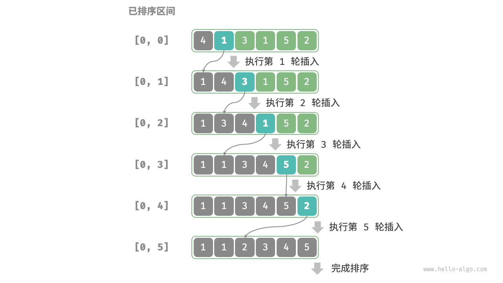
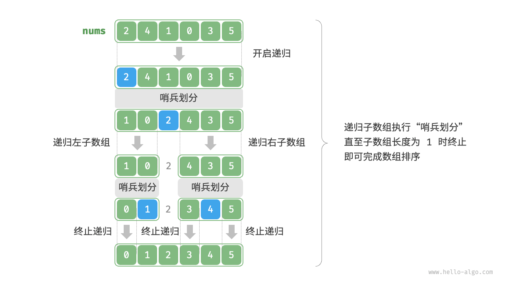
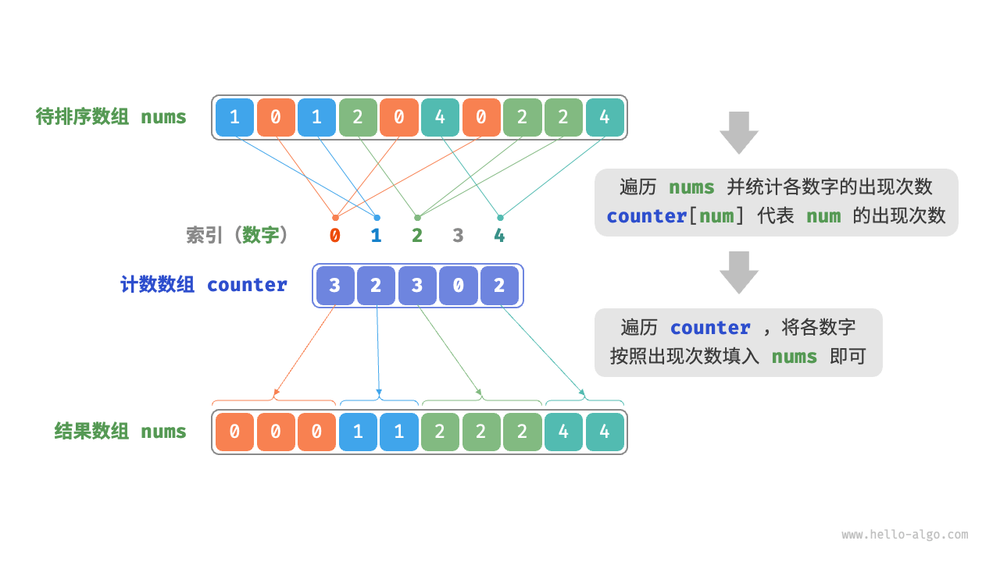

## Sorting Definition

An ordering relation < for keys a, b and c has the following properties:

- Law of Trichotomy（三歧律）: Exactly one of `a<b`, `a=b`, `b<a` is true.（对于任意键 a,b，a<b 或 a=b 或 b<a 中恰有一个为真）
- Law of Transitivity（传递律）: If a<b, and b<c, then a<c.

### Sorting evaluation

排序算法的评价维度有以下几点（来源于 Hello-algo）：

- **运行效率：**排序算法的时间复杂度应尽可能低
- **就地性(in-place)：**原地排序通过在原有的数组上直接操作实现排序，无需借助额外的辅助数组，节省内存。
- **稳定性：**稳定排序在完成排序后，相等元素的相对顺序不发生改变
- **自适应性：**自适应排序能够利用输入数据的已有顺序信息来减少计算量，达到更优的时间效率，其最佳时间复杂度往往优于平均时间复杂度
- **是否基于比较：**基于比较的排序依赖于比较运算符，其理论最优时间复杂度为 $O(n\log n)$；而非比较排序不使用比较运算符，其时间复杂度可以达到 $O(n)$，但通用性相对较差。

## Selection Sort（选择排序）

算法流程如下：

- 找到未排序部分的最小项
- 将其交换到未排序部分的前端并固定
- 对剩余未固定（未排序）项重复上述操作，直至全部排序

其时间复杂度为 $\Theta(N^2)$，比较低效，因为每次查找最小值都需要遍历整个剩余数组，空间复杂度为 $\Theta(1)$，原地排序

## HeapSort（堆排序）

### Naive HeapSort

堆排序的思想是利用**最大堆快速获取最大值**，注意我们这里并没有使用最小堆获取最小值，后面我们会展开详细的阐述。其算法流程如下：

- 将所有项插入最大堆，创建输出数组
- 从堆删除最大项，并置于输出数组未使用部分的末尾

下面我们分析堆排序的时间复杂度，堆插入的时间复杂度是 $O(N\log N)$，选择最大值的时间复杂度为 $\Theta(1)$，每次删除最大值的时间复杂度为 $\Theta(\log N)$，删除总计的时间复杂度为 $O(N\log N)$，整体的时间复杂度为 $O(N\log N)$；空间复杂度为 $\Theta(N)$

###  In-place HeapSort

Naive HeapSort 需要单独创建一个输出数组，耗费额外的空间，我们可以就在输入数组进行原地的堆排序，避免额外的空间消耗。

假设数组的长度为 $n$，则堆排序的流程如下：

- 输入数组并建立最大堆，完成后，最大元素位于堆顶（这里建立大顶堆应该采用遍历堆化的建堆方法，用层序遍历的倒序遍历堆，依次对每个非叶结点执行“从顶至底堆化”，可以参考[8.2  建堆操作 - Hello 算法](https://www.hello-algo.com/chapter_heap/build_heap/)）

- 将堆顶元素（数组的第一个元素）与堆底元素（数组的最后一个元素）交换，完成交换后，堆的长度减1，已排序元素的数量增加1
- 从堆顶元素开始，从顶至底执行堆化操作(sift down)。完成堆化操作后，即修复堆的性质
- 循环执行第二步和第三步，循环 $n-1$ 轮后，即可完成数组排序

!!! note "Tip"

    这里需要注意的是，由于堆的长度会随着提取最大元素而减小，我们需要给 `sift_down()` 这个向下堆化的函数添加一个长度参数 $n$，用于指定堆的当前有效长度

In-place HeapSort 的总时间复杂度为 $O(N\log N)$，空间复杂度为 $\Theta(1)$

!!! note "Tip"

    下面我们说明一下 In-place HeapSort 为什么要使用最大堆，而未选择最小堆。

    使用最大堆的时候，有序部分是从数组末尾增长的，未排序的堆的剩余部分留在前面，有序部分在后面，不会相互干扰结构；而如果我们使用最小堆，有序部分是从开头开始增长的，我们需要更改堆顶的索引，虽然我感觉其实也差不多。利用最小堆的堆排序仍然是 $O(N\log N)$ 的

## MergeSort（归并排序）

归并排序是一张基于分治策略的排序算法，其包含**划分**和**合并**两个阶段：

- **划分阶段：**通过递归不断地将数组从中点处分开，将长数组的排序问题转化为短数组的排序问题
- **合并阶段：**当子数组长度为 $1$ 时终止划分，开始合并，持续地将左右两个较短的有序数组合并为一个较长的有序数组

算法示意图如下（来自 Hello-algo）：


详细的算法流程如下：

划分阶段我们从顶至底递归地将数组从中点划分为两个子数组：

- 计算数组中点 `mid`，递归划分左子数组（区间 `[left, mid]`）和右子数组（区间 `[mid+1, right]`）
- 递归执行上述步骤，直至子数组区间长度为 `1` 时终止

合并阶段我们从底至顶地将左子数组和右子数组合并为一个有序数组。

需要说明的是，归并排序操作的顺序是，先递归左子数组，再递归右子数组，最后处理合并。下面我们提供 C 语言版本的代码实现，需要说明的是在代码中， `nums` 的待合并区间为 `[left, right]`，而 `tmp` 的对应区间为 `[0, right-left]`

```c
void merge(int *nums, int left, int mid, int right){
    // 左子数组区间为 [left, mid]，右子数组区间为 [mid+1,right]
    int tmpSize = right - left + 1;
    // 临时数组 tmp，用于存放合并后的结果
    int* tmp = (int*)malloc(tmpSize * sizeof(int));
    // 初始化左子数组和右子数组的起始索引
    int i = left, j = mid + 1; k = 0;
    // 当待合并的两个子数组都不空时，进行比较并将较小的元素复制到临时数组中
    while(i <= mid && j <= right){
        if(nums[i] <= nums[j]){
            tmp[k++] = nums[i++];
        }else{
            tmp[k++] = nums[j++];
        }
    }
    // 将左子数组或右子数组的剩余元素复制到临时数组中
    while(i <= mid){
        tmp[k++] = nums[i++];
    }
    while(j <= right){
        tmp[k++] = nums[j++];
    }
    // 将临时数组 tmp 中的元素复制回原数组 nums 的对应区间
    for(k = 0; k < tmpSize; ++k){
        nums[left + k] = tmp[k];
    }
    // 释放原数组
    free(tmp);
}

void mergeSort(int* nums, int left, int right){
    // 当子数组长度为1时终止递归
    if(left >= right){
        return;
    }
    int mid = left + (right - left)/2;
    // 递归划分左子数组
    mergeSort(nums,left,mid);
    // 递归划分右子数组
    mergeSort(nums,mid+1,right);
    // 合并
    merge(nums,left,mid,right);
}
```

### Insertion Sort（插入排序）

插入排序的原理是在未排序区间选择一个基准元素，将该元素与其左侧已排序区间的元素逐一比较大小，并将该元素插入到正确的位置，其算法流程如下：

- 初始状态下，我们认为数组的第 $1$ 个元素已经完成排序
- 选取数组的第 $2$ 个元素作为 `base`，将其插入到正确位置，此时数组的前 $2$ 个元素已经排序
- 选取第 $3$ 个元素作为 `base`，将其插入到正确位置，此时数组的前 $3$ 个元素已经排序
- 依此类推，在最后一轮中，选取最后一个元素作为 `base`，将其插入到正确位置后，所有元素均已排序

流程可以结合下图进行理解：



插入排序的时间复杂度为 $O(n^2)$，这是最坏情况；当输入的数组完全有序的时候，插入排序就会达到最佳时间复杂度 $O(n)$

可供参考的 C 语言版本的 Insertion Sort 代码如下：

```c
void insertionSort(int nums[], int size){
    // 外循环，已排序区间为 [0, i-1]
    for(int i = 1; i < size; i++){
        int j = i-1, base=nums[i];
        // 内循环：将 base 插入到已排序区间 [0,i-1] 中的正确位置
        while(j >=0 && nums[j] > base){
            // 将插入位置右侧的元素向右移动，给新元素腾位置
            nums[j+1] = nums[j];
            j--;
        }
        nums[j+1] = base;
    }
}
```

!!! note "Tip"

    需要说明的是，在几乎已经排序的数组上，插入排序的工作量是很小的；并且对于小规模的数组，插入排序通常也是比较快的，尽管其时间复杂度为 $O(N^2)$，分治的 MergeSort 时间复杂度为 $O(N\log N)$，但其在划分阶段的开销比较大

总结一下这四种排序算法的时间复杂度：

|                    | Best Case Runtime | Worst Case Runtime | Space       | Demo                                                         | Notes                             |
| ------------------ | ----------------- | ------------------ | ----------- | ------------------------------------------------------------ | --------------------------------- |
| Selection Sort     | $\Theta(N^2)$     | $\Theta(N^2)$      | $\Theta(1)$ | [demo](https://docs.google.com/presentation/d/1p6g3r9BpwTARjUylA0V0yspP2temzHNJEJjCG41I4r0/edit?usp=sharing) |                                   |
| HeapSort(in-place) | $\Theta(N)$       | $\Theta(N\log N)$  | $\Theta(1)$ | [demo](https://docs.google.com/presentation/d/1SzcQC48OB9agStD0dFRgccU-tyjD6m3esrSC-GLxmNc/edit) | Bad cache(in CS61C) performance   |
| MergeSort          | $\Theta(N\log N)$ | $\Theta(N\log N)$  | $\Theta(N)$ | [demo](https://docs.google.com/presentation/d/1h-gS13kKWSKd_5gt2FPXLYigFY4jf5rBkNFl3qZzRRw/pub?start=false&loop=false&delayms=3000&slide=id.g463de7561_042) | Fastest of all these              |
| Insertion Sort     | $\Theta(N)$       | $\Theta(N^2)$      | $\Theta(1)$ | [demo](https://docs.google.com/presentation/d/10b9aRqpGJu8pUk8OpfqUIEEm8ou-zmmC7b_BE5wgNg0/pub?start=false&loop=false&delayms=3000) | Best for small N or almost sorted |

### QuickSort（快速排序）

#### Partitioning（分区）

Partitioning 是快速排序的基础操作，其能够确保主元置于正确位置，并将数组分为两部分，其定义如下：

对于数组 `a[]`，选取主元（也可以称为基准数） `x=a[i]`（我们称之为 pivot），重排数组，使得：

- `x` 移动到新位置 `j`，这里 `j` 有可能等于 `i`，也即位置没有改动
- `j` 左侧的所有元素 $\leq x$
- `j` 右侧的所有元素 $\geq x$

需要说明的是，左侧和右侧的内部无需有序，等于 `x` 的元素可以分布在左侧或右侧，相对顺序不需要严格保持（这也说明快速排序是不稳定排序）

这里我们给出 partioning 操作的具体流程：

- 选取数组最左端的元素作为基准数，初始化两个指针 `i` 和 `j` 分别指向数组的两端
- 设置循环，在每轮中使用 `i` 和 `j` 分别寻找第一个比基准数大（其实是大于等于）或小（其实是小于等于）的元素，交换这两个元素
- 循环执行上述步骤，直至 `i` 和 `j` 相遇时停止，并将基准数交换至两个子数组的分界线

!!! note "Tip"

    上面我们使用的是 `>=` 和 `<=`，这是因为在有大量重复元素的情况下，我们使用大于等于或小于等于可以更均匀地将相等元素分布到两侧，避免一边过长。

具体示例可以参考[11.5  快速排序 - Hello 算法](https://www.hello-algo.com/chapter_sorting/quick_sort/#__tabbed_1_1)

分区完成后，原数组就被划分成了三个部分：左子数组、基准数、右子数组，并且满足 “左子数组任意元素 $\leq$ 基准数 $\leq$ 右子数组任意元素”，这实际上是分治策略的体现，接下来我们只需要对这两个子数组进行排序即可。

#### QuickSort

快速排序算法基于分区操作，通过递归实现，算法流程如下：

- 首先对原数组执行一次 partition，得到未排序的左子数组和右子数组
- 然后对左子数组和右子数组分别递归执行 partition
- 持续递归，直至子数组的长度为 1 时终止，从而完成整个数组的排序。

流程可以参考下图



下面我们分析一下快速排序的性能，在最佳情况下，pivot 始终在中点，分治高度 $H=\Theta(\log N)$，每层的时间复杂度为 $\Theta(N)$，总时间复杂度为 $\Theta(\log N)$；在最坏情况下，pivot 始终在端点（例如已排序的数组），此时高度 $H=\Theta(N)$，总时间为 $\Theta(N^2)$；在平均情况（比如随机数组）下，时间复杂度为 $\Theta(N\log N)$。

在输入的数组完全逆序的情况下，快速排序达到了最差的递归深度 $n$，使用 $O(n)$ 的栈桢空间，并且快速排序操作是在原数组上进行的，没有借助额外的数组。

#### QuickSort with Optimzed Pivot

前面我们提到，对于已排序或者几乎排序的数组，快速排序的时间复杂度很有可能退化到 $O(N^2)$，那么我们可以采取什么策略避免这些坏情况的发生呢？这里有四种想法：

- **随机性：**我们随机选取 `pivot` 或预先对数组进行 shuffle
- **更加智能的 `pivot` 选择**：如果我们使用确定性且常数时间选择的 pivot，攻击者可以轻易地构造出一类危险输入，让快速排序的性能退化到最坏情况，可以参考 Mcllroy 的 [A Killer Adversary for QuickSort](https://www.cs.dartmouth.edu/~doug/mdmspe.pdf)]；而如果我们线性时间确定 pivot 计算实际的中位数，其开销过大。
- **Introspection：**监控递归深度，为递归深度设定一个阈值，一旦超过这个阈值我们就切换到 MergeSort
- **预处理数组：**我们可以尝试分析数组是否适合快速排序，但是这本身就很麻烦，仅仅检查是否已经排序并不足够。

下面我们介绍一下精确中位数方案，该方案基于 BFRPT 算法，该算法在 $\Theta(N)$ 时间内找到第 $k$ 小元素（中位数为第 $[N/2]$ 小），从而提供一个平衡的主元，确保每次分区至少排除一定比例的元素。

感觉有点复杂，暂时先不介绍了（）

这里介绍一下[Hello-algo](https://www.hello-algo.com/chapter_sorting/quick_sort/#1153)提到的基准数优化的策略：

我们可以在数组中选取三个候选元素（通常为数组的首、尾、中点元素），并将这三个候选元素的中位数作为基准数，这杨一来，基准数“既不太大也不太小”的概率将大幅提升，采用这种方法后，时间复杂度劣化至 $O(n^2)$ 的概率大大降低。

## Comparison-based Algorithmic Bounds

### Math Problems

我们首先建立阶乘与对数函数之间的关系，为后续提出算法的理论界限奠定基础。

#### Problem 1

首先我们需要说明的是 $N\mathrm{!}\in \Omega((\frac{N}{2})^{\frac{N}{2}})$，也即证明，存在常数 $c>0$ 和整数 $N_0\geq 1$，使得对于所有 $N\geq N_0$，有 
$$
N!\geq c\cdot(\frac{N}{2})^{\frac{N}{2}}
$$
我们首先讨论 $N$ 为偶数的情形，记 $N=2m$，其中 $m$ 是正整数，则有
$$
N!=\prod_{k=1}^N k =(\prod_{k=1}^mk)\cdot(\prod_{k=m+1}^{2m}k)\geq \prod_{k=m+1}^{2m}k>\prod_{k=m+1}^{2m}m=m^m
$$
又 $m=\frac{N}{2}$，所以有
$$
N!>(\frac{N}{2})^{\frac{N}{2}}
$$
下面我们考虑 $N$ 为奇数的情形，令 $N=2m+1$，其中 $m=[\frac{N}{2}]$，则有
$$
N!=\prod_{k=1}^{2m+1}k\geq \prod_{k=m+1}^{2m+1}k>m^{m+1}=m\cdot m^m=\frac{N-1}{2}(\frac{N-1}{2})^{\frac{N-1}{2}}
$$
利用 $\frac{N-1}{2}=\frac{N}{2}\cdot \frac{N-1}{N}$，所以有
$$
N!>\frac{N}{2}\cdot\frac{N-1}{N}(\frac{N}{2}\cdot\frac{N-1}{N})^{\frac{N-1}{2}}=(\frac{N}{2})^{\frac{N+1}{2}}\cdot (\frac{N-1}{N})^{\frac{N+1}{2}}
$$
只需让
$$
N!>(\frac{N}{2})^{\frac{N+1}{2}}\cdot (\frac{N-1}{N})^{\frac{N+1}{2}}>(\frac{N}{2})^{\frac{N}{2}}
$$
解得 $N_0$ 即可，这样的 $N_0$ 显然是存在的。

#### Problem 2

下面我们要说明的是 $\log(N!)\in\Omega(N\log N)$

只需要在 Problem 1 所得的不等式两边取对数即可，得到 $\log(N!)>\log((\frac{N}{2})^{\frac{N}{2}})=\frac{N}{2}\log(\frac{N}{2})$，所以得到 $\log (N!)\in \Omega(N\log N)$

#### Problem 3

下面我们要说明的是 $N\log N \in \Omega(\log (N!))$，这是比较 trivial 的
$$
N\log N = \sum_{k=1}^N \log N >\sum_{k=1}^N \log k=\log N!
$$
而结合 Problem 1 2 3 我们可以得到 $\log(N!)\in \Theta(N\log N)$

### Theoretical Bounds

#### The Ultimate Comparison Sort（TUCS）

我们假设存在一个渐进最快的基于比较的排序算法，这种算法可能尚未被发现，将其最坏情况运行时记为 $R(N)$，基于已知算法，比如归并排序的 $\Theta(N\log N)$，我们可以得出 $R(N)$ 有上界 $N\log N$，也即 $R(N)\in O(N\log N)$；同时，$R(N)$ 的下界至少为 $\Omega(N)$，这是因为我们必须检查每个元素。实际上 $R(N)$ 精确的下界是 $\Omega(N\log N)$，为了得到这个更强的下界，我们需要引入决策树模型。

#### Decision Tree

决策树模型是证明下界的核心，用决策树模型证明下界的逻辑是这样的：

首先我们考虑对于 $N$ 个不同的元素，输入数组的可能排列显然有 $n!$ 种，算法必须为每种排列都输出正确的排序结果，如果两种不同的排列导致了相同的输出，算法就无法区分，所以决策树必须至少有 $N!$ 个不同的叶子，每个叶子对应一种唯一排列。

而决策树本身是二叉树，我们知道，一个高度为 $h$ 的二叉树最多有 $2^h$ 个叶节点，那么反过来要容纳 $N!$ 个叶节点，输的高度 $h$ 需满足：
$$
2^h \geq N! \Rightarrow h\geq \log_2(N!)
$$
所以 $h\in\Omega(\log(N!))$，而前面我们已经得到 $\log(N!)\in \Theta(N\log N)$，所以有 $h\in \Omega(\log(N!))$

于是我们得到，TUCS is $\Omega(N\log N)$，最终我们可以得出结论: Any comparison based sort requires at least order $N\log N$ comparisons in its worst case.（基于比较的排序算法的时间复杂度无法超越 $O(n\log n)$）

## Counting Sorts（计数排序）

前面我们已经讲过，基于比较的排序的时间复杂度无法超越 $O(N\log N)$，那自然就会有这样一个问题，如果我们根本就不比较呢？有没有可能得到更好的运行时？

课程提出了一个有些趣味但并不实用的例子，Sleep Sort ，用于排序整数数组 `A` 中的每个元素，其为每个 `x` 启动一个进程，睡眠 `x` 秒后打印 `x`，并且所有进程是同时启动的。Sleep Sort 的运行时为 $\Theta(N+\max(A))$，但在实际的机器中，由于操作系统的调度需求，该方法隐含了需要按睡眠时间排序的进程列表，其实并不高效。下面我们介绍计数排序

计数排序是一种非比较算法，其通过牺牲空间来换取时间效率，它的核心思想是**创建一个计数数组(counting arrays)来统计每个键值的出现次数**，然后使用这些计数直接将元素放置到排序数组的正确位置，从而避免逐对进行比较。

我们首先考虑计数排序最基础的形式，对于一个给定长度为 $n$ 的数组 `nums`，其中的元素都是非负整数：

- **统计范围与频率：**首先遍历数组找出最大键值 $m$，创建计数数组 `counter`，大小 $R=m+1$，并遍历 `nums` 数组，对于当前的 `num` 元素，每轮将 `counter[num]` 自增1即可

此时由于 `counter` 的各个索引是天然有序的，相当于所有的数字都已经排好了，我们只需遍历 `counter` 数组，根据各数字出现次数的从小到大的顺序填入 `nums` 即可，如下图所示（来源于 Hello-algo）



### Prefix Sum（前缀和）

!!! tip "To be done"

    参考 Hello-algo 吧

## Radix Sort

!!! tip "To be done"

    有时间了再来补笔记
