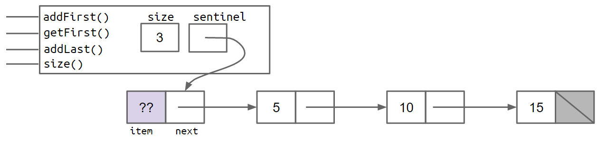
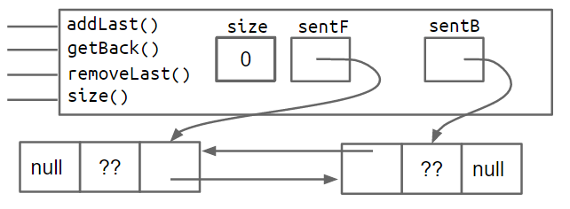
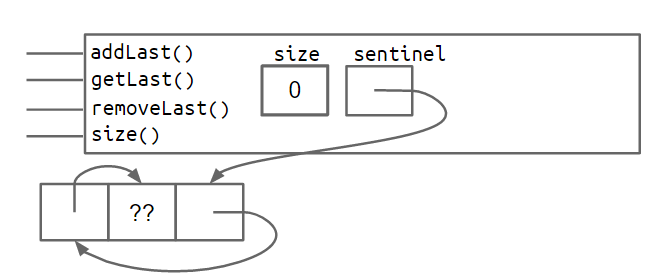

One thing that we would not have been able to easily do when using arrays is to change the number of objects after the simulation had begun. This is because arrays have a fixed size in Java that can never change.

An alternative approach would have been to use a list type. While Java have built-in List type, we're going to eschew using it right now but build our own list from scratch instead.

## IntList

The courses first introduce a class `IntList` as follows:

```java
public class IntList{
    public int first;
    public Intrest rest;
    
    public IntList(int f, IntList r){
        first = f;
        rest = r;
    }
}
```

If you have learnt List in C, you may find that is kind of different from the mode in C, which is based on the ListNode, while the IntList here is a naked recursive data structure. Without doubt it is fairly awkward to use, resulting in code that is hard to read and maintain. To use `IntList` correctly, the programmer must understand and utilize recursion even for simple list related tasks, which limits its usefulness to novice programmers, and may introduces tricky errors

So the lec wants to build a new class `SLList`,which much more closely resembles the list implementations that programmers use in modern languages.

## SLLists(Singly Linked Lists 单向链表)

### Improvement1 Rebranding

Just introduce class IntNode and make it the basic.

```java
public class IntNode{
    public int item;
    public IntNode next;
    
    public IntNode(int i,IntNode n){
        item = i;
        next = n;
    }
}
```

### Improvement2 Bureaucracy

create a separate class called `SLList` that we user will interact with:

```java
public class SLList{
    public IntNode first;
    
    public SLList(int x){
        first = new IntNode(x,null);
    }
}
```

Just compare the creation of an `IntList` of one item to the creation of a `SLList` of one item `IntList L1 = new IntList(5,null)`，`SLList L2 = new SLList(5)` 

We can see that the `SLList` hides the detail that there exists a null link from the user. We can add some help method such as `addFirst` , `getFirst` and so on.

```java
// Adds an item to the front of the list
public void addFirst(int x){
    first = new IntNode(x,first);
}

// Retrieves the front item from the list
public int getFirst(){
    return first.item;
}
```

In fact, the `SLList` class acts as a middleman between the list user and the naked recursive data structure.


### Improvement3 Public vs. Private

!!! note "Tip"

    similar to access specifiers in C++

Private variables and methods can only be accessed by code inside the same `.java` file. That means the class below will fail to compile, yielding a `first has private access in SLList` error

```java
public class SLLTroubleMaker{
    public static void main(String[] args){
        SLList L = new SLList(15);
        L.addFirst(10);
        L.first.next.next = L.first.next;
    }
}
```

By contrast, any code inside the file will be able to access the `first` variable.

It may seem a little silly to restrict access for the only thing that the `private` keyword does is break programs that otherwise compile. However, in large software engineering projects, the `private` keyword is an invaluable signal that certain pieces of code should be ignored(and thus need not to be understood) by the end user. Likewise, the `public` keyword should be thought of as a declaration that a method is available and will work forever exactly as it does now.

**When you create a `public` member(method or variable), you should be careful because you're effectively committing to supporting that member's behavior exactly as it is now, forever.**


### Improvement4 Nested Classes

In the previous code, the professor got tow `.java` files: `IntNode` and `SLList`, while `IntNode` is just a supporting character in the story of `SLList`. Java allows us to embed a class declaration inside of another for just this situation. The syntax is straightforward and intuitive:

```java
public class SLList{
    public class IntNode{
        public int item;
        public IntNode next;
        public IntNode(int i, IntNode n){
            item = i;
            next = n;
        }
    }
    
    private IntNode first;
    
    public SLList(int x){
        first = new IntNode(x,null);
    }
}
```

Having a nested class has no meaningful effect on code performance, and is simply a tool for keeping code organized.

What's more, if the nested class has no need to use any of the instance methods or variables of `SLList`, we may declare the nested class `static` as follows:

```java
public class SLList{
    public static class IntNode{
        public int item;
        public IntNode next;
        public IntNode(int i, IntNode n){
            item = i;
            next = n;
        }
    }
    
    private IntNode first;
    ...
}
```

Declaring a nested class as `static` means that methods inside the static class can not access any of the members of the enclosing class(外部类). In this case, it means that no method in `IntNode` would be able to access `first`, `addFirst`, `getFirst`.

This can save a bit of memory for each `IntNode` no longer needs to keep track of how to access its enclosing `SLList`.

!!! note "Tip"

    在 Java 中，当一个类（如`IntNode`）嵌套在另一个类（如`SLList`）内部且**非静态**时，每个`IntNode`实例都会隐式持有一个指向其外部`SLList`实例的引用，以便在需要时访问外部类的成员（变量或方法）。

    而当`IntNode`被声明为`static`时，它与外部`SLList`类的关联被解除，不再需要持有这个指向外部类实例的引用。由于`IntNode`的功能仅涉及自身的`item`和`next`，完全不需要访问`SLList`的成员（如`first`或`size`），这个引用就成了多余的。因此，声明为`static`后，每个`IntNode`实例会减少这部分引用所需的内存开销，从而 “节省一点内存”。

We can also add `addLast(int x)` and `size()` methods as follows:

```java
public void addLast(int x){
    IntNode p = first;
    
    while(p.next != null){
        p=p.next;
    }
    
    p.next = new IntNode(x,null);
}

public static int size(IntNode p){
    int size = 0;
    IntNode temp = p;
    while(temp != null){
        size += 1;
        temp = temp.next;
    }
    return size;
}
```

### Improvement5 Caching（缓存）

But the `size` method is very slow for large lists, which is unacceptable. It is possible to rewrite the `size` so that it takes the same amount of time, no matter how large the list is. The solution in this lesson is to simply add a `size` variable to the `SLList` class that tracks the current size（a little beyond my expectation, cause I assumed which would be a ingenious method）. This practice of saving important data to speed up retrieval（检索） is sometimes known as **caching**（缓存）.

```java
public class SLList{
    ... // IntNode declaration omitted
    private IntNode first;
    private int size;
    
    public SLList(int x){
        first = new IntNode(x,null);
        size = 1;
    }
    
    public void addFirst(int x){
        first = new IntNode(x,first);
        size += 1;
    }
    
    public int size(){
        return size;
    }
    ...
        
    // we update "size" each time we revise or create the SLList
}
```

This modification makes our `size` method incredibly fast. Of course, it will also slow down our `addFirst` and `addLast` methods, and also increase the memory of usage of our class, but only by a trivial amount. In this case, the tradeoff is clearly in favor of creating a cache for size.

Another natural advantage is that we will be able to easily implement a constructor that creates an empty list.(Just set `first` to `null` if the list is empty)

```java
public SLList(){
    first = null;
    size = 0;
}
```

**Unfortunately, there is a subtle fault that we may neglect.** In `addLast` method, when `first` is `null`, the attempt to access `p.next` in `while(p.next != null)` causes a null pointer exception. So how can we fix the bug, the answer is improvement 6—— Sentinel Nodes（哨兵节点）

### Improvement6 Sentinel Nodes（哨兵节点）

One solution to fix `addLast` is to create a special case for the empty list, as shown below:

```java
public void addLast(int x){
    size += 1;
    
    if(first == null){
        first = new IntNode(x,null);
        return;
    }
    IntNode p = first;
    while(p.next != null){
        p = p.next;
    }
    p.next = new IntNode(x,null);
}
```

This solution works without doubt, but special case code like that shown above should be avoided when necessary. We want to keep complexity under control cause Human beings only have so much working memory. Although for a simple data structure like the `SLList`, the number of special cases may be small. But More complicated data structures like trees can get much, much uglier.

A cleaner, though not that obvious solution sis to make it so that all `SLLists` are the "same", even if they are empty. We can do this by **creating a special node that is always there**, which we will call a **sentinel node**. The sentinel node will hold a value, which we do not care about.

A shown in the below, a `SLList` with the items 5,10, and 15 would look like:



The lavender ?? value indicates that we don't care what value is there. Since Java does not allow us to fill in an integer with question marks, we just pick some arbitrary value like -518273 or 63 or anything else.

Since a `SLList` with a sentinel node has no special cases, we can simply delete the special case from our `addLast` method, yielding:

```java
public void addLast(int x){
    size +=1;
    IntNode temp = sentinel;
    while(temp.next != null){
        temp = temp.next;
    }
    temp.next = new IntNode(x,null);
}
```

Thus, we are going to introduce the concept called **Invariants**（不变量）. An invariant is a fact about a data structure that is guaranteed to be true(assuming there are no bugs in our code./前提是我们的代码无bug)

A `SLList` with a sentinel node has at least the following invariants:

- The `sentinel` reference always points to a sentinel node.
- The front item(if it exists) is always at `sentinel.next.item`

- The `size` variable is always the total number of items that have been added.

## DLLists(Doubly linked Lists)

In this section, we'll wrap up our discussion of linked lists, and also start learning the foundations of arrays.

Consider the `addLast(int x)` method above:

```java
public void addLast(int x){
    size +=1;
    IntNode p = sentinel;
    while(p.next != null){
        p = p.next;
    }
    
    p.next = new IntNode(x,null);
}
```

Without doubt, the method is slow. For a long list, the `addLast` method has to walk through the entire list. Similarly, we can attempt to speed up by adding a `last` variable, as shown below:

```java
public calss SLList{
    private IntNode sentinel;
    private IntNode last;
    private int size;
    
    public void addLast(int x){
        last.next = new IntNode(x,null);
        last = last.next;
        size += 1;
    }
    ...
}
```

However, suppose that we'd like to support `addLast`、`getLast` and `removeLast` operations, `addLast` and `getLast` will be fast, but `removeLast` operation will be slow. That's because we have no easy way to get the second-to-last node, to update the `last` pointer, after removing the last node.


Some may consider adding a `secondToLast` pointer, but it will not help either, because then we'd need to find the third to last item in the list in order to make sure that `secondToLast` and `Last` obey the appropriate invariants after removing the last item.

### Improvement7 Looking Back

The most natural way to tackle the issue is to add a previous pointer to each `IntNode`:

```java
public class IntNode{
    public IntNode prev;
    public int item;
    public IntNode next
}
```

In other words, our list now has two links for every node. One common term for such lists is the "Doubly Linked List", which we'll call a `DLList` for short.

The addition of these extra pointers will lead to extra code complexity. The box and pointer diagram below shows more precisely what a doubly linked list looks like for lists of size 0 and size 2, respectively.


### Improvement8 Sentinel Upgrade

Back pointers allow a list to support adding, getting and removing the front and back of a list in constant time. There is a **subtle** issue with this design where the `last` pointer sometimes points at the sentinel node, and sometimes at a real node.(While the list is null, `last` may point to the sentinel node, while not null, it may point to the real tail node) this results in code with special cases that is much uglier than we'll get after our 8th and final improvement.

One fix is to add a second sentinel node to the back of the list. This results in the topology shown below as a box and pointer diagram.




An alternate approach is to implement the list so that it is **circular**, with the front and back pointers sharing the same sentinel node as shown below.



Both the two-sentinel and circular sentinel approaches work and result in code that is free of ugly special cases.

## Generic DLLists（泛型双向链表）

Our DLLists above suffer from a major limitation: they can only hold integer values. For example, suppose we wanted to create a list of Strings:

```java
DLList d2 = new DLList("hello");
d2.addLast("world");
```

The code above would crash for our `DLList` constructor and `addLast` methods only take an integer argument.

Luckily, in 2004, Java has supported **generics**, which will allow you to, among other things, create data structures that hold any reference type.

The basic idea of generics is that right after the name of  the class in our class declaration, we use an arbitrary placeholder inside angle brackets:`<>`. Then anywhere we want to use the arbitrary type, we use that place holder instead. For example, our `DLList` declaration before was:

```java
public class DLList{
    private IntNode sentinel;
    private int size;
    
    public class IntNode{
        public IntNode prev;
        public IntNode next;
        public int item;
        ...
    }
    ...
}
```

A generic `DLList` that can hold any type would look as below:

```java
public class DLList<T>{
    private IntNode sentinel;
    private int sisze;
    
    public class IntNode{
        public IntNode prev;
        public IntNode next;
        public T item;
        ...
    }
    ...
}
```

Now that we've defined a generic version of the `DLList` class, we must also use a special syntax to instantiate this class. To do so, we put the desired type inside of angle brackets during declaration, and also use empty angle brackets during instantiation. For example:

```java
DLList<String> d2 = new DLList<>("hello"); // 这里可以不加尖括号，因为在声明变量的时候已经指定了泛型类型，在实例化的时候可以使用空的尖括号<>，
// 编译器会根据变量声明的类型自动推断出实例化时的泛型类型，换句话说 DLList<String> d2 = new DLList<>("hello") 和 DLList<String> d2 = new DLList<String>("hello") 是等价的
d2.addLast("world");
```

Since generics only work with reference types, we cannot put primitives like `int` or `double` inside of angle bracket, e.g. `<int>`. Instead, **we use the reference version of the primitive type**, which in the case of `int` case is `Integer`, e.g.

```java
DLList<Integer> d1 = new DLList<>(5);
d1.insertFront(10);
```

!!! warning "注意" 

    在 Java 的泛型编程中，我们**不能直接使用基本数据类型作为泛型参数**，因为 Java 的泛型是基于**类型擦除(Type Erasure)**实现的，这意味着泛型信息在编译后会被擦除，最终在运行时使用的是其原始类型，通常是 `Object`。由于基本数据类型不是对象，它们不能直接作为`Object` 的子类或实现，因此无法直接放入泛型容器中。

    我们应该使用**包装类(Wrapper Classes)**，Java 为每个基本数据类型提供了对应的包装类，以下是基本数据类型与其对应包装类的表格

    | 基本数据类型(Primitive Type) | 包装类(Wrapper Class) |
    | ---------------------------- | --------------------- |
    | `byte`                       | `Byte`                |
    | `short`                      | `Short`               |
    | `int`                        | `Integer`             |
    | `long`                       | `Long`                |
    | `float`                      | `Float`               |
    | `double`                     | `Double`              |
    | `boolean`                    | `Boolean`             |
    | `char`                       | `Character`           |

For now, use the following rules of thumb:

- In the `.java` file implementing a data structure, specify your generic type name only once at the very top of the file after the class name
- In other `.java` files, which use your data structure, specify the specific desired type during declaration and use the empty diamond operator during instantiation.（实例化时使用空菱形运算符）
- If you need to instantiate a generic over a primitive type, use the Wrapper Classes instead of their primitive equivalents.


## Array Basics

In the next sections, we'll discuss how to build a list class using arrays.

Arrays are a special type of object that consists of a numbered sequence of memory boxes. This is unlike class instances, which have named memory boxes. To get the ith item of an array, we use bracket notation as we saw in HW0 and Project0, e.g. `A[i]` to get the ith element of A

Arrays consist of:

- A fixed integer length,N
- A sequence of N memory boxes (N = length) where all boxes are of the same type, and are numbered 0 through N-1

### Array Creation

There are three valid notations for array creation:

- `x = new int[3];`
- `y = new int[]{1,2,3,4,5};`

- `int[] z = {9,10,11,12,13}`

The first notation will create an array of the specified length and fill in each memory box with a default value. In this case, it will create an array of length 3, and fill each of the 3 boxes with the default `int` value `0`

The second notation creates an array with the exact size needed to accommodate the specified starting value. In this case, it creates an array of length 5, with those five specific elements.

The third notation, used to declare and create `z`, has the same behavior as the second notation. The only difference is that it omits the usage of `new`, and can only be used when combined with a variable declaration. 

!!! note "Tip"

    Java 中的`System.arraycopy()`方法用于数组复制，定义在 `java.lang.System` 类中，能够将一个数组中的元素快速复制到另一数组中，支持在同一数组或不同数组间的复制操作，通常比手动编写的循环快，由底层直接实现，其函数原型如下：

    ```java
    public static native void arraycopy(Object src, int srcPos, Object dest, int destPos, int length);
    ```

    - `src`：源数组，即要从中复制元素的数组
    - `srcPos`：源数组中的起始位置，表示从源数组的哪个索引开始复制
    - `dest`：目标数组，即要将元素复制到的数组
    - `destPos`：目标数组中的起始位置，表示从目标数组的哪个索引开始粘贴
    - `length`：要复制的元素数量

    需要注意的是，源数组和目标数组必须是兼容的类型。如果两者都是引用类型数组，则他们要么是相同类型，要么其中一种类型是另一种类型的子类；如果指定的索引加上长度超出了数组的实际大小，将会抛出 `ArrayIndexOutOfBoundsException` 异常；数组不能为空，源数组和目标数组都不能为 `null`，否则会抛出 `NullPointerException` 异常

Note that Java arrays only perform bounds checking at runtime. That is, the following code compiles just fine, but will crash at runtime.

```java
int[] x = {9,10,11,12,13};
int[] y = new int[2];
int i = 0;
while(i < x.length){
    y[i] = x[i];
    i += 1;
}
```

### 2D Arrays in Java

2D array in Java is actually just an array of arrays.

Consider the code `int[][] bamboozle = new int[4][]`. This creates an array of integer arrays called `bamboozle`. Specifically, this creates exactly four memory boxes, each of which can point to an array of integers(of unspecified length)

### Arrays vs. Classes

Both arrays and classes can be used to organize a bunch of memory boxes. In both cases, the number of memory boxes is fixed, i.e. the length of an array cannot be changed, just as class fields cannot be added or removed.

The key differences between memory boxes in arrays and classes:

- Array boxes are numbered and accessed using `[]` notation, and class boxes are named and accessed using dot notation.
- Array boxes must all be the same type. Class boxes can be different types.

One particularly notable impact of these difference is that `[]` notation allows us to specify which index we'd like at runtime. By contrast, specifying fields in a class is not something we do at runtime. For example, consider the code below:

```java
String fieldOfInterest = "mass";
Planet p = new Planet(6e24,"earth");
double mass = p[fieldOfInterest];
```

If we tried compiling this, we'd get a syntax error

```
error: array required, but Planet found
        double mass = earth[fieldOfInterest];
```

The same problem occurs if we try to use dot notation:

```java
String fieldOfInterest = "mass";
Planet p = new Planet(6e24,"earth");
double mass = p.fieldOfInterest;
```

Compiling, we'd get:

```
error: cannot find symbol
        double mass = earth.fieldOfInterest;        
                           ^
  symbol:   variable fieldOfInterest
  location: variable earth of type Planet
```

!!! note "Tip"

    上述内容是说，数组的`[]`符号支持运行时动态指定索引，比如在下面代码中

    ```java
    int indexOfInterest = askUserForIngeter();
    int[] x = {100,101,102,103};
    int k = x[indexOfInterest];
    System.out.Println(k);
    ```

    我们如下输入，则可能得到这样的结果：

    ```
    $ javac arrayDemo
    $ java arrayDemo
    What index do you want? 2
    102
    ```

    `indexOfInterest`的值可以在程序运行时由用户输入，然后通过 `x[indexOfInterest]` 访问数组的对应元素，这意味着数组的访问位置可以根据运行时的动态数据灵活确定。

    但**类的字段无法通过运行时动态指定名称访问**，无论是用 `p[fieldOfInterest]` 还是 `p.fieldOfInterest`，都无法通过一个字符串变量在运行时动态指定要访问的类字段，编译器会直接报错，这是因为类的字段访问必须在编译时就明确指定具体名称，无法通过变量动态映射。

## ALists(ArrayLists)

We'll build a new class called `AList` that can be used to store arbitrarily long lists of data, similar to our `DLList`. Unlike the `DLList`, the `AList` will use arrays to store data instead of a linked list.

### Linked List Performance Puzzle

Suppose that we wanted to write a new method for `DLList` called `int get(int i)`. The `get` method will be slow for long lists compared to `getLast`. This is because we only have references to the first and last items of the list, we'll always need to walk through the list from the front or back to the item that we're trying to retrieve.

In the very worst case, the item is in the very middle and we'll need to walk through a number of items proportional to the length of the list.

### First Attempt: The Naive Array Based List

Accessing the ith element of an array takes constant time on a modern computer. This suggests that an array-based list would be capable of much better performance for `get` than a linked-list based solution, since it can simply use bracket notation to get the item of interest.

An array-based list demo is as follows:

```java
public class AList{
    int[] items; // List 的外衣，实质实现完全是数组的逻辑
    int size;
    
    public AList(){
        items = new int[100];
        size = 0;
    }
    public void addLast(int x){
        items[size] = x;
        size += 1;
    }
    
    public int getLast(){
        return items[size-1];
    }
        
    public int get(int i){
        return items[i-1];
    }
    public int size(){
        return size;
    }    
}
```

The solution has the following handy invariants:

- The position of the next item to be inserted(using `addLast`) is always `size`.

- The number of items in the AList is always `size`.
- The position of the last item in the list is always `size-1`.

### removeLast

Before we start, we make the following key observation: Any change to our list must be reflected in a change in one or more memory boxes in our implementation. Any change the user tries to make to the list using the abstractions we provide(`addLast`,`removeLast`) must be reflected in some changes to these memory boxes in a way that matches the user's expectations. Actually, to write `removeLast`, we just need to change `size`, while `items` and `items[i]` do not need change.

### Naive（朴素的） Resizing Arrays

If the size of the array is not enough, we simply build a new array that is big enough to accommodate the new data. For example, we can imagine adding the new item as follows:

```java
int []a = new int[size+1];
System.arraycopy(items,0,a,0,size);
a[size] = 11;
items = a;
size = size + 1;
```

The process of creating a new array and copying items over is often referred to as "resizing". 

### Analyzing the Naive Resizing Array

The approach that we attempted in the previous section has terrible performance. By running a simple computational experiment where we call `addLast` 100000 times, we see that the `SLList` completes so fast that we can't even time it. By contrast our array-based list takes several seconds.

Suppose we have an array of size 100. If we call insertBack two times, how many total boxes will we need to create and fill throughout this entire process? And how many total boxes will we have at any one time, assuming that garbage collection happens as soon as the last reference to an array is lost?

The answer is 203 and 102, which is easy to grasp.

And what if starting from an array of size 100, approximately how many memory boxes get created and filled if we call `addLast` 1000 times?

The answer is around 500000 for total array boxes created is 101 + 102 + ... + 1000. 

In fact, creating all those memory boxes and recopying their contents takes time. In the graph below, we plot total time vs. number of operations for an SLList on the top, and for a naive array based list on the bottom. The SSList shows a straight line, which means for each `add` operation, the list takes the same additional amount of time. This means each single operation takes constant time! We can also think of it this way: the graph is linear, indicating that each operation takes constant time, since the integral of a constant is a line. By contrast, the naive array list shows a parabola, indicating that each operation takes linear time, since the integral of a line is a parabola（抛物线）. This has significant real world implications. For inserting 100000 items, we can roughly compute how much longer by computing the ratio of $\frac{N^2}{N}$. Inserting 100000 items into our array based list takes $\frac{100000^2}{100000}$ or $100000$ times as long. This is obviously unacceptable.


### Geometric Resizing

We can fix our performance problems by growing the size of our array by a multiplicative amount（成倍增加）, rather than an additive amount（累加）. That is to say, rather than **adding** a number of memory boxes equal to some resizing factor `RFACTOR`, we instead resize by **multiplying** the number of boxes by `RFACTOR`

```java
// adding
public void insertBack(int x){
    if (size == items.length){
        resize(size + RFACTOR);
    }
    items[size] = x;
    size += 1;
}

// multiplying
public void insertBack(int x){
    if(size == items.length){
        resize(size * RFACTOR);
    }
    items[size] = x;
    size += 1;
}
```

### Memory Performance

Our `AList` is almost done, but we have one major issue. Suppose we insert 1000000000 items, then later remove 990000000 items. In this case, we'll be using only 10000000 of our memory boxes, leaving 99% completely unused.

To fix this issue, we can also downsize our array when it starts looking empty. Thus, we can define a "usage ratio" R, which is equal to the size of the list divided by the length of the `items` array. For example, in the figure below, the usage ratio is 0.04


Typically, we halve the size of the array when R falls to less than 0.25

### Generic ALists

Just as we did before, we can modify our `AList` so that it can hold any data type, not just integers. To do this, we again use the special angle braces notation in our class and substitute our arbitrary type parameter for integer wherever appropriate.

There is one significant syntactical difference: **Java does not allow us to create an array of generic objects** due to an obscure issue with the way generics are implemented. In other words, we cannot do something like:

```java
T[] items = new T[8] // T 是泛型参数
```

!!! note "Tip"

    这是因为 Java 的泛型采用 “类型擦除” 机制，编译时会去除泛型类型信息，导致运行时无法确定数组的具体类型，从而可能引发类型安全问题。解决办法是先创建一个 Object 类型的数组，再强制转换为泛型数组，例如 `T[] items = (T[]) new Object[8]`，尽管这会产生编译警告，但这确乎是 Java 中处理泛型数组创建的常见方式。

Instead, we have to use the awkward syntax shown below:

```java
T[] items = (T[]) new Object[8];
```

The other change we make is that we null out any items that we "delete". We do want to null out references to the objects that we're storing. This is to void "loitering"（内存滞留）. Cause Java only destroys objects when the last reference has been lost. If we fail to null out the reference, then Java will not garbage collect the objects that have been added to the list.

!!! note "Tip"

    也即对于泛型对象，我们需要在删除元素后显式地将其引用设置为 `null`，而对于之前存储基本类型时无需这么做。

This is a subtle performance bug that we're unlikely to observe unless we're looking for it, but in certain cases could result in a significant wastage of memory.

!!! tip "补充"

    这里补充一点 Project1 可能用到的知识：

    **基于数组的队列的实现**

    我们知道在数组中删除首元素的时间复杂度为 $O(n)$，这导致出队操作的效率比较低，但是我们可以采用下面的方法来避免这个问题，我们可以使用一个变量 `front` 指向队首元素的索引，并维护一个变量 `size` 用于记录队列的长度。定义 `rear = front + size`，这个公式计算出的 `rear` 指向**队尾元素之后的下一个位置**。

    而基于此设计，数组中**包含元素的有效区间为`[front,rear-1]`**，入队操作我们只需要将输入的元素赋值给 `rear` 索引处，并且将 `size` 增加1；出队操作我们只需要将 `front` 增加1，并且将 `size` 减少1。

    但是这时候会有一个问题，在不断地进行入队和出队的过程中，`front` 和 `rear` 都在向右移动，**当它们到达数组尾部的时候就无法继续移动了**，为了解决这个问题，我们可以将数组视为首尾相接的“环形数组”。所以当我们需要让 `front` 和 `rear` 越过数组尾部的时候，直接回到数组的头部继续遍历。这种周期性规律可以通过“取余”操作来实现，也即 `rear = (front + queSize) % capacity`

    **基于数组的双向队列的实现**

    双向队列在队列的基础上还允许在头部和尾部执行元素的添加或删除操作，在队列的实现上增加一个“队首入队”和“队尾出队”的方法。


