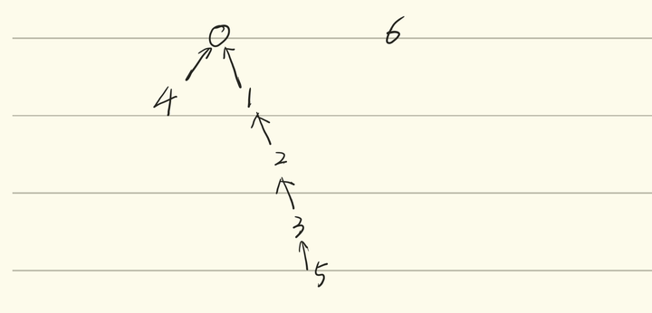

## 并查集简介

### 并查集

并查集（Union-Find/Disjoint Sets）是一种用于管理多个不相交子集的数据结构，其维护固定数量的元素，这些元素被划分为若干个不相交的子集，每个子集代表一个独立的集合。并查集的核心功能是通过**合并子集(Union)**和**查询元素（Find）**来动态管理这些集合。

在并查集中，每个元素初始时属于自己的独立子集，随着操作进行，子集可以通过合并操作逐渐组合成更大的集合，通常可以用来解决连通性问题。

### 并查集操作

并查集主要由两个核心操作组成：

<br>
1. `connect(x,y)`，也被称为 `union`：

   其先找到 `x` 和 `y` 所在的子集，如果两者不在同一个子集中，就将这两个子集合并为一个新的子集。

   例如，假设有元素 A,B,C,D，初始时每个元素在单独的子集中：`{A},{B},{C},{D}`，在调用`connect(A,B)`后，A 和 B 合并为一个子集：`{A,B},{C},{D}`，再调用`connect{A,D}`后，A 和 D 的子集合并，结果为 `{A,B,D},{C}`

<br>
2. `isConnected(x,y)`，也被称为`find`：

   其用于检查元素 `x` 和 `y` 是否属于同一个子集（先确定 `x` 和 `y` 各自属于哪个子集，如果是同一个，就返回 `true`；如果不是同一个，就返回 `false`）

### 并查集接口

通常来说，一个接口决定了数据结构应该具有哪些行为，而不规定其具体的实现方式，这里我们给出并查集的 Java 接口：

```java
public interface DisjointSets{
    void connect(int p, int q);
    
    boolean isConnected(int p, int q);
}
```

这里 `connect(int p, int q)` 对应 `union` 操作，用于合并 `p` 和 `q` 所在的子集；而 `isConnected(int p, int q)` 对应 `find` 操作，用于判断 `p ` 和 `q` 是否在同一子集中。

!!! note "Tip"

    通常我们假设并查集存储的元素是非负整数，事实上实际应用中我们可以通过映射将任意对象转换为整数

## 并查集的实现

### ListsOfSets（集合列表）

这种实现是将并查集表示为 **元素为集合的列表**，比如 `List<Set<Integer>>`，每个集合存储为一个 `Set<Integer>`，初始化为 N 个单元素集合，但是这样的缺点在于，`connect(5,6)` 这样的操作，我们需要遍历 N 个集合来找到5，N 个集合来找到6，这样时间复杂度就为 $O(N)$ 了，除此之外，`isConnected()` 操作也同样需要遍历集合。除此之外，实现代码也非常的复杂

### Quick Find

Quick Find 是一种简单的并查集实现，目的是让 `isConnected`(`find`) 操作变得高效。

其核心思想是使用一个整数数组来表示元素的集合归属，其中：

- 数组索引表示元素（从 0 到 N-1）
- 数组元素的值表示该集合所属的集合编号(set ID)，同一集合中的所有元素共享同一个集合编号，或者说对应数组元素的值相同。

例如，对于元素集合 `{0,1,2,4},{3,5},{6}`，我们可以用数组表示为

```
id[] = [0,0,0,5,0,5,6]
```

其中，`id[0] = id[1] = id[2] = id[4] = 0` 表示元素 0,1,2,4 属于同一个集合。

下面我们来看一下 Quick Find 操作的具体实现

#### 构造函数 `QuickFinDS(int N)`

初始化 N 个元素的并查集（创建大小为 N 的数组 `id`），每个元素初始时属于自己的独立集合（赋值 `id[i]=i`），时间复杂度为 $\Theta(N)$，需要遍历数组进行初始化

#### `Connect(x,y)`

获取 `x` 的集合编号 `pid = id[x]` 和 `y` 的集合编号 `qid = id[y]`，然后遍历整个数组，将所有值为 `pid` 的元素改为 `qid`，从而将 `x` 的集合合并到 `y` 所在的集合。时间复杂度为 $\Theta(N)$，需要遍历整个数组

#### `isConnected(x,y)`

直接比较 `id[x]` 和 `id[y]` 是否相等，即可实现检查元素 `x` 和 `y` 是否在同一集合的功能。时间复杂度为 $\Theta(1)$，只需要进行一次比较

其具体代码如下：

```java
public class QuickFinDS implements DisjiontSets{
    private int[] id;
    
    public QuickFinDS(int n){
        id = new int[n];
        for(int i = 0; i < n; i++){
            id[i] = i;
        }
    }
    
    public void connnect(int p, int q){
        int pid = id[p];
        int qid = id[q];
        for(int i = 0; i < id.length; i++){
            if(id[i] == pid){
                id[i] = qid;
            }
        }
    }
    
    public boolean isConnected(int p, int q){
        return id[p] == id[q];
    }
}
```

| Implementation | 构造函数    | `connect`   | `isConnected` |
| -------------- | ----------- | ----------- | ------------- |
| ListOfSets     | $\Theta(N)$ | $O(N)$      | $O(N)$        |
| Quick Find     | $\Theta(N)$ | $\Theta(N)$ | $\Theta(1)$   |

### Quick Union

Quick Union 的主要目的是优化 `connect` 操作的效率，其用一个整数数组来表示集合，但与 Quick Find 不同的是，Quick Union 将集合组织为**树形结构**：

- 数组索引表示元素
- **数组值表示该元素的父节点索引**，如果元素是树的根节点（也即没有父节点），我们就给它分配一个负数作为值

这样集合就被表示为多棵树，每棵树代表一个不相交的子集，树的根节点唯一标识一个集合。例如，对于集合 `{0,1,2,4},{3,5},{6}`，我们可以用数组表示为，并如下图所示

```
parent[] = [-1,0,1,-1,0,3,-1]
```


!!! note "Tip"

    这里我们使用数组来存储节点之间的父子关系，树结构需要我们根据父子关系自行转化。

下面我们来看一下 Quick Union 的具体实现

#### 构造函数 `QuickUnionDS(int num)`

初始化 num 个元素的并查集，并且每个元素初始时是自己的根节点，实际操作上就是创建大小为 num 的数组 `parent`，并赋值 `parent[i] = -1`，此时每个元素自己单独为根节点。其时间复杂度为 $\Theta(n)$，因为需要遍历数组进行初始化

#### 辅助函数 `find(int p)`

该函数用于找到元素 `p` 所在树的根节点，辅助 `connect` 和 `isconnected` 两个方法。

其实现是从元素 `p` 开始，沿着 `parent[p]` 向上遍历，直至找到根节点（也即 `parent[p] ` 为负值的时候），然后返回根节点的索引

比如对于 `parent` 数组 `parent[] = [-1,0,1,-1,0,3,-1]`，`find(4)` 首先检查得到 `parent[4] = 0`，然后检查 `parent[0] = 0`，为根节点，返回其索引 0。

时间复杂度为 $O(N)$，最坏情况下树为链状，需要遍历整个树高

#### `connect(x,y)`

该函数用于将元素 `x` 和 `y` 所在的集合合并，其实现如下：

- 首先调用 `find(x)` 和 `find(y)` 分别找到 `x` 和 `y` 所在的树的根节点(这里我们假设分别为 `i` 和 `j`)  
- 将一棵树的根节点指向另一棵树的根节点，比如 `parent[i] = j`

时间复杂度为 $O(N)$，因为依赖于 `find` 函数

#### `isConnected(x,y)`

该函数用于检查 `x` 和 `y` 是否在同一集合内，其实现即调用 `find(x)` 和 `find(y)`，并比较它们的根节点是否相同。

时间复杂度为 $O(N)$，因为依赖于 `find` 函数

#### Performance

Quick Union 其实存在一个潜在的性能问题，就是树可能会非常高，在这种情况下，查找一个元素的根节点代价非常高，在最坏的情况下，我们必须遍历所有节点才能达到根节点，这是一个 $\Theta(N)$ 的运行时。


| Implementation | Constructor | `connect`   | `isConnected` |
| -------------- | ----------- | ----------- | ------------- |
| Quick Find     | $\Theta(N)$ | $\Theta(N)$ | $\Theta(1)$   |
| Quick Union    | $\Theta(N)$ | $O(N)$      | $O(N)$        |

表格对比看下来，Quick Union 看起来似乎比 Quick Find 更差，但是 $O(N)$ 代表的是最坏时间复杂度，当我们的树是平衡的时候，`connect` 和 `isConnected` 的表现都相当好。

其完整实现如下：

```java
public class QuickUnionDS implements DisjiontSets{
    private int[] parent;
    
    public QuickUnionDS(int n){
        parent = new int[n];
        for(int i = 0; i < size; i++){
            parent[i] = -1;
        }
    }
    
    // 辅助函数我们可以将其设置为 private
    private int find(int p){
        while(parent[p] >= 0){
            p = parent[p];
        }
        return p;
    }
    
    @Override
    public void connect(int p, int q){
        int i = find(p);
        int j = find(q);
        parent[i] = j;
    }
    
    @Override
    public boolean isConnected(int p, int q){
        return find(p) == find(q);
    }
}
```

### Weighted Quick Union

Weighted Quick Union 是对 Quick Union 的改进，主要是通过控制树的高度来优化 `find` 操作的性能，从而提高 `connect` 和 `isConnected` 的效率，它仍然是使用树形结构来表示集合，但是又引入了**权重**来决定合并的策略：

- 数组结构：与 Quick Union 类似，我们仍然是使用一个整数数组 `parent`，其中 `parent[i]` 表示元素 `i` 的父节点索引，根节点的 `parent[i]` 则记为负值（**将其绝对值记为树的节点的数量**，表示权重，这样方便后续操作。也可以使用单独的 `size` 数组来记录树的大小）

- 在合并两棵树的时候，我们总是**将权重较小的树（节点数少的树）连接到权重较大的树（节点数多的树）的根节点**，以保持树的平衡

通过对树的高度的控制，我们希望将 `find` 操作的复杂度从 $O(N)$ 降低到 $O(\log N)$

下面我们来看 Weighted Quick Union 的具体实现

#### 构造函数 `WeightedQuickUnionDS(int n)`

初始化 N 个元素的并查集，每个元素为初始单节点树，权重为1。

实现上则是创建数组 `parent`，并将每个元素都初始化为 -1。构造函数的时间复杂度为 $\Theta(N)$，因为我们需要遍历数组进行初始化

#### 辅助函数 `find(int p)`

该函数的功能是找到元素 `p` 所在树的根节点，其实现是从 `p` 开始，沿 `parent[p]` 向上遍历，直至找到根节点，并返回根节点的索引，和 Quick Union 类似。该函数的时间复杂度为 $O(\log N)$，这是因为我们所设计的权重规则保证了树的最大高度是 $\Theta(N)$ 的 

#### `connect(x,y)`

调用 `find(x)` 和 `find(y)` 找到 `x` 和 `y` 所在的根节点，不妨记为 `i` 和 `j`，然后比较两棵树的大小，也即 `-parent[i]` 和 `-parent[j]` 的大小，最后我们将较小的数的根连接到较大数的根，并**更新较大树的根节点大小 `parent` 值**，两棵树的根节点值相加即可，因为这里的权重是元素个数而非树高。

其时间复杂度为 $O(\log N)$

#### `isConnected(x,y)`

调用 `find(x)` 和 `find(y)`，比较根节点是否相同即可

| Implementation       | Constructor | `connect`   | `isConnected` |
| -------------------- | ----------- | ----------- | ------------- |
| Quick Find           | $\Theta(N)$ | $\Theta(N)$ | $\Theta(1)$   |
| Quick Union          | $\Theta(N)$ | $O(N)$      | $O(N)$        |
| Weighted Quick Union | $\Theta(N)$ | $O(\log N)$ | $O(\log N)$   |

其完整实现如下：

```java
```

!!! note "Tip"

    那么就会有人问，既然我们想要减少 `find` 的代价，为什么我们不将 树高 作为权重进行 Union 操作呢？我个人的理解是，将树高作为权重，`connect` 和 `isConnected` 两个操作的时间复杂度同样是 $O(\log N)$，但是实现起来却比 元素个数 作为权重更难实现。因为将 元素个数 作为实现，每次 `union` 后的更新逻辑是比较简单的（只需要简单相加即可），但是更新 树高 却是比较困难的，我们很难判断树高会如何变化。并且节点数是树的静态属性，不受树结构变化的影响；而树高是动态属性，可能会因为后续的优化（比如路径压缩）等等而变得难以维护。

### Weighted Quick Union with Path Compression

Weighted Quick Union with Path Compression 是 WQU 的进一步优化，通过在 `find` 操作中添加**路径压缩**技术，进一步地降低了树的高度，从而使得 `connect` 和 `isConnected` 平均时间复杂度接近常数。

WQU-PC 的数组结构、权重规则都与 WQU 非常类似，主要区别在于 `find` 操作，WQU-PC将遍历路径上的每个节点，并将其直接连接到根节点，通过这种路径压缩，尽量使得树结构变得扁平（接近两层结构），使得 `connect` 和 `isConnected` 的均摊时间复杂度接近常数。

举个具体的例子，对于如下初始状态

```
parent[] = [-6,0,1,2,0,3,-1]
```



我们在调用 `find(5)` 后，应有路径压缩使得 1,2,3,5 直接指向根0：

```
parent[] = [-6,0,0,0,0,0,-1]
```

下面我们来看 WQU-PC 的具体实现

#### 构造函数 `WeightedQuickUnionWithPathCompressionDS(int n)`

与 WQU 逻辑类似，时间复杂度为 $\Theta(N)$，因需要遍历数组进行初始化

#### 辅助函数 `find(int p)`

基础实现类似，从 `p` 开始，沿着 `parent[p]` 向上遍历直至找到根节点，返回根节点索引。而路径压缩的实现则是，在遍历的过程中，我们需要记录路径上的节点（或者再一次遍历路径），并将其直接连接到根节点上。对于 `find` 函数来说，单次 `find` 的时间复杂度为 $O(\log N)$，在最坏的情况下仍然需要遍历树高；但是均摊复杂度却是接近 $O(1)$的，具体来说是 $O(\alpha(N))$，其中 $\alpha(N)$ 是逆阿克曼常数

#### `connect(x,y)`

该函数将元素 `x` 和 `y` 所在的集合合并，实现和 WQU 相同，不过调用的 `find` 函数包含路径压缩。单次时间复杂度为 $O(\log N)$，均摊时间复杂度为 $O(\alpha(N))$

#### `isConnected(x,y)`

调用 `find(x)` 和 `find(y)`，比较根节点是否相同。单次时间复杂度为 $O(\log N)$，均摊时间复杂度为 $O(\alpha(N))$

#### Performance

| Implementation            | Constructor | `connect`      | `isConnected`  |
| ------------------------- | ----------- | -------------- | -------------- |
| Quick Find                | $\Theta(N)$ | $\Theta(1)$    | $\Theta(N)$    |
| Quick Union               | $\Theta(N)$ | $O(N)$         | $O(N)$         |
| Weighted Quick Union      | $\Theta(N)$ | $O(\log N)$    | $O(\log N)$    |
| WQU with Path Compression | $\Theta(N)$ | $O(\alpha(N))$ | $O(\alpha(N))$ |

- Quick Find：`isConnected` 非常快，但是 `connect` 慢，适合查询频繁的场景
- Quick Union： `connect` 最好情况为 $\Theta(1)$，但是最坏情况为 $O(N)$（链状树）
- WQU：通过权重来控制树高，`connect` 和 `isConnected` 为 $O(\log N)$，性能更加均衡
- WQU-PC：路径压缩使得均摊复杂度接近常数 $O(\alpha(N))$，是并查集的最优实现。

!!! note "Tip"

    更具体地说，对于 WQU-PC，N个元素上的M次操作的时间复杂度为 $O(N+M\times(\lg ^*N))$，其中 $\lg^*$ 是迭代对数

其完整的代码实现如下：

```java
```

