我们已经学过了链表 Linked List，这是一个很不错的数据结构，但是也有很明显的缺陷，比如如果链表已经排好序了，我们查找一个项目仍然需要非常长的时间（线性，时间复杂度仍为 $O(\log n)$）。而我们又知道，对于排序的数组来说，我们可以使用二分查找来更快地找到一个元素，其时间复杂度为 $O(\log n)$。那么就有这样一个问题，对于链表，我们是否有可能进行二分搜索来减少查找的时间呢？这就引出了树这种数据结构。

## 树的基本概念

下面我们来更加形式化地定义一下树这种数据结构。

树是由**节点(Nodes)**和**边(Edges)**这两部分组成的，节点是存储数据的单元，边则是连接节点的路径，**任意两个节点之间只有一条边（这是有效树结构的约束）**。**根节点**是指没有父节点的节点，**叶节点**是指没有子节点的节点。

我们可以在已有的约束基础上引入新的约束，创建更为具体的树类型，例如二叉树和二叉搜索树等

## 二叉搜索树(Binary Search Trees)

**二叉树**是指在通用约束的基础上，每个节点最多有0、1或2个子节点，**二叉搜索树**则是在二叉树的基础上，额外满足 **BST 属性**：

即对于每个节点 `X`，其**左子树**中的所有键值**小于**节点 `X` 的键值；**右子树**中的所有键值**大于**节点 `X` 的键值。正是这一核心属性，决定了二叉搜索树搜索和插入操作的高效性。

```java
public class BST<Key>{
    private Key key;
    private BST left; // 等价于 private BST<key> left; 因为我们在一个泛型类内部引用该类自身时，Java 变异会隐式地使用当前实例的类型参数
    private BST right;
    
    public BST(Key key, BST left, BST right){
        this.key = key;
        this.left = left;
        this.right = right;
    }
    
    public BST(Key key){
        this.key = key;
        // 左子树和右子树会被自动初始化为 null
    }
    
}
```

我们先介绍一下 BST 的相关术语：

- **根节点(root node)：**位于二叉树顶层的节点，没有父节点
- **叶节点(leaf node)：**没有子节点的节点，其两个指针均指向 `None`
- **边(edge)：**连接两个节点的线段，即节点引用（指针）
- **节点所在的层(level)：**从顶至底递增，根节点所在层为1
- **节点的度(degree)：**节点的子节点的数量，在二叉树中，度的取值范围是0、1、2
- **二叉树的高度：(height)**：从根节点到最远叶节点所经过的边的数量

- **节点的深度(Depth)：**从根节点到该节点所经过的边的数量

- **节点的高度(Height)：**从距离该节点最远的叶节点到该节点所经过的边的数量

- **平均深度(Average Depth)：**所有节点深度的平均值，其计算公式如下：
  $$
  Average Depth = \frac{\sum_{i=0}^D(d_i\cdot n_i)}{N}
  $$
  其中 $d_i$ 表示深度 $i$，$n_i$ 代表深度 $i$ 处的节点数，$N$ 为树的总节点数。平均深度反映了平均情况下的运行时间。

下面我们来看 BST 的搜索、插入和删除操作

### 搜索(Search)

BST 搜索的原理和二分查找非常的类似，我们从根节点出发，比较目标键值与当前节点的键值：如果相等，就返回当前节点；如果目标键值小于当前节点键值，就递归搜索左子树；如果目标键值大于当前节点键值，就递归搜索右子树，如果到达空节点(null)，说明未找到目标。

```java
public static BST find(BST T, Key sk){
    if(T == null){
        return null;
    }
    if(sk.equals(T.key)){
        return T;
    }else if(T.key < sk){
        return find(T.right, sk);
    }else{
        return find(T.left, sk);
    }
}
```

如果树是平衡的，搜索时间复杂度就为 $O(\log n)$，如果不平衡，时间复杂度就可能退化到线性

### 插入(Insert)

插入操作发生在叶节点，我们先通过类似搜索的方式找到插入位置：如果树为空，我们就直接创建新节点；如果目标键值小于当前节点的键值，我们就递归插入左子树；如果目标键值大于当前节点的键值，我们就递归插入右子树；如果键值已经存在，我们不进行插入（保持唯一性）

```java
public static BST insert(BST T,Key ik){
    if(T == null){
        return new BST(ik);
    }
    if(ik < T.key){
        return insert(T.left, ik);
    }else if(ik > T.key){
        return insert(T.right, ik);
    }
    return T
}
```

插入操作保持了BST属性，但是插入顺序会对树高度产生影响，进而影响时间复杂度。最坏情况为按顺序插入，例如1,2,3，此时树会退化为链表，时间复杂度为 $O(n)$；当插入顺序使得树尽可能平衡的时候，时间复杂度就为 $O(\log n)$

### 删除(Delete)

从二叉搜索树中删除元素稍微复杂一些，因为每次删除的时候我们需要保证其仍然保持二叉搜索树的属性，我们可以将二叉搜索树的删除问题分成下面三种情况：

- 要删除的节点没有子节点（为叶节点）
- 要删除的节点有一个子节点
- 要删除的节点有两个子节点

#### 删除叶节点情形

我们可以直接将父节点的对应指针置为 `null` 以直接删除该叶节点，Java 的垃圾回收机制会将其清理。

#### 待删除节点有一个子节点的情形

我们将 待删除节点的父节点的指针 指向 待删除节点的子节点 即可，子节点天然满足 BST 属性

#### 待删除节点有两个子节点的情形

为了保持二叉搜索树的 BST 属性，我们需要找到一个替代节点来代替被删除节点，所以这个替代节点需要满足：

+ 小于待删除节点的右子树的所有键值
+ 大于待删除节点的左子树的所有键值

通常我们会选择**左子树的最右节点（最大值）**或**右子树的最左节点（最小值）**，然后用选定的替代节点替换被删除的节点，并删除原替代节点（通常是叶节点或者只有一个子节点的节点），这种删除方法被称为 **Hibbard** 删除。例如下图这个例子中，为了删除结点 k，我们可以选取 g 或 m 作为替代节点。

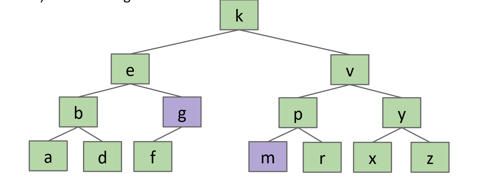

### BST 作为集合（Set）和映射（Map）

#### 实现 Set

相比于基于数组实现的 ArraySet（搜索时间复杂度为 $O(n)$），二叉搜索树利用二分搜索的性质，可以将搜索时间复杂度降为 $O(\log n)$，适合快速检查元素是否存在

#### 实现 Map

给节点加上 `Key` 即可，按键值比较来确定插入的位置，搜索效率同样降为 $O(\log n)$

## B-Trees

### BST 的性能问题

我们知道，BST 的性能直接依赖于树的高度，当 BST 退化为线性结构（类似于链表）的时候，高度为 $\Theta(n)$，而当 BST 是平衡的，每个节点的左右子树高度差很小的时候，高度为 $\Theta(\log n)$。

而 BST 的结构、高度完全由节点插入顺序决定，不同的插入顺序会导致完全不同的树形状，从而影响高度和性能。能够证明，随机插入的 BST 的平均深度和高度预期为 $\Theta(\log N)$，但在实际的数据处理中，插入顺序通常是不可控的，比如数据按时间顺序到达，而若数据恰好是按升序或降序到达的，那么 BST 就会退化为链表，导致性能下降，本质上，BST 的性能问题在于我们总是在叶节点处插入，接下来我们将引入一种非常平衡的树——B-Tree

### B-Tree 的定义

前面我们提到，BST 性能变差的原因是我们总在叶节点处插入，那么如果我们不通过创建新的叶节点来插入，而是**将新元素添加到现有的叶结点**呢？这样树的高度就不会增加，我们就能避免其退化为线性结构。但仍然有一个问题，如果一个节点可以存储无限多个元素，搜索该节点内的元素相当于搜索一个数组，运行时间有可能退化为 $\Theta(n)$，所以我们还要**限制节点的元素数量**，为每个节点设置一个元素上线（例如最多4个元素）。当节点元素数量达到上限的时候，我们就让**节点分裂**，将节点拆分为两个子节点，并提升一个中间元素到父节点，从而保持树的平衡，这就是 B-Tree 的解决方案。

B-Tree 是一种**自平衡的多路搜索树**，其避免通过添加新叶子结点增加高度，而是**将新元素插入到现有叶子结点**，并在节点“过满”时进行分裂，确保树始终保持平衡，高度为 $\Theta(\log n)$。B-Tree 的每个节点可以存储多个元素（通常为 1 到 $L$ 个，$L$ 是常数），节点内的元素保持**排序**，子节点按元素范围组织（比如小于某个元素、介于两个元素之间、大于某个元素）

B-Tree的常见类型有 2-3-4 树和 2-3 树。2-3-4 树是指每个节点可以有**2、3或4个子节点**，分别对应1、2或3个元素（K个元素的节点有K+1个子节点）。当一个节点已经有3个元素（满节点），并且需要再插入一个新元素时，节点会分裂；2-3 树则是每个节点可以有2或3个子节点，每个节点最多可以存储2个元素。

### B-Tree 的插入过程

下面我们以 2-3-4 树为例来介绍 B-Tree 的插入步骤：

首先我们遍历到叶子节点：像 BST 一样，我们根据新元素的值遍历树找到合适的叶子结点（根据节点内元素的排序来决定向左、右或者中间子节点移动）

然后我们将新元素插入到叶子结点，并且保持节点内的元素排序。

接着我们检查节点是否过满，如果插入后节点有四个元素（对于 2-3-4 树）就需要分裂，分裂过程如下：

- 我们首先取中间元素（中间左或中间右均可），提升到父节点
- 将剩余元素分成两个新节点（各有两个元素或一个元素）
- 重新整理子节点，确保子节点范围与提升的元素保持一致

最后我们递归处理父节点，如果父节点因提升的元素而过满，就需要重复分裂过程（如果是根节点过满，分裂根节点就会创建一个新根，使得树的高度增加1）

下面我们举一些例子

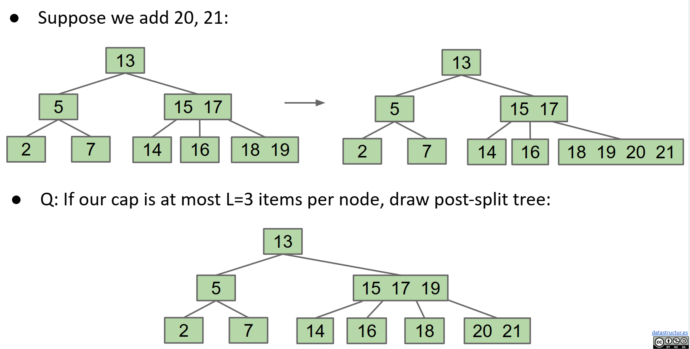

### B-Tree 的性能分析

前面我们提到过， BST 插入到叶子节点可能会导致树高度线性增长，最坏情况为 $\Theta(n)$。而 B-Tree 通过限制节点元素的数量和分裂机制，避免了高度的无限制增长，分裂操作又将节点均匀分配，确保树足够“浓密”，高度为 $\Theta(\log n)$，操作的时间复杂度为 $O(\log n)$

### B-Tree 不变量

在 BST 中，我们知道插入顺序对树的高度是有着显著影响的，那么我们不禁要问，插入顺序对 B-Tree 的高度是否也有着类似的影响呢？答案是 **B-Tree 的插入顺序可能影响高度，但是影响有限，B-Tree 的节点分裂机制确保树高接近 $\Theta(\log n)$**，远远优于 BST 的最坏情况 $\Theta(n)$

事实上，B-Tree 通过以下两个关键不变性来保证其平衡和高效性：

- **不变性1**：**所有叶节点到根节点的距离是相同的**，任何操作（搜索、插入）的最长路径长度一致
- **不变性2**：非叶子节点有 k 个元素时，必须有 k+1 个子节点

## Rotating Trees

B-Tree 确实是非常均衡的，但实现起来却相当的困难，我们需要跟踪不同的节点，其分裂逻辑也十分的复杂，那么有没有另一种更简单的平衡树的方法呢？答案是**旋转(Rotation)**

首先我们应当明确的是，对于任何 BST，我们都有多种方法来构建它，以保持 BST 的不变性，在前面我们采用的是插入，不同的插入顺序会生成不同的 BST，比如下面的这个包含1,2,3的 BST，就有5种不同的结构。

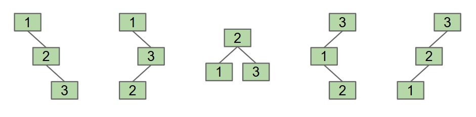

事实上，对于 $n$ 个不同的元素，BST 的可能结构数量是由卡塔兰数决定的，Catalan 数公式如下：
$$
C_n=\frac{1}{n+1}C_{2n}^n
$$
但插入并不是唯一能生成不同 BST 结构的方式，旋转同样可以做到，下面我们给出旋转的正式定义。

### Tree Rotation

旋转的正式定义是：

`rotateLeft(G):Let x be the right child of G. Make G the new left child of x.`

`rotateRight(G):Let x be the left child of G. Make G the new right child of x.`

下面我们分别举两个左旋和右旋的例子：

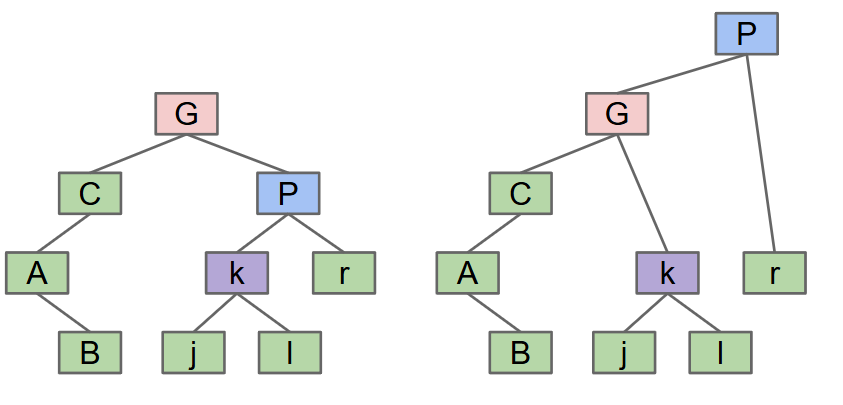

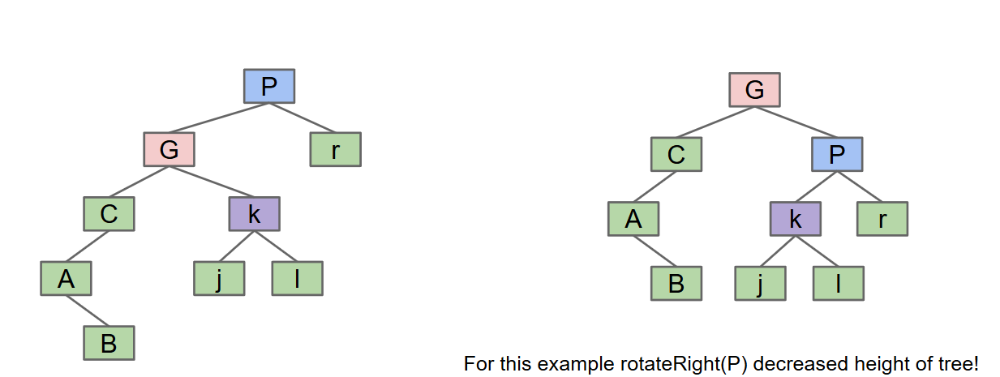

下面我们给出左旋和右旋操作的简单实现：

```java
private Node rotateRight(Node h){
    Node x = h.left;
    h.left = x.right;
    x.right = h;
    return x;
}

private Node rotateLeft(Node h){
    Node x = h.right;
    h.right = x.left;
    x.left = h;
    return x;
}
```

我们再来看一个旋转的练习

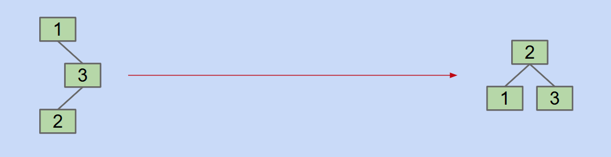

对于这种情况，我们怎么旋转才能由左边的树结构得到右边的树结构呢？答案是先 `rotateRight(3)`，再 `rotateLeft(1)`（这里不太懂的话可以看看当时学习数据结构和算法这门课的时候做的 AVL Trees 旋转的笔记）

旋转可以改变树的层级结构，这允许我们通过旋转来调整树的高度，从而影响平衡性；旋转还能够保持 BST 的搜索性质，即左子树的所有节点值小于根节点，右子树的所有节点值大于根节点。

## Red-Black Trees（红黑树）

我们在前面提到，2-3 树（B-Trees）的平衡性非常好，但实现起来也非常困难，那么我们能否两者兼顾呢？或者说，我们能否创建一个使用 BST 实现，并且结构上与 2-3 树相同且保持平衡的树呢？答案是**红黑树**。

### motivation

我们不妨想想怎么将 2-3 树改造成我们想要的两者兼顾的样子。对于只有2个子节点的节点，也即包含1个元素和2个子节点，这时候和 BST 树几乎是一样的，无需修改；对于有3个子节点的节点，也即包含2个元素和3个子节点的节点，我们可以尝试引入“胶合节点(glue node)”来连接两个子节点，其中胶合节点是空节点，不存储任何值，如下图所示：

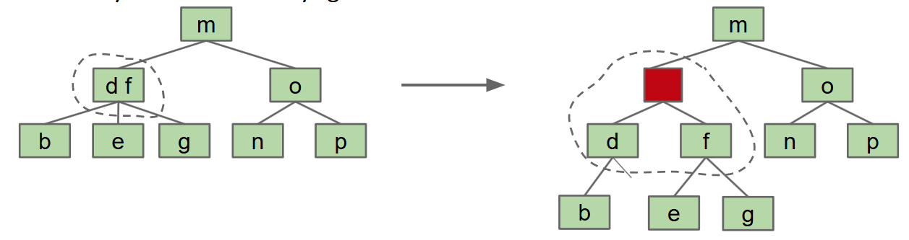

但是这样会增加空间和代码的复杂性，于是我们又尝试使用**glue links**，并以颜色红/黑来表示，如下图所示：

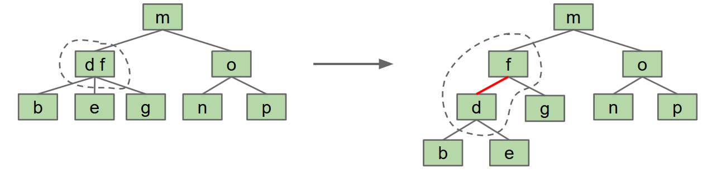

我们选择将左元素作为右元素的子节点，通过**红色链接**进行连接，这会导致形成一棵**左倾斜树**。普通的链接是黑色的，这便是红黑树的由来。由于我们讨论的是左元素作为右元素的子节点，所以我们把这个结构称为**左倾红黑树(LLRB)**。在 CS61B 中我们使用的也会是 LLRB。

LLRB 和 2-3 树之间存在着一一对应关系，每个 2-3 树都对应着一个唯一的 LLRB 红黑树，而 2-3-4 树则与标准红黑树之间保持着对应关系。

下面我们来看一下 LLRB 和对应 2-3 树之间的一些转换练习：

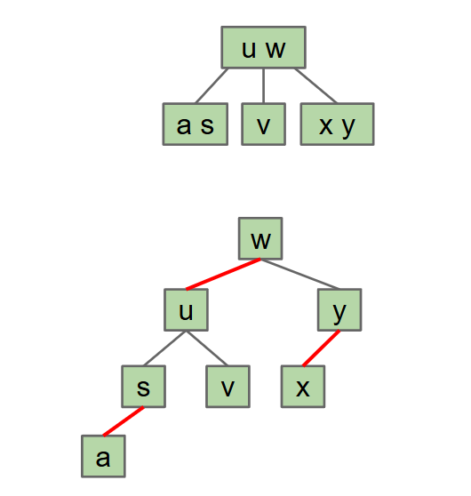

有些 LLRB 其实是不合法的，比如下列几个：

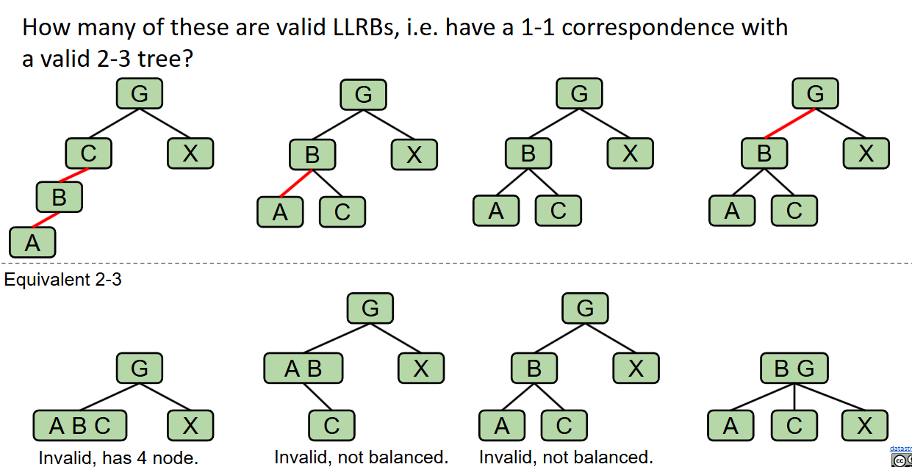

第一个不合法，因为有连续的两个红链接，转化为对应的 2-3 树之后会发现有个节点含有3个元素；第二个不合法，因为 LLRB 要求每条路径的黑色链接数是相同的，这是由于对应的 2-3 树的每条路径的高度要相同；第三个不合法的原因和第二个相同，第四个是合法的

### LLRB 的性质

LLRB 有以下几点核心属性：

- LLRB 和 2-3 树一一对应
- LLRB 没有连续的两个红色链接，因为这样对应三个节点
- 没有红色的右链接，因为我们采用的是左倾策略
- **每条路径的黑色链接数是相同的**，这是由于继承了 2-3 树所有叶子等深的特性
- LLRB 的高度不超过对应的 2-3 树高度的两倍

这些性质确保 LLRB 在动态操作中能够保持 $O(\log n)$ 的运行时间，并且还简化了 2-3 树的复杂实现。

### LLRB 与 2-3 树的高度

要计算 2-3 树对应的 LLRB 的高度，我们要抓住以下几个关键点：

- 2-3 树中的每个3节点（包含2个元素和3个子节点）在转换为 LLRB 是会被拆分为2个节点（一个黑色节点和一个红色子节点）
- LLRB 树的高度由黑色链接和红色链接的总数决定，且每条路径上黑色路径的长度是相同的。
- 一般情况下，LLRB 树的高度不超过对应 2-3 树高度的2倍

一般来说遵从这样一个规则，如果 2-3 树的高度是 H，那么其对应的 LLRB 的最大可能高度会是 2H+1。这是因为 2-3 树每条路径的深度是一致的，都是 H，也就决定了 LLRB 中每条路径的黑色链接数都会是 H，最坏情况是 2-3 树的每个节点都是3节点（也即包含两个元素和三个子节点的节点），这样的节点会有 H+1 个（高度是 H，由 H 条边连接 H+1 个节点），导致 LLRB 中引入 H+1 条红色链接，最终高度为黑色链接数 H + 红色链接数 H+1。

### LLRB 的插入操作

LLRB 的插入，有的人可能会采用向 2-3 树中插入并将其转换为 LLRB 树，从而完成 LLRB 的插入操作，但这其实是与创建 LLRB 的初衷相违背的，创建 LLRB 的初衷是为了避免 2-3 树的复杂代码，所以我们应当向对待普通的 BST 那样向 LLRB 中插入，但这可能会破坏其与 2-3 树的一一对应关系，所以我们还需要使用旋转操作来将树调整回适当的结构，下面我们讨论一下向 LLRB 插入节点时需要处理的问题：

- **insertion color（插入颜色）**：在 2-3 树中，我们插入节点总是往叶节点中添加，而 2-3 树和红黑树又是一一对应的，所以我们添加的链接颜色**应当始终为红色**

  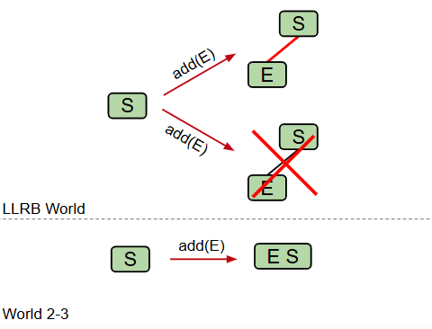

- **insertion on the right（右侧插入）**：因为在 CS61B 中我们使用的一直都是 LLRB，也即左倾红黑树，所以我们永远都不能有右侧红色链接，如果我们在右侧插入红色链接的话，需要使用旋转来维护 LLRB 的不变量(invariant)，使得红色链接位于左侧。然而如果我们在右侧插入红色链接，并且左子结点也是一个红色链接时候，我们将暂时允许这种情况的存在，后面介绍这种情况怎么处理。

  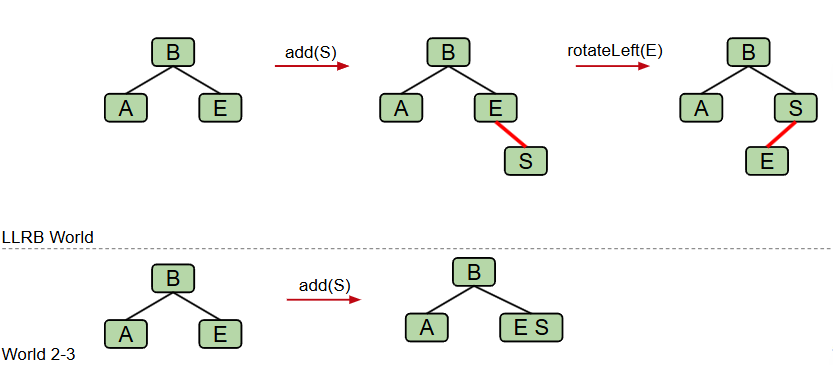

- **double insertion on the left（左侧双重插入）**：如果左侧有两个连续的红色链接，那么我就会得到对于 2-3 树来说的非法的4节点（也即含有3个元素，四个子节点的节点）。我们首先会将其旋转，将中间节点（我们这里将其记作节点 S）作为根节点。

  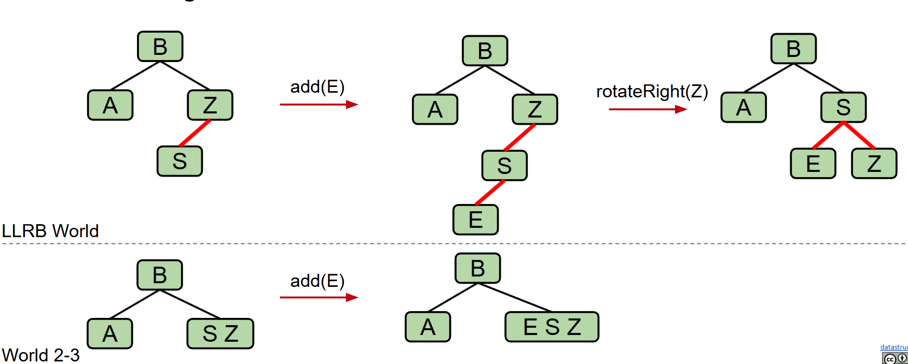

  

  此时其左侧、右侧均为红色链接，然后在这种情况下，我们将会翻转所有与节点 S 连接的边的颜色（红变黑，黑变红），这样的操作并不会改变其作为二叉搜索树的结构。

  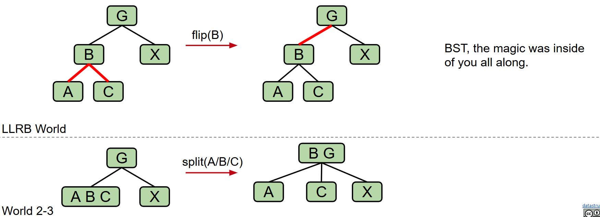

提供一个练习，写出依顺序向空的 LLRB 中插入 7,6,5,4,3,2,1 最终得到的 LLRB，答案如下：

??? Tip "答案"

    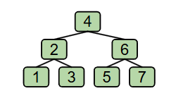

如果不太理解的话可以查看这里的[演示](https://docs.google.com/presentation/d/1jgOgvx8tyu_LQ5Y21k4wYLffwp84putW8iD7_EerQmI/edit?usp=sharing)

### LLRB runtime

LLRB 和 2-3 树之间存在着一一对应关系，且其高度始终保持在 2-3 树高度的两倍范围内，因此其操作的运行时间为 $O(\log n)$

下面我们给出 LLRB 插入的相关代码：

```java
private Node put(Node h, Key key, Value val) {
    if (h == null) { return new Node(key, val, RED); }

    int cmp = key.compareTo(h.key);
    if (cmp < 0)      { h.left  = put(h.left,  key, val); }
    else if (cmp > 0) { h.right = put(h.right, key, val); }
    else              { h.val   = val;                    }

    if (isRed(h.right) && !isRed(h.left))      { h = rotateLeft(h);  }
    if (isRed(h.left)  &&  isRed(h.left.left)) { h = rotateRight(h); }
    if (isRed(h.left)  &&  isRed(h.right))     { flipColors(h);      } 

    return h;
}
```

!!! note "Tip"

    几点说明：

    - LLRB 的删除是比较困难的，我们这里不做介绍。
    - Java 的 `TreeMap` 是一个红黑树，但不是左倾的。LLRB 和 2-3树之间保持一一对应关系，标准红黑树与 2-3-4 树保持对应关系，但这种对应并不是双射，而是多对一的。
