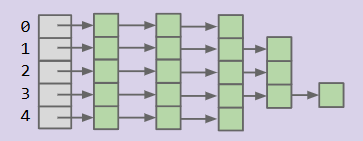

我们已经学习过几种可以高效搜索的数据结构，比如 BST，2-3 Tree，LLRB等等，他们都支持 `add` 操作和 `contain` 操作，但是它们都有一些局限性：

- 元素之间需要是可比较的，但我们希望能够支持任意对象，无需比较。
- 这些树的搜索、插入复杂度为 $\Theta(\log n)$，我们能否实现常数时间的复杂度呢？

我们需要一种新的方法——哈希(Hashing)

## First attempt

为了先解决时间复杂度的问题，我们能很容易的想到一个粗浅的想法——直接用数据本身作为数组的索引，称之为 `DataIndexedIntegerSet`。比如假设假设只考虑 `int` 的情形，我们可以创建一个 `boolean` 数组，默认全为 `false`，以 `true` 表示该整数已经添加，`false` 表示其不存在。`add(int x)` 操作只需要将数组的 `x` 索引对应的元素设置为 `true`，`contains(int x)` 操作只需要检查 `x` 索引对应的元素是否为 `true`

但很显然这个想法有着诸多致命的缺陷：

- 空间浪费
- 只支持整数，无法直接存储字符串、类对象等等

## word-insertion

我们提到 `DataIndexedIntegerSet` 只支持整数，那么这个小节我们试着支持对字符串的插入。有一个直接的想法是，我们可以在字符串和数字之间建立一个映射，将每个字符串映射为数字作为其在数组中的索引。但这样的映射必须是唯一的，不能产生 collision（碰撞）。

我们可以从十进制中获得灵感，一个十进制数 $5149=5\times 10^3+1\times 10^2+4\times 10+9\times 10^0$，我们完全可以将字母与数字之间做对应，例如 `a=1,b=2,...`，注意这里我们没有使用0，这是因为可能出现 `00324` 的结构，在十进制中没有意义。举个例子，对于单词 `dog`，有 `d=4,o=15,g=7`，所以可以这样找到 `dog` 所对应的数字：
$$
\text{dog} = 4\times26^2+15\times26^1+7\times26^0=3101
$$
也即 `3101` 为 `dog` 所对应的索引。

```java
public static int letterNum(String s, int i){
    char ithChar = s.charAt(i);
    if(ithChar < 'a' || ithChar > 'z'){
        throw new IllegalArgumentException("Only lowercase a-z allowed");
    }
    return ithChar - 'a' + 1; // 将字母转换成其对应的数字,a=1,b=2,...
}

public static int englishToInt(String s){
    int intRep = 0;
    for(int i = 0; i < s.length(); i++){
        intRep = intRep * 26;
        intRep += letterNum(s,i);
    }
    return intRep;
}
```

`englishToInt(String s)` 的时间复杂度为 $O(s)$，其中 $s$ 是字符串的长度，通常来说 $s$ 较小，所以我们可以将其视时间复杂度视为常数，故`add/contains` 时间复杂度为常数

## string-insertion and overflow

我们甚至还可以支持中文，例如使用 Unicode，但是字符码高达40959，如果我们将40959作为基数，这样的空间要求太高了，所以某种意义上，也许我们会放弃映射的唯一性要求，被迫接受 collision 。

并且需要指出，Java中的 `int` 实际上是有符号的 32-bit 的 `int`，所以它的范围是 $-2^{31}\sim 2^{31}-1$，也即 $-2147483648\sim 2147483647 $，当结果超过这个范围时就会发生类似于求模的循环，也即`最大值+1=最小值`，`最小值-1=最大值`，这是因为Java的 `int` 运算在底层其实就是模 $2^{32}$ 的。溢出不是大问题，我们仍然能够实现将字符串转化为 `int` 的目标，但溢出会导致 collision 的发生，比如 `melt banana` 和 `subterrestrial anticosmetic` 在经过 base-126 的计算后溢出结果相同。

所以我们不应该去避免 collision，而是要去处理 collision

### Hash Codes

在计算机科学中，我们把将对象转化为 `int` 这样的过程叫做计算哈希码(hash code)。Java 中的每个对象都有一个默认的 `.hashcode()` 方法，其通过确定这个 `object` 在内存中的位置，并使用该内存地址进行转换，这种方法可以为每个 Java 对象提供一个唯一的哈希码；有的时候我们也会自己编写 `hashcode` 方法。

### Hash Code 的属性

不是所有将对象转为 `int` 的转换都叫做 `hash code`，其必须满足以下几点必要属性：

- 输出必须为 `int`
- 一致性：对同一次对象多次调用，返回的值总是相同的
- 相等性，如果有 `a.equals(b)`（如果用 `==` 地址相同哈希码显然相同，这里我们是希望值相同的时候拥有相同的哈希吗），则一定有 `a.hashCode == b.hashCode()`（反之不一定，不同的对线够可以同 `hash`）

一般来说，一个好的哈希码还应该是 "distribute items evenly" 的，也就是均匀分布的，Java 内置的哈希码计算分布均匀。

## Handling Collisions

这一小节我们介绍如何处理 collision，核心思路是修改我们的数组，使得其元素不仅仅是一个普通的元素，而是包含其他数据结构，例如 `LinkedList`：如果我们得到一个元素，其哈希码为 $h$，我们分两种情况考虑：

- 如果当前索引为空，我们就在此创建新的链表并添加该元素
- 如果已有列表存在，我们先在列表中检查元素是否存在（避免重复），如果不存在就将其添加到链表末尾。

!!! note "Tip"

    这种方法我们称之为链式寻址

### Concrete workflow

对于 `add` 操作来说：

- 首先获取元素的哈希码
- 如果索引中没有该元素，我们就创建一个新的列表，并将该元素置于列表中
- 如果索引中已经有一个列表，就在列表中检查元素是否已经存在，如果没有就将其添加到列表中

对于 `contains` 操作：

- 我们首先获取元素的哈希码
- 如果数组对应索引处为空，就返回 `false`
- 否则我们就检查该索引处的 List 中的所有元素，如果存在就返回 `true`，如果不存在就返回 `false`

### Runtime Complexity

插入操作(`add`)和查找操作(`contain`)的时间复杂度为 $\Theta(Q)$，这里的 $Q$ 是最长的链表的长度，这是因为两者都需要遍历链表，`add` 需要检查重复，`contain` 需要查找元素。最坏情况下，如果所有的 $n$ 个元素的哈希码相同，就会全部存入同一链表，此时复杂度退化至 $\Theta(n)$。

### Solving space

在学会如何处理 collision 之后，我们可以解决空间存储的问题，一个不错的想法是**取模**，比如在我们得到 hash code 之后，我们对 100 取模，得到 0-99 范围内的一个索引，使得数组的容量大大减小，但需要注意的是，同一索引的链表会更长，导致 $Q$ 增大，这在一定程度上也会降低时间效率。

## HashTable

最终我们可以得到一种新的数据结构——HashTable：

- 输入元素被哈希函数(hash function)转换为整数，然后它们使用取模运算符被转化为有效索引，数组的每个索引处存储链表，碰撞元素均存入对应链表
- `contain` 以类似的方式工作，先确定有效索引，然后在相应的 LinkedList 中查找该项目

### Runtime

考虑这样一个场景，我们有一个 5 buckets 的哈希表，链表长度 $Q$ 的增长速度对于 $N$ 是怎样的，如下图所示：



答案是 $Q$ 是 $\Theta(N)$ 的。因为在最好的情况下，最长的列表的长度会是 $\frac{N}{5}$，而在最差的情况下会变成 $N$，所以 $Q$ 是 $\Theta(N)$ 的，这样的时间复杂度是线性的。如果我们将 bucket 的数量记作 $M$，元素的总数量为 $N$，我们能否改进我们的设计使得 $\frac{N}{M}$ 是常数时间复杂度的呢？我们有两个优化方案。

我们定义负载因子为 $\frac{N}{M}$，这直接决定了链表的平均长度。

**方案一：动态扩容哈希表**

我们可以动态调整桶的数量 $M$，控制负载因子不超过某个阈值，从而保证运行效率。

扩容策略如下：

- **触发条件：**当负载因子超过预设阈值（例如1.5）的时候触发扩容
- **扩容操作：**
  - 我们创建新的哈希表，桶的数量为旧表的2倍（$2M$）
  - 遍历旧表的所有元素，逐个重新插入新表（因为 $M$ 发生改变，模运算的结果也会改变，元素的索引需要重新计算），插入新表的时候由于旧表元素无重复，所以我们可以直接加在链表的头部而无需重新检查，确保单元素的插入时间复杂度为 $\Theta(1)$

扩容的整体时间复杂度为 $\Theta(N)$（重新插入 $N$ 个元素，每个的时间复杂度为 $\Theta(1)$），扩容后若元素分布均匀，负载因子 $\frac{N}{M}$ 维持在常数范围内，此时 `add` 和 `contains` 的平均运行时优化为 $\Theta(1)$

**方案二：改进哈希码**

这个方案实现起来比较困难。动态扩容的效果依赖于元素在桶中是否均匀分布，而均匀分布的核心前提是高质量的哈希码，哈希码的设计有以下的一些经验：

采用我们前面提到的基数策略生成哈希码，基数选择小质数，可以避免因整数溢出导致的碰撞，并且让不同元素的哈希码尽可能随机，减少集中分布。


