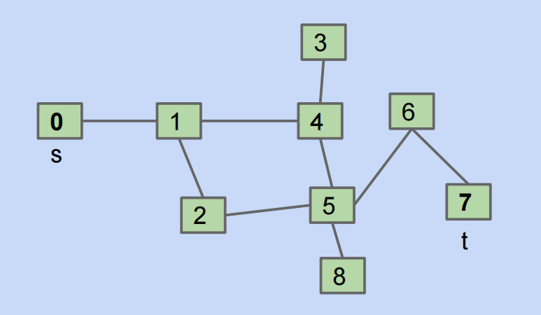
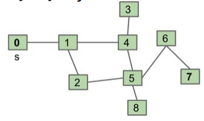

## Tree Iteration Traversal（树的迭代遍历）

在引入图这种数据结构之前，我们先讨论如何在树结构上进行迭代或遍历。和线性结构不同，树本身没有单一的“自然”顺序，所以我们需要 traversal 的概念，而不是简单的 iteration。树遍历的自然方式有以下几种：

- 层序遍历(Level order traversal)，树的广度优先遍历(Breadth-First Traversal，简称BFS)就是层序遍历。
- 深度优先遍历(Depth-First Traversal)，包括三种变体：前序遍历(pre-order)、中序遍历(in-order)和后序遍历(post-order)

这些遍历并不是随意定义的，而是基于递归结构，先处理子树再处理当前节点或者相反。

### 层序遍历(Level Order Traversal)

层序遍历的思路是按层级从上到下、从左到右访问节点。

层序遍历的实现比较难，因为我们需要跟踪当前层级，我们通常使用队列来实现，基本步骤如下：

- 首先将根节点入队
- 当队列不为空时：
  - 从队列中取出一个节点并访问它
  - 将该节点的所有子节点（先左后右）依次加入队列
- 重复上述步骤，直至队列为空

下面我们给出代码示例：

```java
List<Integer> leverOrder(TreeNode root){
    // 初始化队列，并加入根节点
    Queue<TreeNode> queue = new LinkedList<>();
    queue.add(root);
    // 初始化一个列表，用于保存遍历序列
    List<Integer> list = new ArrayList<>();
    while(!queue.empty()){
        TreeNode node = queue.poll(); // 队列出队
        list.add(node.val);
        if(node.left != null){
            queue.offer(node.left); // 左子节点入队
        }
        if(node.right != null){
            queue.offer(node.right); // 右子节点入队
        }
    }
    return list;
}
```

### 前序遍历(Pre-order Traversal)

前序遍历的思路是从根开始，先访问（打印）当前节点，然后递归左子树，再递归右子树。这里的**前序指的是访问节点在递归子树之前**，伪代码如下：

```java
preOrder(BSTNode x){
    if(x == null){
        return;
    }
    print(x.key);
    preOrder(x.left);
    preOrder(x.right)
}
```

### 中序遍历(In-order Traversal)

中序遍历的思路是先递归左子树，再访问当前节点，然后再递归右子树。这里的**中序是指访问当前节点的逻辑在递归左右子树之间**，伪代码如下：

```java
inOrder(BSTNode x){
    if(x == null){
        return;
    }
    inOrder(x.left);
    print(x.key);
    inOrder(x.right);
}
```

### 后序遍历(Post-order Traversal)

后序遍历的思路是先递归左子树，再递归右子树，然后访问当前节点。这里的**后序是指访问当前节点的逻辑在递归左右子树之后**，伪代码如下：

```java
postOrder(BSTNode x){
    if(x == null){
        return;
    }
    postOrder(x.left);
    postOrder(x.right);
    print(x.key);
}
```

## 图（Graph）

树是一种很好的数据结构，但是它也有一些限制，比如“任意两个节点之间只有一条路径“、“无环”，而有些节点-边的结构违反了这条规则，自然它们也就不是树，现实中也多有循环或者多路径的情况。如果我们在树的基础上去除路径约束，允许任意连接，就会形成图这种数据结构，下面我们给出图的定义。

图是一种非线性数据结构，由顶点(vertex/node)和边(edge)组成，我们可以将图 $G$ 抽象地表示为一组定点 $V$ 和一组边 $E$ 的集合，例如
$$
V=\{1,2,3,4,5\}\\
E=\{(1,2),(1,3),(1,5),(2,3),(2,4),(2,5),(4,5)\}\\
G=\{V,E\}
$$
如果我们将顶点看作节点，将边看作连接各个节点的引用（指针），我们就可以将图看作一种从链表拓展而来的数据结构。相较于线性关系的链表和分治关系的树，网络关系的图的自由度更高，也更为复杂。

通常来说，图分为简单图(simple graphs)和多图(multigraphs)，简单图是指满足以下两个条件的图：

- 无多重边(multiple edges)：即两个节点间不能有两条或更多不同的边
- 无自环(self-loops)：节点不能有连接自身的边

在课程中我们默认是简单图，除非特别说明。

!!! Tip "说明"

    对简单图的分类有无向图和有向图、无环图和有环图，是离散数学里面的一些概念，这里就不详细说明了。

## Graph Problems

图结构产生了很多的有趣的问题，从简单的路径检测到复杂的优化，我们可以提出很多问题，例如：

- **s-t 路径(s-t Path)：**顶点s和t之间是否有路径
- **连通性(Connectivity)：**图是否连通？也即是否所有顶点间都有路径？
- **双连通性(Biconnectivity)：**是否存在一个顶点，其移除会使图断开？
- **最短 s-t 路径(Shortest s-t Path)：**s到r的最短路径是什么？
- **循环检测(Cycle Detection)：**图中是否有循环？
- **Euler回路(Euler Tour)：**是否存在一个循环，使得每一条边恰好出现一次？
- **Hamilton回路(Hamilton Tour)：**是否存在一个循环，使得每个顶点恰好出现一次？
- **平面性(Planarity)：**能否在纸上绘制图而使得无边的交叉？
- **同构(Isomorphism)：**两个图是否同构？

我们通常很难去区分哪些图的问题比较难，那些不太难，有些问题可能已经高效地解决了，有些仍然是open的难题。比如欧拉回路和哈密顿回路，欧拉回路是一个在1873年就被解决的问题，其解的时间复杂度为 $O(E)$，其中 $E$ 是图中边的数量。而哈密顿回路至今仍然没有人能高效地解决它，目前已知的最好的算法的时间复杂度是指数级的。

### s-t Path 问题（Depth-First Traversal）

即给定一个起点 $s$ 和一个终点 $t$，是否存在从 $s$ 到 $t$ 的路径，即要编写函数 `connected(s,t)`，返回是否存在路径，这其实要求我们以某种方式去遍历整个图（事实上是 DFS 深度优先遍历），我们可能会想到这么一个递归的算法：对于 `connected(s,t)`

- Does s==t? If so, return true.
- Otherwise, if connected(v,t) for any neighbor v of s, return true.
- Return false.

但事实上这个算法是有问题的，我们考虑如下的图：

这事实上会让我们陷入一个无限循环，例如以0为起点：

- `connected(0,7)`：
  - Does 0==7? No,so...
  - if(connected(1,7)) return true;
- `connected(1,7)`：
  - Does 1==7? No,so...
  - if(connected(0,7))... **get an infinite loop**

那么我们应该如何去修复这个问题呢？方案是**标记已经访问了的节点**，这样的 `connected(s,t)` 伪代码如下：

```text
mark s // mark that we have already visited s
if(s==t):
	return true;
for child in unmarked_neighbors(s): // if a neighbor is marked, then ignore it!
	if isconnected(child,t):
		return true;
return false
```

mark可以用bool数组或者set来实现，防止重新访问，具体的例子可以参考这个[demo](https://docs.google.com/presentation/d/1OHRI7Q_f8hlwjRJc8NPBUc1cMu5KhINH1xGXWDfs_dA/edit?usp=sharing)

事实上，我们刚刚编写的这个 `connected()` 函数本质上是图的深度优先遍历（DFS），类似于树的 pre-order/in-order/post-order traversal。因为其遍历过程大致是这样的：

- 首先标记自己，然后访问第一个邻居
- 第一个邻居标记自己，再访问其邻居
- 邻居的邻居标记自己，继续深入

这就与树的深度优先遍历非常类似，其时间复杂度为 $O(V+E)$，这里 $V$ 是顶点数，$E$ 是边数

图的深度优先遍历又可以分为 DFS Preorder（前序深度优先遍历）和 DFS Postorder（后序深度优先遍历）。

DFS Preorder是深度优先搜索的一种变体，先访问当前节点（执行动作例如print或设置 `edgeTo`），然后递归地遍历其未访问的邻接节点，详细过程如下：

- 从起点（根或源节点）开始，标记当前节点
- 执行动作（例如记录当前节点或者设置路径前驱）
- 递归地深入第一个未访问的邻接节点，重复上述过程
- 返回后处理下一个邻接节点

在上图中 DFS Preorder访问的顺序是0 1 2 5 4 3 6 7 8（实际上是调用 `dfs` 的顺序）

DFS Postorder 是深度优先搜索的另一种变体，其先递归遍历所有未访问的邻居，然后访问当前节点（执行动作），其详细过程如下：

- 从起点开始，标记当前节点
- 递归遍历所有未访问的邻居
- 返回后执行动作

在上图中 DFS PostOrder 的顺序是3 4 7 6 8 5 2 1 0（自底向上，实际上是 `dfs` return 的顺序）

### Breadth-First Traversal

BST Order 是广度优先搜索的遍历顺序，其按照距离从起点向外扩展，先访问所有当前层的邻接节点，再进入下一层，可以使用队列实现，类似于树的层序遍历，详细过程如下：

- 从起点入队，标记为访问
- 出队当前节点，访问其所有未访问的邻居
- 重复直至队列为空

在上图中 BFS Order 的顺序是0 1 24 35 68 7

!!! note "Tip"

    需要说明的是，在图的DFS或者BFS中，当一个节点有多个未访问的邻居时，如果邻居没有按照固定的顺序存储，那么算法选择下一个处理的对象的选择顺序可能是任意的，也即图遍历的顺序可能不是唯一的。对于 DFS 来说，不同顺序会改变探索的路径，但是结果（例如可达性等等）不会发生改变；BFS 不同顺序会改变层内节点访问的次序，但是最短的路径层数不会发生改变

## Graph Traversal Implementations

### Shortest Paths（最短路径问题）

给定一个图（无权重图），如何从起点 `s` 找到到所有其他节点的最短路径，需要给出通用的算法。

!!! note "Tip"

    对于无权重图的最短路径问题，BFS 是更好的选择，因为 BFS 按距离访问节点，保证了第一个到达某个节点时的路径是最短的，天然适合最短路径问题。

对于这样的最短路径问题，使用 BFS 的算法如下：

- Initialize a queue with a starting vertex s and mark that vertex.
- Repeat until queue is empty:
  - Remove vertex v from the front of the queue
  - For each **unmarked** neighbor n of v:
    - Mark n
    - Set edgeTo[n] = v, (and distTo[n] = distTo[v] + 1 if we want to track distance)
    - add n to end of queue.

可以查看这个[demo](https://docs.google.com/presentation/d/1JoYCelH4YE6IkSMq_LfTJMzJ00WxDj7rEa49gYmAtc4/edit?usp=sharing)。如果是有权图，BFS 就并不适合了，因为 BFS 实际上假设所有的边等长。

### Graph API

接下来我们讨论如何在代码上实现图与图算法，首先我们要考虑 API(Application Programming Interface) 和用于表示图的底层数据结构，不同的选择会对时间复杂度、空间复杂度以及实现算法的难度产生深远的影响。

API 是一系列可供我们使用的方法的列表，包括方法签名以及它们行为相关的信息，对于图的 API，我们做以下约定：无论节点的原始标签是什么，我们都用整数0,1,2等等进行编号，并通过 `Map<Label,Integer>`映射标签到整数，从而简化实现，避免泛型的复杂性。

```java
public class Graph{
    public Graph(int V); // 构造函数，创建有 V 个节点的空图
    public void addEdge(int v, int w); // 添加边 v-w(无向图，同时也添加了w-v)
    Iterable<Integer> adj(int v); // 返回 v 的邻居节点迭代器
    int V();					 // 返回节点数
    int E();					 // 返回边数
    ...
}
```

对于上述 API，要求节点数 V 必须提前指定，并且其不支持节点或边权重，无直接方法获取节点的度数，需要我们手动计算，例如：

```java
public static int degree(Graph G, int v){ // 计算节点度数
    int degree = 0;
    for(int w : G.adj(v)){
        degree += 1;
    }
    return degree;
}

public static void print(Graph G){ // 打印图
    for(int v = 0; v < G.V(); v += 1){
        for(int w : G.adj(v)){
            System.out.println(v + "-" + w);
        }
    }
}
```

### Graph Representations

用于实现图的底层数据结构通常有三种：邻接矩阵(Adjacency Matrix)、边集(Edge Sets)、邻接表(Adjacency Lists)。

**邻接矩阵**使用二维的 bool 数组或 int 数组，`G[w][v] == true` 表示边 `v-w` 存在，并且对于无向图，显然邻接矩阵是一个对称阵，也即有 `G[w][v] == G[v][w]`，而 `adj(v)` 的实现逻辑即返回行 `v` 的迭代器，扫描整行找出为 `true` 的值，时间复杂度为 $\Theta(V)$ 。邻接矩阵的优点和缺点也很明显，优点是其检查边是否存在的时间复杂度为 $\Theta(1)$，但缺点是其空间复杂度为 $\Theta(V^2)$，在图稀疏的时候会造成很大的空间浪费。

**边集**意指用一个集合来存储所有的边，例如 `HashSet<edge>`，其中 `edge` 是 `(int,int)` 对，对于边集 `adj(v)` 的实现逻辑即扫描所有 $E$ 条边，找出以 `v` 开头的，所以其时间复杂度为 $\Theta(E)$，其优点在于实现简单，空间复杂度为 $\Theta(E)$，没有太多的空间浪费，但时间复杂度较大。

**邻接表**这是以列表为元素的数组，数组的大小为图 $G$ 的节点数 `v`，`adj[v]` 是节点 `v` 的邻居列表。`adj(v)` 的实现逻辑即直接返回 `adj[v]` 的迭代器，其时间复杂度为 $\Theta(degree(v))$。邻接表的优势在于其空间复杂度为 $\Theta(V+E)$，并且邻居迭代也非常的高效，也是最常用的。通常来说，图是稀疏的，所以 $E \ll V^2$。

!!! note "Tip"

    我们来详细分析一下邻接矩阵和邻接表**打印所有的边的时间复杂度**：

    **邻接矩阵**

    ```java
    for(int v = 0; v < G.v(); v += 1){
        for(int w : G.adj(v)){
            System.out.println(v + "-" + w);
        }
    }
    ```

    外层是 $V$ 次循环很显然，我们主要分析一下内层的时间复杂度，这里 `G.adj(v)` 需要遍历所有的节点去找到 `v` 的邻接节点，返回迭代器，其时间复杂度为 $\Theta(v)$，而 `int w : G.adj(v)` 这个 for-each loop 则需要 $\Theta(degree(v))$ 的时间，所以对于内层循环，总时间是 $\Theta(v)+\Theta(degree(v))$，由于 $degree(v)\leq v$，$\Theta(v)$ 是主导项，故内层总时间复杂度为 $\Theta(v)$，嵌套循环的总时间复杂度为 $\Theta(V^2)$

    **邻接表**

    ```java
    for(int v = 0; v < G.V(); v += 1){
        for(int w : G.adj(v)){
            System.out.println(v + "-" + w);
        }
    }
    ```

    对于邻接表的情形，外层仍然是遍历 $V$ 个节点，而内层循环 `G.adj(v)` 直接返回 `adj[v]` 的迭代器，无需进行额外的扫描，所以迭代 `adj[v]` 的时间复杂度为 $\Theta(degree(v))$，又 $\sum degree(v) = 2E$，所以内层实际上是 $2E$ 次，总的时间复杂度为外层 $V$ 次+内层 $2E$ 次，即 $\Theta(V+E)$。对于稀疏图，$E\ll V^2	$，通常又 $E\approx O(V)$；对于密集图，$E$ 接近 $V^2$（对完全图来说有 $E=\frac{V(V-1)}{2}$），此时 $\Theta(V+E) \approx \Theta(V^20)$

总结一下 Runtime of some basic operations for each representation:

| data structures  | addEdge(s,t) | for(w:adj(v))              | print()       | hasEdge(s,t)        | space used    |
| ---------------- | ------------ | -------------------------- | ------------- | ------------------- | ------------- |
| adjacency matrix | $\Theta(1)$  | $\Theta(V^2)$              | $\Theta(V^2)$ | $\Theta(1)$         | $\Theta(V^2)$ |
| list of edges    | $\Theta(1)$  | $\Theta(E)$                | $\Theta(E)$   | $\Theta(E)$         | $\Theta(E)$   |
| adjacency list   | $\Theta(1)$  | $\Theta(1) \sim \Theta(V)$ | $\Theta(V+E)$ | $\Theta(degree(v))$ | $\Theta(E+V)$ |

一个简单的无向图的实现如下：

```java
public class Graph{
    private final int V; // final修饰代表不可改变、不可继承/重写、不能被继承
    private List<Integer>[] adj;
    
    public Graph(int V){
        this.V = V;
        adj = (List<Integer>[]) new ArrayList[V];
        for(int v = 0; v < V; v++){
            adj[v] = new ArrayList<Integer>();
        }
    }
    
    public void addEdge(int v, int w){
        adj[v].add(w);
        adj[w].add(v);
    }
    public Iterable<Integer> adj(int v){
        return adj[v];
    }
}
```

### Graph Traversal Implementations and Runtime

#### Decoupling Type from Processing

图算法常见的设计模式是**将图的表示(Graph类)和处理算法（如路径查找等）解耦**，避免将算法嵌入到Graph类中，而是创建一个独立的客户端类（例如Paths）来处理图：

- Create a graph object
- Pass the graph to a graph-processing method(or constructor) in a client class.
- Query the client class for information

例如：

```java
public class Paths{
    public Paths(Graph G,int s):   		// Find all paths from G
    boolean hasPathTo(int v):	   		// is there a path from s to v
    Iterable<Integer> pathTo(int v): 	// path from s to v(if any)
}
```

然后我们可以像这样调用：

```java
Paths P = new Paths(G,0);
P.hasPathTo(3); // returns true
P.pathTo(3);    // returns {0,1,4,3}
```



这样的解耦使得Graph类保持简单，只需要负责表示图，而算法逻辑则移到客户端类中，便于扩展不同的算法

#### DepthFirstPaths Implementations and runtime 

DFS 算法使用**递归**实现，目的是从起点 `s` 找到到达每个可达定点的路径，并使用两个数组来存储结果：

- `boolean[] marked`：`marked[v] = true` 表示 `v` 与 `s` 连通（已访问）
- `int[] edgeTo`：`edgeTo[v]=w` 表示路径上的 `v` 的前一个顶点是 `w`

其示例代码如下：

```java
public class DepthFirstPaths{
    private boolean[] marked;
    private int[] edgeTo;
    private int s;
    
    public DepthFirstPaths(Graph G, int s){
        // 初始化 marked 和 edgeTo 数组，长度均为 V
        marked = new boolean[G.V()];
        edgeTo = new int[G.V()];
        this.s = s;
        dfs(G,s); // 以 s 为起点进行 DFS
    }
    
    void dfs(Graph G, int s){
        marked[s] = true;
        for(int w : G.adj(s)){
            if(marked[w] == true){
                continue;
            }
            edgeTo[w] = s; // 记录路径
 			dfs(G,w); // 递归访问
        }
    }
    
    public boolean hasPathTo(int v){
        return marked[v];
    }
    
    public Iterable<Integer> pathTo(int v){
        if(!hasPathTo(v)){
            return null;
        }
        List<Integer> path = new ArrayList<>();
        for(int x = v; x != s; x = edgeTo[x]){ // 从v回溯到s，构建列表
            path.add(x);
        }
        path.add(s);
        Collections.reverse(path); // 反转列表
        return path;
    }
}
```

下面我们分析DFS的时间复杂度，如果我们是基于邻接表的，可以给出构造函数的一个时间复杂度上界 $O(V+E)$，这是因为每个节点至多访问一次($O(V)$次dfs调用)，每个边也至多访问两次（`marked[w]`检查），有人可能会提出这样一个问题，我们在dfs调用的时候访问的节点之间肯定是存在边的，所以dfs调用次数 $\leq $ E，那我们是否能给一个更紧的上界 $O(E)$ 呢？这是不行的，因为构造函数会初始化 `marked` 数组，将 $V$ 个元素置为 `false`，时间复杂度为 $\Theta(V)$。`DFS` 的空间复杂度为 $\Theta(V)$，因为需要长度为 $V$ 的数组存储信息。

!!! warning "注意"

    需要注意的是，时间为 $O(V+E)$，不能说是 $\Theta(V+E)$，例如无边的孤立图就是 $O(V)$

#### BreadthFirstPaths Implementations and runtime

BFS 使用队列来实现层级遍历，找到以 `s` 为起点到每个可达节点的最短路径，同样使用 `marked` 和 `edgeTo` 数组，使用**迭代**实现

```java
public class BreadthFirstPaths{
    private boolean[] marked;
    private int[] edgeTo;
    private int s;
    
    public BreadthFirstPaths(Graph G,int s){
        this.s = s;
        marked = new boolean[G.V()];
        edgeTo = new int[G.V()];
        bfs(G,s)
    }
    
    private void bfs(Graph G, int s){
        Queue<Integer> fringe = new LinkedList<>();
        fringe.add(s); // enqueue
        marked[s]=true;
        while(!fringe.isEmpty()){
            int v = fringe.poll(); // dequeue
            for(int w : G.adj(v)){
                fringe.add(w);
                marked[w] = true;
                edgeTo[w] = v;
            }
        }
    }
}
```

查询方法和DFS相同，如果必要的话我们还可以添加 `distTo` 数组来跟踪距离(`distTo[w] = distTo[v] + 1`)，其时间复杂度为 $O(V+E)$，类似DSF，$O(V)$ 次 `dequeue`，$O(E)$ 次 `marked` 检查；空间复杂度为 $\Theta(V)$

总结一下，**对于 DFS 和 BFS**有如下表格：

| Problem            | Problem Description                                   | Solution | Efficiency(adj. list)                     |
| ------------------ | ----------------------------------------------------- | -------- | ----------------------------------------- |
| s-t Paths          | Find a path from s to every reachable vertex          | DFS      | $O(V+E)$ time           $\Theta(V)$ space |
| s-t shortest paths | Find a shortest path from s to every reachable vertex | BFS      | $O(V+E)$ time       $\Theta(V)$ space     |

如果采用的是邻接矩阵的话，时间复杂度都变为 $O(V^2)$
