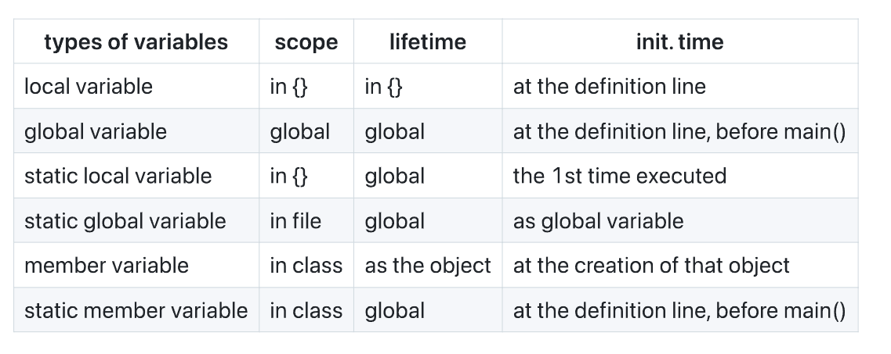

## Access Control

类的成员根据可见性和访问权限可以被分为`public`，`private`，`protected`三种类型：

- `public`意味着其后声明的成员（变量或函数）对所有人都是可以访问的（类外的任何代码都可以直接访问这些成员）

- `private`意味着其后声明的成员只能在**该类型**的成员函数内部访问（也就是说，成员对类的外部是完全不可见的）

!!! note "Tip"

    需要注意的是，同一个类的不同对象实例是可以访问彼此的`private`成员的，这是因为**访问控制是基于类级别而不是对象级别的**

### Friend（友元）

友元是一种明确授予访问权限的方式，其**允许不是类成员的函数访问类的私有成员**。我们可以将全局函数声明为友元（**友元函数在声明的时候需要加`friend`前缀，但是在定义的时候并不需要加`friend`前缀**），也可以将另一个类的成员函数声明为友元，甚至可以将整个类声明为友元，下面我们举一些实际的例子：

```c++
#include <iostream>
using namespace std;

class Box {
private:
    double width;
    double height;
    
    // 友元函数声明
    friend double calculateArea(const Box& b);
    
public:
    Box(double w, double h) : width(w), height(h) {}
};

// 友元函数定义 - 可以访问Box的私有成员
double calculateArea(const Box& b) {
    return b.width * b.height; // 直接访问私有成员
}
```

!!! warning "注意"

    友元有以下几点注意事项：

    1. **友元函数不是类的成员函数**，因此不能通过类的对象调用，比如`obj.showSecret()`，而是直接作为普通函数进行调用，比如`showSecret(obj)`
    1. 单向关系：**友元关系不具有传递性和对称性**，A是B的友元不意味着B是A的友元（因为**友元是授权访问**的）
    2. 访问权限：友元获得了对私有和保护成员的完全访问权，我们无法限制只访问特定的成员
    3. 不可继承：**友元关系不能被继承**，派生类不能自动获得基类的友元
    4. 声明位置：友元声明可以放在类定义的任何区域（包括`public`,`private`,`protected`），效果是一样的

### Class和Struct的不同

class默认成员访问权限是`private`，struct默认成员访问权限是`public`

 

## Object的存储类型和作用域、生命周期

按照**作用域和生命周期**分类可以分成**局部对象**和**全局对象**，按照存储类型分类可以分成**自动对象**和**静态对象**

**自动对象（默认的局部对象）**

自动对象在每次进入作用域时创建，离开时销毁

**静态对象**

只初始化一次，在程序运行期间一直存在

**Local objects（局部对象）**

局部对象定义在方法内部，作用域局限于他们所属的方法，生命周期仅限于函数调用期间，构造函数在进入定义它们的代码块时调用，析构函数在离开该代码块时调用。局部对象默认是自动存储的，但可以用`static`关键字声明为静态存储

**Global objects（全局对象）**

全局对象是定义在任何函数之外的对象，**构造函数在`main()`函数执行前就调用**，析构函数在`main()`函数结束后或调用`exit()`时调用，**同一文件**中的构造顺序由其出现顺序决定（不同文件的构造顺序是不确定的），全局对象总是静态存储的


这样就会产生一个比较棘手的问题——**Static Initialization Dependency（静态初始化依赖）**，我们知道，同一个文件中的静态对象的构造顺序是已知的（按照它们在文件中出现的顺序），但是不同文件之间的静态对象构造顺序是未指定的、不确定的，所以当不同文件中的非局部静态对象之间存在依赖关系时就会导致问题。

!!! note "Tip"

    非局部静态对象是指：

    - 定义在全局作用域或命名空间作用域的对象
    - 在类中声明为`static`的成员变量
    - 在文件作用域定义为`static`的对象

而这种“静态初始化依赖”的问题有两种解决方案：

- 直接避免使用有依赖关系的非局部静态对象
- 将所有静态对象定义放在同一个文件中，并按正确的依赖顺序排序

## Static

static这个关键字在C语言中是有两种含义的：

1. 静态存储：也即在固定的地址分配一次，会记住其值
2. Restricted access：内部链接、访问受限

但是Restricted access在C++中已经基本废弃了，C++中的static主要是静态存储的含义

### 函数中的static

用static来声明一个变量（静态局部变量），这意味着该变量的值将被整个程序一直记住，不会丢失，并且初始化操作只会进行一次。静态局部变量虽然生命周期是全局的，但是其作用域仍然还是局限于定义它的函数内部

### 静态对象

**静态对象**是指在函数内部使用`static`关键字声明的对象，例如

```c++
void f(){
    static X my_x(10,20);
}
```

静态对象在程序运行期间只会被创建一次，并且在整个程序的生命周期内保持其状态

下面我们明确一下**静态对象构造和析构的时机**：

- **构造：** 静态对象的构造函数在定义点第一次被执行时调用，并且只会调用一次（后续的函数调用不会重新构造它）
- **析构：** 静态对象的析构函数在程序退出时（比如`main()`结束或者调用`exit()`）时被调用，且编译器会保证静态对象的析构顺序遵循**LIFO(后进先出)**的规则，也即**后构造的对象先被析构**


**条件构造**：在某些情况下，可能需要满足条件才会构造，比如下面的例子

```c++
void f(int x) {
    if (x > 10) {
        static X my_X(x, x * 21);
        // ...
    }
}
```

静态对象`my_X`仅在函数`f()`被调用且参数的值`x`大于10的时候才会进行构造，一旦构造，`my_X`的值将会被保留，之后即使再次调用`f()`，也不会再次构造（静态对象的特性）；而如果条件从未被满足，那就不会被构造，自然也不会有析构。

### 静态成员变量和静态成员函数

这一部分主要是在C++中将`static`关键字应用于类成员（包括静态成员变量和静态成员函数）的情况，这类静态成员遵循类的访问控制规则（比如`public`、`private`、`protected`），同时也具有持久性，独立于对象实例，生命周期为整个程序。

下面我们来详细介绍一下各类变量的作用域和生存期，以及何时被初始化：



如上图，需要说明一下的是，上面的`member variable`指的是`private`类型的成员变量。静态成员变量(`static member variable`)是我们下面要讲的东西，这里暂时不展开，本地变量、全局变量、静态局部变量我们也都能理解，唯一要区分一下的可能是**全局变量（global variable）**与**静态全局变量(static global variable)**：

**全局变量**是定义在函数外部（通常在文件顶部或者命名空间作用域）中的变量，默认其具有**外部链接(extrenal linkage)**，意味着其可以被其他文件通过`extern`声明而访问；

**静态全局变量**同样是定义在函数外部的，但是其使用`static`关键字进行修饰，静态全局变量具有**内部链接(internal linkage)**，意味着其仅在定义它的文件中可见，其他文件无法访问。

下面我们再辨析一下两者的作用域、生存期、初始化时间：

- **作用域**：全局变量的作用域是全局（global），在整个程序中可见，可以在定义它的文件中直接使用，其他文件也可以通过`extern`声明来访问；静态全局变量的作用域是文件作用域（in file），仅在定义它的文件中可见，其他文件无法通过`extern`或其他方式访问它
- **生存期：** 全局变量的生存期是全局（global），从程序开始运行道程序结束，初始化在程序启动（`main()`函数之前）完成，销毁在程序结束；静态全局变量的生存期和全局变量完全相同
- **初始化时间：** 全局变量的初始化在程序启动时，定义处（`main()`函数之前），静态全局变量的初始化时间与全局变量相同
- **链接属性：** 全局变量是外部链接，如果多个文件中定义了同名的全局变量（未使用`extern`），就会导致连接错误；而静态全局变量是内部链接，仅限于定义它的文件，其他文件无法看到或访问，即使是多个文件中定义了同名的静态全局变量，它们之间也是独立的，不会引发冲突

#### 静态成员变量

静态成员变量有以下几个特性：

- 对类的所有成员函数（包括静态和非静态）都是全局可用的
- 类的所有对象实例共享同一份静态成员变量（静态成员变量属于类本身，而不是某个具体的对象实例）
- 只需要初始化一次，在文件作用域中完成，通常在`.cpp`文件中
- 需要在`.cpp`文件中为静态成员变量提供存储空间并初始化，且初始化时不使用`static`修饰符

!!! warning "注意"

    静态成员变量必须在类外定义和初始化，否则会导致链接错误。

    而且很重要的是，我们需要区分一下定义和声明，尤其是静态成员变量的定义和声明，这是两个不同的步骤，我们必须分开完成。

    **声明：**声明是告诉编译器静态成员变量的存在，包括它的名称、类型和所属的类，但是并不为其分配实际的内存，声明的位置通常在类定义中（一般在`.h`文件中）

    **定义：**定义是为静态成员变量分配实际的内存空间，（通常）并指定初始值，定义通常在源文件中、类定义外，需要注意的是，**定义的时候不使用`static`关键字，因为`static`已经在声明中指定了存储类**。定义必须有且仅有一次，否则会导致**重复定义错误**。

    如果只声明而未定义，链接器会报错，因为没有为变量分配实际的存储空间

    下面我们给出一个完整的例子：

    ```c++
    // X.h
    #ifndef X_H
    #define X_H
    class X {
    public:
        static int count; // 声明静态成员变量
        X() { count++; }
        static void printCount();
    };
    #endif
    
    // X.cpp
    #include <iostream>
    #include "X.h"
    int X::count = 0; // 定义并初始化静态成员变量
    void X::printCount() {
        std::cout << "Count: " << count << std::endl;
    }
    
    // main.cpp
    #include "X.h"
    int main() {
        X::printCount(); // 输出: Count: 0
        X obj1;          // count 增到 1
        X::printCount(); // 输出: Count: 1
        X obj2;          // count 增到 2
        X::printCount(); // 输出: Count: 2
        return 0;
    }
    ```

#### 静态成员函数

静态成员函数是类的成员函数，使用`static`关键字声明，属于类本身，不是类的任何对象实例。并且和`private`成员可以被同一个类的不同对象实例访问一样，静态成员函数也是类级别的功能，不依赖于具体的实例。

和静态成员变量一样，也需要区分声明和定义。静态成员函数在类中声明为`static`，例如：

```c++
class X{
public:
    static int count;
    static void printCount(); // 静态成员函数
};
```

在实现中（通常在`.cpp`文件中）不需要`static`关键字，示例如下：

```c++
void X::printCount(){
    std::cout << "Count: " << count << std::endl;
}
```

静态成员函数有几个很重要的特性：

- **只能访问静态成员**：只能访问类的静态成员变量或其他全局变量，而**无法访问非静态成员变量或非静态成员函数**（因为它们依赖于对象实例，而静态成员函数是类级别的功能，并不依赖于具体的实例）
- **无`this`指针**：静态成员不与任何对象绑定，因此也没有隐式的`this`指针
- 不可动态覆盖：静态成员函数不能是虚函数（`virtual`），虚函数后面在多态部分会讲到，因为它们不依赖于对象实例，无法通过多态机制动态绑定。
- 静态成员函数默认具有**外部链接(external linkage)**，可以在不同的编译单元使用，注意和静态全局变量区分。

访问静态成员函数的方法有以下几种：

- 通过类名（推荐），比如

  ```c++
  X::printCount();
  ```

- 通过对象（合法但不推荐）：

  ```c++
  X obj;
  obj.printCount();
  ```

- 通过对象指针（合法但不推荐）：

  ```c++
  X *ptr = new X();
  ptf->printCount();
  ```

上述三种方法都是可以的，但是我们往往更倾向于使用类名调用的方式，因为它更清晰地表明了静态成员函数是类级别的功能。因为静态成员函数是类级别的操作，所以**即使我们没有创建任何`X`类的对象，`X::printCount()`仍然可以调用**，因为静态成员函数在程序启动时已经可用。

!!! note "Tip"

    辨析一下内存的几个主要区域（栈、堆、全局数据区）：

    1. **栈（Stack）**

    栈用于存储**局部变量**和**函数调用信息（如函数参数、返回地址）**，其具有以下特点：

    - 自动管理：变量在作用域开始时分配，离开作用域时自动销毁
    - 分配快速：栈是连续的内存块，分配和释放由编译器管理
    - 大小有限：栈的空间通常比较小（几MB），过多的局部变量或深层递归可能导致栈溢出

    这些变量的生命周期是与其作用域绑定的，通常比较短（函数调用期间）

    2. **堆（Heap）**

    堆用于存储**动态分配**的内存，通过`new`（C++）或`malloc`（C）分配，通过`delete`或`free`释放，其具有以下特点：

    - 手动管理：程序员负责分配和释放内存，容易引发内存泄漏或悬空指针（即指向已经被释放或删除的对象的指针）
    - 分配较慢：堆是动态分配，涉及内存管理器的开销
    - 大小较大：堆空间通常受系统内存的限制，远大于栈

    这些变量的生命周期是从分配到释放的，可以跨函数作用域

    3. 全局数据区（静态数据区）

    全局数据区/静态数据区用于存储**全局变量、静态变量（包括静态局部变量、静态全局变量、静态成员变量）和常量（如字符串字面量）**，其可分为**已初始化数据段（存储显式初始化的全局/静态变量）**和**未初始化数据段（存储未显式初始化的全局/静态变量，自动初始化为0）**，其具有以下特点：

    - 自动管理：由程序加载时分配，程序结束时释放
    - 生命周期为整个程序运行期间（从启动到结束）
    - 分配在程序启动时完成，初始化在`main()`之前

## 引用（Reference）

### 引用的声明

引用是C++中操作对象的别名，比如

```c++
int x=3;
int &y = x;
```

在上述例子中`y`就是`x`的一个引用，后续我们对`y`的改动其实就是在对`x`做改动，这和指针是一样的，我们需要区别一下。

引用有以下几点规则：

- 引用必须初始化（不能为`null`），且绑定之后就不可再改变了（与指针不同，指针是可以改变指向的对象的）

- 引用必须要指向有地址的对象（也就是我们常说的左值），**引用只能绑定左值！！！**，所以引用在初始化的时候不能绑定常量值。比如下面的这个例子就会出错

  ```c++
  void f(int &);
  f(i*3); // 上面这个例子就会报错，因为i*3是一个右值
  ```

  在上面这个例子中，引用作为函数的参数出现，调用函数`f()`的时候传入的是一个右值，右值是没有地址的，所以会出现错误

下面我们对比一下**指针和引用**的不同：指针可以为`null`，可以重新指向其他地址，而引用不能为空，是现有变量的别名，且这种绑定是固定的（不能再改变）。

引用有一些限制：

- 没有引用数组(No arrays of references)
- 没有引用到引用(No references to references)
- 没有指针到引用(No pointers to references)
- 可以有引用到指针(Reference to pointer is ok)

!!! note "Tip"

    上面我们提到左值和右值(Left Value & Right Value)，这可能是一个陌生的概念，下面我们介绍一下**左值和右值：**

    - 左值是可以出现在赋值左侧的变量或引用（通常具有实际的地址）
    - 右值是临时值，如字面量或表达式

    引用作为函数的参数时只能接受左值

    值得一提的是，在C++11的标准中，引用也可以指向右值，称为**右值引用：**

    ```c++
    int &&rx=x*2
    ```

    右值引用的声明形式为`T&&`，用于绑定临时对象，延长其生命周期（因为右值往往是用于计算的临时值，在计算完成后就会消失，而右值引用则能将其暂时保留下来）

在实际的函数参数传递过程中，我们往往会使用以下形式：

```c++
void fun(const int & clref){
    cout <<  "l-value const refercence";
}
```

这样的函数可以接受右值作为参数，因为我们使用`const T&`作为函数参数（有时候我们还会使用`auto`来自动推断类型），对于右值`const T&`可以延长其生命周期，而`const`确保函数不会修改传入的参数，适用于只需要读取参数值而不需要修改的场景。

## Constant

### Const

Const关键字用于声明常量变量，使用`const`声明的变量值不可修改，**必须初始化**，例如：

```c++
const int x = 123;
x = 27; // 修改了常量变量的值，非法
```

但是需要注意的是，在C++中，`const`变量默认是具有内部链接的，也就是说，它们只在定义它们的文件（翻译单元）中可见。编译器往往会将`const`变量的值存储在符号表中，而不是分配实际的内存空间，如果我们要强制为常量分配存储空间的话，可以使用`extern`关键字，比如

```c++
// file1.cpp
extern const int x = 123; // 分配存储空间，外部链接
// file2.cpp
extern const int x; // 其他文件通过此声明可以访问
```

可以强制为常量分配内存，并且使其具有外部链接，允许其他文件访问该常量。

### 编译时的常量

编译时常量是在编译时值已经确定的常量，典型示例为`const int bufsize = 1024`，编译时常量必须在定义时就完成初始化，否则编译会报错（不然怎么知道这个常量的值是多少，毕竟后续也不能再做修改）。不过有一个例外就是，在使用`extern`声明的时候，初始化可以在其他文件中提供，比如

```c++
// header.h
extern const int bufsize; // 声明
// source.cpp
const int bufsize = 1024;// 定义并初始化
```

### 运行时常量

运行时常量的值在运行时才能确定，比如通过用户的输入或者计算得到，例如

```c++
const int size = x;
```

### 指针和常量

这部分有一点复杂，主要是指针与常量组合起来可能有不同顺序，造成的结果也不同，比如

```c++
char * const q = "abc";
const char* p = "ABCD";
```

这两个定义中`const`的位置不一样，第一个`char* const q`是说`q`是一个**常量指针**（指向字符的指针是一个常量），也就是说，指针`q`所指向的地址是不可更改的，一旦`q`被初始化指向某个地址之后，不能再让他指向其他地址，但指针所指向的内容本身是可以修改的；

而`const char* p = "ABCD"`则是说指针`p`是一个指向**常量字符**的指针，也即指针`p`可以指向其他地址，但是我们不能通过`p`修改它所指向的内容（注意只是说我们不能通过这个指针去修改，但是内容本身可以修改）

下面我们看一个总结指针和常量关系的表格：

- 普通指针（`int * ip`）可以指向非`const`变量，但不能指向`const`变量，因为这可能导致通过指针修改常量
- 指向常量的指针（`const int * cip`）可以指向非`const`变量，也可以指向`const`变量，因为它保证不修改值

|                  | `int i;`           | `const int ci = 3` |
| ---------------- | ------------------ | ------------------ |
| `int *ip;`       | `ip=&i`是可以的    | `ip=&ci`是不可以的 |
| `const int *cip` | `cip = &i`是可以的 | `cip=&ci`是可以的  |

且`*ip=54`合法，而`*cip=54`是不合理的，因为我们不能通过指向常量的指针去修改其指向的内容

### 字符串字面量

在C语言中我们学过，字符串字面量是常量，且其实本质上是`const char`数组，存储在只读内存区域，在C语言中我们也学过这样的写法

```c++
char *s = "Hello World!";
```

这是一个历史遗留写法，编译器允许但是我们并不推荐，因为`s`是一个普通指针，但是它指向了字符串字面量这种常量，如果我们尝试修改将会导致未定义行为，我们推荐的做法是使用指向常量的指针，也即

```c++
const char *s = "Hello World!";
```

上述定义方式明确表示指针`s`指向常量。如果我们想要修改字符串的话，应当使用数组，如：

```c++
char s[] = "Hello World!";
s[0] = 'h' // 这是合法的
```

### 常量转换

我们可以将非`const`赋值给常量变量，这时候非`const`值会做一个隐式转换变为`const`值。

但是我们不能将`const`值直接赋给非`const`变量或指针，除非我们使用`const_cast`显式去除`const`属性（但是尽量避免使用`const_cast`，因为它有可能引入难以调试的错误）

### 常量与地址传递

我们知道，按值传递整个对象将可能导致高昂的拷贝成本（比如`std::vector`），因此我们通常更推荐使用指针或引用，但是这非常有可能导致我们修改了原始值，所以这个时候我们应当尽量使用`const`修饰，比如`const int *x`，以防止函数修改原始值，这提高了代码的安全性，明确函数的只读意图

## Const object（常量对象）

常量对象是指使用`const`关键字声明的对象，其内容不可修改，比如：

```c++
const Currency the_raise(42,38);
```

表示创建了一个常量对象`the_raise`，其内部数据不能被更改。

而为了保护常量对象不被修改，我们需要将成员函数声明为`const`来确保这些函数不会更改对象的状态，且常量对象也只能调用被标记为`const`的成员函数，而非常量对象则可以调用任何成员函数（包括`const`和非`const`函数），例如：

```c++
// 非常量对象
Date when(1, 1, 2001); // 非const对象
int day = when.get_day(); // 合法
when.set_day(13); // 合法

// 常量对象
const Date birthday(12, 25, 1994); // const对象
int day = birthday.get_day(); // 合法
birthday.set_day(14); // 错误：不能调用非const函数
```

### 常量成员函数

常量成员函数在声明和定义的时候都需要在函数签名后加上`const`关键字，因为如果声明和定义不统一的话，可能会存在函数重载导致认定为不同函数的情况。常量函数不能修改其所属对象的数据，且不能调用非`const`成员函数（因为非`const`成员函数可能会修改对象的数据），例如：

```c++
int Date::set_day(int d) {
    day = d; // 合法，非const函数可以修改数据
}
int Date::get_day() const {
    day++; // 错误：不能修改数据成员
    set_day(12); // 错误：不能调用非const成员函数
    return day; // 合法
}
```

!!! note "Tip"

    函数末尾是否有const是会影响函数重载的。事实上，C++的函数重载是基于函数签名进行区分的，函数签名包括**函数名、参数列表以及`const`修饰符**

在写代码的时候，我们通常的习惯是，将所有不修改对象数据的成员函数都声明为`const`，以确保它们对常量对象是安全的。

!!! note "Tip"

    下面我们捋一捋常量对象、常量成员变量、常量成员函数之间的关系：

    **常量对象**意味着对象的所有成员变量都不能被修改，无论是通过成员函数还是直接访问（此时成员变量不需要再显式地用`const`进行声明）。

    **常量成员变量**则是使用`const`关键字声明的成员变量，表示该成员变量在对象构造后不可以被修改。需要注意的是，**常量成员变量必须在构造函数的初始化列表中进行初始化**，且在对象生命周期内不可以被更改。

    **常量成员函数**则是在类的成员函数声明之后加上`const`关键字，表示该函数不会修改对象的状态。其与常量对象之间的关系就是：常量对象只能调用常量成员函数，因为非常量成员函数可能试图改变成员变量的值。

### 类中的编译时常量

编译时常量（编译阶段就能完全确定其值的常量，C++编译器在处理这些常量时，可以将他们的值直接嵌入生成的代码中，或者用来决定某些代码结构的具体形式，比如数组大小）需要在编译时确定其值，我们可以看下面这个例子：

```c++
class HasArray {
    const int size; // const成员变量
    int array[size]; // 非法！
};
```

在上述这个例子中，编译器是需要根据数组的大小分配内存的，但是`size`并不是一个编译时常量，编译器不知道要为这个数组分配多少空间，其无法在生成类定义时确定`array[size]`的大小。

`const`成员变量的值通常在对象构造时通过构造函数的初始化列表确定，而不是编译时就固定了，比如下面这个例子：

```c++
class HasArray {
    const int size;
public:
    HasArray(int s) : size(s) {} // size在运行时初始化
    int array[size]; // 非法：size不是编译时常量
};
```

`const int size`是一个成员变量，它的值是每个对象实例特有的，并且在对象构造时通过初始化列表设置，它的值是**运行时常量**。

那么上述问题怎么解决呢，我们有以下几个处理方法：

1. **匿名枚举：**使用枚举(`enum`)来定义编译时常量，因为枚举值在编译时是固定的，参考下面这个例子：

   ```c++
   class HasArray {
       enum { size = 100 }; // 匿名枚举，size是编译时常量
       int array[size]; // 合法
   };
   ```

2. **静态常量(static const)：**使用`static const`成员变量来定义编译时常量，参考下面这个例子：

   ```c++
   class HasArray {
       static const int size = 100; // static const是编译时常量
       int array[size]; // 合法
   };
   ```

## Dynamically allocated memory（动态分配内存）

和C语言中的`malloc`、`free`组合对应的，C++中有`new`和`delete`两个运算符可以动态分配内存。

我们使用`new`运算符在程序运行时分配内存，返回指向分配的内存的地址的指针，例如

```c++
new int; // 分配一个int的内存
new stash; // 分配一个stash类型的对象
new int[10]; // 分配一个包含10个int的数组
```

`new`分配的内存位于堆上

我们使用`delete`释放`new`分配的内存，将内存归还给内存池，例如

```c++
delete p; // 释放单个对象的内存
delete[] p; // 释放数组的内存
```

### 动态数组

我们使用`new`分配动态数组，并**返回指向数组第一个元素的指针**，例如：

```c++
int *psome = new int[10];
```

动态数组在释放的时候应当使用`delete[]`，必须使用`[]`来指示释放的是整个数组，而不仅仅是第一个元素，如果误用`delete`而非`delete[]`释放数组，很可能会导致未定义行为或内存泄漏

下面我们举一些`new-delete`的例子：

```c++
int* p = new int; // 分配单个int
int* a = new int[10]; // 分配int数组
Student* q = new Student(); // 分配单个Student对象
Student* r = new Student[10]; // 分配Student数组
delete p; // 释放单个int
a++; // 指针移动，指向数组第二个元素
delete[] a; // 错误：释放的指针不是原始分配的地址
delete q; // 释放单个Student对象
delete r; // 错误：应该用delete[]释放数组
delete[] r; // 正确：释放Student数组
```

!!! warning "注意"

    在使用`new`和`delete`的时候有几点小tips：

    - 不要释放非`new`分配的内存。使用`delete`释放非`new`分配的内存（如栈上的地址）会导致未定义行为
    - 不要重复释放同一块内存。多次`delete`同一指针会导致未定义行为
    - 一定要匹配好`new`和`delete`的类型，如果使用`new[]`分配数组，必须使用`delete[]`释放；如果用`new`分配单个对象，必须使用`delete`释放
    - 对空指针使用`delete`是安全的，程序会直接忽略。
