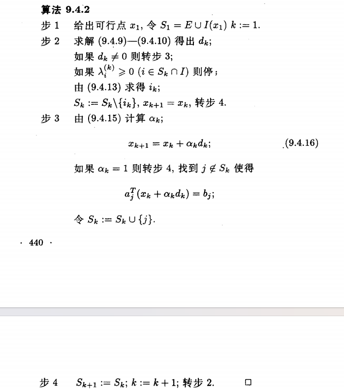
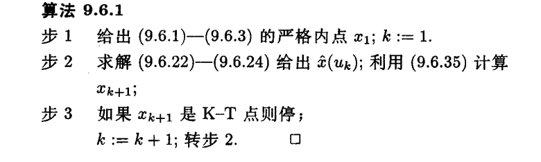

## 二次规划问题

二次规划是最简单的约束非线性规划问题，目标函数 $f(x)$ 是二次函数，约束函数 $c_i(x)(i=1,2,\cdots,m)$ 都是线性函数，问题形式可以写为

$$\begin{align}
\min_{x\in R^n} Q(x)=\frac{1}{2}x^THx+g^Tx\\
\text{s.t.}\ a_i^Tx=b_i,\ i=1,\cdots,m_e\\
a_i^Tx\geq b_i,\ i=m_e+1,\cdots,m
\end{align}$$

考虑我们前面所学的约束优化最优性条件（一阶必要条件和二阶必要条件），我们先计算 $\nabla Q(x)$ 和 $\nabla^2 Q(x)$，仍然使用矩阵微分，有

$$
d Q(x)=\frac{1}{2}(dx)^T Hx+\frac{1}{2}x^THdx+g^Tdx=(x^TH^T+g^T)dx
$$

则有 $\nabla Q(x)=(x^TH^T+g^T)^T=g+Hx$，$\nabla^2Q(x)=H$，$\nabla c_i(x)=a_i$

!!! note "Tip"

    这里我们约定矩阵 $H$ 是对称阵

所以根据约束优化最优性条件可以知道，设 $x^*$ 是上述二次规划问题的局部极小点，则必然存在乘子 $\lambda_i^*(i=1,\cdots,m)$ 满足 KKT 条件

$$\begin{align}
\text{稳定性条件}\qquad g+Hx^*=\sum_{i=1}^m\lambda_i^*a_i\\
\text{互补松弛条件}\qquad \lambda^*[a_i^Tx^*-b_i]=0, \ i=m_e+1,\cdots,m\\
\text{对偶可行性条件}\qquad \lambda_i^*\geq 0, \ i=m_e+1,\cdots,m
\end{align}$$

并且对一切满足

$$
d^Ta_i=0, i\in E\cup I(x^*)
$$

的 $d\in R^n$ 都有

$$
d^THd\geq 0
$$

其中 $E=\{1,\cdots,m_e\}$ 以及

$$
I(x^*)=\{i|a_i^Tx^*=b_i,\ \ i=m_e+1,\cdots,m\}
$$

!!! note "Tip"

    这是一个**必要条件**

并且我们还有如下**充分条件**

设 $x^*$ 是一个 KKT 点，$\lambda^*$ 是相应的 Lagrange 乘子，如果对一切满足

$$\begin{align}
d^Ta_i=0,i\in E\\
d^Ta_i\geq 0,i\in I(x^*)\\
d^Ta_i=0,i\in I(x^*)\text{且} \lambda^*>0
\end{align}$$

的非零向量 $d$ 都有

$$
d^THd>0
$$

则 $x^*$ 是二次规划问题的局部严格极小值点

下面我们给出一个**充要条件**

设 $x^*$ 是二次规划问题的可行点，则 $x^*$ 是一个局部极小点当且仅当存在乘子 $\lambda^*=(\lambda_1^*,\lambda_2^*,\cdots,\lambda_m^*)$ 使得

$$\begin{align}
\text{稳定性条件}\qquad g+Hx^*=\sum_{i=1}^m\lambda_i^*a_i\\
\text{互补松弛条件}\qquad \lambda^*[a_i^Tx^*-b_i]=0, \ i=m_e+1,\cdots,m\\
\text{对偶可行性条件}\qquad \lambda_i^*\geq 0, \ i=m_e+1,\cdots,m
\end{align}$$

成立，并且对一切满足

$$\begin{align}
d^Ta_i=0,i\in E\\
d^Ta_i\geq 0,i\in I(x^*)\\
d^Ta_i=0,i\in I(x^*)\text{且} \lambda^*>0
\end{align}$$

的向量 $d$ 都有 $d^THd\geq 0$

!!! note "Tip"

    证明可以参考袁亚湘老师的《最优化理论与方法》一书

如果 $H$ 是（正定）半正定矩阵，则目标函数 $Q(x)$ 是（严格）凸函数，这时二次规划问题被称为（严格）凸的二次规划问题。对于二次规划，可行域只要不为空就必定是凸集，所以当目标函数是凸函数时，任何 KKT 点必为二次规划的全局极小值点

!!! note "Tip"

    KKT 点是全局极小值点需要满足两个条件：

    - 可行域是凸集
    - 目标函数是凸函数

也即我们有如下定理：

设 $H$ 为半正定矩阵，则 $x^*$ 是二次规划问题的全局极小点当且仅当它是一个局部极小点，也即当且仅当它是一个 KKT 点

所以当 $H$ 半正定时，求解二次规划问题等价于求解 $(x,\lambda)\in R^{n+m}$ 使得

$$\begin{align}
\text{稳定性条件}\ \ g+Hx=A\lambda\\
\text{原始约束条件}\ \ a_i^Tx=b_i,i\in I\\
\text{原始约束条件}\ \ a_i^Tx\geq b_i, i\in E\\
\text{互补松弛条件}\ \ \lambda_i[a_i^Tx-b_i]=0,i\in I\\
\text{对偶可行性条件}\ \ \lambda_i\geq 0,i\in I
\end{align}$$

成立，其中 $I=\{m_e+1,\cdots,m\},\lambda =\{\lambda_1,\cdots,\lambda_m\}$ 以及

$$
A=[a_1,\cdots,a_m]
$$

!!! note "Tip"

    上述定理是说，当 $H$ 是半正定矩阵的时候，我们处理的二次规划问题就是一个凸二次规划问题，二阶必要性天然满足，我们不需要去验证，只用求解 KKT 条件就能得到局部极小值点，从而是一个全局极小值点

## 等式约束的二次规划问题

等式约束的二次规划问题可以写成如下形式
$$
\min_{x\in R^n}Q(x)=g^Tx+\frac{1}{2}x^THx\\
\text{s.t.}\ \  A^Tx=b
$$
其中 $g\in R^n,b\in R^m,A\in R^{n\times m}$ 且 $H$ 是对称的，不失一般性，我们假设 $r(A)=m$。

### 消去法

首先我们介绍变量消去法，假设我们已经找到了变量 $x$ 的一个分解 $x=[x_B,x_N]^T$，其中 $x_B\in R^m,x_N\in R^{n-m}$，且对应的分解 $A=\begin{pmatrix}A_B\\ A_N  \end{pmatrix}$，使得 $A_B$ 可逆，则利用这一分解，我们可以将约束 $A^Tx=b$ 写成
$$
A_B^Tx_B+A_N^Tx_N=b
$$
则有 $x_B=(A_B^{-1})^T(b-A_N^Tx_N)$，并且我们将 $g$ 和 $H$ 作与 $x=[x_B,x_N]^T$ 相应的分解，即

$$
\begin{align}
&g=\begin{pmatrix}
g_B\\
g_N
\end{pmatrix}\\
&H=\begin{pmatrix}
H_{BB} & H_{BN}\\
H_{NB} & H_{NN}
\end{pmatrix}
\end{align}
$$

将 $x_B$ 代入 $Q(x)$ 就得到了等式约束二次规划问题的一个等价形式

$$
\min_{X_N\in R^{n-m}} \hat{g_N}^Tx_N+\frac{1}{2}x_N^T\hat{H_N}x_N
$$

其中

$$\begin{align}
\hat{g_N}=g_N-A_NA_B^{-1}g_B+[H_{NB}-A_NA_B^{-1}H_{BB}](A_B^{-1})^Tb\\
\hat{H_N}=H_{NN}-H_{NB}(A_B^{-1})^TA_N^T-A_NA_B^{-1}H_{BN}+A_NA_B^{-1}H_{BB}(A_B^{-1})^TA_N^T
\end{align}$$

此时已经变成了一个关于 $x_N$ 的无约束优化问题，如果 $\hat{H_N}$ 正定，这个二次函数就有最小值，计算二次函数的梯度可以得到

$$
\nabla =\hat{g_N}+\hat{H_N}x_N
$$

可得 $x_N=-\hat{H_N^{-1}}\hat{g_N}$，故上述问题的解由 $x_{N}^*=-\hat{H_N^{-1}}\hat{g_N}$ 唯一地给出，此时等式约束的二次优化问题的解为

$$
x^*=\begin{pmatrix}
x_B^*\\
x_N^*
\end{pmatrix}=
\begin{pmatrix}
-(A_B^{-1})^Tb\\
0
\end{pmatrix}+
\begin{pmatrix}
(A_B^{-1})^TA_N\\
-I
\end{pmatrix}(\hat{H_N})^{-1}\hat{g_N}
$$

我们设在解 $x^*$ 处的 Lagrange 乘子为 $\lambda^*$，则有

$$
g+Hx^*=A\lambda^*
$$

从而有

$$
\lambda^*=A_B^{-1}[g_B+H_{BB}x_B^*+H_{BN}x_N^*]
$$

消去法的思想简单明了，但其有一个不足之处，$A_B$ 可能接近奇异阵，从而导致利用上面我们给出的 $x^*$ 的公式直接求解 $x^*$ 可能导致数值不稳定。

消去法的一个直接推广是广义消去法

### 广义消去法

我们设 $y_1,\cdots,y_m$ 是域空间 $Range(A)$ 中的一组线性无关的向量，$z_1,\cdots,z_{n-m}$ 是零空间 $Null(A^T)$ 中的一组线性无关的向量

!!! note "Tip"

    这里域空间 $Range(A)$ 是指矩阵 $A$ 的所有列向量张成的子空间，其定义是
    $$
    Range(A)=\lbrace{y|y=A\omega,\forall \omega \in R^m\rbrace}
    $$
    零空间 $Null(A^T)$ 则是让线性变换 $A^T$ 输出为 $0$ 的所有向量组成的集合，也即
    $$
    Null(A^T)=\lbrace{z\in R^n|A^Tz=0\rbrace}
    $$

并记
$$
Y=[y_1,\cdots,y_m]\\
Z=[z_1,\cdots,z_{n-m}]
$$
则有矩阵 $A^TY$ 非奇异，$A^TZ=0$，令 $x=Y\overline{x}+Z\hat{x}$，则有 $b=A^Tx=A^TY\overline{x}$，所以等式约束二次规划问题的可行点可以表示为
$$
x=Y(A^TY)^{-1}b+Z\hat{x}
$$
其中 $\hat{x}\in R^{n-m}$ 是自由变量，则原有等式约束二次规划问题可以化为
$$
\min_{\hat{x}\in R^{n-m}}(g+HY(A^TY)^{-1}b)^TZ\hat{x}+\frac{1}{2}\hat{x}^TZ^THZ\hat{x}
$$
这又是一个关于 $\hat{x}$ 的二次函数，假定 $Z^THZ$ 是正定阵，则可以从上式中得到解

$$
\hat{x}^*=-(Z^THZ)^{-1}Z^T(g+HY(A^TY)^{-1}b)
$$

从而我们可以得到原等式约束的二次规划问题的解为

$$
x^*=Y(A^TY)^{-1}b-Z(Z^THZ)^{-1}Z^T(g+HY(A^TY)^{-1}b)\\=(I-Z(Z^THZ)^{-1}Z^TH)Y(A^TY)^{-1}b-Z(Z^THZ)^{-1}Z^Tg
$$

于是相应的 Lagrange 乘子可以表示为

$$
\lambda^*=(A^TY)^{-T}Y^T[g+Hx^*]=(A^TY)^{-T}Y^T[Pg+HP^TY(A^TY)^{-1}b]
$$

其中 $P=I-HZ(Z^THZ)^{-1}Z^T$ 是一个从 $R^n$ 到 $Range(A)$ 的仿射变换。如果 $Y$ 适当选取，我们可以使得 $A^TY=i$，此时有

$$
x^*=P^TYb-Z(Z^THZ)^{-1}Z^Tg\\
\lambda^*=Y^T[Pg+HP^TYb]
$$

由 $x=Y(A^TY)^{-1}b+Z\hat{x}$ 我们可以知道，等式约束的二次规划问题是一个与 $Null(A^T)$ 平行的子空间，而广义消去法正是利用 $Z$ 中的列向量 $Z_i(i=1,2,\cdots,n-m,)$ 作为基向量，将二次函数 $Q(x)$ 在子空间求极小转化为在子空间上的一个无约束二次函数极小问题，所以我们将矩阵 $Z^THZ$ 称为既约 Hessian 阵，称向量 $Z^T(g+HY(A^TY)^{-1}b)$ 称为既约梯度。

而消去法则是广义消去法在

$$
\begin{aligned}
Y=\begin{bmatrix}
A_B^{-1}\\0
\end{bmatrix},\\
Z=\begin{bmatrix}
-A_B^TA_N^T\\
I
\end{bmatrix}
\end{aligned}
$$

时的特殊情形

## 积极集法

### 理论基础

积极集法是通过求解有限个等式约束的二次规划问题来解决一般约束下的二次规划问题。直观上来说，不积极的不等式约束在解的附近起不到约束作用，我们可以去掉不考虑；而积极的不等式约束，由于其在解处等于 $0$，我们可以用等式约束来替代。

积极集法的理论基础就是下面的引理：

**引理** 设 $x^*$ 是二次规划问题的局部极小点，则 $x^*$ 也必然是问题

$$
\min_{x\in R^n} g^Tx+\frac{1}{2}x^THx\\
\text{s.t.} \ \ a_i^Tx=b_i,\ \ i\in E\cup I(x^*)
$$

的局部极小点；反之，如果 $x^*$ 是二次规划问题的可行点，并且是上述问题的 KKT 点，且相应的 Lagrange 乘子 $\lambda^*$ 满足

$$
\lambda_i^*\geq 0,i\in I(x^*)
$$

则 $x^*$ 也是二次规划问题的 KKT 点

### 迭代过程

需要说明的是，积极集法是一个可行点方法，也即每个迭代点都要求是可行点。积极集法每次迭代求解一个等式约束的二次规划问题，如果等式二次规划问题的解是原二次规划问题的可行点，就判断 Lagrange 乘子 $\lambda_i^*\geq 0, i\in I(X^*)$ 是否满足，如果满足就停止计算；否则可以去掉一个约束重新求解约束问题。如果等式约束二次规划问题的解不是原问题的可行点时，就需要增加约束然后重新求解等式约束问题。

!!! note "Tip"

    这里我们可能会产生疑问，我们已经考虑了所有的积极约束，而不积极的不等式约束实际上没有起约束效果，而我们增加约束显然增加的是不等式约束，似乎矛盾了？但实际上，这是在迭代过程中进行的，随着我们的 $x$ 发生变化，原有的不积极的约束可能变为积极的，原有的积极约束可能变为不积极的。

下面我们详细介绍一下积极集法的算法流程

在第 $k$ 次迭代的时候，我们有可行点 $x_k$ 以及一个下标集合 $S_k\subset E\cup I$，其中 $E=\{1,\cdots,m_e\},I=\{m_e+1,\cdots,m\}$，设 $d_k$ 是问题
$$
\min_{d\in R^n} g^T(x_k+d)+\frac{1}{2}(x_k+d)^TH(x_k+d)\\
\text{s.t.} a_i^Td=0,\ \ i\in S_k
$$
的 KKT 点，$\lambda_i^{(k)}(i\in S_k)$ 是相应的 Lagrange 乘子，如果 $d_k=0$，则可以知道 $x_k$ 是问题
$$
\min_{x\in R^n} g^Tx+\frac{1}{2}x^THx\\
\text{s.t.} \ \ a_i^Tx=b_i,\ \ i\in S_k
$$
的 KKT 点，此时如果 $\lambda_i^{(k)}\geq 0$ 对一切 $i\in S_k\cap I$ 都成立则有 $x_k$ 也是原二次规划问题的 KKT 点，否则我们可以令 $i_k\in S_k\cap I$ 使得
$$
\lambda_{i_k}^{(k)}=\min_{i\in S_k\cap I}\lambda_i^{(k)}<0
$$
且令 $S_k:= S_k\backslash\{i_k\}$，然后重新求解
$$
\min_{d\in R^n} g^T(x_k+d)+\frac{1}{2}(x_k+d)^TH(x_k+d)\\
\text{s.t.} a_i^Td=0,\ \ i\in S_k
$$
如果 $d_k\neq 0$，此时 $x_k+d_k$ 有可能不是原二次规划问题的可行点，我们需要在 $x_k$ 和 $x_k+d_k$ 之间的线段上选取最靠近 $x_k+d_k$ 的可行点作为下次迭代的迭代点 $x_{k+1}$，也即
$$
x_{k+1}=x_k+\alpha_kd_k
$$
其中
$$
\alpha_k=\min\{1,\min_{i\notin S_k,a_i^Td_k<0}\frac{b_i-a_ix_k}{a_i^Td_k}\}
$$

!!! note "Tip"

    为了保证移动后的新点 $x_{k+1}$ 仍然在可行域中（也即不违反仍然不在 $S_k$ 中的不等式约束），则对于任意一个不在当前积极集 $S_k$ 中的约束 $i$，我们必须保证移动后的点仍然满足约束条件
    $$
    a_i^T(x_k+\alpha d_k)\geq b_i
    $$
    展开上式可以得到
    $$
    a_i^Tx_k+\alpha a_i^Td_k\geq b_i
    $$
    则有 $\alpha a_i^Td_k\geq b_i-a_i^Tx_k$

    如果 $a_i^Td_k\geq0 $，这意味着我们沿着 $d_k$ 方向走，约束函数的值是不减的，而 $x_k$ 本身是可行点，$b_i-a_i^Tx_k\geq 0$，所以这个不等式对于 $\forall \alpha$ 均成立，此时 $x_{k+1}=x_k+d_k$ 即为最优解，$\alpha=1$ 即为最优步长；

    而如果 $a_i^Td_k<0$，意味着我们沿着 $d_k$ 方向走，约束函数的值在减小，为了保证约束仍然成立，$\alpha$ 不能太大，所以有
    $$
    \alpha \leq \frac{b_i-a_i^Tx_k}{a_i^Td_k}
    $$
    而为了保证 $x_{k+1}$ 对所有的 $i\notin S_k$ 都可行，我们必须去所有所允许步长的最小值，从而有了上述结论
    $$
    \alpha_k=\min\{1,\min_{i\notin S_k,a_i^Td_k<0}\frac{b_i-a_ix_k}{a_i^Td_k}\}
    $$

### 积极集算法伪代码

!!! note "Tip"

    来源于袁亚湘院士《最优化理论与方法》一书

从算法流程中我们可以知道 $x_k\in X,Q(x_{k+1})\leq Q(x_k)$ 对一切 $k$ 都成立，且只要 $d_k\neq 0$ 且 $\alpha_k>0$，则有

$$
Q(x_{k+1})<Q(x_k)
$$

如果算法有限步终止，则所求点必然为二次规划问题的 KKT 点；而如果算法不能在有限步内终止，由于只有有限多个约束，$S_k$ 中的元素个数不可能无穷次增加而不减少，所以必然有无穷多个 $k$ 使得 $d_k=0$，于是即有无穷多个 $k$ 使得 $x_k$ 是上面提到的

$$
\min_{d\in R^n} g^T(x_k+d)+\frac{1}{2}(x_k+d)^TH(x_k+d)\\
\text{s.t.} a_i^Td=0,\ \ i\in S_k
$$

的 KKT 点，而因为只有有限多个约束，积极集 $S_k$ 只能是有限个不同的集合，于是必然存在 $k_0$ 使得对于一切 $k\geq k_0$ 有

$$
Q(x_{k+1})=Q(x_k)
$$

所以对于任一 $k\geq k_0$，$\alpha_k=0$ 和 $d_k=0$ 必然有一个是成立的

!!! note "Tip"

    说句人话就是，如果积极集法没有在有限步终止，一定是陷入了 $\alpha_k=0$ 或 $d_k=0$ 的循环

而书中通过一系列分析得到如下定理

设点列 $x_k$ 由积极集算法产生，如果对 $\forall k$ 都有a
$$
a_i(i\in E\cup I(x_k))
$$
线性无关，则算法必然有限步终止于二次规划问题的 KKT 点或者该问题无下界。

事实上，积极集法需要一个可行的初始点，这等价于求解线性系统
$$
A_1^Tx=b_1\\
A_2^Tx\geq b_2
$$

## 内点法

内点法是指每个迭代点都是可行域的内点的算法

考虑凸的二次规划问题
$$
\min_{x\in R^n} g^Tx+\frac{1}{2}x^THx=Q(x)
\\
\text{s.t.}\  A^Tx=b, \ x\geq 0
$$
设已经有 $x_k$ 是一个内点，也即
$$
A^Tx_k=b,\\
x_k>0
$$
我们定义矩阵

$$
D_k=\begin{bmatrix}
(x_k)_1,\qquad 0
\\
\vdots
\\
0,\qquad  (x_k)_n
\end{bmatrix}
$$

这里 $(x_k)_1,\cdots,(x_k)_n$ 指的是 $x_k$ 的各个分量

并且作变量代换 $\hat{x}:=T_kx$ 如下

$$
\hat{x_i}=\frac{(n+1)(D_k^{-1}x)_i}{e^TD_k^{-1}x+1},\ i=1,\cdots,n;\\
\hat{x}_{n+1}=\frac{n+1}{e^TD_k^{-1}x+1}
$$

则上述凸二次规划问题就转化成

$$
\min_{\hat{x}\in R^{n+1}}\hat{x}_{n+1}Q(T_k^{-1}\hat{x})\\
\text{s.t.}\ \ A^TD_k\hat{x}[n]-\hat{x}_{n+1}b=0,\\
e^T\hat{x}=n+1,\\
\hat{x}[n]\geq 0,\ \hat{x}_{n+1}>0
$$

其中 $e=[1,\cdots,1]^T;\hat{x}[n]=[\hat{x}_1,\cdots,\hat{x}_{n}]^T$

则我们可以得到

$$
x=T_k^{-1}\hat{x}=D_k\frac{\hat{x}[n]}{\hat{x}_{n+1}}
$$

代入

$$
\min_{\hat{x}\in R^{n+1}}\hat{x}_{n+1}Q(T_k^{-1}\hat{x})\\
\text{s.t.}\ \ A^TD_k\hat{x}[n]-\hat{x}_{n+1}b=0,\\
e^T\hat{x}=n+1,\\
\hat{x}[n]\geq 0,\ \hat{x}_{n+1}>0
$$

即可以得到其等价形式

$$
\min \hat{g_k}\hat{x}[n]+\frac{1}{2}\hat{x}[n]^T\hat{H}_k\frac{\hat{x}[n]}{\hat{x}_{n+1}}\\
\text{s.t.}\ \ \hat{A}_k^T\hat{x}=\hat{b}\\
\hat{x}[n]\geq 0,\ \hat{x}_{n+1}>0
$$

其中

$$
\hat{H}_k=D_kHD_k\\
\hat{g}_k=D_kg,
\hat{A}_k = \begin{bmatrix}
\begin{matrix} D_k A_k \\ -b^T \end{matrix} & e
\end{bmatrix},
\\
\hat{b}=\begin{bmatrix}
0\\\vdots\\
0\\
n+1
\end{bmatrix}
$$

对应所给的已知迭代点 $x_k$ 有 $\hat{x}=e$，所以我们考虑在 $\hat{x}=e$ 附近求解，于是我们把 $\hat{x}[n]\geq 0,\ \hat{x}_{n+1}>0$ 加强为

$$
||\hat{x}-e||_2\leq \beta <1
$$

若上述条件满足则必有 $\hat{x}[n]\geq 0,\ \hat{x}_{n+1}>0$ 满足，于是我们考虑子问题

$$
\min \hat{g}_k\hat{x}[n]+\frac{1}{2}\hat{x}[n]\hat{H}_k\frac{\hat{x}[n]}{\hat{x}_{n+1}}\\
\text{s.t.}\ \hat{A}_k^T\hat{x}=\hat{b}\\
||\hat{x}-e||_2\leq \beta<1
$$

其中 $\beta<1$ 是一个与 $k$ 无关的正常数，则由 KKT 条件，求解上述问题等价于

$$
\begin{align}
\hat{g}_k + \hat{x}_{n+1}^{-1} \hat{H}_k \hat{x}[n] &= \hat{A}_k[n]\lambda + \mu(\hat{x}[n] - e) \\
-\frac{1}{2}\frac{1}{\hat{x}_{n+1}^2} \hat{x}[n]^T \hat{H}_k \hat{x}[n] &= \left( \hat{a}_{n+1}^{(k)} \right)^T \lambda + \mu(\hat{x}_{n+1} - 1) = 0 \\
\hat{A}_k^T \hat{x} &= \hat{b} \\
\|\hat{x} - e\|_2 &\leq \beta \\
\mu \bigl[ \|\hat{x} - e\|_2 - \beta \bigr] &= 0, \quad \mu \leq 0
\end{align}
$$

其中 $\hat{A}_k[n]$ 是 $\hat{A}_k$ 的前 $n$ 行组成的矩阵，$\hat{a}_{n+1}^{(k)}$ 是 $\hat{A}_k$ 的第 $n+1$ 行，我们将 $\hat{g}_k + \hat{x}_{n+1}^{-1} \hat{H}_k \hat{x}[n] = \hat{A}_k[n]\lambda + \mu(\hat{x}[n] - e)$ 和 $\hat{A}_k^T \hat{x} = \hat{b}$ 写成矩阵的形式可以得到

$$
P_k\begin{bmatrix}
\hat{x}[n]\\
\hat{\lambda}
\end{bmatrix}
=\hat{x_{n+1}}\overline{b}+\tilde{b}
$$

其中

$$
\begin{align}
P_k=\begin{bmatrix}
\hat{H}_k+\hat{\mu}I &-\hat{A}[n]\\
\hat{A}[n] &0
\end{bmatrix}
\\
\overline{b}=\begin{bmatrix}
-\hat{g}_k\\
b\\
-1
\end{bmatrix}\\
\tilde{b}=\begin{bmatrix}
\hat{\mu}e\\
0\\
n+1
\end{bmatrix}
\end{align}
$$

以及 $\hat{\lambda}=\hat{x}_{n+1}\lambda,\hat{\mu}=-\hat{x}_{n+1}\mu$

于是，对于任何给定的 $\hat{\mu}\geq 0$，我们可以由 $P_k\begin{bmatrix}
\hat{x}[n]\\
\hat{\lambda}
\end{bmatrix}
=\hat{x_{n+1}}\overline{b}+\tilde{b}$  求得 $\hat{\lambda}$ 和 $\hat{x}[n]$，然后将求得的 $\hat{\lambda}$ 和 $\hat{x}[n]$ 代入 $-\frac{1}{2}\frac{1}{\hat{x}_{n+1}^2} \hat{x}[n]^T \hat{H}_k \hat{x}[n] = \left( \hat{a}_{n+1}^{(k)} \right)^T \lambda + \mu(\hat{x}_{n+1} - 1) = 0$ 即可得到 $\hat{x}_{n+1}$，于是对任何 $\hat{\mu}\geq 0$，都可以求得 $\hat{x}(\hat{\mu})$，于是我们定义函数

$$
h(\hat{\mu})=||\hat{x}(\hat{\mu})-e||_2-\beta
$$

如果有 $h(0)\leq 0$，则 $\hat{x}(0)$ 是问题

$$
\min_{\hat{x}\in R^{n+1}}\hat{x}_{n+1}Q(T_k^{-1}\hat{x})\\
\text{s.t.}\ \ A^TD_k\hat{x}[n]-\hat{x}_{n+1}b=0,\\
e^T\hat{x}=n+1,\\
\hat{x}[n]\geq 0,\ \hat{x}_{n+1}>0
$$

的解，从而 $x=D_k\frac{\hat{x}(0)[n]}{\hat{x}(0)_{n+1}}$ 是原问题的解

而如果 $h(0)>0$，由于 $\lim_{\mu\to \infty}h(\mu)=-\beta <0$，则可用对分法求解 $\hat{\mu_k}$ 使得 $h(\hat{\mu}_k)=0$，从而得到问题

$$
\min \hat{g}_k\hat{x}[n]+\frac{1}{2}\hat{x}[n]\hat{H}_k\frac{\hat{x}[n]}{\hat{x}_{n+1}}\\
\text{s.t.}\ \hat{A}_k^T\hat{x}=\hat{b}\\
||\hat{x}-e||_2\leq \beta<1
$$

的解 $\hat{x}(u_k)$，将 $\hat{x}(\hat{u}_k)$ 变换回去就可以得到下一次的迭代点 $x_{k+1}$，也即

$$
x_{k+1}=T_k^{-1}\hat{x}(\mu_k)=\frac{D_k\hat{x}(\mu_k)[n]}{\hat{x}(u_k)_{n+1}}
$$

其中 $\hat{x}(\hat{\mu}_k)[n]=(\hat{x}(\mu_k)_1,\cdots,\hat{x}(\mu_k)_n)^T$

现在我们可以给出一个求解凸的二次规划的内点算法如下：

## 二次规划的对偶性质

假定矩阵 $H$ 是正定阵，则我们可以得到，二次规划问题等价于求解 $(x,\lambda)\in R^{n+m}$ 使得

$$\begin{align}
\text{稳定性条件}\ \ g+Hx=A\lambda\\
\text{原始约束条件}\ \ a_i^Tx=b_i,i\in I\\
\text{原始约束条件}\ \ a_i^Tx\geq b_i, i\in E\\
\text{互补松弛条件}\ \ \lambda_i[a_i^Tx-b_i]=0,i\in I\\
\text{对偶可行性条件}\ \ \lambda_i\geq 0,i\in I
\end{align}$$

我们记 $y=A\lambda-g,t_i=a_i^Tx-b_i,i\in I$，则上式可以写为下列形式

$$
\begin{aligned}
\begin{pmatrix} -b \\ H^{-1}y  \end{pmatrix}&=\begin{pmatrix}
-A^T\\ I
\end{pmatrix}x
+\begin{pmatrix}
0\\\vdots\\t_{m_e+1}\\\vdots \\t_m\\0 \\ \vdots\\0
\end{pmatrix}
\\
&A\lambda-y=g\\
&\lambda_i\geq 0,\ \ i\in I\\
&t_i\lambda_i=0,i\in I\\
&t_i\geq 0,i\in I
\end{aligned}
$$

