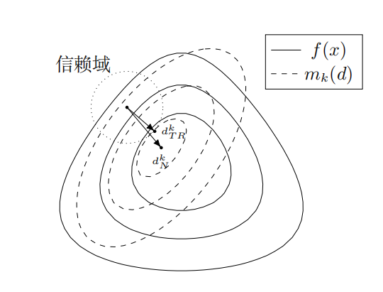
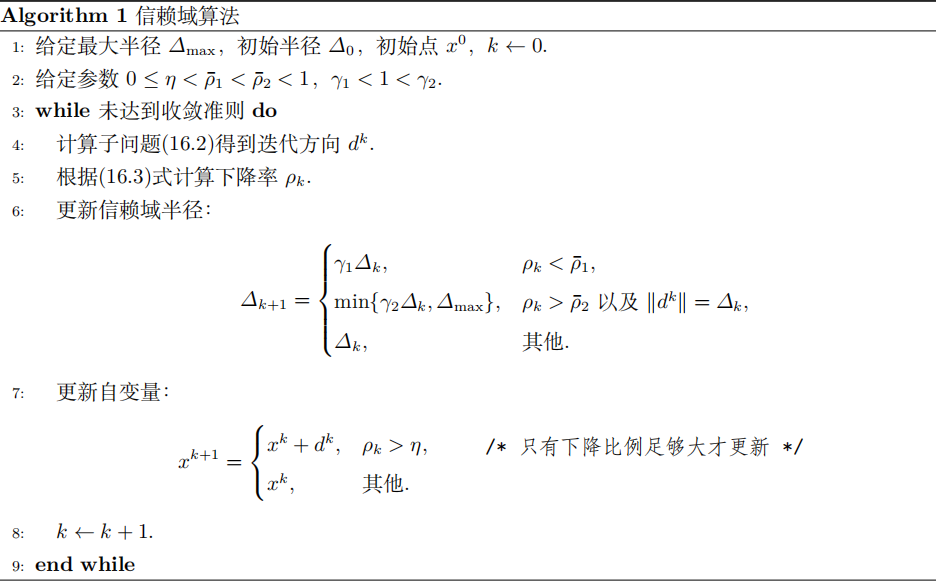
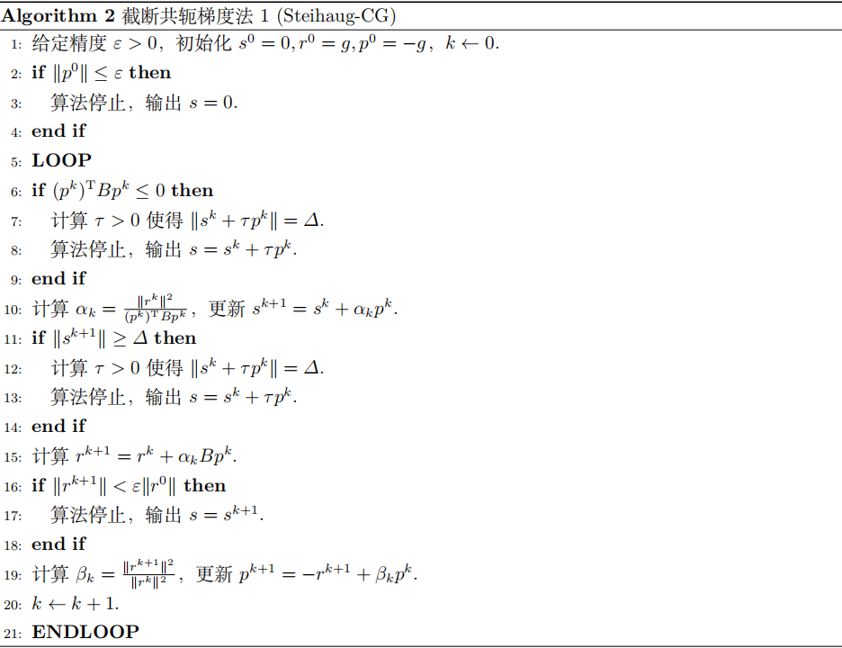
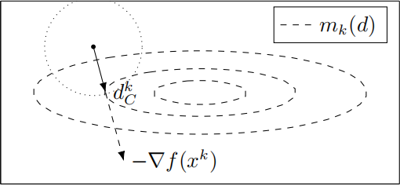

# 信赖域方法

为了保证迭代法的全局收敛性，之前我们采用了一维搜索策略，先确定一个搜索方向 $d_k$，然后沿着这个方向选择适当的步长因子 $\alpha_k$，使得函数下降尽可能多，新的迭代点 $x_{k+1}=x_k+\alpha_kd_k$。现在我们那要讨论另一种全局收敛策略——信赖域方法(Trust-Region Method)

## 信赖域方法的 motivation

我们之前学过牛顿法和拟牛顿法。经典的牛顿法是基于 Taylor 展开利用二次函数来近似目标函数 $f(x)$，但是 Taylor 展开只是一个局部的近似，只有在当前点 $x_k$ 附近，也即步长 $p$ 较小时，近似误差 $O(||p||^2)$ 才足够小。而既然我们知道模型只在一定范围内近似得好，那我们就在每一步设计一个信赖域半径 $\Delta_k$，让算法在信赖域内寻找最小值。

对比线搜索方法，其是先确定一个方向，然后再该方向上寻找步长；而信赖域方法是先确定一个步长限制（也即信赖域半径），然后在这个区域内同时决定方向和步长，如果这一步走的效果不好，我们就缩小信赖域半径再尝试一次；如果效果好，我们就可以在下次尝试更大的半径。

其基本思想是要求试探步 $d_k$ 在信赖域之内，即在每次迭代时有一个正数 $\Delta_k$，并要求试探步 $d_k$ 满足
$$
||d_k||\leq \Delta_k
$$
试探步 $d_k$ 是在某种意义下使得 $x_k+d_k$ 是在以 $x_k$ 为中心的广义球
$$
\{x_k+d| \ ||d||\leq \Delta_k\}
$$
上最好的。由于试探步的这一性质，$x$ 的增量 $||x_{k+1}-x_k||$ 也满足
$$
||x_{k+1}-x_k||\leq \Delta_k
$$
并且信赖域方法不进行搜索，而是令 $x_{k+1}=x_k+d_k$ 或者 $x_{k+1}=x_k$

## 信赖域方法的基本思路

信赖域方法的基本思路如下：

- 在当前迭代点 $x_k$ 建立局部模型（作带 Lagrange 余项的二阶 Taylor 展开），有
  $$
  f(x_k+d)\approx f(x_k)+\nabla f(x_k)^Td+\frac{1}{2}d^T\nabla^2f(x_k+td)d
  $$
  其中 $t\in(0,1)$，信赖域方法用一个对称矩阵 $B_k$ 来近似二阶项中的 Hessian 矩阵，从而我们得到一个近似的二次模型
  $$
  m_k(d)=f(x_k)+\nabla f(x_k)^Td+\frac{1}{2}d^TB_kd
  $$
  并且由于 Taylor 展开的局部性，我们需要对上述模型添加信赖域约束
  $$
  \Omega_k=\{x_k+d \big|\ ||d||\leq \Delta_k\}
  $$
  其中 $\Delta_k>0$ 是信赖域半径

!!! warning "注意"

    需要指出的是，$B_k$ 是对称阵，但 $B_k$ 不一定是正定阵

- 在球形区域 $||d||\leq \Delta_k$ 内寻找 $m_k(d)$ 的最小值，这个问题通常被称为**信赖域子问题**
  $$
  \min_{d\in R^n} m_k(d)=f(x_k)+\nabla f(x_k)^Td+\frac{1}{2}d^TB_kd\qquad \text{s.t.} \ \ ||d||\leq \Delta_k
  $$

- 更新模型信赖域的半径：

  - 模型足够好，就增大半径
  - 模型比较差，就缩小半径
  - 否则半径不变

- 对模型进行评价：

  - 好，子问题的解即为下一个迭代点
  - 差，迭代点不变

并且我们引入如下定义来衡量 $m_k(d)$ 近似程度的好坏
$$
\rho_k=\frac{f(x_k)-f(x_k+d_k)}{m_k(0)-m_k(d_k)}
$$
其中 $d_k$ 是求解信赖域子问题得到的迭代方向。由 $\rho_k$ 的定义可以知道，其为函数值实际下降量和预估下降量（即二阶近似模型下降量）的比值。如果 $\rho_k$ 接近 $1$，说明 $m_k(d)$ 近似 $f(x)$ 的效果比较好，应当扩大 $\Delta_k$；如果 $\rho_k$ 非常小甚至为负，就说明我们过分地相信了二阶模型 $m_k(d)$，此时应当缩小 $\Delta_k$，使用这个机制可以动态地调节 $\Delta_k$，让二阶模型 $m_k(d)$ 的定义域始终处于一个合适的范围。

图中实线表示 $f(x)$ 的等高线，虚线表示 $m_k(d)$ 的等高线，$d_N^k$ 表示解无约束问题得到的下降方向；$d_{TR}^k$ 表示解信赖域子问题得到的下降方向

## 信赖域子问题

信赖域算法每一步都需要求解这个子问题
$$
\min_{d\in R^n} m_k(d)\qquad \text{s.t.}\ \ ||d||\leq \Delta_k
$$
我们首先提出信赖域子问题的最优性条件

**（信赖域子问题最优性条件）** $d^{*}$ 是信赖域子问题
$$
\min \ m(d)=f+g^Td+\frac{1}{2}d^TBd\qquad \text{s.t.}\ \  ||d||\leq \Delta
$$
的全局极小解当且仅当 $d^{*}$ 是可行的且存在 $\lambda \geq 0$ 使得
$$
\begin{cases}
(B+\lambda I)d^{*} = -g\\
\lambda(\Delta - ||d^{*}||)=0\\
B+\lambda I \succeq 0
\end{cases}
$$
其中 $B+\lambda I\succeq 0$ 意指 $B+\lambda I$ 是半正定的

证明可以参考中科大《运筹学》讲义

### 求解信赖域子问题的迭代法

上述定理提供了一个寻找 $d$ 的方法

> 先暂时空着

### 截断共轭梯度法

既然信赖域子问题的解是不容易求出的，我们可以考虑去求其近似解。Steihaug 在 1983 年对共轭梯度法进行了改造，使其成为能够求解子问题的算法，此算法能够应用在大规模问题中，是一种非常有效的信赖域子问题的求解方法。

**截断共轭梯度法的基本思想**是：信赖域子问题和一般的二次极小化问题之间相差一个约束，如果我们先不考虑其中的约束 $||d||\leq \Delta$ 而直接使用共轭梯度法求解，在迭代过程中找到合适的迭代点作为信赖域子问题的近似解，并在检测到负曲率或达到信赖域边界 $||d||=\Delta$ 就终止

我们回顾一下标准共轭梯度法求解二次极小化问题的迭代过程
$$
\min_s \ q(s)=g^Ts+\frac{1}{2}s^TBs
$$
给定初值 $s_0=0,r_0=g,p_0=-g$，其迭代过程为
$$
\alpha_k=\frac{||r_k||^2}{p^T_kBp_k}\\
s_{k+1}=s_k+\alpha_kp_k\\
r_{k+1}=r_k+\alpha_k Bp_k\\
\beta_k=\frac{||r_{k+1}||^2}{||r_k||^2}\\
p_{k+1}=-r_{k+1}+\beta_kp_k
$$
其中迭代序列 $\{s_k\}$ 最终的输出即为二次极小化问题的解，算法的终止准则是判断 $||r_k||$ 是否足够小。

而**截断共轭梯度法是在标准共轭梯度法的基础上增加了两条终止准则，并对最后一步的迭代点 $s_k$ 作修正来得到信赖域子问题的解**。

 由于矩阵 $B$ 不一定是正定的，在迭代的过程中可能会产生如下三种情况：

- **负曲率方向：**$p_k^TBp_k<0$，即 $B$ 不是正定矩阵，此时我们需要立即终止算法。但是根据这个条件，我们也找到了一个负曲率方向，此时有 $r_k^Tp_k<0$，仍然能够保证函数值是下降的，只需要沿着这个方向走到信赖域边界即可（后续会给出详细的讨论）
- **迭代点超出信赖域：**$p_k^TBp_k>0$ 但 $||s_{k+1}||\geq \Delta$，这表示如果我们继续进行共轭梯度法的迭代，点 $s_{k+1}$ 将处于信赖域之外或者信赖域边界上，我们需要马上停止迭代，并且在 $s_k$ 和 $s_{k+1}$ 之间找一个近似解
- **收敛于信赖域内部：** $p_k^TBp_k>0$ 并且 $||r_{k+1}||$ 充分小，这表示共轭梯度法成功收敛到了信赖域内部。此时信赖域子问题等价于无约束的二次极小化问题。算法正常终止，我们只需要输出当前的迭代点作为解

!!! note "Tip"

    截断共轭梯度法的核心思想就是运行标准的共轭梯度法，直至发生上述三种情况之一就截断，这也是该方法名字的由来。

截断共轭梯度法的迭代序列 $\{s_k\}$ 有非常好的性质，实际上我们可以证明**如下定理**：

设 $q(s)$ 是任意外迭代步信赖域子问题的目标函数，令 $\{s_j\}$ 是由截断共轭梯度算法产生的迭代序列，则在算法终止前 $q(s_j)$ 是严格单调递减的，也即
$$
q(s_{j+1})<q(s_j)
$$
并且 $||s_j||$ 是严格单调递增的，也即
$$
0=||s_0||<||s_1||<\cdots<||s_{j+1}||<\cdots\leq \Delta
$$

!!! note "Tip"

    上面提到了**外迭代**，因为信赖域算法事实上是有两层循环结构的，**外迭代步**指的是信赖域算法主循环的每一次更新($x_k\to x_{k+1}$)，而**内迭代**指的是为了计算这一步该怎么走而在求解子问题时进行的迭代（即阶段共轭梯度法的循环，子问题求解）

证明可以参考中科大《运筹学》讲义

### 柯西点

柯西点的本质就是在信赖域的限制下，我们**沿着负梯度方向**走到极小值点，步长 $d_C^k=-\tau_k\nabla f(x_k)$，这里的 $\tau_k$ 是通过最小化二次模型 $m_k$ 得到的步长，同时必须要满足信赖域半径的约束。

我们设 $m_k(d)$ 是 $f(x)$ 在点 $x=x_k$ 处的二阶近似，$\tau_k$ 为如下优化问题的解：

$$
\min m_k(-\tau\nabla f(x_k)),\\
\text{s.t.}\ \ ||\tau\nabla f(x_k)||\leq \Delta_k,\tau \geq 0
$$

则称 $x^k_C:=x^k+d_C^k$ 为**柯西点**，其中 $d_C^k=-\tau_k\nabla f(x^k)$。并且给定 $m_k(d)$，柯西点可以显式地计算出来，为了方便我们用 $g_k$ 表示 $\nabla f(x_k)$，容易计算出 $\tau_k$ 的表达式为

$$
\tau_k=\begin{cases}
\frac{\Delta_k}{||g_k||},&g_k^TB_kg_k<0\\
\min\{\frac{||g_k||^2}{g_k^TB_kg_k},\frac{\Delta_k}{||g_k||}\}, & 其他
\end{cases}
$$

!!! note "Tip"

    遇到负曲率情况，直接走到信赖域的边界，有 $\tau_k=\frac{\Delta_k}{||g_k||}$；

    其他情况，如果模型在这个方向上有极小值，就要看这个极小值是在信赖域里面还是在信赖域外面，如果在里面，就停留在极小值点 $\frac{||g_k||^2}{g_k^TB_kg_k}$；如果在外面，就被信赖域边界挡住 $\frac{\Delta_k}{||g_k||}$，也即取两者的最小值

**（柯西点的下降量）** 设 $d_C^k$ 为求解柯西点产生的下降方向，则有
$$
m_k(0)-m_k(d_C^k)\geq c_1||g_k||\min\{\Delta_k,\frac{||g_k||}{||B_k||_2}\}
$$
其中 $c_1=\frac{1}{2}$

从上述定理我们知道，柯西点能够保证 $m_k$ 至少下降一定的量。所以在后续证明信赖域方法的全局收敛性时，只要我们选出的步长 $d_k$ 带来的下降量不比柯西点差，算法就一定能够收敛。

!!! note "Tip"

    柯西点实际上是在约束下对 $m_k(d)$ 进行了一次精确线搜索的梯度法

    

### Dogleg(折线法)

我们前面提到，Cauchy 虽然能够保证全局收敛，但是其本质上只是限制在信赖域内的最速下降法，而最速下降法在接近最优解的时候是线性收敛的，这样的速度很慢。

而另一方面，如果 Hessian 矩阵 $B_k$ 是正定的，牛顿步 $p^B=-B_{k}^{-1}g_k$ 能够提供超线性地收敛速度，但是他可能长度过大超出了信赖域，或者在远离极小点的时候不可靠。

我们就产生一种想法，是否能够先使用最速下降接近极小点，然后再用牛顿迭代？这正是 Dogleg 方法的直觉

我们构造一条从初始点出发的折线路径，这条路径连接了最速下降方向和牛顿方向，并且我们在这条路径上寻找位于信赖域边界上的点，作为对信赖域子问题解的近似，如下图所示：

这条路径由两段线段组成：

- 第一段：从原点出发，沿着负梯度方向走到该方向上模型 $m_k$ 的无约束极小点 $p^U$
- 第二段：从 $p^U$ 出发，直接指向牛顿点 $p^B$（即无约束下的全局极小点）

假设 $B_k$ 是正定的，我们需要计算两个关键点：

- **最速下降方向的无约束极小点 $p^U$**：即沿着负梯度方向 $-g_k$ 使得二次模型 $m_k$ 最小的点

- **牛顿点 $p^B$：**这是二次模型 $m_k$ 的无约束全局极小点
  $$
  p^B=-B_k^{-1}g_k
  $$

Dogleg 路径 $\tilde{p}(\tau)$ 定义如下：
$$
\tilde{p}(\tau)=\begin{cases}
\tau p^U&0\leq \tau\leq 1\\
p^U+(\tau-1)(p^B-p^U),&1\leq \tau\leq 2
\end{cases}
$$
当 $\tau\in[0,1]$ 时，路径沿着负梯度方向从 $0$ 走到 $p^U$；当 $\tau\in[1,2]$ 时，路径从 $p^U$ 走到 $p^B$

Dogleg 路径有以下几个优良的性质：

- **距离单增：**随着 $\tau$ 增加，点到起始点的距离 $||\tilde{p}(\tau)||$ 单增，所以路径只会由内向外穿过信赖域边界一次
- **模型值单减：**随着 $\tau$ 增加，二次模型函数值单减，故我们走得越远效果越好

Dogleg 求解策略：我们需要在 Dogleg 路径上找到一个点，使得 $\tau$ 尽可能大，同时满足 $||p||\leq \Delta_k$，下面分三种情况考虑：

- **牛顿点在信赖域内，$||p^B||\leq \Delta_k$**，此时直接取牛顿点作为解，也即 $d_k=p^B$，此时具有二阶收敛速度

- **最速下降点在信赖域外，也即 $||p^U||\geq \Delta_k$**，此时解位于第一段和信赖域边界的交点，此时退化为柯西点，满足
  $$
  d_k=\frac{\Delta_k}{||p^U||}p^U
  $$

- **Dogleg 转折点在信赖域内，但是牛顿点在信赖域外，也即 $||p^U||<\Delta_k$ 且 $||p^B||>\Delta_k$**，此时解位于第二段和信赖域边界的交点，我们需要寻找 $\tau\in [1,2]$，使得
  $$
  ||p^U+(\tau-1)(p^B-p^U)||=\Delta_k
  $$
  解出 $\tau$ 后即可求得步长 $d_k=p^U+(\tau-1)(p^B-p^U)$

!!! note "Tip"

    Dogleg 方法是一种不需要精确求解信赖域子问题，但是比柯西点更高效地近似方法，但只适用于 $B_k$ 正定的情况，如果不正定（出现负曲率情况）就不能使用 Dogleg 方法。

## 信赖域方法的收敛性

### 全局收敛性

回顾信赖域算法的伪代码，我们引入了一个参数 $\eta$ 作为阈值来确定是否应该更新迭代点，$\eta$ 的取值分为两种情况：

- 当 $\eta = 0$ 时，只要原目标函数有下降量就接受信赖域迭代步的更新
- 当 $\eta>0$ 时，只有当改善量 $\rho_k$ 达到一定程度时在进行更新

在这两种情况下信赖域方法的收敛性结果是不同的，我们分别介绍这两种结果

**（全局收敛性1）** 设近似 Hessian 矩阵 $B_k$ 有界，也即 $||B_k||_2\leq \beta,\forall k$，$f(x)$ 在下水平集 $\mathcal{L}=\{x|f(x)\leq f(x_0)\}$ 上有下界，且 $\nabla f(x)$ 在 $\mathcal{L}$ 的一个开邻域 $S(R_0)$ 内利普希茨连续，若 $d_k$ 为信赖域子问题的近似解且满足柯西点下降量，信赖域算法选取参数 $\eta=0$，则有
$$
\lim_{k\to\infty}\inf||\nabla f(x_k)||=0
$$
即 $x_k$ 的聚点中包含稳定点

!!! note "Tip"

    上述定理说明，如果我们无条件接受信赖域子问题的更新，信赖域算法仅仅有子序列的收敛性，迭代点序列本身不一定收敛，下面的定理则说明选取 $\eta >0$ 可以改善收敛性结果。

**（全局收敛性2）** 在定理（全局收敛性1）的条件下，如果信赖域算法选取参数 $\eta>0$，且信赖域子问题近似解 $d_k$ 满足柯西点下降量，则
$$
\lim_{k\to\infty}||\nabla f(x_k)||=0
$$
和牛顿类算法不同，信赖域算法具有全局收敛性，因此它对迭代初值的要求比较弱，而牛顿法的收敛性极大地依赖初值的选取。

### 局部收敛性

在构造信赖域子问题的时候我们利用了 $f(x)$ 的二阶信息，它在最优点附近应该具有牛顿法的性质。特别的，当近似矩阵 $B_k$ 取为 Hessian 矩阵 $\nabla^2f(x_k)$ 时，根据信赖域子问题的更新方式，二次模型 $m_k(d)$ 会越来越逼近原函数 $f(x)$

设 $f(x)$ 在最优点 $x=x^{*}$ 的一个邻域内二阶连续可微，且 $\nabla f(x)$ 利普希茨连续，在最优点 $x^{*}$ 处二阶充分条件成立，也即 $\nabla^2f(x)\succ0$，我们**假设**

(1) 迭代点列 $\{x_k\}$ 收敛到 $x^{*}$

(2) 在迭代中选取 $B_k$ 为 Hessian 矩阵 $\nabla^2f(x_k)$

(3) 子问题算法产生的迭代方向 $d_k$ 均满足柯西点下降量

(4) 当 $||d_N^k||\leq \frac{\Delta_k}{2}$ 时，对充分大的 $k$ 有 $||d_k-d_N^k||=o(||d_N^k||)$

则当 $k$ 足够大时，信赖域约束 $\Delta_k$ 将未被激活，信赖域算法产生的迭代序列 $\{x_k\}$ 具有 Q-超线性收敛速度

