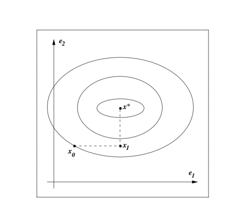
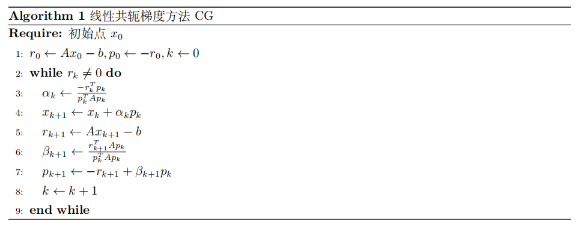
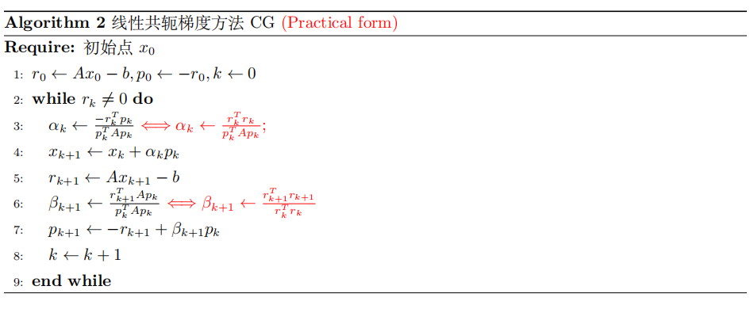

!!! Tip "说明"

    本文内容主要关注线性的共轭梯度法，非线性的共轭梯度法大概率是不会考的

## 线性共轭梯度法

首先考虑二次问题
$$
\min f(x)=\frac{1}{2}x^TAx-b^Tx
$$
这里 $A\in R^{n\times n}$。最简单的情形是 $A$ 为对角阵，并且我们考虑下图这样的二维情况

我们可以每次沿着坐标轴对二次函数求最小值，这样只需要两步就可以得到最优解。一般地，如果 $A$ 为对角矩阵，且对角元为 $\lambda_1,\lambda_2,\cdots,\lambda_n$，那么就有
$$
f(x)=\sum_{i=1}^n(\frac{1}{2}\lambda_ix_i^2-b_ix_i)
$$
此时我们可以每次固定一个维度 $k$，对 $\frac{1}{2}\lambda_kx_k^2-b_kx_k$ 极小化，这样只需要 $n$ 步即可得到最优值。

但是如果 $A$ 不是对角阵，我们仍然沿着坐标轴最小化函数的话，迭代点不会很快收敛

### 共轭方向

设 $A$ 是 $n\times n$ 正定阵，对于 $R^n$ 的任一组非零向量 $\{p_0,p_1,\cdots,p_k\}$，如果 $p_i^TAp_j=0(i\neq j)$，则称 $p_0,p_1,\cdots,p_k$ 是关于 $A$ 共轭的

!!! note "Tip"

    共轭实际上是正交概念的推广，当我们取 $A=I$ 时，共轭即为正交

我们假设 $\{p_0,p_1,\cdots,p_{n-1}\}$ 是给定的关于 $A$ 的共轭方向，令 $S=[p_0,p_1,\cdots,p_{n-1}]$，如果我们对 $f(x)$ 做变换
$$
\hat{f}(\hat{x})=f(S\hat{x})=\frac{1}{2}\hat{x}^T(S^TAS)\hat{x}-(Sb)^T\hat{x}
$$
则由共轭方向的定义，我们可以知道矩阵 $S^TAS$ 是对角正定矩阵，因此，对于 $\hat{f}(\hat{x})$ 我们可以在 $\hat{x}$ 的各个坐标轴方向 ${e_1,\cdots,e_n}$ 来求解最小化问题（对应于 $x$ 的坐标在 $p_0,\cdots,p_{n-1}$），最终得到最优解。

而线性共轭梯度法便是**去构造 $A$ 的共轭方向 ${p_0,p_1,\cdots,p_{n-1}}$**，从而快速地求解二次问题。

显然，矩阵 $A$ 的特征向量就是共轭方向，但是如果 $A$ 的规模太大，特征根分解就会非常缓慢。我们也可以通过改进施密特正交化来得到共轭方向，但是这样需要存储所有的 $p_0,p_1,\cdots,p_{k-1}$ 以构造 $p_k$。而线性共轭梯度法的优点在于，在某个迭代步 $k$ 时，我们只需要 $p_{k-1}$ 就可以构造出 $p_k$，而并不需要所有的 $p_0,\cdots,p_{{k-2}}$

**线性共轭梯度法** 由于优化二次函数就等价于求解方程 $Ax=b$，所以该方法叫做线性共轭梯度法。而名字中的梯度是因为我们将第一个方向 $p_0$ 取作最速下降方向，也即负梯度方向，$p_0=-\nabla f(x_0)$

线性共轭梯度法的算法为代码如下：

下面我们导出为什么这样选取 $\alpha_k,x_{k+1},r_{k+1},p_{k+1}$

- 给定正定阵 $A$，选取初始点 $x_0$，$p_0=-\nabla f(x_0)$ 保证第一步为下降方向，记
  $$
  r_k=Ax_k-b=\nabla f(x_k)
  $$

- 我们希望每一步迭代在 $p_k$ 方向最小化函数值，也即求精确的一维搜索步长 $\alpha_k$，也即 $\alpha_k=\arg\min_{\alpha>0} f(x_k+\alpha p_k)$，由此可得

  
  $$
  \alpha_k=-\frac{r_k^Tp_k}{p_k^TAp_k}
  $$

- 更新迭代点 $x_{k+1}=x_k+\alpha_kp_k$，并构造 $p_{k+1}$ 是负梯度方向和前一个共轭方向 $p_k$ 的线性组合，也即
  $$
  p_{k+1}=-r_{k+1}+\beta_{k+1}p_k
  $$
  由于 $p_{k+1}^TAp_k=0$，可得
  $$
  \beta_{k+1}=\frac{r_{k+1}^TAp_k}{p_k^TAp_k}
  $$

尽管构造 $p_{k+1}$ 的方式仅仅保证了 $p_k$ 与 $p_{k+1}$ 是互为共轭的，但实际上我们有如下定理，保证 $p_{k+1}$ 与所有的 $p_0,\cdots,p_k$ 均为共轭

**线性共轭梯度法性质** 设线性共轭梯度法的地 $k$ 步的迭代结果 $x_k$ 不是原问题的解，则有以下结论成立：

- $span(r_0,r_1,\cdots,r_k)=span(r_0,Ar_0,\cdots,A^kr_0)$
- $span(p_0,p_1,\cdots,p_k)=span(r_0,Ar_0,\cdots,A^kr_0)$
- $r_k^Tp_i=0,\forall i < k$
- $p_k^TAp_i=0,\forall i < k$
- $r_k^Tr_i=0,\forall i < k$

下面的定理阐述了线性共轭法的另一个重要的性质

严格凸二次函数 $f(x)=\frac{1}{2}x^TAx-b^Tx$，共轭方向法执行精确一维搜索，则每步迭代点 $x_{k+1}$ 是 $f(x)$ 在空间

$$
\mathcal{V}_k=\{x\big | x=x_0+\sum_{j=0}^k\beta_jp_j,\forall \beta_j\in R\}
$$

中的唯一极小值点，因此，最多需要 $n$ 步，$x_k$ 收敛到最优点 $x^*=A^{-1}b$

下面我们给出证明，由共轭方向的定义可以知道，$\{p_0,p_1,\cdots,p_{n-1}\}$ 线性无关，如果 $x_n$ 是 $\mathcal{V}_{n-1}$ 上的最小值，则是 $R^n$ 上的最小值，所以我们只需要证明 $x_{k+1}$ 是 $\mathcal{V}_{k}$ 上的最小值，只需要证明对所有 $k < n$ 成立
$$
r_{k+1}^Tp_j=0,j=0,1,\cdots,k
$$
即在点 $x_{k+1}$ 处的函数梯度 $r_{k+1}=\nabla f(x_{k+1})$ 与子空间 $span\{p_0,p_1,\cdots,p_k\}$ 正交，而这正是线性共轭梯度法的性质。

除此之外，由以下关系，我们还可以得到更加实用的线性共轭梯度法，首先有
$$
p_k^Tr_k=(-r_k+\beta_{k}p_{k-1})^Tr_k=-r_k^Tr_k
$$

!!! note "Tip"

    用到了 $p_{k-1}^Tr_k=0$

又因为 $r_{k+1}-r_k=A(x_{k+1}-x_k)=\alpha_kAp_k$，在等式两边同时乘以 $r_{k+1}^T$ 和 $p_k$ 分别得到 $\alpha_kr_{k+1}^TAp_k=r_{k+1}^Tr_{k+1}$，$\alpha_k=\frac{r_k^Tr_k}{p_k^TAp_k}$

实用线性共轭梯度法的伪代码如下：

!!! Tip "说明"

    线性共轭梯度法收敛性的结论我这里就不给了