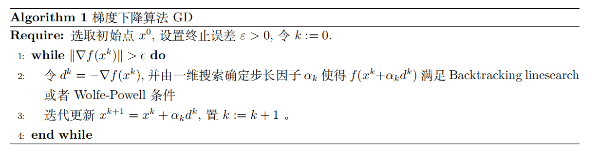
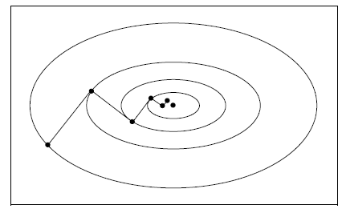

梯度类算法的本质是**仅仅使用函数的一阶导数信息**选取下降方向 $d_k$，这其中最基本的算法是梯度下降法（也称为最速下降法），即直接选择负梯度方向作为下降方向 $d_k$

## 梯度下降法

对于光滑函数 $f(x)$，在迭代点 $x_k$ 处，我们需要选择一个较为合理的 $d_k$ 作为下降方向，注意到 $\varphi(\alpha)=f(x_k+\alpha d_k)$，作泰勒展开可得
$$
\varphi(\alpha)=f(x_k)+\alpha\nabla f(x_k)^Td_k+O(\alpha^2||d_k||^2)
$$
由柯西不等式，当 $\alpha$ 较小时，取 $d_k=-\nabla f(x_k)$ 使得函数下降最快，而梯度下降法就是选取 $d_k=-\nabla f(x_k)$ 的算法，其迭代格式为
$$
x_{k+1}=x_k-\alpha_k\nabla f(x_k)
$$
其中步长 $\alpha_k$ 可以使用上一节的线搜索算法确定，也可以选择固定的 $\alpha_k$

梯度下降算法的伪代码如下：

!!! warning "注意"

    需要说明的是，负梯度方向是下降最快的方向，但这仅仅是局部性质，负梯度方向不一定是全局下降最快的方向。

    如果我们在选择步长的时候采用的是精确线搜索方法，由于 $\varphi(\alpha)= f(x_k+\alpha d_k)$，且精确线搜索满足 $\varphi'(\alpha_k) = 0$，则有
    $$
    \varphi'(\alpha_k)=\nabla f(x_k+\alpha_kd_k)^Td_k=-d_{k+1}^Td_k=0
    $$
    所以我们得到了 $d_{k+1}^Td_k=0$，这意味着最速下降法每一步的方向是正交的。当目标函数的等值线是一个扁长椭球时，就会出现锯齿现象，下降缓慢，如下图所示：

    

### 收敛性分析

#### 浙大《优化实用算法》

##### 全局收敛性

线搜索方法中我们已经引入了 Zoutendijk 定理，对于最速下降法来说，有 $p_k=-\nabla f(x_k)$，所以
$$
\cos\theta_k = \frac{-\nabla f(x_k)^T p_k}{||\nabla f(x_k)||\cdot||p_k||}=\frac{||\nabla f(x_k)||^2}{||\nabla f(x_k)||^2}=1
$$
所以 $||\nabla f(x_k)||\to 0$ 能得到全局收敛性。

##### 收敛速度

首先考虑二次函数 $f(x)=x^TGx$，其中 $G$ 对称正定，假设 $\lambda_1$ 和 $\lambda_n$ 是 $G$ 的最大和最小特征值，设 $x^{*}$ 是问题的解，则最速下降法的收敛速度至少是线性的，并且满足

$$
\frac{f(x_{k+1})-f(x^{*})}{f(x_k)-f(x^{*})}\leq \frac{(\kappa-1)^2}{(\kappa+1)^2}=\frac{(\lambda_1-\lambda_n)^2}{(\lambda_1+\lambda_n)^2}\\
\frac{||x_{k+1}-x^{*}||}{||x_k-x^{*}||}\leq\sqrt{\kappa}\frac{(\kappa-1)}{(\kappa+1)}
$$

其中 $\kappa = \frac{\lambda_1}{\lambda_n}\geq 1$ 是矩阵 $G$ 的条件数

!!! note "Tip"

    这说明了梯度法的一个非常重大的缺陷，当目标函数的 Hessian 矩阵条件数较大时，它的收敛速度会非常缓慢

对于一般函数，设 $f(x)$ 在 $x^{*}$ 附近二次连续可微，$\nabla f(x^{*})=0$，$\nabla^2f(x^{*})$ 正定，则

$$
\frac{f(x_{k+1})-f(x^{*})}{f(x_k)-f(x^{*})}=\beta_k<1\\
\lim_{k\to\infty}\sup \beta_k \leq \frac{M-m}{M}<1
$$

 其中 $M,m$ 满足 $0<m\leq \lambda_n\leq\lambda_1\leq M$，$\lambda_n$ 和 $\lambda_1$ 是 $\nabla^2f(x)$ 的最小和最大特征值

#### 中科大《运筹学》

陈士祥老师的《运筹学》讲义主要讲解了在非凸、凸函数、强凸三种情况下梯度算法的收敛结果

##### 非凸函数情况下的收敛

**梯度利普希茨连续** 若给定函数 $f$ 是可微函数，并且对于任意定义域的点 $x,y$ 梯度满足利普希茨连续性，也即存在 $L>0$，使得
$$
||\nabla f(y)-\nabla f(x)||\leq L||y-x||
$$
则称 $f$ 是梯度利普希茨连续的

**引理** 若 $f$ 是利普希茨光滑的（也即 $\nabla f$ 是利普希茨连续的），则 $f$ 有二次上界，即
$$
f(y)\leq f(x)+\nabla f(x)^T(y-x)+\frac{L}{2}||y-x||^2
$$
**证明** 由 $f$ 可微可以得到
$$
f(y)=f(x)+\int_0^1 \nabla f(x+t(y-x))^T(y-x)dt\\
=f(x)+\nabla f(x)^T(y-x)+\int_0^1 (\nabla f(x+t(y-x))-\nabla f(x))^T(y-x)dt
$$
因此有
$$
f(y)-f(x)-\nabla f(x)^T(y-x)=\int_0^1 (\nabla f(x+t(y-x))-\nabla f(x))^T(y-x)dt\\\leq \int_0^1 ||\nabla f(x+t(y-x))-\nabla f(x)||\cdot||y-x||dt\leq \int_0^1L t||y-x||^2dt=\frac{L}{2}||y-x||^2
$$

 

| 问题类型                     | 收敛描述                                     | 迭代复杂度                                  |
| ---------------------------- | -------------------------------------------- | ------------------------------------------- |
| Nonconvex L-smooth           | $\lVert\nabla f(x)\rVert\leq \varepsilon$    | $O(\frac{1}{\varepsilon^2})$                |
| Convex L-smooth              | $f(x_k)-f^{*}\leq \varepsilon$               | $O(\frac{1}{\varepsilon})$                  |
| Strongly convex $\mu$-smooth | $\lVert x_k-x^{*}\rVert^2<\varepsilon$       | $O(\frac{L}{\mu}\log\frac{1}{\varepsilon})$ |

### Barzilai-Borwein 方法（两点步长梯度法）

我们知道，当问题的条件数很大，也即问题比较病态的时候，梯度下降法的收敛性质会收到很大的影响，而我们接下来要提出的 Barzilai-Borwein（BB） 方法是一种特殊的梯度法，经常比一般的梯度法有着更好的效果。

从形式上看，BB 方法的下降方向仍然是点 $x_k$ 处的负梯度方向 $-\nabla f(x_k)$，但步长 $\alpha_k$ 并不是直接由线搜索算法给出的，我们考虑梯度下降法的格式：
$$
x_{k+1}=x_k-\alpha_k \nabla f(x_k)
$$
这种格式也可以写成
$$
x_{k+1}=x_k-D_k\nabla f(x_k)
$$
其中 $D_k=\alpha_k I$，BB 方法选取的 $\alpha_k$ 是如下两个最优问题之一的解：
$$
\min_{\alpha} ||\alpha y_{k-1}-s_{k-1}||^2\\
\min_{\alpha} ||y_{k-1}-\alpha^{-1}s_{k-1}||^2
$$
其中 $s_{k-1}=x_k-x_{k-1}$，$y_{k-1}=\nabla f(x_{k})-\nabla f(x_{k-1})$，后续学习拟牛顿法的是时候我们会指出上述两个最优问题的实际意义。容易验证，上述两个问题的解分别为

$$
\alpha^{BB1}_k=\frac{s_{k-1}^Ty_{k-1}}{y_{k-1}^Ty_{k-1}},\qquad \alpha_k^{BB2}=\frac{s_{k-1}^Ts_{k-1}}{s_{k-1}^Ty_{k-1}}
$$

因此我们可以得到 BB 方法的两种迭代格式

$$
x_{k+1}=x_k-\alpha_{k}^{BB1}\nabla f(x_k)\\
x_{k+1}=x_k-\alpha_k^{BB2}\nabla f(x_k)
$$

从上述过程中可以看出，计算两种 BB 步长的任何一种仅仅需要函数相邻两步的梯度信息和迭代点信息，而不需要任何线搜索算法，因此 BB 方法的使用范围特别广泛。但需要注意的是，通过上式计算出的步长可能过大或过小，我们还需要将步长做上界和下界的截断，也即选取 $0<\alpha_m<\alpha_M$，使得

$$
\alpha_m\leq \alpha_k\leq \alpha_M
$$

