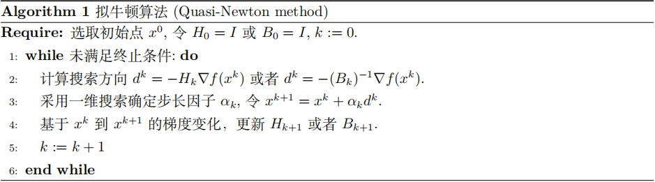

# 牛顿类算法

梯度类算法仅仅依赖函数值和梯度的信息（也即一阶信息），如果函数 $f(x)$ 充分光滑，我们就可以**利用二阶导数信息构造下降方向 $d_k$**，牛顿类算法就是利用二阶导数信息来构造迭代格式的算法。由于其利用的信息更多，牛顿法的实际表现可以远好于梯度法，但是它对函数 $f(x)$ 的要求也相应变高。

## 经典牛顿法

设 $f(x)$ 是二次可微实函数，我们在 $x_k$ 附近作二阶 Taylor 展开近似可得
$$
f(x_k+d_k)=f(x_k)+\nabla f(x_k)^Td_k+\frac{1}{2}d_k^T\nabla^2f(x_k)d_k+o(||d_k||^2)
$$
忽略上式的高阶项，将等式右边视作关于 $d_k$ 的函数求其一阶导零点，可以得到
$$
\nabla^2f(x_k)d_k=-\nabla f(x_k)
$$
上式我们称为**牛顿方程**，容易得出当 $\nabla^2f(x_k)$ 非奇异时，更新方向满足
$$
d_k=-[\nabla^2f(x_k)]^{-1}\nabla f(x_k)
$$
一般称满足牛顿方程的 $d_k$ 为牛顿方向，经典牛顿法的更新格式为
$$
x_{k+1}=x_k-\nabla^2f(x_k)^{-1}\nabla f(x_k)
$$
在上式中，步长 $\alpha_k\equiv1$，即可以不额外考虑步长的选取，我们也称步长为 $1$ 的牛顿法为经典牛顿法。

我们看一个例子，在目标函数是正定二次函数
$$
f(x)=\frac{1}{2}x^TGx-c^Tx
$$
的情况下（$G$ 为正定阵），对任意的 $x$ 有 $\nabla^2f(x)=G$，第一次迭代我们令 $H_0=G^{-1}$，则有
$$
d_0=-H_0\nabla f(x_0)=-G^{-1}(Gx_0-c)=-(x_0-x^{*})
$$
这里 $x^{*}=G^{-1}c$ 是问题的最优解（这是因为 $x^{*}=G^{-1}c$ 是函数的极值点，也即 $f'(x)=Gx-c$）。若 $x_0\neq x^{*}$，我们取步长 $\alpha_0=1$，就可以得到 $x_1=x_0+\alpha_0d_0=x^{*}$，由此我们可以知道，不管初始点 $x_{0}$ 如何选取，在一次迭代后即可达到最优解 $x^{*}$

而**选取步长 $\alpha_k\equiv 1$ 的迭代公式为**
$$
x_{k+1}=x_k+d_k=x_k-[\nabla^2f(x_k)]^{-1}\nabla f(x_k)
$$
这就是经典的牛顿迭代法。

## 收敛性分析

经典牛顿法 $x_{k+1}=x_k-[\nabla^2 f(x_k)]^{-1}\nabla f(x_k)$ 具有很好的局部收敛性质，我们有如下定理：

**（经典牛顿法的收敛性）** 假设目标函数 $f$ 是连续二阶可微的函数，且 Hessian 矩阵在最优值点 $x^{*}$ 的一个邻域 $N_{\delta}(x^{*})$ 内是利普希茨连续的，即存在常数 $L>0$ 使得
$$
||\nabla^2f(x)-\nabla^2f(y)||\leq L||x-y||,\forall x,y\in N_{\delta}(x^{*})
$$
如果函数 $f(x)$ 在点 $x^{*}$ 处满足 $\nabla f(x^{*})=0,\nabla^{2}f(x^{*})\succ 0$（意指 $\nabla^2f(x^{*})$ 正定），则对于牛顿法有如下结论：

- 如果初始点离 $x^*$ 足够近，则牛顿法产生的迭代点列 $\{x_k\}$ 收敛到 $x^*$
- $\{x_k\}$ 收敛到 $x^*$ 的速度是 $Q-$ 二次的
- $\{||\nabla f(x_k)||\}$ $Q-$ 二次收敛到 $0$

!!! note "Tip"

    证明可以参考文再文老师的书

上述定理表明经典牛顿法是收敛速度很快的算法，但是它的收敛是有条件的：

- 其一，初始点 $x_0$ 必须距离问题的解充分近，即**牛顿法只有局部收敛性**，当 $x_0$ 距离问题的解较远时，牛顿算法在多数情况下会失效
- 第二，**Hessian 矩阵 $\nabla^2f(x^{*})$ 需要为正定矩阵**，如果 $\nabla^2f(x^*)$ 是奇异的半正定矩阵，牛顿算法的收敛速度可能仅达到 $Q-$ 线性

并且从证明还可以看出，问题的条件数并不会在很大程度上影响牛顿法的收敛速度，利普希茨常熟 $L$ 在迭代后期通常会被 $||x_k-x^*||$ 抵消，但对于病态问题，牛顿法的收敛于可能会变小，这对初值的选取有了更高的要求。

!!! note "Tip"

    牛顿法适用于优化问题的高精度求解，但是其并没有全局收敛性质。因此在实际应用中，人们通常会先使用梯度类算法先求得较低精度的解，然后调用牛顿法来获得高精度的解。

## 修正牛顿法

经典牛顿法有以下几点缺陷：

- 每一步迭代都需要解一个 $n$ 维线性方程组，导致在高维问题中计算量很大，Hessian 矩阵 $\nabla^2f(x_k)$ 不容易计算也不容易储存
- 当 $\nabla^2f(x_k)$ 不正定时，由牛顿方程给出的解 $d_k$ 性质通常比较差，甚至不一定为下降方向
- 当迭代点距离最优值较远的时候，直接选取步长 $\alpha_k=1$ 会使得迭代不稳定，有些情况下迭代点列会发散。

为了克服这些缺陷，我们必须对经典牛顿法做某些修正或变形。

## 拟牛顿法

牛顿法的突出优点是局部收敛很快（具有二阶收敛速率），但是运用牛顿法需要计算二阶导数，并且目标函数的 Hessian 矩阵 $\nabla^2f(x_k)$ 可能非正定，甚至奇异。为了克服这些缺点，人们就提出了拟牛顿法，其基本思想是：**用不含二阶导数的矩阵 $H_k$ 近似牛顿法中的 Hessian 矩阵的逆 $[\nabla^2f(x_k)]^{-1}$**。

而由构造近似矩阵的方法不同，也会导出不同的拟牛顿法

### 割线方程（拟牛顿条件）

前面我们提到，拟牛顿法的思想是构造一个近似矩阵来替代真实的二阶导数，下面我们推导一下这个近似矩阵需要满足什么条件。

设第 $k$ 此迭代后得到了 $x_{k+1}$，并将目标函数 $f(x)$ 在 $x_{k+1}$ 处作二阶 Taylor 展开，有：
$$
f(x)\approx f(x_{k+1})+\nabla f(x_{k+1})^T(x-x_{k+1})+\frac{1}{2}(x-x_{k+1})^T\nabla^2f(x_{k+1})(x-x_{k+1})
$$
则进一步有
$$
\nabla f(x)\approx \nabla f(x_{k+1})+\nabla^2f(x_{k+1})(x-x_{k+1})
$$
我们令 $x=x_k$ 可以得到
$$
\nabla f(x_k)\approx \nabla f(x_{k+1})+\nabla^2f(x_{k+1})(x_k-x_{k+1})
$$
我们记位移向量 $s_k=x_{k+1}-x_k$，梯度差向量 $y_k=\nabla f(x_{k+1})-\nabla f(x_k)$，则有
$$
\nabla^2f(x_{k+1})s_k\approx y_k\qquad or \qquad [\nabla^2f(x_{k+1})]^{-1}y_k\approx s_k
$$
由此，我们可以估计在 $x_{k+1}$ 处的 Hessian 矩阵或者 Hessian 矩阵的逆阵，我们要求在迭代中构造出 Hessian 矩阵的近似 $B_{k+1}$，满足
$$
B_{k+1}s_k=y_k
$$
或者 Hessian 矩阵逆阵的近似 $H_{k+1}$，使得其满足
$$
H_{k+1}y_k=s_k
$$
我们把上面两个式子称作**割线方程**，也叫做**拟牛顿条件**

!!! note "Tip"

    一维情况下，导数的割线近似是
    $$
    \frac{f'(x_{k+1}) - f'(x_k)}{x_{k+1} - x_k} \approx f''(x_{k+1})
    $$
    需要指出的是，我们是在”制定规则“，而不是发明新的算法。

### 曲率条件

就像经典牛顿法要求 Hessian 矩阵是正定的一样，拟牛顿法也要求近似矩阵 $B_{k+1}$ 必须是正定矩阵，这样才能保证产生的搜索方向是下降方向，从而保证算法收敛，也即有必要条件：
$$
s_k^TB_{k+1}s_k>0 \Rightarrow s_k^Ty_k>0
$$
所以我们就得到了曲率条件，要求在每次迭代中满足
$$
s_k^Ty_k>0
$$
其中 $s_k$ 是位移，$y_k$ 是梯度差。

假设我们在实际计算中采用的是线搜索，如何满足这个条件呢？我们假设线搜索使用的是 Powell-Wolfe 准则：
$$
\nabla f(x_k+\alpha d_k)d_k\geq c_2\nabla f(x_k)^Td_k>0
$$
其中 $c_2\in (0,1)$，上式即 $\nabla f(x_{k+1})^Ts_k\geq c_2\nabla f(x_k)^Ts_k$，在不等式两边同时减去 $\nabla f(x_k)^Ts_k$，由于 $c_2-1<0$，且 $s_k$ 是下降方向，则有
$$
y_k^Ts_k\geq (c_2-1)\nabla f(x_k)^Ts_k>0
$$

!!! note "Tip"

    换句话说，只要我们使用标准的 Wolfe 线搜索来确定步长，曲率条件就会自动满足

拟牛顿法的迭代格式如下：

下面我们讨论怎样构造以及确定满足拟牛顿条件的矩阵逆阵的近似 $H_{k+1}$

### SR1 公式

设 $H_k$ 是第 $k$ 次迭代的 Hessian 矩阵逆阵的近似，我们希望用 $H_k$ 来产生 $H_{k+1}$，也即 $H_{k+1}=H_k+E_k$，其中 $E_k$ 是一个低秩矩阵

这里我们可以考虑采用对称秩一修正
$$
H_{k+1}=H_k+auu^T
$$
则由拟牛顿条件有
$$
H_{k+1}y_k=H_ky_k+au(u^Ty_k)=H_ky_k+a(u^Ty_k)u=s_k
$$
所以 $u$ 必然与 $s_k-H_ky_k$ 共线，我们假定 $s_k-H_ky_k\neq 0$，不妨取 $u=s_k-H_ky_k$，此时有 $a=\frac{1}{u^Ty_k}$，从而有
$$
H_{k+1}=H_k+\frac{(s_k-H_ky_k)(s_k-H_ky_k)^T}{(s_k-H_ky_k)^Ty_k}
$$
上式称为对称秩一校正。

同理，由 $B_{k+1}s_k=y_k$ 可以得到（完全对称的逻辑）
$$
B_{k+1}=B_k+\frac{uu^T}{u^Ts_k}, u =y_k-B_ks_k
$$

#### SR1 的缺陷

对称秩一校正的缺点在于，我们无法保证迭代矩阵 $H_{k+1}$ 的正定性，下面我们给出一个结论：

仅当 $H_k$ 正定以及 $(s^k-H_ky_k)^Ty_k>0$ 时，对称秩一修正才能保持正定性

**证明** 设 $0\neq \omega \in R^n$，则有
$$
\omega^TH_{k+1}\omega = \omega^TH_k\omega +\frac{(u^T\omega)^2}{u^Ty_k}>0
$$
但这个条件很难保证，即使 $(s_k-H_ky_k)^Ty_k>0$ 是满足的，其也可能很小从而导致数值上出问题。这些都使得对称秩一校正的拟牛顿法的应用有比较大的局限性

### DFP 公式

我们采用对称秩二（SR2）修正
$$
H_{k+1}=H_k+auu^T+bvv^T
$$
并由拟牛顿条件，有
$$
H_{k+1}y_k=H_ky_k+a(u^Ty_k)u+b(v^Ty_k)v=s_k
$$
这里的 $u,v$ 显然不是唯一确定的，但是我们能很容易地看出一种选择
$$
\begin{cases}
u=s_k,\qquad au^Ty_k=1\\
v=H_ky_k,\qquad bv^Ty_k=-1
\end{cases}
$$
所以有
$$
H_{k+1}=H_k+\frac{s_k{s_k}^T}{{s_k}^Ty_k}-\frac{H_ky_ky_k^TH_k}{y_k^TH_ky_k}
$$
上式称为 DFP （Davidon-Fletcher-Powell）校正公式

### BFGS 公式

BFGS 是由 Broyden, Fletcher, Goldfarb, Shanno 4人从不同角度提供了一种新的拟牛顿公式

根据割线方程，我们将秩二更新的待定参量式代入，有
$$
B_{k+1}s_k = (B_k+auu^T+bvv^T)s_k=y_k
$$
整理有
$$
a(u^Ts_k)u+b(v^Ts_k)v=y_k-B_ks_k
$$
一个简单的取法是，我们让 $a(u^Ts_k)u$ 对应 $y_k$，让 $b(v^Ts_k)v=-B_ks_k$，也即有
$$
au^Ts_k=1, \ u=y_k,\ n=bv^Ts_k=-1,\ v=B_ks_k
$$
将上述参量代入割线方程则有 BFGS 更新公式
$$
B_{k+1}=B_k+\frac{uu^T}{s_k^Tu}-\frac{vv^T}{s_k^Tv}
$$
利用 SMW 公式，以及 $H_k=(B_k)^{-1}$，我们可以推出关于 $H_k$ 的 BFGS 公式

!!! note "Tip"

    **SMW** 公式：通过已知矩阵 $A$ 的逆矩阵 $A^{-1}$，可以快速求出经过低秩修正后的新矩阵 $A+UV^T$ 的逆矩阵

    **秩一修正情形：**当矩阵 $A$ 加上一个秩为 $1$ 的矩阵 $vv^T$ 时，设 $A\in R^{n\times n}$ 是非奇异阵，若 $1+v^TA^{-1}u\neq 0$，则 $A$ 的秩一修正 $A+uv^T$ 非异，其逆可以表示为
    $$
    (A+uv^T)^{-1}=A^{-1}-\frac{A^{-1}uv^TA^{-1}}{1+v^TA^{-1}u}
    $$
    **秩 $k$ 修正情形：**设矩阵 $A\in R^{n\times n}$ 非奇异，$U\in R^{n\times k},V\in R^{n\times k}$，若 $I_k+V^TA^{-1}U$ 可逆，则 $A+UV^T$ 非奇异，其逆可以表示为
    $$
    (A+UV^T)^{-1}=A^{-1}-A^{-1}U(I_k+V^TA^{-1}U)^{-1}V^TA^{-1}
    $$

于是我们得到 BGFS 公式.

在拟牛顿类算法中，基于 $B_k$ 的 BFGS 公式为
$$
B_{k+1}=B_k+\frac{y_ky_k^T}{s_k^Ty_k}-\frac{B_ks_k(B_ks_k)^T}{s_k^TB_ks_k}
$$
基于 $H_k$ 的 BFGS 公式为
$$
H_{k+1}=(I-\frac{y_ks_k^T}{s_k^Ty_k})^TH_k(I-\frac{y_ks_k^T}{s_k^Ty_k})+\frac{s_ks_k^T}{s_k^Ty_k}
$$

!!! note "证明"

    推导可以参考中科大运筹学讲义