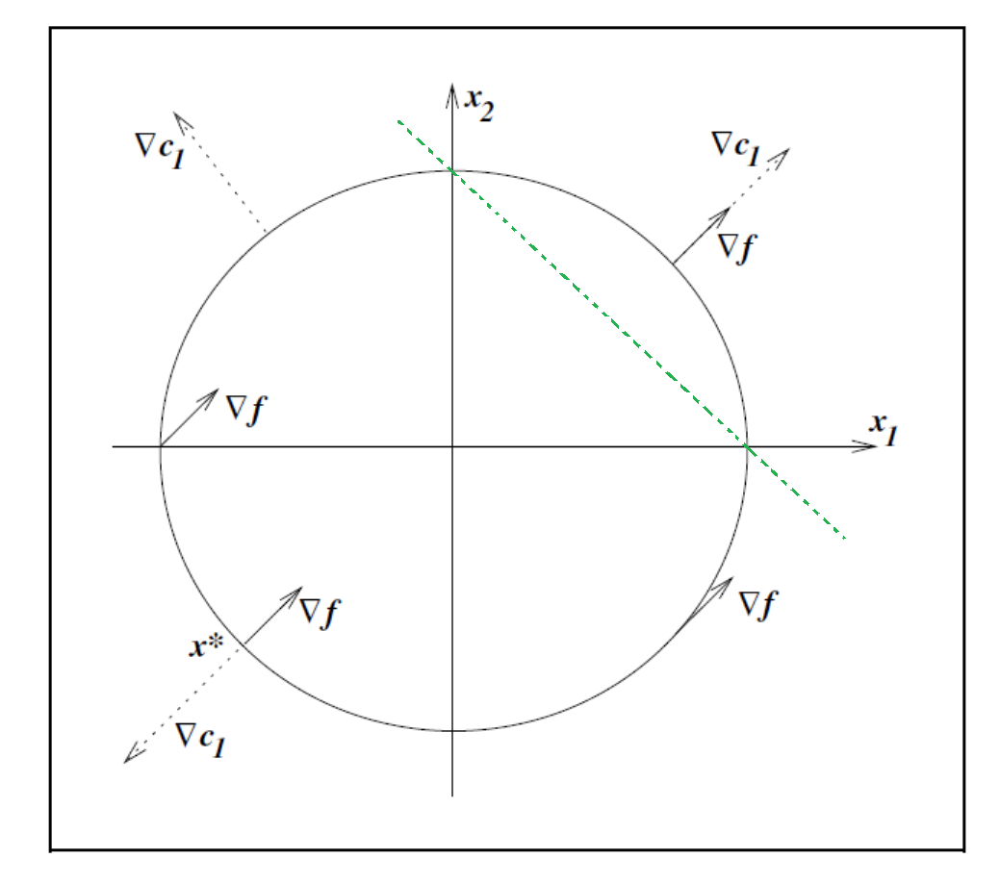
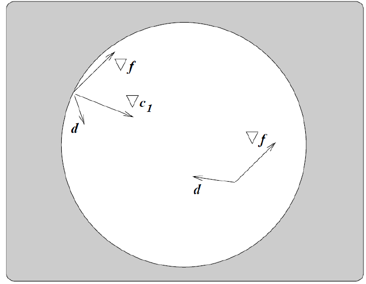
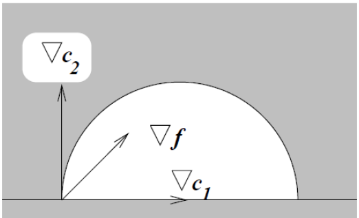
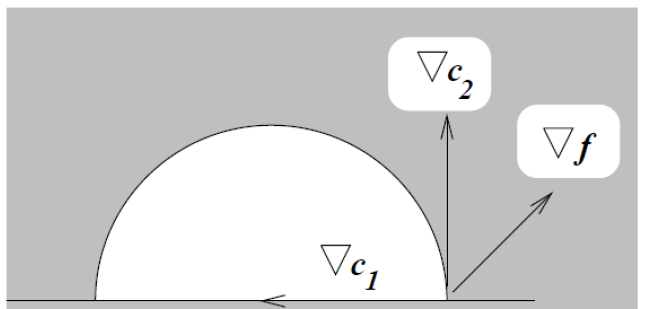
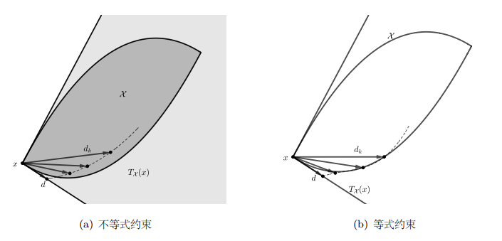

## 约束优化问题定义

约束非线性优化问题的形式如下：

$$
\min_{x\in R^n}f(x)\\
\text{s.t.}\ \ c_i(x)=0,\ i=1,\cdots,m_e;\\
c_i(x)\geq 0, i=m_e+1,\cdots,m
$$

其中 $f(x)$ 以及 $c_i(x)(i=1,\cdots,m)$ 都是定义在 $R^n$ 上的实值连续函数，并且至少有一个是非线性的。$m$ 正整数，$m_e$ 是介于 $0$ 和 $m$ 之间的整数。我们称 $f(x)$ 为目标函数，$c_i(x)(i=1,\cdots,m)$ 被称为约束函数 。如果 $m_e=m$，我们就将上述问题称为等式约束优化问题；如果 $c_i(x)(i=1,\cdots,m)$ 都是线性函数，我们就称上述问题为线性约束优化问题。对于一个线性约束优化问题，如果目标函数 $f(x)$ 是二次函数，我们就将其称为二次规划问题。

下面我们给出**可行点**和**可行域**的定义，$x\in R^n$ 被称为上述问题的可行点当且仅当等式约束和不等式约束都成立，所有可行点组成的集合被称为可行域。并且上面的等式约束和不等式约束统称为约束条件。容易知道，可行点就是所有满足所有约束条件的点，我们记可行域为 $X$:
$$
X=\{x|c_i(x)=0,\ i=1,\cdots,m_e;\ c_i(x)\geq 0, i =m_e+1,\cdots,m\}
$$
故求解约束优化问题，**就是在可行域 $X$ 上寻找一个点 $x$ 使得目标函数 $f(x)$ 达到最小**，我们给出解的精确定义如下：

设 $x^{*}\in X$，如果 

$$
f(x)\geq f(x^{*}),\forall x\in X
$$

我们就称 $x^{*}$ 是问题的全局极小点，如果对一切 $x\in X$ 且 $x\neq x^{*}$ 有

$$
f(x)>f(x^{*})
$$

我们就称 $x^{*}$ 是全局严格极小点，相应地也会有局部极小点的定义:

设 $x^{*}\in X$，如果对某一 $\delta>0$ 有

$$
f(x)\geq f(x^{*}),\ \forall x\in X\cap B(x^{*},\delta)
$$

就称 $x^{*}$ 是问题的局部极小点，这里 $B(x^{*},\delta)$ 是以 $x^{*}$ 为中心，以 $\delta$ 为半径的广义球，也即

$$
B(x^{*},\delta)=\{x|||x-x^{*}||_2\leq \delta\}
$$

如果对一切 $x\in X\cap B(x^{*},\delta)$ 且 $x\neq x^{*}$ 有 $f(x)>f(x^{*})$ 成立，则称 $x^{*}$ 是局部严格极小点。

下面我们给出**积极约束**和**非积极约束**的定义，假定 $x^{*}$ 是问题的一个局部极小点，如果有 $i_0\in [m_e+1,m]$（不等式约束）使得

$$
c_{i_0}(x^{*})>0
$$

则我们可以将第 $i_0$ 个约束条件去掉，且 $x^{*}$ 仍然是去掉第 $i_0$ 个约束条件所得到的问题的局部极小点，所以我们称第 $i_0$ 个约束在 $x^{*}$ 处是非积极的。

引入记号 $E=\{1,2,\cdots, m_e\},I=\{m_e+1,\cdots,m\},I(x)=\{i|c_i(x)\leq 0,i\in I\}$，则对任意 $x\in R^n$，我们称集合

$$
\mathcal{A}(x)=E\cup I(x)
$$

是在 $x$ 点的积极集合（满足等式约束和不等式约束取到等的点），$c_i(x),i\in \mathcal{A}(x)$ 是在 $x$ 点的积极约束（有效约束），$c_i(x),i\notin \mathcal{A}(x)$ 是在 $x$ 点的非积极约束（非有效约束）。

假设我们已经知道上述问题在解处的积极约束 $\mathcal{A}(x^{*})$，我们就只需要求解如下的等式约束优化问题

$$
\min_{x\in R^n}f(x)\\
\text{s.t.}\ \ c_i(x)=0,\ i\in \mathcal{A}(x^{*})
$$

我们就将其转化为了等式约束问题，一般来说，等式约束优化问题更容易求解。

## 例子和motivation

### 等式约束

**问题**：$\min x_1 + x_2$，**约束**：$x_1^2 + x_2^2 - 2 = 0$

如上图所示，这个例子的全局最优解为 $(-1,1)^T$，$x^{*}$ 的一个性质是 $\nabla f$ 和 $\nabla c_1$ 平行，但是方向相反。我们在 $c_1$ 上取任何非 $x^*$ 的点，则让 $x$ 保持在可行域内部的方向有两个，一个是顺时针，一个是逆时针，并且这两个方向中总有一个是和 $-\nabla f$ 成锐角的，也就是下降方向，直到 $x^{*}$ 点，$\nabla c_1$ 和 $\nabla f$ 平行，这时候沿 $c_1$ 的任何方向都和 $\nabla f$ 成直角，也即 $f$ 不会下降。换句话说，直观来讲，$x^{*}$ 满足的条件是

$$
\{\ x^*\ 的可行方向\}\cap\{\ f在\ x^*\ 的下降方向\ \}=\emptyset
$$

 下面我们做一些严格的分析，$\forall x\in \Omega$，保持 $x$ 停留在 $\Omega$ 内部的可行方向 $d$ 需要满足 $c_1(x+d)=0$，则由 Taylor 展开可以得到

$$
0=c_1(x+d)\approx c_1(x)+\nabla c_1(x)^Td=\nabla c_1(x)^Td
$$

并且如果$x$ 不是 $f$ 的局部极小值点，那么从 $x$ 出发，在可行域内部必然有 $f$ 的下降方向，同样在 Taylor 展开，则有

$$
0>f(x+d)-f(x)\approx \nabla f(x)^Td
$$

从而有 $\nabla f(x)^Td<0$

所以如果以上两个条件同时成立，就意味着我们可以找到一个从 $x$ 出发的方向 $d$，使得 $x+d$ 停留在 $\Omega$ 内部，并且 $f(x)$ 继续下降。所以**如果 $x$ 是问题的解，那么上述两点一定不能成立**，这样我们就得到了**一阶必要性条件：**唯有 $\nabla c_1$ 和 $\nabla f$ 平行，才不会出现既可行又下降的方向，也即
$$
\nabla f(x)=\lambda \nabla c_1(x),\lambda \in R
$$

!!! note "Tip"

    这里我们对梯度的要求是平行

我们引入 Lagrange 乘子函数
$$
L(x,\lambda_1)=f(x)-\lambda_1c_1(x)
$$
则平行条件等价于
$$
\nabla_xL(x,\lambda_1)=\nabla f(x)-\lambda_1\nabla c_1(x)=0
$$
所以约束优化问题解的必要条件可以表示为，**存在$\lambda_1^*\in R$，使得 $\nabla_xL(x^*,\lambda_1^*)=0$**，这里的 $\lambda_1$ 我们称为约束条件 $c_1(x)=0$ 对应的 Lagrange 乘子，显然这个条件不是充分的，比如该例子中还有一个可行点 $(1,1)^T$ 也满足这个条件，但它是极大指点

### 不等式约束

**问题**：$\min x_1 + x_2$，**约束**：$2 - x_1^2 - x_2^2 \ge 0$ 

此时可行域变为圆的内部和边界，最优解仍然是 $(-1,-1)^T$，并且 $\forall x\in \Omega$，为了确保 $x+d$ 停留在 $\Omega$ 内，则有
$$
c_1(x+d)\approx c_1(x)+\nabla c_1(x)^Td\geq 0
$$
并且使得 $f$ 下降的方向仍然是
$$
\nabla f(x)^Td<0
$$
下面我们分两种情况考虑：

**$x$ 在 $\Omega$ 内部：**也即 $c_1(x)>0$，此时任何 $d$ 都是可行方向，如果从 $x^*$ 出发的方向都不能同时满足两个条件（也即交集是空集），那么只剩下唯一的可能：
$$
\nabla f(x^*)=0
$$
这是无约束问题下对应的必要条件

**$x$ 在 $\Omega$ 边界：**也即 $c_1(x)=0$，此时又回到第一个例子的情形，如果 $x$ 出发还存在优化的可能方向，则必须满足
$$
\nabla f(x)^Td<0,\ \nabla c_1(x)^Td\geq 0
$$
这时第一个不等式限定了半个平面，第二个不等式限定了另外半个平面，而我们希望没有优化的可能方向，也即 $x$ 是局部最优解了，所以我们就希望两个半平面相交是空集，此时只有可能是 $\nabla f$ 和 $\nabla c_1(x)$ 是同向的，也即
$$
\nabla f(x)=\lambda_1 \nabla c_1(x),\lambda_1\geq 0
$$

!!! note "Tip"

    这里我们对梯度的要求更严格，需要同向

总结一下上面两种情况，可以统一为

$x^{*}$ 没有可行的下降方向（$x^*$ 是局部极小值点） $\iff$ 存在 $\lambda_1^*$，使得

$$
\nabla _x L(x^*,\lambda_1^*)=0,\ \lambda_1^*\geq 0
$$

并且

$$
\lambda_1^*c_1(x^*)=0
$$

!!! note "Tip"

    即在最优点处，要么约束是紧的，要么乘子为 $0$，我们将这个条件称为**互补性条件**

### 两个不等式约束

**问题**：$\min x_1 + x_2$，**约束**：$2 - x_1^2 - x_2^2 \ge 0 ,x_2\geq 0$

|  |  |
| ------------------------------------------------------------ | ------------------------------------------------------------ |

 此时最优解为 $x^*=(-\sqrt{2},0)^T$，并且两个约束都是活跃的。

如果某个 $x$ 不是一个最优值点，也就意味着从它出发还有进一步可以下降的方向，那么必然有方向 $d$ 满足
$$
c_i(x+d)\approx c_i(x)+\nabla c_i(x)^Td=\nabla c_i(x)^Td\geq 0\\
\nabla f(x)^Td<0
$$
第一个条件由于 $c_i(x)$ 是活跃的，有 $c_i(x)=0$；第二个条件代表 $d$ 是下降方向，显然最优解 $x^*=(-\sqrt{2},0)^T$ 不存在这个方向

同样我们可以定义 Lagrange 乘子函数
$$
L(x,\lambda)=f(x)-\lambda_1c_1(x)-\lambda_2c_2(x)
$$
这里 $\lambda=[\lambda_1,\lambda_2]^T$ 是 Lagrange 乘子，则 $\nabla f(x)$ 和 $c_i(x)$ 的关系可以表示为：存在 $\lambda^*\geq 0$，使得

$$
\nabla_xL(x^*,\lambda^*)=0
$$

且满足互补性条件 $\lambda_1^*c_1(x^*)=0,\lambda_2^*c_2(x^*)=0$

!!! note "Tip"

    互补性条件实际上是在说，一个约束要么是活跃的 $c_i(x)=0$，它就会在 $\nabla_xL(x,\lambda)=0$ 中参与，要么是不活跃的，也即 $\lambda_i=0$，则此时它在 $\nabla_xL(x,\lambda)=0$ 中实际上是不存在的

## 对偶理论

!!! warning "注意"

    由于参考的书籍有袁亚湘老师的《最优化理论与方法》、文再文老师的《最优化：建模、算法与理论》以及课上的PPT，记号可能不太一样，但各部分会在前面提一下这部分的记号使用。

    袁老师和课上PPT给出的不等式约束都是 $c_i(x)\geq 0$，此时 $\nabla c_i$ 指向可行域的内部；而文再文老师的书中不等式约束写的是 $c_i(x)\leq 0$，此时 $\nabla c_i$ 指向可行域的外部。这两种符号本质上没有区别，但是需要注意其最终的 Lagrange 函数的形式，以及 KKT 公式的形式会有一些区别，需要注意一下。

### 拉格朗日函数和对偶问题

从上面的例子我们可以看出，研究约束优化问题的一个重要工具是拉格朗日函数，它的基本思想是**给该问题中的每一个约束指定一个拉格朗日乘子，以乘子为加权系数将约束增加到目标函数中。**这里我们记 $\lambda_i$ 为对应于第 $i$ 个不等式约束的 Lagrange 乘子，$\nu_i$ 为对应于第 $i$ 个等式约束的 Lagrange 乘子。为了构造合适的对偶问题，我们的基本原则是对 Lagrange 乘子添加合适的约束条件，使得 $f(x)$ 在任意可行点 $x$ 处的函数值大于或等于相应 Lagrange 函数的值，根据这个原则，我们要求 $\lambda\geq 0$。记 $m=|I|,p = |E|$，则 Lagrange 函数的具体形式是 $L:R^n\times R_{+}^m\times R^p\to R$ 定义为
$$
L(x,\lambda,\nu)=f(x)-\sum_{i\in I}\lambda_ic_i(x)-\sum_{i\in E}\nu_ic_i(x)
$$

!!! warning "注意"

    文再文老师的书中用的是 $c_i(x)\leq 0$，此时 Lagrange 函数中的减号应当是加号，也即
    $$
    L(x,\lambda,\nu)=f(x)+\sum_{i\in I}\lambda_ic_i(x)+\sum_{i\in E}\nu_ic_i(x)
    $$

对 Lagrange 函数 $L(x,\lambda,\nu)$ 中的 $x$ 取下确界可以定义**Lagrange 对偶函数**

**Lagrange 对偶函数** $g$： $R_{+}^m\times R^p\to[-\infty,+\infty)$ 是 Lagrange 函数 $L(x,\lambda,\nu)$ 对于 $\lambda\in R_+^m,\nu\in R^p$ 关于 $x$ 取的下确界，即
$$
g(\lambda,\nu)=\inf_{x\in R^n} L(x,\lambda,\nu)
$$

固定 $(\lambda,\nu)$，如果 Lagrange 函数关于 $x$ 无界，那么对偶函数在 $(\lambda,\nu)$ 处的取值为 $-\infty$。因为 Lagrange 对偶函数是逐点定义的一族关于 $(\lambda,\nu)$ 的仿射函数的下确界，其为凹函数，这个性质能够帮助我们推导出许多拥有良好性质的算法。

对每一对满足 $\lambda\geq 0$ 的乘子对 $(\lambda,\nu)$，Lagrange 对偶函数 $g(\lambda,\nu)$ 给约束优化问题的最优值 $p^*$ 提供了下界，并且这个下界依赖于参数 $\lambda$ 和 $\nu$ 的选取。

**弱对偶原理** 对于任意的 $\lambda \geq0$ 和 $\nu$，Lagrange 对偶函数给出了优化问题最优值的一个下界，即

$$
g(\lambda,\nu)\leq p^*,\ \lambda \geq 0
$$

那么一个自然的问题是，从 Lagrange 对偶函数获得的下界中，哪个是最优的呢？为了求解这个最优的下界，就会有如下的 Lagrange 对偶问题

$$
\max_{\lambda\geq 0,\nu}g(\lambda,\nu)=\max_{\lambda\geq 0,\nu} \inf_{x\in R^n} L(x,\lambda,\nu)
$$

向量 $\lambda$ 和 $\nu$ 我们也称为约束优化问题的对偶变量或者 Lagrange 乘子向量，由于 $g(\lambda,\nu)$ 是凹函数以及约束集合的凸性，Lagrange 对偶问题是一个凸优化问题。当 $g(\lambda,\nu)=-\infty$ 时，对偶函数提供的 $p^*$ 的下界变得没有实际意义；只有当 $g(\lambda,\nu)>-\infty$ 时，对偶函数生成的关于原始问题的最优解 $p^*$ 的下界才是非平凡的，因此我们规定 Lagrange 对偶函数的定义域

$$
\mathbf{dom} \ g=\{(\lambda,\nu)|\lambda \ge0,g(\lambda,\nu)>-\infty\}
$$

当 $(\lambda,\nu)\in \mathbf{dom} \ g$ 时，称其为**对偶可行解**，记对偶问题的最优值为 $q^*$，称 $p^*-q^*(\geq 0)$ 为对偶间隙。如果对偶间隙为 $0$，也即 $p^*=q^*$，称**强对偶原理**成立。假设 $(\lambda^*,\nu^*)$ 是使得对偶问题取得最优值的解，称其为**对偶最优解**或者最优 Lagrange 乘子

!!!note "Tip"

    推导 Lagrange 对偶问题最重要的是能把 Lagrange 对偶函数的具体形式方便地写出来，并且 Lagrange 对偶问题的写法并不唯一

### Wolfe 对偶

为了计算简便，对偶问题有一个更简洁的形式，Wolfe 对偶。Wolfe 对偶并没有像标准 Lagrange 对偶那样先求 $\inf_{x}L(x,\lambda)$，而是直接把一阶驻点条件加入到了约束中
$$
\max_{x,\lambda}\ L(x,\lambda)\\
\text{s.t.}\nabla_x\ L(x,\lambda)=0,\lambda\geq 0
$$
换句话说，Wolfe 对偶找的是 Lagrange 函数 $L(x,\lambda)$ 的驻点处的最大值

并且有这样一个定理保证 Wolfe 对偶的有效性

如果目标函数 $f$ 和约束函数 $-c_i$ 都是凸可微的，$(\overline{x},\overline{\lambda})$ 是主问题的一组解，并且满足 LICQ，那么 $(\overline{x},\overline{\lambda})$ 也是 Wolfe 对偶问题的一组解。

!!! note "Tip"

    具体例题可以参考 PPT

## 约束优化问题的最优性理论

在前面的分析中，考虑是否存在可行的下降方向时，我们是用一阶 Taylor 展开进行分析的，这是建立在一阶线性展开能够捕捉可行域的几何性质的基础上；而如果在 $x$ 附近，一阶 Taylor 展开和可行域相差巨大，一阶线性逼近就不能很好地近似原问题。所以我们需要对活跃的约束条件 $c_i$ 在 $x$ 处的性质加以限制，以保证一阶 Taylor 展开能够很好地近似真实的可行域。

### 一阶最优性条件

在给出最优性条件之前，我们先介绍一些必要的概念

#### 切锥和约束品性

##### 切锥和线性化可行方向锥

**切锥** 给定可行域 $\Omega$ 以及其内的一点 $x$，若存在可行序列 $\{z_k\}_{k=1}^{\infty}\in \Omega$ 逼近 $x$（即 $\lim_{k\to\infty}z_k=x$）以及正标量序列 $\{t_k\}_{k=1}^{\infty},t_k\to0$ 满足
$$
\lim_{k\to \infty}\frac{z_k-x}{t_k}=d
$$
则称向量 $d$ 为 $\Omega$ 在点 $x$ 处的一个切向量，点 $x$ 处的所有切向量构成的集合称为**切锥**，我们用 $T_{\Omega}(x)$ 表示

我们可以看一个直观的例子

左图中，深色部分 $\chi$ 表示两个不等式约束限定的区域，点 $x$ 处的切锥 $T_{\chi}(x)$ 为图中的浅色区域；右图则是考虑等式约束，此时可行域 $\chi$ 对应左图可行域的边界，此时切锥 $T_{\chi}(x)$ 是点 $x$ 处与 $\chi$ 相切的两条射线。

一般情况下，我们不能直接利用局部极小点的定义去判断 $x^{*}$ 是否为局部解，因为 $X\cap B(x^{*},\delta)$ 通常有无穷多个点，我们无法进行验证。因此我们有必要给出只依赖在 $x^{*}$ 点处目标函数和约束函数信息的，且与定义等价的条件，我们称之为**最优性条件**。

此时我们可以从几何上刻画约束优化问题的最优性条件，我们同样要求切锥（可行方向集合）不包含使得目标函数值下降的方向，则有下面的一阶必要条件（几何最优性条件）

**几何最优性条件** 假设 $x^*$ 是约束优化问题的一个局部极小值点，如果 $f(x),c_i(x),i\in I\cup E$ 在点 $x^*$ 处是可微的，那么

$$
d^T\nabla f(x^*)\geq 0\qquad \forall d\in T_{\Omega}(x^*)
$$

等价于 $T_{\Omega}(x^*)\cap\{\nabla f(x^*)^Td<0\}=\emptyset$

但切锥是根据可行域的几何性质来定义的，其计算并不容易，所以我们希望能够找到一个代数方法来计算可行方向，进而更容易地判断最优性条件，所以我们给出一个更容易计算的可行方向集合的定义——**线性化可行方向锥**

**线性化可行方向锥** 对于可行点 $x\in \Omega$，点 $x$ 处的线性化可行方向锥定义为

$$
\mathcal{F}(x) = \{ d \;|\;
\begin{array}{l}
d^T\nabla c_i(x) = 0,\ \forall\ i \in E, \\
d^T\nabla c_i(x) \geq 0,\ \forall\ i \in \mathcal{A}(x) \cap I
\end{array}
\}
$$

!!! note "Tip"

    注意这里我们用的是 $c_i(x)\geq0$ 类的记号，如果采用的是 $c_i(x)\leq 0$，第二条应该改成 $d^T\nabla c_i(x)\leq0$，因为我们实际上是希望积极的不等式约束在方向 $d$ 上仍然满足，如果用 $c_i(x)\geq 0$，方向 $d$ 就应当使得 $c_i(x)$ 是不减的，也就是 $d^T\nabla c_i(x)\geq 0$，采用另一种类似可得。

    直观来讲，线性化可行方向锥中的向量**应该保证和等式约束中函数的梯度垂直，这样才能够尽量保证 $c_i(x),i\in E$ 的值不变；而对积极集 $\mathcal{A}(x)\cap I$ 中的指标 $i$，沿着该向量 $c_i(x)$ 的值不能减小，因此线性化可行方向对 $c_i(x),i\in \mathcal{A}(x)\cap I$ 可以是一个上升方向（如果用的是 $c_i(x)\leq 0$ 就应该是下降方向；而对非积极集中的约束，则无需提出任何对线性化可行方向的要求）**

线性化可行方向锥一般比切锥更大，实际上有如下定理

设 $c_i(x),i\in E\cup I$ 一阶连续可微，则对任意可行点 $x$ 有
$$
T_{\Omega}(x)\subset \mathcal{F}(x)
$$

!!! note "Tip"

    实际上，线性化可行方向锥 $\mathcal{F}(x)$ 不仅受问题可行域 $\Omega$ 的影响，还会受到 $\Omega$ 的代数表示方式的影响，在不改变 $\Omega$ 的条件下改变定义 $\Omega$ 的等式/不等式的数学形式会影响 $\mathcal{F}(x)$ 包含的元素；而切锥 $T_{\Omega}(x)$ 的定义则直接依赖于可行域 $\Omega$，不受到 $\Omega$ 代数表示方式的影响。

从上述讨论中我们知道，线性化可行方向锥容易计算和使用，但是会被问题形式所影响；而切锥更直接地体现了可行域 $\Omega$ 的性质，却很难计算。所以为了刻画线性化可行方向锥 $\mathcal{F}(x)$ 和切锥 $T_{\Omega}(x)$ 之间的关系，我们引入**约束品性**的概念，大部分的约束品性是为了保证在最优点 $x^*$ 处有 $\mathcal{F}(x^*)=T_{\Omega}(x^*)$，使得我们能够使用 $\mathcal{F}(x)$ 代替 $T_{\Omega}(x)$，进而更方便地研究约束最优化问题的最优性条件。

##### 约束品性

**线性无关约束品性** 给定可行点 $x$ 以及相应的积极集 $\mathcal{A}(x)$，如果积极集对应的约束函数的梯度，即 $\nabla c_i(x),i\in\mathcal{A}(x)$ 是线性无关的，则称**线性无关约束品性(LICQ)在点 $x$ 处成立**

当 LICQ 成立时，切锥和线性化可行方向锥是相同的，也即如下定理

**给定任意可行点 $x\in \Omega$，如果在该点处 LICQ 成立，则有 $T_{\Omega}(x)=\mathcal{F}(x)$**

关于 LICQ 的一个常用推广是 Mangasarian-Fromovitz 约束品性，简称 MFCQ

**MFCQ** 给定可行点 $x$ 以及相应的积极集 $\mathcal{A}(x)$，如果存在一个向量 $\omega\in R^n$，使得
$$
\nabla c_i(x)^T\omega>0,\forall i\in \mathcal{A}(x)\cap I\\
\nabla c_i(x)^T\omega = 0,\forall i\in E
$$
并且等式约束对应的梯度集 $\{\nabla c_i(x),i\in E\}$ 是线性无关的，则称 MFCQ 在点 $x$ 处成立。

!!! note "Tip"

    需要注意的是，MFCQ 中的向量 $\omega$ 本质上就是一个严格可行方向，所以如果我们使用的是 $c_i(x)\geq 0$，MFCQ 的第一条应当是 $\nabla c_i(x)^T\omega >0$；如果我们使用的是 $c_i(x)\leq 0$，则 MFCQ 的第一条应当是 $\nabla c_i(x)^T\omega<0$

    MFCQ 其实是 LICQ 的一个弱化版本

另一个用来保证 $T_{\Omega}(x)=\mathcal{F}(x)$ 的约束品性是线性约束品性

**线性约束品性** 如果所有的约束函数 $c_i(x),i\in I\cup E$ 都是线性的，则称线性约束品性成立。

当线性约束品性成立时，也有 $T_{\Omega}(x)=\mathcal{F}(x)$，因此对只含线性约束的优化问题，例如线性规划、二次规划，很自然地有 $T_{\Omega}(x)=\mathcal{F}(x),\forall x$，我们也不再需要考虑约束函数的梯度是否线性相关。并且一般来说，线性约束品性和 LICQ 之间没有互相包含的关系。

#### Karush-Kuhn-Tucker（KKT）条件

由上一节的讨论中，我们知道，如果在局部最优解 $x^*$ 处有
$$
T_{\Omega}(x^*)=\mathcal{F}(x^*)
$$
成立（比如如果 LICQ 在点 $x^*$ 处成立），那么集合

$$
\left\{ d \;\middle|\;
\begin{array}{l}
d^T\nabla f(x^*)<0
\\
d^T\nabla c_i(x) = 0,\ \forall\ i \in E, \\
d^T\nabla c_i(x) \geq 0,\ \forall\ i \in \mathcal{A}(x) \cap I
\end{array}
\right\}
$$

是空集，但上式的验证仍然是非常麻烦的，我们试图将其转化为一个更简洁的形式。下面我们先介绍 Farkas 引理

**Farkas 引理** 设 $p$ 和 $q$ 为两个非负整数，给定向量组 $\{a_i\in R^n,i=1,2,\cdots,p\},\{b_i\in R^n,i=1,2,\cdots,q\}$ 和 $c\in R^n$，满足以下条件：
$$
d^Ta_i=0,\ i=1,2,\cdots,p\\
d^Tb_i\geq 0,i=1,2,\cdots,q,\\
d^Tc<0
$$
的 $d$ 不存在当前仅当存在 $\lambda_i,i=1,2,\cdots,p$ 和 $\mu_i\geq 0,i=1,2,\cdots,q$ 使得
$$
c=\sum_{i=1}^p\lambda_ia_i+\sum_{i=1}^q \mu_ib_i
$$
我们在上式中取 $a_i=\nabla c_i(x^*),i\in E,b_i=\nabla c_i(x^*),i\in \mathcal{A}(x^*)\cap I$ 以及 $c=\nabla f(x^*)$，所以本节最开始讲的集合成立就等价于下式成立

$$
\nabla f(x^*)=\sum_{i\in E}\lambda_i^*\nabla c_i(x^*)+\sum_{i\in\mathcal{A}(x^*)\cap I}\lambda_i^*\nabla c_i(x^*)
$$

其中 $\lambda_i^*\in R,i\in E;\lambda_i^*\geq 0,i\in \mathcal{A}(x^*)\cap I$，如果我们补充定义 $\lambda_i^*=0,i\in I\backslash\mathcal{A}(x^*)$，则有

$$
\nabla f(x^*)=\sum_{i\in I\cup E}\lambda_i^*\nabla c_i(x^*)
$$

这正对应于 Lagrange 函数关于 $x$ 的一阶最优性条件，并且对于 $i\in I$，我们注意到

$$
\lambda_i^* c_i(x^*)=0
$$

上式称为**互补松弛条件**，这个条件表明对不等式约束，以下两种情况至少出现一种：

- 乘子 $\lambda_i^*=0$
- $c_i(x^*)=0$，即 $i\in \mathcal{A}(x^*)\cap I$

以上两种情况恰好只有一种满足时，我们称此时**严格互补松弛条件**成立。一般来说，具有严格互补松弛条件的最优值点有比较好的性质，算法收敛得很快。

综上所述，我们有如下一阶必要条件，也称作 KKT 条件，并将满足 KKT 条件的变量对 $(x^*,\lambda^*)$ 为 KKT 对

**KKT 条件** 假设 $x^*$ 是约束优化问题的一个局部最优点，如果

$$
T_{\Omega}(x^*)=\mathcal{F}(x^*)
$$

成立，那么存在 Lagrange 乘子 $\lambda_i^*$ 使得如下条件成立

$$\begin{align}
\text{稳定性条件} \qquad \nabla_xL(x^*,\lambda^*)=\nabla f(x^*)-\sum_{i\in I\cup E}\lambda_i^*\nabla c_i(x^*)=0\\
\text{原始可行性条件}\qquad c_i(x^*)=0,\forall i\in E\\
\text{原始可行性条件}\qquad c_i(x^*)\geq 0,\forall i\in I\\
\text{对偶可行性条件}\qquad \lambda_i^*\geq0,\forall i\in I\\
\text{互补松弛条件}\qquad \lambda_ic_i(x^*)=0,\forall i\in I
\end{align}$$

!!! warning "注意"

    注意采用的 $c_i(x)\geq0$ 还是 $c_i(x)\leq 0$，记号体系的不同会影响部分定理的形式

我们称满足上式的点 $x^*$ 为 KKT 点，但需要注意的是，KKT 条件实际上只给出了切锥和线性化可行方向锥相同时的最优性条件，换句话说，如果在局部最优点 $x^*$ 处 $T_{\Omega}(x^*)\neq \mathcal{F}(x^*)$，那么 $x^*$ 不一定是 KKT 点。同样地，因为 KKT 条件是必要条件，KKT 点不一定是局部最优点。

### 二阶最优性条件

对于约束优化问题，我们知道，如果存在一个点 $x^*$ 满足 KKT 条件，那么沿着任意线性化可行方向目标函数的一阶近似是不会下降的，此时一阶条件无法判断 $x^*$ 是否是最优值点，我们就需要用二阶信息来进一步判断在其可行邻域内的目标函数值。

我们假设 $T_{\Omega}(x^*)=\mathcal{F}(x^*)$，需要判断满足 $d^T\nabla f(x^*)=0$ 的线性化可行方向 $d$ 是否为 $f(x^*)$ 的下降方向，我们以 Lagrange 函数在这些方向上的曲率信息为桥梁来判断点 $x^*$ 处的最优性，下面我们先给出临界锥的定义

**临界锥** 设 $(x^*,\lambda^*)$ 满足 KKT 条件，定义临界锥为

$$
C(x^*,\lambda^*)=\{d\in \mathcal{F}(x^*)|\nabla c_i(x^*)^Td=0,\forall i\in \mathcal{A}(x^*)\cap I \text{且} \lambda_i^*>0\}
$$

其中 $\mathcal{F}(x^*)$ 为点 $x^*$ 处的线性化可行方向锥

容易知道，临界锥是线性化可行方向锥 $\mathcal{F}(x^*)$ 的子集，沿着临界锥中的方向进行优化，所有等式约束和 $\lambda_i^*>0$ 对应的不等式约束（积极约束）都会尽量保持不变，对于一般地 $d\in \mathcal{F}(x^*)$ 我们仅仅能保证 $d^T\nabla c_i(x^*)\geq 0$

利用上述定义，我们可以得到

$$
d\in C(x^*,\lambda^*)\Rightarrow\lambda_i^*\nabla c_i(x^*)^Td=0,\forall i\in E\cup I\\
$$

更进一步地

$$
d\in C(x^*,\lambda^*)\Rightarrow d^T\nabla f(x^*)=\sum_{i\in E\cup I}\lambda_i^*d^T\nabla c_i(x^*)=0
$$

也就是说，临界锥定义的线性化可行方向是我们无法只利用一阶导数就判断出下降还是上升的方向，此时我们必须引入高阶导数信息加以判断，这里我们给出如下的二阶最优性条件。

**二阶必要条件** 假设 $x^*$ 是约束优化问题的一个局部最优解，并且 $T_{\Omega}(x^*)=\mathcal{F}(x^*)$ 成立，我们令 $\lambda^*$ 为相应的 Lagrange 乘子，也即 $(x^*,\lambda^*)$ 满足 KKT 条件，那么

$$
d^T\nabla_{xx}^2L(x^*,\lambda^*)d\geq 0,\ \forall d\in C(x^*,\lambda^*)
$$

**二阶充分条件** 假设在可行点 $x^*$ 处，存在一个 Lagrange 乘子 $\lambda^*$，使得 $(x^*,\lambda^*)$ 满足 KKT 条件，如果

$$
d^T\nabla_{xx}^2L(x^*,\lambda^*)d>0,\ \forall d\in C(x^*,\lambda^*),d\neq 0
$$

那么 $x^*$ 为约束优化问题的一个严格局部极小解

!!! note "Tip"

    例子可以参考文再文老师的书和PPT，自己手算一遍

