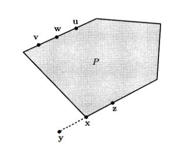
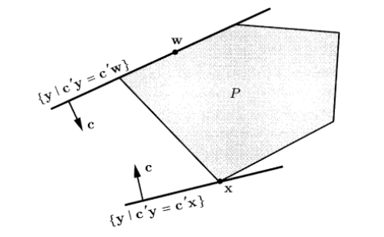
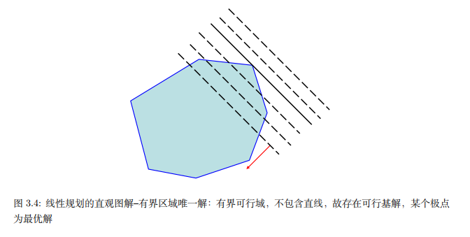
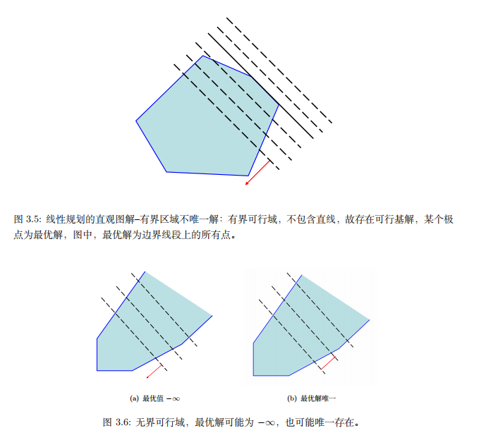

# 线性规划

## 线性规划问题概述

### 线性规划一般形式

针对实际问题，可以列出如下问题形式

$$\begin{align}
\min(\max)\ \ z=c_1x_1+\cdots+c_nx_n\\
\text{s.t.}\ \  a_{11}x_1+\cdots+a_{1n}x_{n}\leq(=,\geq)b_1\\
\vdots\\
a_{m1}x_1+\cdots+a_{mn}x_n\leq(=,\geq)b_m
\end{align}$$

我们可以把上式转化为如下的一般形式

$$\begin{aligned}
\min\ \ c_1x_1+\cdots+c_nx_n\\
\text{s.t.}\ \  a_{11}x_1+\cdots+a_{1n}x_n\geq b_1\\
\vdots\\
a_{m1}x_1+\cdots+a_{mn}x_n\geq b_m
\end{aligned}$$

若优化目标为最大化(Maximize)函数值，则可以在目标函数中添加负号得到等价的最小化(Minimize)的问题。如果约束中既有 $\leq$ 也有 $\geq$，也可以通过改变符号的方式统一为 $\geq$ 约束

所以，我们有线性规划矩阵的一般形式为

$$
\min \ \ c^Tx\\
\text{s.t.} \ \ Ax\geq b
$$

并且线性规划的约束都是凸多面体

### 线性规划标准形式

线性规划问题总可以写成如下标准形式：

$$\begin{align}
\min \ \ \sum_{j=1}^nc_jx_j\\
\text{s.t.} \ \ \sum_{j=1}^n a_{ij}x_j=b_i,i=1\cdots,m\\
x_{j}\geq 0,j=1,\cdots,n
\end{align}$$

或者用矩阵表示为

$$
\min c^Tx\\
\text{s.t.}\ \  Ax=b\\
x\geq 0
$$

其中矩阵 $A\in R^{m\times n}$，$c$ 是 $n$ 维列向量，$b$ 是 $m$ 维列向量，$x\geq 0$ 表示所有分量 $x_i\geq 0$。

对于非标准形式，我们可以做以下几个标准化步骤：

- 目标函数 $\max f(x)\to \min -f(x)$
- 不等式约束的等式化（比如引入松弛变量或者剩余变量）
- 自由变量的非负化

!!! note "Tip"

    事实上，线性规划的一般形式和标准形式是等价的。

    两个优化问题等价是指，对于一个优化问题的可行解，我们总可以找到另一个问题对应的可行解，使得它们的目标函数值相等。一个条件更弱的阐释是：如果给定一个问题的最优解，可以构造出另一个问题的最优解，并且最优值相同，那么两个优化问题等价。

    比如对于线性规划一般形式
    $$
    \min\ \ c_1x_1+\cdots+c_nx_n\\
    \text{s.t.}\ \  a_{11}x_1+\cdots+a_{1n}x_n\geq b_1\\
    \vdots\\
    a_{m1}x_1+\cdots+a_{mn}x_n\geq b_m
    $$
    我们可以引入松弛变量 $s\in R^m,s\geq 0$，使得有等式 $Ax-s=b$ 成立，并且可以将 $x$ 记为 $x'-x'',x'\geq0,x''\geq0$，因为任意实数总可以写成两个非负实数的差，所以问题可以写为
    $$
    \min \ \ c^Tx'-c^Tx''+0_m^Ts\\
    \text{s.t.}\ \ Ax'-Ax''-s=b\\
    x'\geq 0,x''\geq0,s\geq0
    $$
    这里 $0_m$ 表示 $m$ 维零向量，令 $\overline{c}^T=(c^T,-c^T,0_m^T),\overline{A}=[A,-A,-I_m]$，这里 $I_m$ 表示 $m\times m$ 的单位矩阵，$\overline{x}^T=((x')^T,(x'')^T,s^T)$，我们就可以得到
    $$
    \min \ \overline{c}^T\overline{x}\\
    \text{s.t.} \ \ \overline{A}\overline{x}=b\\
    \overline{x}\geq0
    $$
    这就是线性规划的标准形式。

## 线性规划基本理论

### 线性规划基本理论

我们在这里考虑一般形式，记可行域为 $P=\{x\in R^n|Ax\geq b\}$，在线性规划中，约束条件均为线性等式或线性不等式，所以可行域 $P$ 是凸集。如果我们处理过简单的线性规划问题，画图的时候我们会发现，其最优解是在某个顶点处取得的，这就产生了一个很自然的问题，在一般情况下，线性规划的最优点是否仍然是 $P$ 的某个顶点，下面我们给出几个定义

#### 顶点、极点、基解和可行基解

我们记 $P=\{x\in R^n|Ax\geq b\}$ 为一个凸多面集，并且我们仍然将 $P$ 中的等式约束集记为 $E$，即 $a_i^Tx=b_i,i\in E$，不等式约束集记为 $I$，也即 $a_i^Tx\geq b_i,i\in I$

- **极点(extreme point)：**如果 $\hat{x}\in P$ 不能被表示为其他两个可行点的凸组合，那么 $\hat{x}\in P$ 被称为 $P$ 的极点，换句话说，如果我们找不到不同于 $\hat{x}$ 的两个点 $x^{(1)},x^{(2)}\in P$ 和 $\lambda\in[0,1]$，使得 $\hat{x}=\lambda x^{(1)}+(1-\lambda)x^{(2)}$，那么 $\hat{x}\in P$ 就被称为 $P$ 的极点。

  如下图所示，$w$ 是 $v$ 和 $u$ 的凸组合，故 $w$ 不是极点；$x$ 是极点，因为如果有 $x=\lambda y+(1-\lambda)z,\lambda\in[0,1]$，那么有 $y\notin P$ 或 $z\notin P$ 或 $x=y$ 或 $x=z$
  
  

- **顶点(vertex)：**如果存在某个 $c\in R^n$，使得 $c^T\hat{x}<c^Ty,\forall y\in P,y\neq \hat{x}$，就称 $\hat{x}$ 是 $P$ 的顶点；换句话说，当且仅当 $P$ 在超平面 $\{y|c^Ty=c^T\hat{x}\}$ 的一侧，并且 $P$ 恰好与该超平面相交于 $\hat{x}$，就称 $\hat{x}$ 是 $P$ 的顶点。

  如下图所示，$x$ 是顶点，$w$ 不是顶点

  

- **基解(basic solution)和可行基解(basic feasible solution)：**我们先给出线性规划中的积极约束、积极集，定义都是类似的。考虑约束 $P=\{x|Ax\geq b\}=\{x|a_i^Tx\geq b_i,i=1,2,\cdots,m\}$，如果 $a_i^T\overline{x}=b_i$，我们就称约束 $a_i^Tx\geq b_i$ 对于点 $\overline{x}$ 是积极约束，并且将积极约束的下标集记为 $\mathcal{A}=\{i:a_i^T\overline{x}=b_i,i=1,2,\cdots,m\}$，称 $\mathcal{A}$ 为积极集，并且和我们在前面讲到的约束优化理论等价的，有
  $$
  \mathcal{A}=E\cup \{i\in I|a_i^T\overline{x}=b_i\}
  $$
  下面我们给出基解和可行解的定义

  **基解** 如果

  - 所有 $P$ 中的等式约束（若有）都成立
  - 所有积极集 $\mathcal{A}=\{i|a_i^T\hat{x}=b_i,i=1,2,\cdots,m\}$ 中，存在 $n$ 个下标 $i$，使得 $a_i$ 线性无关

  就称 $\hat{x}$ 为一个基解（第二条是针对整个积极集提的约束，但等式约束已经天然成立了）

  但由基解的定义，其实际上满足的是等式约束和不等式约束中活跃的部分，我们尚未验证基解是否满足不等式约束中不活跃的部分，这就引出了可行基解

  **可行基解** 一个基解如果也是可行解，我们就称其为一个**可行基解（BFS）**

下面我们给出一个定理

如果 $P=\{x|Ax\geq b\}$ 是一个非空多面集，$x\in P$，那么下面三种情况是等价的：

- $x$ 是顶点
- $x$ 是极点
- $x$ 是可行基解

#### 线性规划标准形式的可行基解

我们考虑线性规划标准形式的可行基解
$$
\min c^Tx\\
\text{s.t.}\ \ Ax=b\\
x\geq 0
$$
其中矩阵 $A\in R^{m\times n}$，$c$ 是 $n$ 维列向量，$b$ 是 $m$ 维列向量，$x\geq 0$ 表示所有分量 $x_i\geq 0$

我们有如下定理：

考虑约束 $Ax=b$ 和 $x\geq 0$，并假设 $m\times n$ 矩阵 $A$ 的所有行向量是线性无关的，向量 $x\in R^n$ 是基解当且仅当我们有 $Ax=b$，并且存在下标 $B(1),\cdots,B(m)$ 使得

- 矩阵 $A$ 中的列向量 $A_{B(1),\cdots,A_{B(m)}}$ 是线性无关的
- 如果 $i\neq B(1),\cdots,B(m)$，那么 $x_i=0$

!!! note "Tip"

    只需要在矩阵 $A$ 中挑出线性无关的 $m$ 列，解方程把对应的变量算出来，剩余的变量全设为 $0$，我们就得到了一个基解（顶点）

不失一般性，我们假设 $A=(B,N)$，其中 $B$ 是 $m$ 阶可逆矩阵，同时我们记 $x=(x_B^T,x_N^T)^T$，其中 $x_B$ 的分量和 $B$ 中的列对应，$x_N$ 的分量与 $N$ 中的列对应，这样 $Ax=b$ 即可以写为
$$
(B,N)(x_B,x_N)^T=b
$$
也即 $Bx_B+Nx_N=b$，从而有 $x_B=B^{-1}b-B^{-1}Nx_N$

**基解/基矩阵**

在上式中，$x_N$ 的分量就是线性方程组 $Ax=b$ 的自由变量，我们令 $x_N=0$，则可以得到解
$$
x=[x_B,x_N]^T=[B^{-1}b,0]^T
$$
为方程组的一个解，对应的 $B$ 我们称为基矩阵，$x_B$ 的各分量称为基变量，$x_N$ 的各分量称为非基变量，如果 $B^{-1}b\geq 0$，则 $x=[B^{-1}b,0]^T$ 为线性规划的可行基解，相应的 $B$ 为可行基矩阵，$x_B=[x_{B_1},\cdots,x_{B_m}]$ 为一组可行基变量

#### 可行基解的存在性和最优性

我们先给出**包含直线**的定义，对于一个多面集 $P=\{x|Ax\geq b\}\subset R^n$，如果存在 $x\in P$ 和一个非零向量 $d\in R^n$，使得对于任意实数 $\lambda$，有 $x+\lambda d\in P$，那么称 $P$ 包含一条直线

**极点存在性定理** 假设 $P=\{x|Ax\geq b\}\subset R^n$ 非空，则下列两种情况等价：

- $P$ 中存在至少一个极点
- $P$ 不包含直线

对于非空有界的多面集，或者非空的标准形式多面集，它们显然不包含直线，所以必然有可行基解

**可行基解最优性** 考虑线性规划问题，在多面集 $P=\{x|Ax\geq b\}$ 上，最小化 $c^Tx$，假设 $P$ 中存在至少一个极点，并且存在最优解，那么必定有某个极点是最优解

**可行基解最优性** 考虑线性规划问题，在多面集 $P=\{x|Ax\geq b\}$ 上，最小化 $c^Tx$，假设 $P$ 中存在至少一个极点，那么，要么最优值是 $-\infty$，要么必定有某个极点是最优解

!!! warning "注意"

    这两个定理的假设有所区别，上面的假设存在最优解；而下面则分为最优值有限和无限两种情况。

**推论：**若线性规划问题的可行域非空，则要么最优值为 $-\infty$，要么存在最优解。但该推论对于一般的非线性规划问题是不成立的。

由于标准形式至少存在一个极点，所以我们有如下结论

**线性规划标准形式最优性结论** 考虑线性规划问题，假设标准形式多面集 $P=\{x|Ax=b,x\geq 0\}$ 非空，那么，要么最优值是 $-\infty$，要么必定有某个极点是最优解

由上述定理，我们有如下标准形式最优解的分类约定：

- 可行域为空 $\Rightarrow$ 无解
- 可行域有界 $\Rightarrow$ 唯一解或无穷多解
- 可行域无界 $\Rightarrow$ 唯一解或无穷多解或最优值为 $-\infty$

我们把唯一解、无穷多解称为模型存在最优解；把无界解 $-\infty$ 归入不存在最优解的情形

下面给出一些直观的图解

### 总结

当线性规划标准形式存在最优解时，目标函数的最优值一定能在可行域的某个极点出达到，也即线性规划存在最优解时，一定存在一个可行基解时最优解

这样，**线性规划模型的求解（最优解）归结为求最优可行基解**，这一思想正是单纯形法的出发点，但可行基解的个数往往是很多的，没法一一枚举，我们该采取什么策略呢？下面我们介绍单纯形法

## 基于对偶理论的线性规划

由于浙大《优化实用算法》对线性规划的讲解放在了约束优化最优性条件、对偶理论之后，其对线性规划的讲解就变得比较简略，这里为了暂时应对课程的进度，将 PPT 的内容和体系做一点梳理。

### Lagrange 函数和 KKT 条件

对于线性规划标准形式问题，我们可以构造 Lagrange 函数
$$
L(x;\lambda,s)=c^Tx-\lambda^T(Ax-b)-s^Tx
$$
其中 $\lambda$ 是等式约束的乘子，$s$ 是不等式约束的乘子。

接着我们考虑 KKT 条件：

- 稳定性条件
  $$
  \nabla_x L(x;\lambda,s)=c-A^T\lambda-s=0
  $$
  并且由此导出的 KKT 条件为

$$\begin{align}
\text{稳定性条件}\ \ A^T\lambda+s=c\\
\text{原始可行性条件}\ \ Ax=b\\
\text{原始可行性条件}\ \ x\geq 0\\
\text{对偶可行性条件}\ \ s\geq 0\\
\text{互补松弛条件}\ \ s^Tx=0\text{或}x_is_i=0,\ \ i=1,\cdots,n
\end{align}$$

!!! note "Tip"

    需要指出的是，对于一般的非线性规划问题，KKT 只是必要条件；但是对于线性规划，KKT 条件是充要条件（对于凸优化问题满足 KKT 条件的点一定是全局最优解），下面我们对于线性规划给出证明：

    如果我们找到一组 $(x^*,\lambda^*,s^*)$ 满足 KKT 条件，那么根据互补松弛条件 $s^Tx=0$ 和稳定性条件可以得到

    $$
    c^Tx^*=(A^T\lambda^*+s^*)^Tx^*=(Ax^*)^T\lambda^*=b^T\lambda^*
    $$

    也即主问题的目标值=对偶问题的目标值。而对于其他的任意可行解 $\overline{x}$（满足 $A\overline{x}=b,\overline{x}\geq 0$），有

    $$
    c^T\overline{x}=(A^T\lambda^*+s^*)^T\overline{x}=b^T\lambda^*+\overline{x}^Ts^*
    $$

    由于 $\overline{x}\geq 0,s^*\geq 0$，所以 $\overline{x}^Ts^*\geq 0$，从而有 $c^T\overline{x}\geq c^Tx^*$，也即只要满足 KKT 条件，该点 $x^*$ 一定是全局最优解

### 基于 KKT 条件的单纯形法

基本策略和前面仍然类似，最优解一定可以在某个顶点取到，单纯形法就是从一个顶点（可行基解）移动到另一个相邻顶点，使目标函数值下降。

而单纯形法的核心就是**在维护部分 KKT 条件成立的前提下，试图满足剩余的 KKT 条件**

不失一般性，我们假设 $A=(B,N)$，其中 $B$ 是 $m$ 阶可逆矩阵，同时我们记 $x=(x_B^T,x_N^T)^T$，其中 $x_B$ 的分量和 $B$ 中的列对应，$x_N$ 的分量与 $N$ 中的列对应，这样 $Ax=b$ 即可以写为
$$
(B,N)(x_B,x_N)^T=b
$$
也即 $Bx_B+Nx_N=b$，从而有 $x_B=B^{-1}b-B^{-1}Nx_N$

我们将变量分为基变量 $(x_B,s_B)$ 和 非基变量 $(x_N,s_N)$

#### 不变量

在单纯形法的每一步迭代中，我们始终强制满足以下 KKT 条件

- **原始可行性：**$Ax=Bx_B+Nx_N=b$，并且由于我们令 $x_N=0$，始终有 $x_B=B^{-1}b\geq 0$

- **互补松弛：**

  - 对于基变量，我们强制 $s_B=0$（因为 $x_B>0$）
  - 对于非基变量，我们强制 $x_N=0$，此时 $s_N$ 可以不为 $0$

  这保证了互补松弛条件是始终成立的

#### 对偶可行性条件

唯一尚未被满足的 KKT 条件是 $s\geq 0$（稳定性条件我们会在构造算法的时候保持其是恒成立的），根据稳定性条件 $A^T\lambda +s=c$，我们将其拆解为基于非基部分
$$
\begin{cases}
B^T\lambda+s_B=c_B\\
N^T\lambda+s_N=c_N
\end{cases}
$$

!!! note "Tip"

    这里就保证了稳定性条件的成立

由于我们强制了 $s_B=0$，可以解出等式约束的乘子
$$
\lambda = B^{-T}c_B
$$
进而计算非基变量对应的对偶松弛变量
$$
s_N=c_N-N^T\lambda = c_N-N^TB^{-T}c_B
$$
然后我们根据 $s_N$ 的值进行判断：

1. 若 $s_N$ 的所有分量 $\geq 0$，此时所有 KKT 条件被满足，当前点即为最优解，算法终止

2. 存在某个 $s_q<0,q\in N$，说明 KKT 条件的对偶可行性尚未被满足，$s_q<0$ 意味着如果我们让 $x_q$ 从 $0$ 变成某个正数，目标函数 $c^Tx$ 的值将会减小，所以还不是最优解，我们需要确定移动的方向、步长以及新的基组合

   - **确定入基变量：**确定一个使得 $s_q<0$ 的下标 $q\in N$ 作为入基指标，对应的变量 $x_q$ 为入基变量（通常选择 $s_q$ 最小的那个）
     
   - **确定移动方向：**为了保持原始可行性条件 $Ax=b$ 成立，我们改变 $x_q$ 时，基变量 $x_B$ 也必须随之调整。我们设 $x_q$ 的增加量为 $\theta(\theta>0)$，其余非基变量保持为 $0$，则由 $Bx_B(\theta)+A_q\theta=b$ 以及初始状态 $Bx_B=b$ 相减可得
     $$
     x_B(\theta)=x_B-\theta B^{-1}A_q
     $$
     我们定义下降方向向量 $d\in R^m$ 为 $d=B^{-1}A_q$，则基变量随 $\theta$ 的变化轨迹为
     $$
     x_B(\theta)=x_B-\theta d
     $$
     
   - **步长限制：**虽然增加 $\theta$ 可以降低目标函数值，但我们必须满足可行性条件 $x_B(\theta)\geq 0$，也就是对于基变量的所有分量 $i=1,\cdots,m$，必须满足
     $$
     (x_B)_i-\theta d_i\geq 0
     $$
     这一不等式组决定了迭代的步长上限和出基变量
   
     - **无界：**如果对于所有的 $i$，都有 $d_i\leq 0$，则上述不等式对于任意 $\theta>0$ 恒成立，意味着目标函数趋于 $-\infty$，原问题无界
   
     - **基变换：**如果存在 $i$ 使得 $d_i>0$，则步长受到限制 $\theta\leq \frac{(x_B)_i}{d_i}$，并且步长应当取这些上界中的最小值，也即
       $$
       \theta^*=\min\{\frac{(x_B)_i}{d_i}|d_i>0\}
       $$
       
   
       设该最小值在第 $k$ 个分量处取到，也即 $(x_B)_k-\theta d_k=0$，则此时对应下标为 $B_k$ 的基变量在移动后值变为了 $0$，触碰到了非负约束的边界，为了继续保持互补松弛性，该变量 $x_{B_k}$ 必须退出基集合而成为非基变量，而 $x_q$ 进入基集合，我们将 $p=B_k$ 定义为出基指标
   

所以单纯形法（单步）算法的流程如下：

1. **初始化**：给定基 $B$ 和非基 $N$，满足 $x_B = B^{-1}b \ge 0$。

2. **计算乘子与检验数**：

   - 解 $B^T \lambda = c_B$ 得到 $\lambda$。

   - 计算 $s_N = c_N - N^T \lambda$。

3. **最优性检验**：

   - 若 $s_N \ge 0$，停止，当前解最优。

   - 否则，选择一个 $s_q < 0$ 的对应变量 $x_q$ 作为**入基变量**。

4. **确定出基变量**：

   - 计算方向 $d = B^{-1} A_q$。

   - 若 $d \le 0$，说明无界，停止。

   - 否则，计算比值 $\min_{i|d_i>0} \frac{(x_B)_i}{d_i}$，确定**出基变量** $x_p$。

5. **更新**：更新基集合 $\mathcal{B}$（加入 $q$，移除 $p$），更新 $x_B, x_N$，转步骤 2。

## 单纯形法

由前面的讨论我们知道，标准形式的线性规划问题的最优解如果存在，一定在某个顶点取到。

单纯形法的基本思想如下：

从一个可行基解出发，求使得下一个目标函数值有所改善的可行基解，并通过不断迭代改进可行基解力图达到最优的可行基解，其主要步骤如下：

- 最优判定(optimality)
- 转轴运算(pivoting)

### 最优判定

首先我们假定对线性规划标准形问题
$$
\{\min c^Tx|Ax=b,x\geq0\}
$$
已经得到了一个可行基的划分 $A=(\mathbf{B},N),x=[x_B,x_N]^T,c=[c_B,c_N]^T$

则可行解有如下形式：
$$
x=[x_B,0]^T,x_B\geq 0
$$
我们从可行解 $x=[x_B,0]^T$ 开始，考虑沿着方向 $d=[d_B,d_N]^T$ 移动到 $x+\theta d,\theta>0$，$d_B$ 被称为基方向，$d_N$ 被称为非基方向。

这里的想法是在非基方向中选取新的可行基解，使得目标函数值变小，不妨设
$$
\begin{cases}
d_j=1,j\in N\\
d_i=0,i\in N,i\neq j
\end{cases}
$$
$d_B$ 待确定，沿着 $d$ 移动的步长为 $\theta$，则对于非基变量，有
$$
\overline{x_j}=x_j+\theta,\theta>0\\
\overline{x_i}=0,i\neq j,i\in N
$$
对于移动后的点，我们首先需要保证 $A(x+\theta d)=b$，则由 $A(x+\theta d)=b,Ax=b$ 有
$$
0=Ad=Bd_{B}+A_j
$$
所以 $d_B=-B^{-1}A_j$

其中 $A_j$ 表示矩阵 $A$ 的第 $j$ 列向量，在点 $x+\theta d$ 的目标函数值可以表示为
$$
z=c_B^T(x_B+\theta d_B)+\theta c_N^Td_N=c_B^T(x_B-\theta B^{-1}A_j)+\theta c_j
$$
所以，目标值相对于原来 $c^Tx$ 的变化量为
$$
z-c^Tx=\theta(c_j-c_B^TB^{-1}A_j)
$$
我们将 $\overline{c_j}=c_j-c_B^TB^{-1}A_j$ 称为非基方向 $x_j$ 的减少量

**最优判定条件** 标准形式线性规划问题中，某个可行基解为 $x=[B^{-1}b,0]^T$，若由上式决定的 $\overline{c}$ 满足
$$
\overline{c_j}\geq 0,\forall j\in N
$$
那么 $x$ 是一个最优解

**证明** 记任意可行解为 $y$（满足 $y_j\geq 0,j\in N$），令 $d=y-x$，那么 $Ad=0$，可知 $d$ 满足
$$
d_B=-B^{-1}Nd_N
$$
进一步有
$$
c^Ty-c^Tx=c^Td=\sum_{j\in N}(c_j-c_B^TB^{-1}A_j)d_j=\sum_{j\in N}\overline{c_j}d_j
$$
由于 $y$ 是可行解，所以有 $d_j\geq0,j\in N$，因此 $c^Tx$ 是最小值

### 转轴运算

在上述变换过程 $x+\theta d$ 中，我们并未考虑 $x+\theta d$ 关于约束 $x\geq 0$ 的可行性，换句话说，我们需要考虑是否存在合适的 $\theta>0$ 使得 $x+\theta d\geq 0$

**可行方向** 令 $x\in P$ 是一个可行点，如果存在正数 $\theta>0$，使得 $x+\theta d\in P$，我们称 $d$ 是 $x$ 的可行方向

**退化基解** 基解 $x$ 称为退化基解，如果 $x$ 有大于 $n$ 个积极约束

对于标准形式的多面集，由于我们假设 $A$ 的行向量是线性无关的，基解 $x$ 至少有 $n-m$ 个坐标为 $0$；如果 $x$ 有大于 $n$ 个积极约束，那么有大于 $n-m$ 个积极约束是 $x_i=0$，也就是有大于 $n-m$ 个分量是 $0$。反之，如果 $x$ 是一个基解，并且 $x$ 有大于 $n-m$ 个分量是 $0$，那么 $x$ 处有大于 $n$ 个积极约束。所以对于标准形式，我们有如下定义

**退化基解** 对于标准形式的多面集，如果基解 $x$ 有大于 $n-m$ 个分量是 $0$，就称 $x$ 为退化基解

