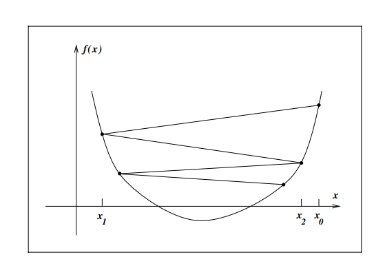
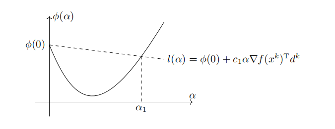
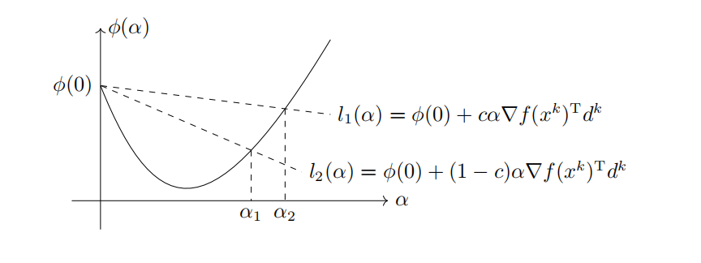
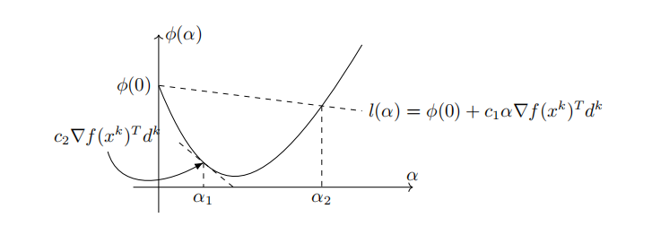
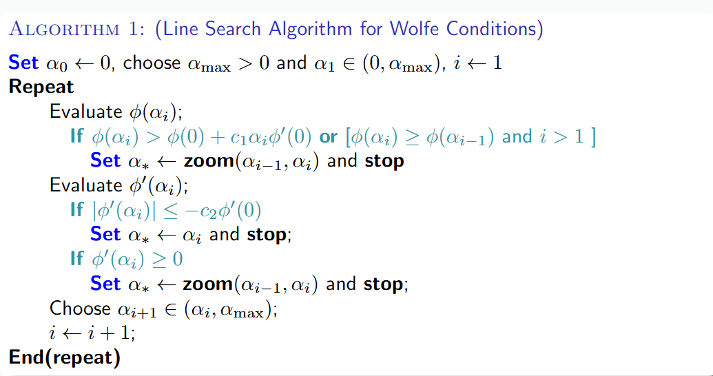
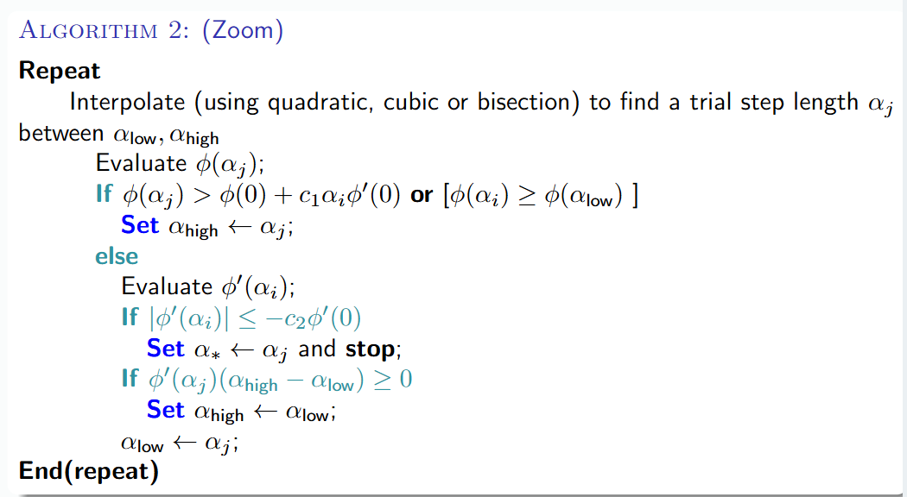

在本章伊始，我们曾讲到梯度类算法的一般迭代步骤为 $x^{(k+1)}=x^{(k)}+\alpha_k d^{(k)}$，这里要求 $d^{(k)}$ 是一个下降方向，也即 $(d^k)^T\nabla f(x^k)<0$（这里是因为，方向和梯度方向内积为负值，夹角为钝角，自然能保证是下降的），这个下降性质保证了沿着此方向搜索函数 $f$ 的值会减小。所以线搜索类算法的关键在于构造搜索方向 $d^{(k)}$ 和步长因子 $\alpha_k$。而这一讲的线搜索方法就是在**确定方向**后，以精确或非精确的方式，**找到合适的步长 $\alpha_k$**，使得函数值得到有效的下降。

## 线搜索概述

在迭代格式中，沿着下降的方向 $d^{(k)}$，通过解一维最优化问题
$$
\min_{\alpha \geq 0}\varphi(\alpha)=f(x^{(k)}+\alpha d^{(k)})
$$
确定步长因子的方法称为**一维搜索（线搜索）**

若以上述问题的最优解为步长，此时我们称之为**精确一维搜索（精确线搜索/最优线搜索）**，经常用到的精确一维搜索有黄金分割法、插值迭代法等等。但即使是精确一维搜索，经过有限次计算求出上述问题的严密解一般也不可能，我们往往在得到有足够精度的近似解时就将其作为补偿。

在实际计算中，我们往往不是求解一维最优化问题，而是找出满足某些适当条件的粗略近似解作为步长，此时称为**非精确一维搜索（近似一维搜索）**，比如使目标函数 $f$ 得到可以接受的下降量，也即使得下降量 $f(x^{(k)})-f(x^{(k)}+\alpha_kd^{(k)})>0$ 是可接受的。

### 线搜索的重要性

如上图，我们没有经过线搜索的计算，随意选取步长，由于步长 $\alpha$ 选择较大，迭代产生了左右震荡。反之若是步长太小，算法收敛速度非常缓慢。而线搜索的目标就是使得沿着下降方向 $d$，每次的函数值满足充分下降条件。

### 线搜索区间

#### 线搜索结构

线搜索的主要结构如下：

- 在进行一维搜索之前，我们首先确定一个包含问题最优解的搜索区间
- 采用某种分割技术或者插值方法缩小这个区间，进行搜索

例如我们设 $\alpha^{*}$ 是满足 $\varphi(\alpha^{*})=\min_{\alpha \geq 0}\varphi(\alpha)$ 的精确解，如果存在 $[a,b]\subset [0,\infty)$，使得 $\alpha^{*}\in[a,b]$，我们就称 $[a,b]$ 是一维极小化 $\min_{\alpha\geq 0}\varphi(\alpha)$ 的搜索区间

#### 进退法

进退法是一种确定搜索区间的简单方法，其基本思想是，从一点出发，按一定步长前进/后退，始终将函数值维持"高-低-高"的模式，如果一个方向不成功，就退回来，沿相反方向寻找，其算法流程如下：

1. **选取初始数据：**给定 $\alpha_0,h_0>0$，加倍系数 $t>1$，计算 $\varphi(\alpha_0)$，设 $k=0$
2. **比较目标函数值：**令 $\alpha_{k+1}=\alpha_k+h_k$，计算 $\varphi_{k+1}=\varphi(\alpha_{k+1})$，如果 $\varphi_{k+1}<\varphi_k$，转步3，否则转步4
3. **加大搜索步长：**令 $h_{k+1}=th_k,\alpha=\alpha_k,\alpha_k=\alpha_{k+1},\varphi_k=\varphi_{k+1},k=k+1$，转步2
4. **反向探索：**若 $k=0$，转换搜索方向，令 $h_l=-h_k,\alpha_k=\alpha_{k+1}$，转步2，否则停止迭代（此时 $k>0$，在函数值下降的方向已经至少前进了一步，现在遇到函数值开始上升的顶点，形成了高低高模式，成功找到一个包含极小值的区间），令

$$
a = \min\{\alpha,\alpha_{k+1}\}, b = \max\{\alpha,\alpha_{k+1}\}
$$

## 精确线搜索

我们首先定义**单峰/单谷函数**的概念：

设 $\varphi:R\to R,[a,b]\subset R$，若存在 $\alpha^{*}\in[a,b]$，使得 $\varphi(\alpha)$ 在 $[a,\alpha^*]$ 上严格递减，在 $[\alpha^*,b]$ 上严格递增，则称 $[a,b]$ 是函数 $\varphi$ 的单峰区间；类似可以定义单谷区间。

### 分割法

分割法包括黄金分割法、斐波那契法、二分法等等，其基本思想是不断取试探点并比较函数值，来持续缩小包含极值点的搜索区间，当区间长度缩短到一定程度的时候，区间上各点均接近极小值，我们仅需要计算函数值，不需要计算导数值，适用于非光滑以及导数表达式复杂或者无法写出的情形。

我们设 $\varphi(\alpha)=f(x_k+\alpha p_k)$ 是搜索区间 $[a_1,b_1]$ 上的单峰函数，其中 $p_k$ 是当前步的方向，并假设在 $k$ 次迭代时搜索区间为 $[a_k,b_k]$，取两个试探点 $\lambda_k,\mu_k\in[a_k,b_k]$，且 $\lambda_k<\mu_k$，要求满足下面两个条件：

- $\lambda_k$ 和 $\mu_k$ 到搜索区间 $[a_k,b_k]$ 两端点等距，也即 $b_k-\lambda_k=\mu_k-a_k$
- 每次迭代，搜索区间长度缩短率相同，也即 $b_{k+1}-a_{k+1}=\tau(b_k-a_k)$

如果 $\varphi(\lambda_k)\leq \varphi(\mu_k)$，此时 $a_k,\lambda_k,\mu_k$ 组成了一组高-低-高，我们就令 $a_{k+1}=a_k,b_{k+1}=\mu_k$；如果 $\varphi(\lambda_k)>\varphi(\mu_k)$，此时 $\lambda_k,\mu_k,b_k$ 就构成了一组高-低-高，令 $a_{k+1}=\lambda_k,b_{k+1}=b_k$。

#### 黄金分割法

对于黄金分割法，$\tau = \frac{\sqrt{5}-1}{2}\approx 0.618$，并且有
$$
\lambda_k=a_k+0.382(b_k-a_k),\qquad \mu_k=a_k+0.618(b_k-a_k)
$$

#### Fibonacci 法

Fibonacci 法预先设定迭代次数 $n$，故对于Fibonacci法，$\tau$ 不再是常数，而是随 $k$ 变化的 $\tau_k$，下面我们进行推导。

首先回忆一下 Fibonacci 数列的定义，$F_0=0,F_1=F_2=1,F_{k+1}=F_{k}+F_{k-1},k=1,2,\cdots$，并且 Fibonacci 法也遵循区间缩减法的一般规律。我们假设在第 $k$ 次迭代后，新区间的长度 $L_{k+1}$ 与原区间长度 $L_k$ 的关系是 $L_{k+1}=\tau_k L_k$，且两个试探点 $\lambda_k,\mu_k$ 将区间分为 $\lambda_k-a_k,\mu_k-\lambda_k,b_k-\mu_k$ 三段，并且 $\lambda_k-a_k=b_k-\mu_k$。在推导 Fibonacci 法时很精妙的一步是，**我们希望上一步留下的内部试探点，可以成为下一步新区间的试探点之一**，这样我们每次迭代就只需要计算一次新的函数值。

假设第 $k$ 步我们比较之后发现有 $\varphi(\lambda_k)\leq \varphi(\mu_k)$，那么极小值一定在 $[a_k,\mu_k]$ 内部，所以

我们的新区间为 $[a_{k+1},b_{k+1}]=[a_k,\mu_k]$，新区间的长度是 $L_{k+1}=\mu_k-a_k$，并且我们此时希望能够复用

#### 二分法

二分法中 $\lambda_k=\mu_k=\frac{a_k+b_k}{2}$

!!! note "Tip"

    分割法都是线性收敛的方法

### 插值法

插值法的基本思想是**在搜索区间中不断使用低次多项式来近似目标函数，并逐步用插值多项式的极小点来逼近一位搜索问题 $\min_{\alpha}\varphi(\alpha)$ 的极小值点**，当函数解析性质比较好的时候，插值法比分割法效果更好。

插值法有二次插值法（单点、二点、三点）、三次插值法（二点）等等，其中单点二次插值本质上就是牛顿法，具有局部二阶收敛性，例如设 $q(\alpha)=a\alpha^2+b\alpha+c$，满足 $q(\alpha_1)=\varphi(\alpha_1),q'(\alpha_1)=\varphi'(\alpha_1),q''(\alpha_1)=\varphi''(\alpha_1)$，直接求解 $q(\alpha)$ 的最小值可以得到
$$
\overline{\alpha}=-\frac{2b}{a}=\alpha_1-\frac{\varphi'(\alpha_1)}{\varphi''(\alpha_1)}
$$

### 精确线性搜索的收敛性

下面我们将证明精确线性搜索的收敛性，首先我们给出一个定理，只要目标函数的二阶导数有界，那么通过精确线性搜索（即找到最优的步长 $\alpha_k$）得到的函数值下降量是有下界的。

**定理** 设 $\alpha_k>0$ 是精确线性搜索的解，$||\nabla^2f(x_k+\alpha p_k)||\leq M$，则有
$$
f(x_k)-f(x_k+\alpha_kp_k)\geq \frac{1}{2M}||\nabla f(x_k)||^2\cos^2 \theta_k
$$
其中 $M$ 是 $Hessian$ 矩阵模的上界，$\theta_k$ 是搜索方向 $p_k$ 与梯度 $\nabla f(x_k)$ 之间的夹角，也即满足 $\cos \theta_k=\frac{p_k^T\nabla f(x_k)}{||p_k||||\nabla f(x_k)||}$

**证明** 由假设可以知道，对于任意的 $\alpha$ 满足
$$
f(x_k+\alpha p_k)\leq f(x_k)+\alpha p_k^T\nabla f(x_k)+\frac{\alpha^2}{2}M||p_k||^2
$$
取 $\alpha=\overline{\alpha}=-\frac{p_k^T\nabla f(x_k)}{M||p_k||^2}$，则有
$$
f(x_k)-f(x_k+\alpha_kp_k)\geq f(x_k)-f(x_k+\overline{\alpha}p_k)\geq -\overline{\alpha}p_k^T\nabla f(x_k)-\frac{\overline{\alpha}^2}{2}M||p_k||^2\\
=\frac{1}{2}\frac{(p_k^T\nabla f(x_k))^2}{M||p_k||^2}=\frac{1}{2M}||\nabla f(x_k)||^2\frac{(p_k^T \nabla f(x_k))^2}{||p_k||^2||\nabla f(x_k)||^2}=\frac{1}{2M}||\nabla f(x_k)||^2\cos^2\theta_k
$$

!!! note "Tip"

    上述定理表明，只要搜索方向和梯度方向不垂直(并且搜索方向得先是个下降方向)，每次迭代都能够保证目标函数值是下降的

**全局收敛性定理** 设 $\nabla f(x)$ 在水平集 $L=\{x\in R^n|f(x)\leq f(x_0)\}$ 上存在且一致连续，并且选取的方向 $p_k$ 与负梯度 $-\nabla f(x_k)$ 的夹角 $\theta_k$ 满足，存在某个 $\mu$
$$
\theta_k \leq \frac{\pi}{2}-\mu
$$
对所有 $k$ 成立，则或者有对某个 $k$ 有 $\nabla f(x_k)=0$（代表在某一步找到了最优解），或者有 $f(x_k)\to -\infty$，或者有 $\nabla f(x_k)\to 0$，这保证了算法不会停留在非最优点

**收敛速度** 假设产生的序列 $\{x_k\}$ 收敛到 $f(x)$ 的极小值点 $x^{*}$，如果 $f(x)$ 在 $x^{*}$ 的某个领域内二次连续可微，且存在 $\varepsilon>0$ 和 $M>m>0$，使得当 $||x-x^{*}||<\varepsilon$ 时，有
$$
m||y||^2\leq y^TG(x)y\leq M||y^2||,  \ \  \ \forall y\in R^n
$$
则 $\{x_k\}$ 线性收敛

## 不精确一维搜索法

事实上，精确一维搜索的代价是巨大的，并且对于牛顿法、拟牛顿法等高效算法来说并不必要，更为实用的反而是不精确一维搜索

### 线搜索准则

前面我们提到，不精确线性搜索是找出满足某些适当条件的粗略近似解作为步长，下面我们介绍选取 $\alpha_k$ 需要满足的要求，我们将其称为**线搜索准则**，需要指出的是，**线搜索准则的合适与否直接决定了算法的收敛性，如果选取不合适的线搜索准则将会导致算法无法收敛**，比如我们考虑这样一个一维的无约束优化问题

**例** 考虑一维无约束优化问题
$$
\min_x f(x)=x^2
$$
迭代初始点 $x^0=1$，问题是一维的，下降方向只有 $x$ 轴正向和负向两种，我们选取 $d_k=-\text{sign}(x_k)$，且我们只要求选取的补偿满足迭代点处函数值单调下降，也即 $f(x_k+\alpha_k d_k)<f(x_k)$，我们可以考虑如下两种步长：
$$
\alpha_{k,1}=\frac{1}{3^{k+1}},\qquad \alpha_{k,2}=1+\frac{2}{3^{k+1}}
$$
通过简单计算可以得到
$$
x_k^1=\frac{1}{2}(1+\frac{1}{3^k}),\qquad x_k^2=\frac{(-1)^k}{2}(1+\frac{1}{3^k})
$$
显然，序列 $\{f(x_k^1)\}$ 和序列 $\{f(x_k^2)\}$ 均单调下降，但是序列 $\{x_k^1\}$ 收敛的点不是极小值点，序列 $\{x_k^2\}$ 振荡不收敛

下面我们给出一些线搜索准则以确保迭代的收敛性

#### Armijo 准则

Armijo 准则是保证步长能够是函数值有足够的下降，但其无法避免步长过小的问题

**Armijo 准则** 设 $d_k$ 是点 $x_k$ 处的下降方向，若
$$
f(x_k+\alpha d_k)\leq f(x_k)+c_1\alpha \nabla f(x_k)^Td_k
$$
则称步长 $\alpha$ 满足 Armijo 准则，其中 $c_1\in(0,1)$ 是一个常数

Armijo 准则的几何意义是，点 $(\alpha,\varphi(\alpha))$ 必须在直线
$$
l(\alpha)= \varphi(0)+c_1\alpha \nabla f(x_k)^Td_k
$$
的下方，如下图所示：

区间 $[0,\alpha_1]$ 中的点均满足 Armijo 准则。在实际应用中，参数 $c_1$ 我们往往选取一个很小的正数，比如 $c_1=10^{-3}$，这使得 Armijo 准则非常容易得到满足。但是**仅仅使用 Armijo 准则并不能保证迭代的收敛性**，比如 $\alpha = 0$ 显然满足条件，但迭代序列中的点固定不变，也没有意义，所以我们还需要引入其他准则。

#### Goldstein 准则

为了克服 Armijo 准则的缺陷，我们需要引入其他准则来保证每一步的 $\alpha_k$ 不会太小，Armijo 准则是要求点 $\alpha,\varphi(\alpha)$ 必须处在某条直线的下方，我们也可以使用相同的形式，使得该点必须处在另一条直线的上方，以排除太小的 $\alpha_k$，这就是 Goldstein 准则

**Goldstein 准则** 设 $d_k$ 是点 $x_k$ 处的下降方向，若
$$
f(x_k+\alpha d_k)\leq f(x_k)+c\alpha\nabla f(x_k)^Td_k\\
f(x_k+\alpha d_k)\geq f(x_k)+(1-c)\alpha \nabla f(x_k)^Td_k
$$
则称步长 $\alpha$ 满足 Goldstein 准则，其中 $c\in(0,\frac{1}{2})$

类似 Armijo 准则，Goldstein 准则也有非常直观的集合含义，它指的是点 $(\alpha,\varphi(\alpha))$ 必须在两条直线
$$
l_1(\alpha)=\varphi(0)+c\alpha \nabla f(x_k)^Td_k\\
l_2(\alpha)=\varphi(0)+(1-c)\alpha \nabla f(x_k)^Td_k
$$
之间，如下图所示：

区间 $[\alpha_1,\alpha_2]$ 中的点均满足 Goldstein 准则，并且其剔除了过小的 $\alpha$

但同样，我们会发现 Goldstein 准则的问题，它虽然能够使得函数值充分下降，但是它可能避开了最优的函数值，例如在上图中，一维函数 $\varphi(\alpha)$ 的最小值点并不在满足 Goldstein 准则的区间 $[\alpha_1,\alpha_2]$ 中，所以我们还需要引入新的准则

#### Wolfe 准则

**Wolfe准则** 设 $d_k$ 是点 $x_k$ 处的下降方向，若
$$
f(x_k+\alpha d_k)\leq f(x_k)+c_1\alpha \nabla f(x_k)^Td_k\\
\nabla f(x_k+\alpha d_k)^T d_k\geq c_2\nabla f(x_k)^Td_k
$$
则称步长 $\alpha$ 满足 Wolfe 准则，其中 $c_1,c_2\in(0,1)$ 为给定的常数且 $c_1<c_2$

上述准则中，第一个不等式即是 Armijo 准则，第二个不等式是 Wolfe 准则的本质要求。$\nabla f(x_k+\alpha d_k)^Td_k$ 其实恰好是 $\varphi(\alpha)$ 的导数，这条不等式实际上是要求 $\varphi(\alpha)$ 在点 $\alpha$ 处的切线的斜率不能小于 $\varphi'(0)$ 的 $c_2$ 倍，如下图所示：

在上图中，区间 $[\alpha_1,\alpha_2]$ 中的点均满足 Wolfe 准则。并且由于 $\varphi(\alpha)$ 的极小值点 $\alpha^{*}$ 有
$$
\varphi'(\alpha^*)=\nabla f(x^k+\alpha^* d_k)^Td_k=0
$$
因此 $\alpha^{*}$ 永远满足第二个不等式，而选择较小的 $c_1$ 可以使得 $\alpha^{*}$ 同时满足第一个不等式，也即 Wolfe 准则在绝对大多数情况下都会包含线搜索子问题的精确解。在实际应用中，参数 $c_2$ 通常取为 $0.9$

!!! note "补充"

    **Strong Wolfe Condition：** Strong Wolfe conditions 是标准 Wolfe 准则的一个变体，其仍然满足第一条充分下降条件，但第二条曲率条件通过绝对值来约束新梯度的斜率，也即：
    $$
    f(x_k+\alpha d_k)\leq f(x_k)+c_1\alpha\nabla f(x_k)^Td_k\\
    |\nabla f(x_k+\alpha d_k)^Td_k|\leq c_2|(\nabla f(x_k))^T d_k|
    $$
    Strong Wolfe 准则不仅防止了新的斜率过负，也禁止它变得过正，可以排除那些虽然满足标准 Wolfe 条件但距离一维函数 $\varphi(\alpha)$ 的极小值较远的点，从而将步长 $\alpha_k$ 约束在一个更接近极小值点的邻域内。

### 线搜索回溯法

线搜索回溯法用于寻找一个满足 Armijo 准则的步长。给定初值 $\hat{\alpha}$，线搜索回溯法通过不断以指数方式缩小试探步长，找到第一个满足 Armijo 准则的点，具体来说，线搜索回溯法选取
$$
\alpha_k = \gamma^{j_0}\hat{\alpha}
$$
其中
$$
j_0=\min\{j=0,1,\cdots|f(x_k+\gamma^j\hat{\alpha}d_k)\leq f(x_k)+c_1\gamma^{j}\hat{\alpha}\nabla f(x_k)^Td_k\}
$$
参数 $\gamma\in(0,1)$ 为一个给定的实数，其算法为代码如下：

- 选择初始步长 $\hat{\alpha}$，参数 $\gamma,c\in(0,1)$，初始化 $\alpha \leftarrow \hat{\alpha}$
- **while** $f(x_k+\alpha d_k)>f(x_k)+c\alpha\nabla f(x_k)^Td_k$ **do**
  - 令 $\alpha \leftarrow \gamma \alpha$
- **end while**
- 输出 $\alpha_k=\alpha$

该算法被称为线搜索**回溯**法是因为 $\alpha$ 的试验值是由大至小的，它可以确保输出的 $\alpha_k$ 能尽可能大，并且算法也不会无限进行下去，因为 $d_k$ 是一个下降方向，当 $\alpha$ 充分小时，Armijo 准则总是成立的，在实际应用中我们通常也会给 $\alpha$ 设置一个下界，防止步长过小。

!!! note "Tip"

    在线搜索回溯法的过程中，初始步长 $\hat{\alpha}$ 在牛顿法和拟牛顿法中被选为 $1$，但在最速下降法或共轭梯度法等其他算法中也可以是不同的值。

### 通用步长选择算法框架

线搜索回溯法虽然简单，但是它只满足 Armijo 条件，有时候我们可能需要满足更严格的 Wolfe 条件，就需要一个更通用的算法框架，我们考虑寻找一维函数
$$
\varphi(\alpha)=f(x_k+\alpha p_k)
$$
的最小值的方法，或者仅仅是寻找满足终止条件之一（比如 Wolfe 准则和 Goldstein 准则）。

如果 $f$ 是一个凸二次函数 $f(x)=\frac{1}{2}x^TQx-b^Tx$，那么沿着 $x_k+\alpha p_k$ 的最小值可以通过求导求极值的方法计算，可以得到
$$
\alpha_k=\frac{(\nabla f(x_k))^Tp_k}{p_kQp_k}
$$
而如果 $f$ 是一个一般的非线性函数，我们就需要使用迭代过程，典型的过程包括两个阶段：

- **设界(bracketing phase)：**找到包含可接受步长区间的区间 $[\overline{a},\overline{b}]$
- **选择(selection phase)：**缩放定位最终步长

#### 插值法

在**选择阶段**，我们可以使用**插值法**来提高效率，其基本思想是用一个简单的低阶多项式来近似模拟目标函数 $\varphi(\alpha)=f(x_k+\alpha p_k)$ 的局部形状，然后求解这个简单的多项式的极小点来作为下一个试验步长。插值过程是迭代进行的，通常从二次插值开始，如果信息更充分或二次插值效果不佳，就用三次插值

**二次插值：**二次插值前我们通常有一个初始的试验步长 $\alpha_0$，这个 $\alpha_0$ **不满足**充分下降条件，也即 $\varphi(\alpha_0)>\varphi(0)+c_1\alpha_0\varphi'(0)$，在这种情况下，一个可接受的步长一定存在于区间 $[0,\alpha_0]$之内。并且我们已知三个信息点，初始函数值 $\varphi(0)$，初始导数值 $\varphi'(0)$，试验点函数值 $\varphi(\alpha_0)$，我们构造一个二次函数 $\varphi_q(\alpha)=a\alpha^2+b\alpha+c$ 来逼近 $\varphi(\alpha)$，让其通过这三个信息点，则可以得到
$$
\varphi_q(\alpha)=(\frac{\varphi(\alpha_0)-\varphi(0)-\alpha_0\varphi'(0)}{\alpha_0^2})\alpha^2+\varphi'(0)\alpha +\varphi(0)
$$
我们的下一个试验步长 $\alpha_1$ 就是这个二次函数的极小值点，我们对 $\varphi_q(\alpha)$ 求导可以解得
$$
\alpha_1=-\frac{\varphi'(0)\alpha_0^2}{2[\varphi(\alpha_0)-\varphi(0)-\varphi'(0)\alpha_0]}
$$
计算出 $\alpha_1$ 后，我们会再次检查它是否满足充分下降条件。如果满足，线搜索就结束；否则进入三次插值

**三次插值：**当二次插值产生的点 $\alpha_1$ 仍然不满足条件时，我们就得到了更多信息，可以构建一个更精确的三次模型，现在有四个信息点，$\varphi(0),\varphi'(0),\varphi(\alpha_0),\varphi(\alpha_1)$，可以构造一个三次函数 $\varphi_c(\alpha)=a\alpha^3+b\alpha^2+c\alpha +d$ 来同时满足这四个条件，我们容易得到 $c=\varphi'(0),d=\varphi(0)$，系数 $a,b$ 可以解线性方程组的解，这里我们直接给出
$$
[a,b]^T=\frac{1}{\alpha_0^2\alpha_1^2(\alpha_1-\alpha_0)}

\begin{bmatrix}
\alpha_0^2&-\alpha_1^2\\
-\alpha_0^3&\alpha_1^3
\end{bmatrix}

\begin{bmatrix}
\varphi(\alpha_1)-\varphi(0)-\varphi'(0)\alpha_1\\
\varphi(\alpha_0)-\varphi(0)-\varphi'(0)\alpha_0
\end{bmatrix}
$$
下一个试验步长 $\alpha_2$ 是这个三次函数的极小值点，可以解得
$$
\alpha_2=\frac{-b+\sqrt{b^2-3a\varphi'(0)}}{3a}
$$

#### 初始步长

牛顿法和拟牛顿法的初始试验步长应该取为 $1$，也即 $\alpha_0=1$

最速下降法和共轭梯度法产生的搜索方向并没有经过良好的缩放，$\alpha_0=1$ 往往是一个比较差的猜测，我们需要一些更好的策略，主要有两种

### 不精确线搜索算法示例

算法1是主循环，负责从一个初始点开始，通过不断尝试更大的步长来寻找一个设界区间 $[\alpha_{i-1},\alpha_i]$；算法2是辅助方法，当主程序找到了一个包含解的区间 $[a_{low},a_{high}]$ 后，其在这个区间内高效地找到最终的步长。

### 收敛性分析

这里的收敛性分析建立在一般的不精确线搜索类算法的框架上，得到的结论较弱。

#### Zoutendijk 定理

Zoutendijk 定理是线搜索方法收敛性的核心定理，为所有使用 Wolfe 准则的先搜索算法提供了一个统一的基本收敛性结论

**(Zoutendijk)** 考虑一般的迭代格式 $x_{k+1}=x_k+\alpha_k d_k$，其中 $d_k$ 是搜索方向，$\alpha_k$ 是步长，且在迭代过程中 Wolfe 准则满足，我们假设目标函数 $f$ 下有界、连续可微且梯度 $L-$利普希茨连续，也即
$$
||\nabla f((x)-\nabla f(y)||\leq L||x-y||,\forall x,y\in R^n
$$
那么 
$$
\sum_{k=0}^{\infty}\cos^2\theta_k ||\nabla f(x_k)||^2<\infty
$$
其中 $\cos\theta_k$ 为负梯度 $-\nabla f(x_k)$ 和下降方向 $d_k$ 夹角的余弦，也即
$$
\cos\theta_k=\frac{-\nabla f(x_k)^Td_k}{||\nabla f(x_k)||\cdot||d_k||}
$$

上述不等式我们称为 Zoutendijk 条件

!!! note "证明"

    证明可以参考文老师的书

#### 线搜索算法收敛性

Zoutendijk 定理直接导出了保证算法全局收敛的关键条件，由 Zoutendijk 条件可以得到
$$
\lim_{k\to\infty}\cos^2\theta_k||\nabla f(x_k)||^2=0
$$
而为了由其导出 $||\nabla f(x_k)||\to 0$，我们需要确保 $\cos^2\theta_k$ 不趋于 $0$，也即搜索方向 $p_k$ 不能与梯度方向 $\nabla f(x_k)$ 趋于正交，即必须存在一个常数 $\delta >0$，使得对于所有的迭代步 $k$ 都满足：
$$
\cos\theta_k\geq \delta >0
$$
这些条件保证了搜索方向始终是一个足够好的下降方向。

由此我们导出了**线搜索算法的收敛性定理**：对于迭代法 $x_{k+1}=x_k+\alpha_kd_k$，设 $\theta_k$ 为每一步负梯度 $-\nabla f(x_k)$ 与下降方向 $d_k$ 的夹角，并假设对任意的 $k$，存在常数 $\gamma >0$，使得
$$
\theta_k<\frac{\pi}{2}-\gamma
$$
则在 Zoutendijk 定理成立的条件下，有
$$
\lim_{k\to\infty}\nabla f(x_k)=0
$$

!!! note "Tip"

    上述定理仅仅给出了最基本的收敛性，而没有进一步回答算法的收敛速度，这是因为算法收敛速度极大地取决于 $d_k$ 的选择，下面一节我们将着重介绍如何选取下降方向 $d_k$
