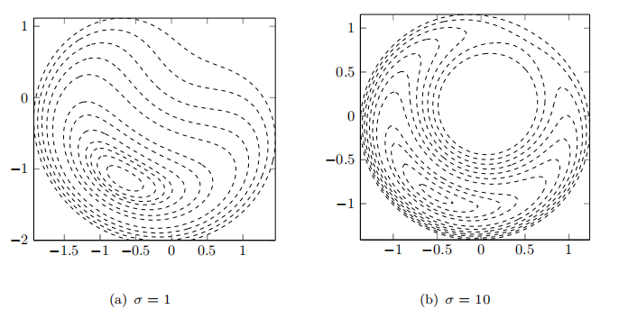
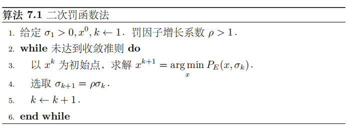
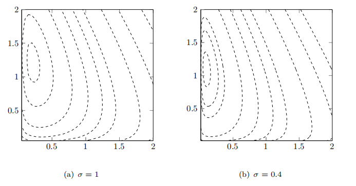
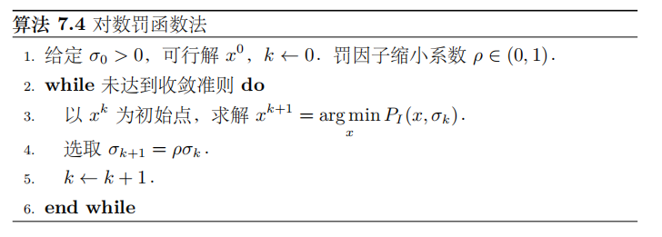

# 罚函数法

本章我们将介绍罚函数法，**罚函数法的思想**是将约束优化问题转化为无约束优化问题进行求解，为了保证解的逼近质量，无约束优化问题的目标函数为原有约束优化问题的目标函数加上与约束函数有关的惩罚项。**对于可行域外的点，惩罚项为正，也即对该点进行惩罚；对于可行域内的点，惩罚项为 $0$，也即不做任何惩罚**。所以惩罚项会促使无约束优化问题的解落在可行域内。

## 等式约束的二次罚函数法

### 等式约束的二次罚函数

约束优化问题的基本形式如下：
$$
\min_{x\in R^n}f(x)\\
\text{s.t.}\ \ c_i(x)=0,\ i=1,\cdots,m_e;\\
c_i(x)\geq 0, i=m_e+1,\cdots,m
$$
我们先考虑一种简单的情况，假设问题约束中仅含有等式约束，即考虑问题
$$
\min_{x} f(x),\\
\text{s.t.}\ \ c_i(x)=0,\qquad i\in E
$$
其中变量 $x\in R^n$，$E$ 为等式约束的指标集，$c_i(x)$ 为连续函数。在某些特殊场合下，我们可以通过求解非线性方程组 $c_i(x)=0$ 消去部分变量，将其转化为无约束问题。但是对于一般的函数 $c_i(x)$ 来说，变量消去这一操作是不可实现的，我们必须采用其他方法来处理这种问题

对于等式约束问题，惩罚项的选取方式有很多，结构最简单的是二次函数，这里我们给出**二次罚函数**的定义

**等式约束的二次罚函数** 对于等式约束最优化问题，定义二次罚函数
$$
P_E(x,\sigma)=f(x)+\frac{1}{2}\sigma\sum_{i\in E}c_i^2(x)
$$
其中等式右端的第二项称为惩罚项，$\sigma>0$ 称为惩罚因子

由于这种罚函数对不满足约束的点进行惩罚，在迭代过程中点列一般处于可行域之外，因此它也被称为**外点罚函数**。

二次罚函数的特点如下：对于非可行点而言，当 $\sigma$ 变大时，惩罚项在罚函数中的权重加大，对罚函数求极小（对 $x$ 求极小，$\sigma$ 在每次求解子问题时是一个固定的数值）相当于迫使其极小点向可行域靠近；在可行域中，$P_E(x,\sigma)$ 的全局极小点与约束优化问题的最优解相同

下面我们看一个例子，考虑优化问题
$$
\min x+\sqrt{3}y\\
\text{s.t.}\ \  x^2+y^2=1
$$
容易求出这个问题的最优解为 $(-\frac{1}{2},-\frac{\sqrt{3}}{2})^T$，考虑二次罚函数
$$
P_E(x,y,\sigma)=x+\sqrt{3}y+\frac{\sigma}{2}(x^2+y^2-1)^2
$$
并有 $\sigma=1$ 和 $\sigma=1$ 对应的罚函数的等高线如下：

随着 $\sigma$ 增大，二次罚函数 $P_E(x,y,\sigma)$ 的最小值和原问题的最小值越来越接近，但是最优点附近的等高线越来越趋近于扁平，使得求解无约束优化问题的难度变大。并且当 $\sigma=10$ 时函数出现了一个极大值，罚函数图形在 $(-\frac{1}{2},-\frac{\sqrt{3}}{2})^T$ 附近出现了一个鞍点

给定惩罚因子 $\sigma$ ，我们可以通过求解 $P_E(x,\sigma)$ 的最小值点作为原问题的近似解，但是 $\sigma$ 选取得过小时罚函数可能无下界，比如我们考虑这样一个例子
$$
\min -x^2+2y^2\\
\text{s.t.}\ \ x=1
$$
容易知道最优解为 $(1,0)^T$，但是我们考虑罚函数
$$
P_E(x,y,\sigma)=-x^2+2y^2+\frac{\sigma}{2}(x-1)^2
$$
对任意的 $\sigma\leq 2$，该罚函数是无界的。出现这样的现象是因为当惩罚因子过小的时候，不可行点处的函数下降抵消了罚函数对约束违反的惩罚，实际上所有外点罚函数法都存在这样的问题，所以 $\sigma$ 的初值不应当选取得太小。

### 等式约束的二次罚函数法伪代码

其算法流程如下：先选取一系列指数增长的惩罚因子 $\sigma_k$，然后针对每个惩罚因子求解二次罚函数 $P_E(x,\sigma_k)$ 的最小值点（或局部极小值点），然后迭代惩罚因子 $\sigma_k$ 继续求解

$x_{k+1}={\arg \min}_{x} P_E(x,\sigma_k)$ 的含义是如下情况之一：

- $x_{k+1}$ 是罚函数 $P_E(x,\sigma_k)$ 的全局极小解
- $x_{k+1}$ 是罚函数 $P_E(x,\sigma_k)$ 的局部极小解
- $x_{k+1}$ 不是罚函数 $P_E(x,\sigma_k)$ 的严格的极小解，但近似满足一阶最优性条件 $\nabla_xP_E(x^{k+1},\sigma_k)\approx 0$

在算法中需要注意如下三点：

- 对参数 $\sigma_k$ 的选取要小心，若 $\sigma_k$ 增长太快，子问题不易求解；若增长太慢，则算法循环次数增多。一个比较合理的取法是根据当前 $P_E(x,\sigma_k)$ 的求解难度来确定 $\sigma_k$ 的增幅。如果当前子问题收敛得很快，可以在下一步选取较大的 $\sigma_{k+1}$，否则就不宜过分增大 $\sigma_k$
- $P_E(x,\sigma)$ 在 $\sigma$ 较小时可能无界，迭代会发散。在我们求解子问题的时候如果检测到迭代点发散应当立即终止迭代并且增大惩罚因子
- 子问题求解的精度必须足够精确，为了保证收敛，子问题的求解误差需要趋近于 $0$

### 等式约束的二次罚函数法收敛性分析

为了讨论方便，我们假设对每个 $\sigma_k$，$P_E(x,\sigma_k)$ 的最小值点都是存在的（这个假设对某些优化问题是不对的，因为二次罚函数的惩罚力度不够，对这类问题我们不会用二次罚函数法进行求解）

**二次罚函数法的收敛性1** 设 $x_{k+1}$ 是 $P_E(x,\sigma_k)$ 的全局极小解，$\sigma_k$ 单调上升趋于无穷，则 $\{x_k\}$ 的每个极限点（聚点） $x^*$ 都是原问题的全局极小解

!!! note "Tip"

    证明可以参考文再文老师《最优化：建模、算法与理论》一书

    上述定理表明，若可以找到子问题的全局极小解，则它们的极限点为原问题的最小值点。但在实际应用中，求 $P_E(x,\sigma_k)$ 的全局极小解是难以做到的，我们只能将子问题求解到一定精度，所以上述定理的应用场合十分有限

**二次罚函数的收敛性2** 设 $f(x)$ 与 $c_i(x),i\in E$ 连续可微，正数序列 $\varepsilon_k\to 0,\sigma_k\to +\infty$，若子问题的解 $x_{k+1}$ 满足 $||\nabla_x P_E(x_{k+1},\sigma_k)||\leq \varepsilon_k$，而对 $\{x_k\}$ 的任何极限点 $x^*$，都有 $\{\nabla c_i(x^*),i\in E\}$ 线性无关，则 $x^*$ 是等式约束最优化问题的 KKT 点，且
$$
\lim_{k\to \infty}(-\sigma_kc_i(x_{k+1}))=\lambda_i^*,\qquad \forall i\in E
$$
其中 $\lambda_i^*$ 是约束 $c_i(x^*)=0$ 对应的 Lagrange 乘子

## 一般约束问题的二次罚函数法

前面我们考虑的是等式约束的优化问题，下面我们考虑不等式约束的二次罚函数问题，考虑如下形式的不等式约束优化问题：
$$
\min f(x)\\
\text{s.t.}  \ \ c_i(x)\geq 0,\ i\in I
$$
它和等式约束优化问题最大的不同就是允许 $c_i(x)>0$ 发生，如果我们采用原来的方式定义罚函数为 $||c(x)||^2$，其也会惩罚 $c_i(x)>0$ 的可行点，这显然不是我们需要的，所以我们要对原有的二次罚函数进行改造，它应该只惩罚 $c_i(x)<0$ 的那些点，而对可行点不作惩罚。

!!! note "Tip"

    注意我这里使用的不等式约束的体系（$c_i(x)\geq 0$）和文再文老师的《最优化：建模、算法与理论》一书（$c_i(x)\leq 0$）不同，相应的定义和结论可能发生变化

**不等式约束的二次罚函数** 对不等式约束最优化问题，定义二次罚函数
$$
P_I(x,\sigma)=f(x)+\frac{1}{2}\sigma\sum_{i\in I}\tilde{c_i}^2(x)
$$
其中等式右端第二项称为惩罚项，$\tilde{c_i}(x)$ 的定义为
$$
\tilde{c_i}(x)=\max\{-c_i(x),0\}
$$
常数 $\sigma>0$ 称为罚因子

函数 $h(t)=(\max\{-t,0\})^2$ 关于 $t$ 是可导的，因此 $P_I(x,\sigma)$ 的梯度也存在，可以使用梯度类算法来求解子问题，但是一般来说 $P_I(x,\sigma)$ 不是二阶可导的，我们不能直接利用二阶算法（如牛顿法）来求解子问题，这也是不等式约束问题二次罚函数的不足之处。求解不等式约束问题的罚函数法的算法和等式约束完全相同。

一般的约束优化问题可能既含有等式约束又含有不等式约束，其形式为
$$
\min f(x)\\
\text{s.t.} \ \ c_i(x)=0,\ i\in E\\
c_i(x)\geq 0,\ i\in I
$$
针对这个问题，我们只需要将两种约束的罚函数相加就能得到一般约束优化问题的二次罚函数

**一般约束的二次罚函数** 对于一般约束最优化问题，我们定义二次罚函数如下
$$
P(x,\sigma)=f(x)+\frac{1}{2}\sigma[\sum_{i\in E}c_i^2(x)+\sum_{i\in I}\tilde{c_i}^2(x)]
$$
其中等式右端第二项称为惩罚项，$\tilde{c_i}(x)$ 的定义同上，常数 $\sigma>0$ 称为惩罚因子

## 内点罚函数法

前面为我们介绍的二次罚函数均属于**外点罚函数**，也即在求解过程中允许自变量 $x$ 位于原问题的可行域之外，当惩罚因子趋于无穷的时候，子问题的最有序列从可行域外部逼近最优解。

自然地，如果我们想要子问题最优解序列从可行域内部逼近最优解，则需要构造**内点罚函数**。顾名思义，内点罚函数法在迭代时始终要求自变量 $x$ 不能违反约束，因此它主要用于不等式约束优化问题

考虑含有不等式约束的优化问题
$$
\min f(x)\\
\text{s.t.}  \ \ c_i(x)\geq 0,\ i\in I
$$
为了使得迭代点始终在可行域内，当迭代点趋于可行域边界的时候，我们需要罚函数趋于正无穷，常用的罚函数是**对数罚函数**

**对数罚函数** 对于不等式约束最优化问题
$$
\min f(x)\\
\text{s.t.}  \ \ c_i(x)\geq 0,\ i\in I
$$
定义**对数罚函数**如下
$$
P_I(x,\sigma)=f(x)-\sigma\sum_{i\in I}\ln(c_i(x))
$$
其中等式右端第二项称为惩罚项，$\sigma>0$ 称为惩罚因子

显然 $P_I(x,\sigma)$ 的定义域为 $\{x|c_i(x)>0\}$，因此在迭代过程中自变量 $x$ 严格位于可行域内部。当 $x$ 趋近于可行域边界时，由对数罚函数的特点，$P_I(x,\sigma)$ 会趋于正无穷，说明对数罚函数的极小值严格位于可行域内部。但是原问题的最优解其实通常是在可行域边界上的，也即 $c_i(x)\geq 0$ 至少有一个取得等号，此时我们需要调整罚函数因子 $\sigma$ 使其趋于 $0$，这会减弱对数罚函数在边界附近的惩罚效果

下面我们看一个例子，考虑优化问题
$$
\min x^2+2xy+y^2+2x-2y\\
\text{s.t.}\ \  x\geq 0,y\geq 0
$$
容易求出该问题的最优解为 $x=0,y=1$，我们考虑对数罚函数
$$
P_I(x,y,\sigma)=x^2+2xy+y^2+2x-2y-\sigma (\ln x+\ln y)
$$
绘制 $\sigma=1$ 和 $\sigma=0.4$ 对应的等高线如下：

可以看出，随着 $\sigma$ 减小，对数罚函数 $P_I(x,y,\sigma)$ 的最小值点和原问题最小值越来越接近，但是当 $x$ 和 $y$ 趋于可行域边界时，对数罚函数趋于正无穷

下面我们给出基于对数罚函数的内点罚函数法算法伪代码

和二次罚函数法不同，对数罚函数法要求 $x_0$ 是一个可行解，常用的收敛准则可以包含
$$
\big|\sigma_k\sum_{i\in I}\ln(c_i(x_{k+1}))\big|\leq \varepsilon
$$
其中 $\varepsilon>0$ 为给定的精度

## 精确罚函数法

二次罚函数法和对数罚函数法的一个共同特点就是在求解的时候必须令惩罚因子趋于正无穷或零，这会带来一定的数值困难，而对于有些罚函数，在问题求解的时候我们不需要令惩罚因子趋于正无穷或零，这种罚函数称为**精确罚函数**。换句话说，如果惩罚因子选取适当，对罚函数极小化得到的解恰好就是原问题的精确解

常用的精确罚函数是 $l_1$ 罚函数，下面我们给出其定义

**$l_1$ 罚函数** 对一般的约束最优化问题，定义 $l_1$ 罚函数如下
$$
P(x,\sigma)=f(x)+\sigma[\sum_{i\in E}|c_i(x)|+\sum_{i\in I}\tilde{c_i(x)}]
$$
其中等式右端的第二项称为惩罚项，$\tilde{c_i(x)}$ 的定义和之前相同，常数 $\sigma>0$ 称为惩罚因子

这里我们用绝对值替代平方来构造惩罚项，实际上是对约束的 $l_1$ 范数进行惩罚，需要说明的是，$l_1$ 罚函数不是可微函数。

**$l_1$ 罚函数的精确性** 设 $x^*$ 是一般约束优化问题的一个严格局部极小解，且满足 KKT 条件，其对应的 Lagrange 乘子为 $\lambda_i^*,i\in E\cup I$，则当惩罚因子 $\sigma>\sigma^*$ 时，$x^*$ 也为 $P(x,\sigma)$ 的一个局部极小解，其中 $\sigma^*$ 的定义为

$$
\sigma^*=||\lambda^*||_{\infty}=\max_i|\lambda_i^*|
$$

上述定理说明对于精确罚函数，当惩罚因子充分大（不需要是正无穷）时，原问题的极小值点就是 $l_1$ 罚函数的极小值点
