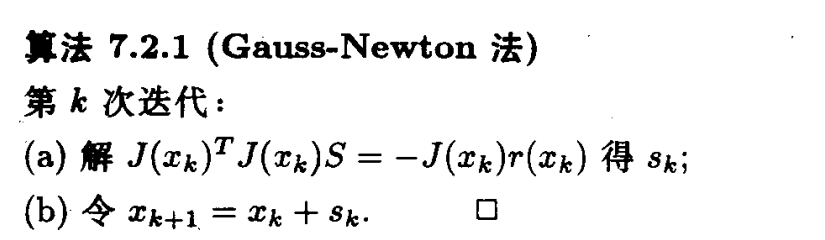

## 非线性最小二乘问题

非线性最小二乘问题形式如下：

$$
\min _{x\in R^n} f(x)=\frac{1}{2}r(x)^Tr(x)=\frac{1}{2}\sum_{i=1}^m[r_i(x)]^2,\qquad m\geq n
$$

其中 $r:R^n\to R^m$ 是 $x$ 的非线性函数。如果 $r(x)$ 是线性函数，上述问题就是线性最小二乘问题。

设 $J(x)$ 是 $r(x)$ 的 Jacobi 矩阵，也即有

$$
J = 
\begin{pmatrix}
\dfrac{\partial r_1}{\partial x_1} & \cdots & \dfrac{\partial r_1}{\partial x_n} \\
\vdots & \ddots & \vdots \\
\dfrac{\partial r_m}{\partial x_1} & \cdots & \dfrac{\partial r_m}{\partial x_n}
\end{pmatrix}
$$

则有 $f(x)$ 的梯度为
$$
g(x)=\sum_{i=1}^m r_i(x)\nabla r_i(x)=J(x)^Tr(x)
$$

!!! note "Tip"

    可以从矩阵微分的角度去考虑，有 $dr(x)=J(x)dx$，$f(x)=\frac{1}{2}r(x)^Tr(x)$，则可以得到
    $$
    df(x)=\frac{1}{2}[dr(x)^Tr(x)+r(x)^Tdr(x)]=r(x)^Tdr(x)=r(x)^TJ(x)dx
    $$
    又 $\nabla f(x)^T=r(x)^TJ(x)$，则可得 $\nabla f(x)=J(x)^Tr(x)$

$f(x)$ 的 Hessian 矩阵为
$$
G(x)=\sum_{i=1}^m[\nabla r_i(x)\nabla r_i(x)^T+r_i(x)\nabla^2r_i(x)]=J(x)^TJ(x)+S(x)
$$
其中我们记
$$
S(x)=\sum_{i=1}^mr_i(x)\nabla^2r_i(x)
$$
所以目标函数 $f(x)$ 的二次模型为

$$\begin{align}
m_k(x)&=f(x_k)+g^T(x_k)(x-x_k)+\frac{1}{2}(x-x_k)^TG(x_k)(x-x_k)\\
&=\frac{1}{2}r(x_k)^Tr(x_k)+(J(x_k)^Tr(x_k))^T(x-x_k)+\frac{1}{2}(x-x_k)^T[J(x_k)^TJ(x_k)+S(x_k)](x-x_k)
\end{align}$$

从而可以得到牛顿法的迭代公式

$$
x_{k+1}=x_k-[J(x_k)^TJ(x_k)+S(x_k)]^{-1}J(x_k)r(x_k)
$$

我们知道牛顿法具有局部的二阶收敛速度，但上述牛顿法的主要问题在于 Hessian 矩阵 $G(x)$ 中的二阶信息项 $S(x)$ 计算比较昂贵，而利用拟牛顿法近似也不太可取。计算梯度 $g(x)$ 时我们已经得到了 $J(x)$，则 $G(x)$ 中的一阶信息项 $J(x)^TJ(x)$ 容易得到，所以**我们考虑是否能够忽略 $S(x)$，或者使用一阶的导数信息就能够逼近 $S(x)$**。由 $S(x)$ 的定义式可以得出，只有当 $r_i(x)$ 接近于 $0$ 或者 $r_i(x)$ 接近线性函数导致 $\nabla^2 r_i(x)$ 接近于 $0$ 时，$S(x)$ 才可以忽略，这类问题我们通常称之为小残量问题，反之则称之为大残量问题。

## Gauss-Newton 法

Gauss-Newton 法的基本原理就是在二次模型中直接忽略 $G(x)$ 中的二阶信息项 $S(x)$，这样就有

$$
m_k(x)=\frac{1}{2}r(x_k)^Tr(x_k)+(J(x_k)^Tr(x_k))^T(x-x_k)+\frac{1}{2}(x-x_k)^T[J(x_k)^TJ(x_k)](x-x_k)
$$

从而由牛顿法就有

$$
x_{k+1}=x_k-[J(x_k)^TJ(x_k)]^{-1}J(x_k)r(x_k)=x_k+s_k
$$

这里我们将 $-[J(x_k)^TJ(x_k)]^{-1}J(x_k)r(x_k)$ 记作 $s_k$，所以 Gauss-Newton 法的第 $k$ 次迭代如下：

从 Gauss-Newton 法的迭代式可以看出，其只需要参量函数 $r(x)$ 的一阶导数信息，并且 $J(x)^TJ(x)$ 是半正定的。

由于牛顿法是局部二阶收敛的，Gauss-Newton 法的成功将依赖于我们所忽略的 $G(x)$ 中的二阶信息项 $S(x)$ 在 $G(x)$ 中的重要性。事实上有如下定理：**如果 $S(x^{*})=0$，则 Gauss-Newton 法也是二阶收敛的；如果 $S(x^{*})$ 相对于 $J(x^{*})^TJ(x^{*})$ 是小的，则 Gauss-Newton 法是局部 Q 线性收敛的；但是如果 $S(x^{*})$ 太大，则 Gauss-Newton 法可能不收敛**。证明可以参考袁亚湘老师的《最优化理论与方法》

下面我们给出 Gauss-Newton 法的优缺点：

- 优点：
    - 对于零残量问题（即 $r(x^{*})=0$），有局部二阶收敛速度
    - 对于小残量问题（即残量 $r(x)$ 较小，或 $r(x)$ 接近线性），有快的局部收敛速度
    - 对于线性最小二乘问题，一步到达极小值点
- 缺点：
    - 对于不是很严重的大残量问题，有较慢的局部收敛速度
    - 对于残量很大的问题或 $r(x)$ 的非线性程度较大的问题，不收敛
    - 如果 $J(x_k)$ 不满秩，方法没有定义
    - 不一定总体收敛

!!! note "Tip"

    实际应用中，我们采用的 Gauss-Newton 法往往加上线性搜索策略，也即带步长 $\alpha_k$：
    $$
    x_{k+1}=x_k-\alpha_k[J(x_k)^TJ(x_k)]^{-1}J(x_k)^Tr(x_k)
    $$
    其中 $\alpha_k$ 是步长。这种方法被称为阻尼 Gauss-Newton 法，由于阻尼 Gauss-Newton 方法采用了线性搜索，它能够保证目标函数每一步都是下降的。所以对于几乎所有的非线性最小二乘问题，它都具有局部收敛性，但对于某些问题它仍然可能收敛得很慢。

## Levenberg-Marquardt 方法

在 Gauss-Newton 方法中，我们要求 $J(x^{*})$ 是满秩的，但 $J(x^{*})$ 奇异的情形经常发生，使得算法收敛到一个非驻点。并且一旦 $J(x^{*})$ 非奇异，在距离解点的某处，$s_k$ 和 $g_k$ 就会在数值上正交，线搜索便不能得到进一步的下降，只能得到极小值点的一个差的估计。

而为了解决上述问题，我们考虑采用信赖域方法，因为 $r(x)$ 往往是非线性函数，Gauss-Newton 方法采用线性化模型代替 $r(x)$ 得到线性最小二乘问题，这种线性化并不对所有的 $x-x_k$ 都成立，所以考虑约束线性最小二乘问题，也即信赖域模型：

$$
\min ||r(x_k)+J(x_k)(x-x_k)||_2\\
\text{s.t.} ||x-x_k||_2\leq h_k
$$

这个模型的解可以由解方程组

$$
[J(x_k)^TJ(x_k)+\mu_k I]s=-J(x_k)^Tr(x_k)
$$

来表征，从而有

$$
x_{k+1}=x_k-[J(x_k)^TJ(x_k)+\mu_kI]^{-1}J(x_k)^Tr(x_k)
$$

如果 $||[J(x_k)^TJ(x_k)+\mu_kI]^{-1}J(x_k)^Tr(x_k)||\leq h_k$，则由 $\mu_k=0$；否则 $\mu_k>0$。由于 $J(x_k)^TJ(x_k)+\mu_kI$ 正定，所以方程组 $[J(x_k)^TJ(x_k)+\mu_k I]s=-J(x_k)^Tr(x_k)$ 产生的方向 $s$ 是下降方向，这种方法我们称为 Levenberg-Marquardt 方法（简称 L-M 方法）

