# 数学建模准备

!!! tip "说明"

    说明：仅供数学建模备赛使用，并非原创，大部分都是 [jiepeng 前辈的笔记内容](https://note.jiepeng.tech/Fundemental/Mathematical-Modeling/)，只是自己在阅读的时候可能加了一点自己的思考和提炼，

## 秘密共享问题

设相关人员共有 $2n+1$ 个，其中 $n$ 人组成的“少数”团体不能打开安全门，任意 $n+1$ 人组成的 “多数” 团体可以打开安全门，则至少需要多少把锁？每个人至少要有多少把钥匙？

**解答** 每个 $n$ 人组合都至少要对应一个打不开的锁，所以至少需要 $C_{2n+1}^n$ 把锁

接着我们再来考虑一下每个人至少需要多少把钥匙，这时我们可以这么考虑，如果缺少某个人，会有多少把锁打不开，那这个人就至少需要有多少把钥匙，所以我们就将问题转化为了 $2n+1$ 人中除去一个人，有多少 $n$ 人组合，答案是 $C_{2n}^n$

### 密码学中的秘密共享

在密码学里，这叫做**门限机制$(t,n)$**：在 $n$ 人之间共享秘密，其中任意 $t$ 人可以重构出秘密，而任意 $t-1$ 人都不能重构出这种秘密。

#### Shamir 门限机制$(t,n)$

其基本思想是通过秘密多项式，将秘密 $s$ 分解为 $n$ 个秘密，分发给持有者，其中任意不少于 $t$ 个秘密均能恢复出密文，而任意少于 $t$ 个秘密均无法得到密文的任何信息。

分发方法如下：

我们假设有秘密 $K$ 要保护，任意取 $t-1$ 个随机整数 $\left\{x_1,\cdots,x_{t-1}\right\}$，构造如下多项式：
$$
f(c) = K +x_1c+x_2c^2+\cdots+x_{t-1}c^{t-1}
$$
其中 $K\in Z$，也即秘密，我们取 $n$ 个不同的整数 $\left\{c_1,\cdots,c_n\right\}$，取公开大素数 $p>n+1,K$，计算 $b_j \equiv f(c_j)\pmod  p$，并将 $(c_j,b_j)$ 发送给第 $j$ 个持有者

其可行性证明就是判断任意 $t$ 个方程是否有唯一解，任意 $t-1$ 个方程是否有无穷多解，取 $t$ 个方程，则系数行列式如下：

$$\begin{aligned}
\begin{bmatrix}
1 & c_1 & c_1^2 & \dots & c_1^{t-1} \\
1 & c_2 & c_2^2 & \dots & c_2^{t-1} \\
\vdots & \vdots & \vdots & \ddots & \vdots \\
1 & c_t & c_t^2 & \dots & c_t^{t-1}
\end{bmatrix}
\end{aligned}$$

这是一个典型的 Vandermonde 行列式，由于 $c_i$ 互不相同，所以行列式不为0，方程有唯一解；

而取任意 $t-1$ 个方程的时候，$t-1$ 个方程对应 $t$ 个未知数，这是一个欠定方程组，有无穷多解

具体的例子可以参考 jiepeng 前辈的[笔记](https://note.jiepeng.tech/Fundemental/Mathematical-Modeling/01-Secret/)

### 数论中的秘密共享

#### 线性同余方程

设 $a,b,n$ 为整数，$x$ 为未知数，那么形如
$$
ax \equiv b \pmod n
$$
的方程称为**线性同余方程**

求解线性同余方程，需要找到区间 $[0,n-1]$ 中 $x$ 的全部解，将它们加减 $n$ 的任意倍数仍然是方程的解，在模 $n$ 的意义下，这些就是该方程的全部解。

下面介绍一下求解线性同余方程的两种思路，分别运用逆元和不定方程。

#### 逆元求解线性同余方程

先指出逆元的定义，设 $a,b$ 为整数，$n$ 为正整数，若 $ab\equiv 1\pmod n$，则称 $a$ 模 $n$ 可逆，且 $b$ 是 $a$ 在模 $n$ 意义下的逆元，我们记为 $a^{-1}$。

首先我们考虑 $a$ 和 $n$ 互素的情形，也即 $\gcd(a,n)=1$ 的情形，此时 $a$ 在模 $n$ 下存在唯一逆元（**逆元仅在所求数与模数互质时存在**），这是方程有唯一解的前提。我们可以计算 $a$ 的逆元 $a^{-1}$（在模 $n$ 的意义下，我们只考虑 $0$ 到 $n-1$ 之间），并将方程两边同时乘以 $a^{-1}$ ，得到方程的唯一解：
$$
x\equiv ba^{-1}\pmod n
$$
接着我们再考虑 $a$ 和 $n$ 不互素的情形，也即 $\gcd(a,n) = d >1$ 的情形，此时原方程不一定有解。我们需要考虑两种类型：

- 当 $d$ 不能整除 $b$ 时，方程无解。对于任意的 $x$，方程左侧 $ax$ 都是 $d$ 的倍数，但是方程右侧的 $b$ 不是 $d$ 的倍数。因此它们也不可能相差 $n$ 的倍数，因为 $n$ 的倍数也一定是 $d$ 的倍数，所以此时方程无解

- 当 $d$ 可以整除 $b$ 时，可以将方程的参数 $a,b,n$ 都同除以 $d$，得到一个新的方程
  $$
  a'x\equiv b'\pmod {n'}
  $$
  其中 $\gcd(a',n')=1$，也就是说 $a'$ 和 $n'$ 互素，这时就是前面提及的情形，我们可以通过求解逆元得到方程的一个解 $x'$。显然 $x'$ 也是原方程的一个解，但这并非原方程的唯一解。转化后的方程的全体解为
  
$$\begin{aligned}
\left\{x'+kn';k\in Z\right\}
\end{aligned}$$
  
  这些解中落在区间 $[0,n-1]$ 中的那些，就是原方程在区间 $[0,n-1]$ 中的全部解。

所以总结这两种情形可以知道，线性同余方程的解的数量等于 $d=\gcd(a,n)$ 或 $0$

!!! note "Tip"

    求逆元也有一些方法，这里介绍**大衍求一术**和**扩展欧几里得算法**：

#### 用不定方程求解线性同余方程

线性同余方程等价于关于 $x,y$ 的二元一次不定方程：
$$
ax+ny = b
$$
给出一个结论，方程有解当且仅当 $\gcd(a,n)|b$，而且该方程的一组通解是

$$\begin{aligned}
x=x_0+t\frac{n}{d}\\
y=y_0-t\frac{a}{d}
\end{aligned}$$

其中 $d=\gcd(a,n)$ 是它们的最大公约数，$t$ 是任意整数，进而线性同余方程的通解就是
$$
x=(x_0+t\frac{n}{d})\pmod n,t\in Z
$$
将 $x_0$ 对 $\frac{n}{d}$ 取模就得到同余方程的最小非负整数解，也就是上文的 $x'$

#### 中国剩余定理

设 $m_1,m_2,\cdots,m_k$ 为两两互质的正整数，$a_1,a_2,\cdots,a_k$ 为任意整数，记 $M = m_1m_2\cdots m_k$，则同余方程组

$$
\begin{cases}
x\equiv a_1 \pmod{m_1}\\
x\equiv a_2 \pmod{m_2}\\
\vdots
\\
x\equiv a_k \pmod{m_k}\\
\end{cases}
$$

有小于 $M$ 的唯一正整数解 $x=M_1M_1^{-1}+M_2M_2^{-1}a_2+\cdots+M_kM_k^{-1}a_k \pmod M$，其中 $M_i = \frac{M}{m_i}$，$M_i^{-1}$ 是 $M_i$ 在模 $m_i$ 意义下的逆元

其计算步骤如下：

1. 计算 $M = m_1 m_2 \cdots m_k$。
2. 计算 $M_i = M / m_i$。 
3. 计算 $M_i^{-1}$。 
4. 解为 $x = M_1 M_1^{-1} a_1 + M_2 M_2^{-1} a_2 + \cdots + M_k M_k^{-1} a_k \pmod{M}$

例如，求解 $x \equiv 2 \pmod{3}$，$x \equiv 3 \pmod{5}$，$x \equiv 2 \pmod{7}$ 的过程如下：

$$
\begin{aligned} M &= 3 \cdot 5 \cdot 7 = 105 \\ M_1 &= 5 \cdot 7 = 35, \quad M_2 = 3 \cdot 7 = 21, \quad M_3 = 3 \cdot 5 = 15 \\ 35 M_1^{-1} &\equiv 1 \pmod{3}, \quad 21 M_2^{-1} \equiv 1 \pmod{5}, \quad 15 M_3^{-1} \equiv 1 \pmod{7} \\ M_1^{-1} &= 2, \quad M_2^{-1} = 1, \quad M_3^{-1} = 1 \\ x &= 35 \cdot 2 \cdot 2 + 21 \cdot 1 \cdot 3 + 15 \cdot 1 \cdot 2 = 233 \equiv 23 \pmod{105} \end{aligned}
$$

#### Asmuth-Bloom 门限机制

## 搜索引擎的PageRank模型

希望给出一种合理、客观、定量、可操作的网页排序规则，使得“重要”的网页排在前面

## Nim 游戏

这是一个很经典的经常会拿来出小学奥数的游戏，其问题背景如下：现在我们有 $n$ 堆硬币，每堆数量一定。两人轮流取硬币，每次只能从其中一堆中取，且每次取至少一枚。取到最后一枚硬币的一方获胜。那么这个游戏是否有必胜策略？如果有，我们应当如何取胜？

我们不妨先从特殊情况开始考虑

### 两堆硬币的情形

两堆硬币的情形下，胜负的关键在于两堆数量是否相等，具体可以分为以下几种场景

#### 两堆数量相等，且都是 1 枚

显然后手必胜，因为先手必须从某一堆中取走 1 枚

#### 两堆数量不等，一堆有 k 枚，一堆只有 1 枚

先手有必胜策略，其可以从 k 枚的堆中取走 k-1 枚，使得两堆变为 $(1,1)$ 的状态。

#### 两堆数量相等，且都是 k 枚

此时后手有必胜策略，因为无论先手从某堆中取走多少枚（比如取走后变成 $(k-m,k),k>0$ 的情形，后手都可以效仿他的策略，从另一堆中取走相同数量的 $m$ 枚，保持两堆数量相等）。最终先手会被逼到取走最后一堆的最后 1 枚，后手取走剩下的 1 枚获胜

#### 两堆数量不等，并且一堆有 k 枚，一堆有 r 枚

先手有必胜策略，先手可以从多的一堆中取走差额 $|k-r|$ 枚，从而使得两堆变为相等的 $(r,r)$ 或 $(k,k)$ 的情形，转换成第三种情况

### 三堆硬币的情形

三堆硬币的情况更为复杂，我们也不妨来看几个典型的场景

#### 三堆各 1 枚

显然先手必胜，因为先手可以取走任意 1 枚，便转化为了两堆数量相等，且都是 1 枚的情形，我们已经讨论过

#### 其中两堆数量相等 $(k,k)$，第三堆有 $r$ 枚

先手必胜，先手可以从第三堆中取走 $r$ 枚，使得三堆变为 $(k,k,0)$ 的情形，这时候就转化为两堆相等的状态，我们讨论过。

其余状况就比较复杂，我们不能一一列举，这时候我们就希望能够找到一种方法，能够将任意情况转化为上述的特殊情况。事实上，上面我们对特殊情况的分析本质上是在寻找**安全状态**，那么我们就先来定义一下什么是安全状态。

如若无论对方如何取均不会获胜，或者无论对方如何取，己方下一次取后均可以变为一个安全状态的，我们就称其为**安全状态**；如若对方至少存在一种获胜的取法，或者己方下一次取无法变为一个安全状态的，就称之为**不安全状态**。必胜策略其实就是让自己下一状态为安全状态的取法。

### Nim 游戏的必胜策略

Nim 游戏的必胜策略是利用二进制、位和（异或运算），将安全状态留给对手。下面是具体的判断方式：

- 将每堆硬币的数量转化为**二进制**
- 计算位和，也即将所有堆的硬币数量的二进制形式进行异或运算
- 如若计算出来的位和是0，则是**安全状态**；如果计算出来的位和不是0，则为**不安全状态**

而 Nim 游戏必胜策略的核心思想就在于，在我们的回合时，如果处于不安全状态，我们就需要想办法取走硬币，使得局面变为“安全状态”留给对手。如果局面是安全状态，那么无论我们怎么取，留给对手的都将是不安全状态，此时对方有必胜策略。那么当我们处于不安全状态时，应该怎么找到一种取法，将安全状态留给对方呢？

- 我们首先找到位和结果中最左边（最高位）的1,
- 然后在所有硬币堆中，找到一个二进制在同样位置也为1的硬币对
- 从这一堆中取走一定数量的硬币，使得新的位和变为0。

## 组合群试

组合群试是一类用于解决**从多个物品中高效识别异常物品（比如伪币、次品等等）**的数学方法，其核心是通过“群试”（分组测试）的方法，用尽可能少的检测次数找出所有的异常物品，适用于已知异常物品数量（如1枚伪币）等等场景。举个实际的问题作为例子：12枚外观相同的硬币中有一枚是伪币，伪币的质量和真币不相同，天平称一次只能比较两端质量的大小，不能读出质量的数值。能否用天平称量三次找出伪币，并说明伪币相对真币偏轻还是偏重。

组合群试是群试的一种，群试分为组合群试和概率群试。概率群试关注平均检测次数最少，适用于异常物品出现概率已知的场景，类似于这样的问题：假定 $n$ 枚硬币相互独立地以概率 $p$ 可能是伪币，如何找出全部的伪币，使得平均检测次数尽可能少；组合群试则更强调“最坏情况下的最优解”，即无论异常物品以何种形式存在，我们都能通过固定次数的检测将其找出。我们会在后面讨论概率群试问题。

### 组合群试的典型应用——伪币辨识问题

我们将给出两种方案，分别称为**自适应方案**和**非自适应方案**，先来解释一下概念，如果后一次称量依赖于之前称量结果，那么我们就称这种方案为自适应的；否则我们称之为非自适应的。

#### 自适应方案(Adaptive)

前面介绍过，自适应方案的一大特点就是后一次检测的方案依赖于前一次的检测结果，进而逐步缩小范围。

自适应方案的核心逻辑是这样的，12枚硬币就有24种可能（12枚硬币每一枚都有可能偏重或偏轻）；而每次天平称量会有3种结果（左轻、右重、平衡），3次称量可以产生 $3^3=27$ 种结果，足以覆盖 24 种可能。比如第一次称重我们可以将硬币分组，1-4 V.S. 5-8，根据结果来排除部分正常硬币，例如平衡则伪币在 9-12 中，不平衡则伪币在 1-8 中。具体过程如下图所示：

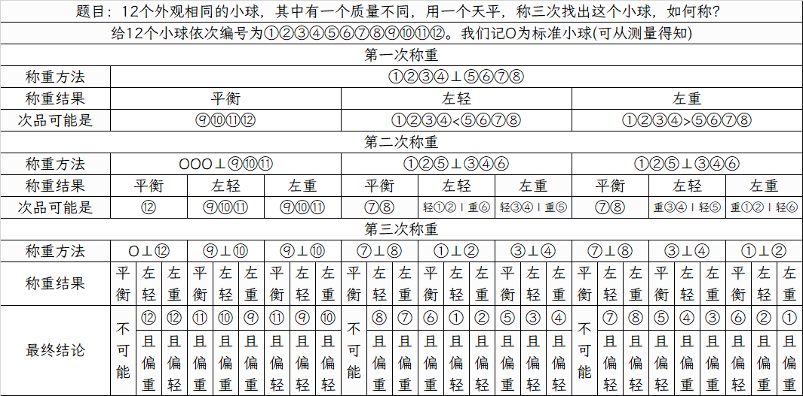

但自适应方案的问题在于前后检测是依赖的，检测步骤需要逐步进行，无法并行处理，并不适用于检测周期长的场景

#### 非自适应方案(Non-adaptive)

非自适应方案的特点是所有检测方案都是预先设计好的，不需要依赖中间结果，所以可以并行执行。

我们先以 12 枚硬币的情形做一个例子，简要介绍一下非自适应方案是怎么确定伪币并判断其轻重的，假设第一次称量我们得到了这样的结果：

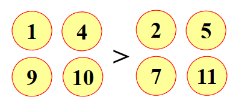

我们可以得到，如果伪币更重，那么伪币在1、4、9、10中，如果伪币更轻，那么伪币在2、5、7、12中。

假设我们第二次测量得到了这样的结果：

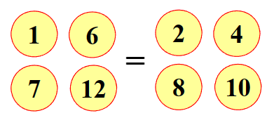

我们此时无法判断伪币的轻重，但是我们可以确定伪币在补集3、5、9、11中

假设我们的第三次测量得到了这样的结果：

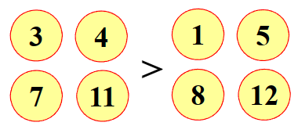

我们可以得到，如果伪币更重，那么伪币在3、4、7、11中，如果伪币更轻，那么伪币在1、5、8、12中。

接着我们把判断轻重的部分放在一起，就可以得到如下的判断表：

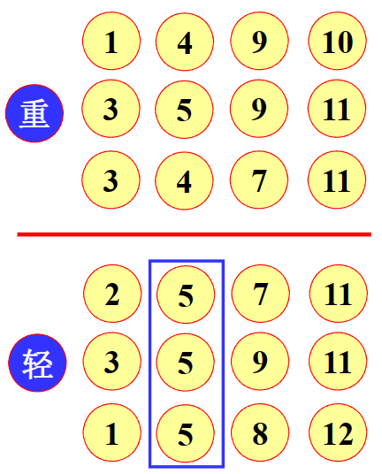

然后每个判断中取3组的交集，即可以得到伪币的位置。（注意这里我们将3、5、9、11放进了重和轻中，因为我们能确定3、5、9、11中一定含有伪币，无论伪币是轻还是重）

#### 一般结论

对于任意整数 $\omega >2$，有

- 若 $3\leq n\leq \frac{3^{\omega}-3}{2}$，则存在一种非自适应的称量方案，使用 $\omega$ 次称量可以从 $n$ 枚硬币中辨别伪币并确定轻重
- 若 $n\leq \frac{3^{\omega}-1}{2}$，则存在一种自适应的称量方案，使用 $\omega$ 次称量可以从 $n$ 枚硬币中辨别伪币并确定轻重

#### 一般情况的非自适应方案

其核心逻辑是构造“Dyson 集”来设计分组方式，这是一种满足特定条件的向量集合，我们将每一枚硬币的称量计划表示成一个向量。

假设我们需要称量 $w$ 次，那么每一枚硬币 $i$ 都可以用一个 $w$ 维的向量 $v_i$ 来表示，并且其元素取自 $\left\{-1,0,1\right\}$

- $1$：表示该硬币在第 $i$ 次称量中放在天平**左侧**
- $-1$：表示放在天平**右侧**
- $0$：表示**不参与**第 $i$ 测称量

称量结束后，我们会得到一个 $w$ 维的结果向量 $\mathbf{R}$，例如 $\mathbf{R}=(1,0,-1)$ 表示第一次左边重，第二次平衡，第三次右边重，然后对比结果向量 $\mathbf{R}$ 和每一个向量 $v_i$ 即可：

- 如果结果向量 $\mathbf{R}$ 恰好等于硬币 $i$ 的向量 $v_i$，说明硬币 $i$ 是伪币，并且偏重。
- 如果结果向量 $\mathbf{R}$ 恰好等于 $-v_i$，也即每个分量都取反，说明硬币 $i$ 是伪币，并且偏轻。

而为了让这个方案成立，所有硬币的向量组成的集合 $\mathbf{S}$（Dyson 集）**必须满足两个关键条件**：

- $\sum_{\mathbf{v}\in \mathbf{S}}\mathbf{v} = 0$

  所有向量的总和必须是零向量，这是为了保证在每一次称量中，放在天平左侧的硬币数量都等于放在右侧的硬币数量。

- 若 $\mathbf{v} \in \mathbf{S}$，则 $-\mathbf{v} \notin \mathbf{S}$

  这是为了保证解的唯一性，如果没有这个条件，当称量结果为 $\mathbf{R}$ 时，我们无法判断是 向量为 $\mathbf{R}$ 的硬币偏重 还是 向量为 $-\mathbf{R}$ 的硬币偏轻

那么我们如何去构造这样满足条件的 Dyson 集呢？这里我们给出一种基于循环变换的构造方法。

我们首先定义一个映射 $f$：
$$
f(-1)=0,\qquad f(0)=1,\qquad f(1)=-1
$$
当我们将这个映射作用域一个向量的每个分量时就会产生一个循环，比如对于向量 $\mathbf{v}=(1,-1,0)$，有
$$
\mathbf{v}=(1,-1,0)\\
f(\mathbf{v})=(-1,0,1)\\
f(f(\mathbf{v}))=(0,1,-1)\\
f(f(f(\mathbf{v})))=(1,-1,0)=\mathbf{v}
$$
由此会形成向量组 $\mathbf{S}(\mathbf{v})=\left\{\mathbf{v},f(\mathbf{v}),f(f(\mathbf{v})),-\mathbf{v},-f(\mathbf{v}),-f(f(\mathbf{v}))\right\}$，其中我们记 $\mathbf{S}^{+}(\mathbf{v})=\left\{\mathbf{v},f(\mathbf{v}),f(f(\mathbf{v}))\right\}$， $\mathbf{S}^{-}(\mathbf{v})=\left\{-\mathbf{v},-f(\mathbf{v}),-f(f(\mathbf{v}))\right\}$，一个重要的特性是 $\mathbf{v}+f(\mathbf{v})+f(f(\mathbf{v}))=\mathbf{0}$，这意味着由 $\mathbf{v},f(\mathbf{v}),f(f(\mathbf{v}))$ 这三个向量组成的集合是自平衡的。

接下来我们根据硬币数量 $n$ 分类讨论，我们的目标是从 $\omega$ 维向量空间中挑选出 $n$ 个向量作为 Dyson 集 $\mathbf{S}$，并满足和为 0 的条件

**情况一：$n=3k$ 时**

这是最为简单的情况，因为每个 $\mathbf{S}^{+}(\mathbf{v})$ 都是自平衡的，我们只需要选择 $k$ 个不相关的基础向量 $\mathbf{v_1},\mathbf{v_2},\cdots,\mathbf{v_k}$（这里的基础向量指的并不是基向量），然后将它们对应的 $\mathbf{S}^{+}$ 集合合并即可，也即
$$
\mathbf{S}=\mathbf{S}^{+}(\mathbf{v_1})\cup\mathbf{S}^{+}(\mathbf{v_2})\cup\cdots\cup\mathbf{S}^{+}(\mathbf{v_k})
$$
这样选出的 $3k$ 个向量的总和自然为0。

!!! note "Tip"

    需要注意的是，我们仅选取 $\mathbf{S}^{+}(\mathbf{v})$，而不选取 $\mathbf{S}^{-}(\mathbf{v})$，因为要满足 Dyson 集的第二条性质。

**情况2：$n=3k+1$ 时**

这种情况我们并不能恰好地用 $\mathbf{S}^{+}$ 组来凑，我们可以先取 $k-2$ 组 $\mathbf{S}^{+}(\mathbf{v_i})$，这样我们就有了 $3(k-2)$ 个向量，它们的和为零，然后我们还需要挑选 $7$ 个特别的向量，这 $7$ 个向量的和也必须为 $0$，我们可以这么去构造，首先选取单位向量 $u=(1,1,1,\cdots,1)$，然后选取 $v_1=(-1,-1,1,\cdots,1)$，$v_2=(-1,1,0,\cdots,0)$，接着我们选取一些 $\mathbf{S}^{+}(\mathbf{v}_1)$ 和 $\mathbf{S}^{+}(\mathbf{v_2})$ 里的向量，比如 $f(\mathbf{v_1})$，但这时候需要注意，如果我们取了 $f(f(\mathbf{v_1}))$，这三者加起来就是0了，不太符合我们的要求，所以我们选取反向量 $-f(f(\mathbf{v_1}))$，故意地去破坏平衡，将平衡的任务留给后续向量。然后我们取 $f(f(\mathbf{v_2}))$，最后根据结果补一个 $\mathbf{v}_3=(1,0,0,\cdots,0)$，让每一维度的坐标之和都为0。

!!! note "Tip"

    这里的组合我们可以认为是算法固定设计好的，就取这样的 $\mathbf{v}_1$、$\mathbf{v_2}$、$\mathbf{v}_3$ 即可

**情况3：$n=3k+2$ 时**

我们需要从 $k-1$ 组完整的 $\mathbf{S}^{+}$ 之外额外找出 5 个向量，使其总和为0，取这样的5个向量即可
$$
u=(1,1,1,\cdots,1)\\
\mathbf{v_1}=(1,-1,0,\cdots,0)\\
-f(\mathbf{v_1})=(0,-1,1,\cdots,1)\\
\mathbf{v_2}=(-1,1,-1,\cdots,-1)\\
-f(\mathbf{v_2})=(-1,0,-1,\cdots,-1)
$$

## 随机模型

### 概率群试——疾病检测

这个问题的背景是这样的：假设 $n$ 个人相互独立地以概率 $p$ 患病，如何使得找出全部病人的平均检测次数尽可能少？

在展开这个问题的讨论之前，我们先介绍几个名词：

设 $A$ 表示患病，$B$ 表示检测结果为阳性，则疾病监测方法的性能指标为

- **灵敏度(sensitivity)**：$p=P(B|A)$，表示患病者被检测为阳性的概率
- **特异度(specificity)：**$q=P(\overline{B}|\overline{A})$，表示未患病者被检测为阴性的概率

设疾病的发病率为 $r$，则被检测出阳性的情况下患者确实患病的概率我们可以用 Bayes 公式求出：
$$
P(A|B)=\frac{P(B|A)P(A)}{P(B|A)P(A)+P(B|\overline{A})P(\overline{A})}=\frac{pr}{pr+(1-q)(1-r)}
$$
一般来说，$p,q$ 都需要非常接近1，否则这个检测方案误差非常大。比如我们假设 $r=0.005,p=0.95,q=0.99$，在这种情况下，一个人没有患病且检测为阴性的概率为0.99，也即阴性误检的概率为0.01，这是比较小的。但是我们这时再考虑一下 $P(A|B)$ 可以得到 $P(A|B)=0.323$，这个概率比较低。

!!! note "Tip"

    事实上，相对于 $p$，结果受 $q$ 的影响变化更加剧烈，这是因为通常来说 $1-r$ 比较大。所以如果一个检测方法相对容易出现假阳性，那么这个检测方法其实不太靠谱。

概率群试通常有以下几个检测方案

#### 两阶段群试

将 $n$ 人的样本混合后检测，如果结果为阴性，说明这 $n$ 人均未被感染；如若结构为阳性，说明这 $n$ 人中至少有一人已经感染，此时我们需要逐个检测每个人的样本。则其检测次数可以分为以下几种情形：

- 混合样本为阴性，概率为 $(1-p)^n$，此时检测次数为 1.
- 混合样本为阳性，概率为 $1-(1-p)^n$，此时检测次数为 $n+1$

所以我们可以得到检测次数 $\xi$ 的数学期望为
$$
E\xi =(1-p)^n+(n+1)[1-(1-p)^n]
$$
则平均检测次数 $\frac{\xi}{n}$ 的数学期望为
$$
E\frac{\xi}{n}=\frac{1}{n}E\xi = \frac{(1-p)^n+(n+1)[1-(1-p)^n]}{n}
$$

#### 矩阵检测方案

##### 自适应方案

将 $m \times n(m\leq n)$ 个人按矩阵排好，先检测每行样本，若结果为阴性，说明这 $m$ 人未感染；若结果为阳性，说明这 $m$ 人至少有一人感染，此时我们一个一个检测样本，这实际上就是两阶段群试。

##### 非自适应方案

将 $m\times n(m\leq n)$ 个人按矩阵排好，对每行每列分别进行检测，通过检测结果确定感染者的位置，此时检测次数为 $m+n$。但是需要非常注意的是，我们并不能精确地确定感染者的位置，只能确定阳的行与阳的列的交叉位置可能阳了，其他的位置没阳，只能减少检测次数，但是并不具有良好的可区分性。

!!! note "Tip"

    事实上真正强大的非自适应方案应当是设计一个精巧的检测矩阵 $A$，使得任何 $k$ 个阳性样本组合所产生的阳性检测结果模式都是独一无二的，这样的矩阵我们称为**可区分矩阵**，但是这显然困难的多。

#### 三阶段检测方案

**第一阶段：**直接对 $n$ 个人进行总体的混合检测，如果结果为阴性则未感染；结果为阳性则进入第二阶段

**第二阶段：**将这 $n$ 人分成 $A,B$ 两组，每组有 $\frac{n}{2}$ 人，先对 $A$ 组进行检测，若结果为阴性，则确定感染者在 $B$ 组；若结果为阳性，说明 $A$ 组有感染者，但仍然需要对 $B$ 组进行检测

**第三阶段：**对有感染者的组进行检测

下面我们来计算平均检测次数的期望

第一阶段：

- 若检测结果为阴性，概率为 $(1-p)^n$，检测次数为 1，记为 $\alpha$
- 若检测结果为阳性，检测次数为1，记为 $\beta$

第二阶段：

- 若 $A$ 组阴性，概率为 $(1-p)^{\frac{n}{2}}$，检测次数为1，记为 $\alpha$
- 若 $A$ 组阳性，概率为 $1-(1-p)^{\frac{n}{2}}$，还需检测 $B$ 组，$B$ 组阳性和阴性的概率与 $A$ 组相同，检测次数为2，记为 $\beta$

第三阶段：

- 若 $A$ 组为阴性，只需对 $B$ 组进行逐个检测，检测次数为 $\frac{n}{2}$，记为 $\alpha$
- 若 $A$ 组为阳性，且 $B$ 组为阴性，则只需对 $A$ 组进行逐个检测，检测次数为 $\frac{n}{2}$，记为 $\beta$
- 若 $A$ 组为阳性，且 $B$ 组也为阳性，则需要对 $A,B$ 两个组都进行逐个检测，检测次数为 $n$，记为 $\gamma$

则对应了以下几种情况：

- $\alpha$，检测总次数为 1，概率为 $(1-p)^n$
- $\beta\alpha\alpha$，概率为 $[1-(1-p)^{\frac{n}{2}}]\times(1-p)^{\frac{n}{2}}$，检测总次数为 $2+\frac{n}{2}$
- $\beta\beta\beta$，概率为 $[1-(1-p)^{\frac{n}{2}}]\times(1-p)^{\frac{n}{2}}$，总检测次数为 $3+\frac{n}{2}$
- $\beta\beta\gamma$，概率为 $[1-(1-p)^{\frac{n}{2}}]\times[1-(1-p)^{\frac{n}{2}}]$，总检测次数为 $3+n$ 

所以总检测次数 $\xi$ 的数学期望为

$$\begin{aligned}
E\xi = (1-p)^n+(2+\frac{n}{2})\times[1-(1-p)^{\frac{n}{2}}]\times(1-p)^{\frac{n}{2}}\\+(3+\frac{n}{2})\times[1-(1-p)^{\frac{n}{2}}]\times(1-p)^{\frac{n}{2}}+(3+n)\times[1-(1-p)^{\frac{n}{2}}]^2
\end{aligned}$$

故平均检测次数 $\frac{\xi}{n}$ 的数学期望为

$$
\frac{1}{n}E\xi
$$

### Monty Hall 问题

也即三门问题，这个问题是这样的：

舞台上有三扇道具门，其中一扇门后有一辆汽车，另外两扇门后各放有一头山羊。竞猜者可以任意选择其中一扇门并获赠门后物品，当竞猜者选择了其中一扇门后，主持人打开了另两扇门中的一扇，门后面是一头山羊，并且主持人知道汽车所在的位置，他打开的门不是竞猜者选择的，也不是后面有汽车的，如果有两扇门符合在各个要求，主持人将会以相同概率选择其中一扇。主持人允许竞猜者改变之前的选择，问题是，竞猜者为了增加获得汽车的概率，是否应当改变当前的选择？

这个问题的答案是有点反直觉的，大多数人可能认为改变选择不会增加获得汽车的可能性。但是事实上改变选择会使获得汽车的概率提高一倍，我们可以用枚举法来验证一下，如下图所示：

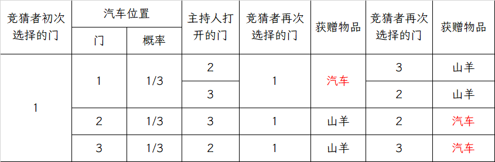

从上图可以看出，如果我们改变选择，获得汽车的概率为 $\frac{2}{3}$，而如若我们不改变选择，获得汽车的概率为 $\frac{1}{3}$

下面我们从概率计算的角度来考虑一下这个问题。

我们不妨假设竞猜者初次选择的是 1 号门，记 $C_i$ 为汽车在 $i$ 号门后面， $M$ 为主持人打开 $2$ 号门，则有
$$
P(M|C_1)=\frac{1}{2},P(M|C_2)=0,P(M|C_3)=1
$$
如若竞猜者改变选择，则其获得汽车的概率为

$$
P(C_3|M)=\frac{P(C_3M)}{P(M)}=\frac{P(M|C_3)P(C_3)}{P(M|C_1)P(C_1)+P(M|C_2)P(C_2)+P(M|C_3)P(C_3)}\\=\frac{1\times \frac{1}{3}}{\frac{1}{2}\times \frac{1}{3}+0\times \frac{1}{3}+1\times\frac{1}{3}}=\frac{2}{3}
$$

如若竞猜者不改变选择，则其获得汽车的概率为

$$
P(C_1|M)=\frac{P(C_1M)}{P(M)}=\frac{P(M|C_1)P(C_1)}{P(M|C_1)P(C_1)+P(M|C_2)P(C_2)+P(M|C_3)P(C_3)}
\\=\frac{\frac{1}{2}\times\frac{1}{3}}{\frac{1}{2}\times\frac{1}{3}+0\times\frac{1}{3}+1\times\frac{1}{3}}=\frac{1}{3}
$$

#### 被蒙在鼓里的主持人

假设主持人并不知道汽车在哪扇门后，他会等可能地打开三扇门中的一扇，那么他打开的门后面有可能是汽车，也有可能是山羊。此时，**改变选择和不改变选择的获得汽车的概率均为 $\frac{1}{2}$**。

我们仍然假设竞争者初次选择 1 号门，并记 $C_i$ 表示汽车在 $i$ 号门后，记 $M$ 为主持人打开 2 号门后是山羊，则有
$$
P(M|C_1)=\frac{1}{2},P(M|C_2)=0,P(M|C_3)=\frac{1}{2}
$$
若竞猜者改变选择，则其获得汽车的概率为

$$
P(C_3|M)=\frac{P(C_3M)}{P(M)}=\frac{P(M|C_3)P(C_3)}{P(M|C_1)P(C_1)+P(M|C_2)P(C_2)+P(M|C_3)P(C_3)}\\=
\frac{\frac{1}{2}\times \frac{1}{3}}{\frac{1}{2}\times\frac{1}{3}+0+\frac{1}{2}\times\frac{1}{3}}=\frac{1}{2}
$$

所以改变选择和不改变选择获得汽车的概率均为 $\frac{1}{2}$

!!! note "Tip"

    所以我们知道，三门问题中为什么改变选择后获得汽车的概率更高，这是因为主持人是有额外信息的，他知道汽车在哪一扇门后，这导致了改变选择和不改变选择获得汽车的概率不同

还有许许多多的拓展，比如 $n$ 扇门、$n$ 扇门 $k$ 辆车、$n$ 扇门多种奖品等等

### 赠券收集问题

一套赠券共有 $N$ 种，商家在每一件商品中随机放入一张赠券。假设每件商品中放入各种赠券的概率相同，那么集齐全套赠券平均需要购买多少件商品？

这里介绍两种方法，分别运用德摩根律和几何分布

#### 德摩根律

定义随机变量 $X$ 表示集齐全套赠券所需购买的商品数，记 $B_i$ 表示购买 $i$ 件商品后集齐全套赠券，记 $A_i^j$ 表示购买 $i$ 件商品后收集到第 $j$ 种赠券，则有

$$\begin{aligned}
P(A_i^j)=1-P(\overline{A_i^j})=1-(1-\frac{1}{N})^i\\
P(B_i)=P(A_i^1\cap A_i^2 \cap \cdots \cap A_i^N)=1-P(\overline{A_i^1\cap A_i^2 \cap \cdots \cap A_i^N})=1-P(\overline{A_i^1}\cup \overline{A_i^2}\cup \cdots \cup \overline{A_i^N})\\
=1-[\sum_{j=1}^N P(\overline{A_i^j})-\sum_{1\leq j<k\leq N}P(\overline{A_i^j}\cap \overline{A_i^k})+\cdots+(-1)^{N-1}P(\overline{A_1^i}\cap \overline{A_i^2}\cap \cdots \cap \overline{A_i^N})]
\end{aligned}$$

我们分析一下，对于任意固定的 $j,k,1\leq j<k\leq N$，$\overline{A_i^j}\cap \overline{A_i^k}$ 表示购买 $i$ 件商品之后没有收集到第 $j$ 种和第 $k$ 种赠券，所以有 $P(\overline{A_i^j}\cap \overline{A_i^k})=(1-\frac{2}{N})^i$

同理，对于任意的固定的 $1\leq j_1<j_2<\cdots<j_k\leq N$，$\overline{A_i^{j_1}}\cap \overline{A_i^{j_2}}\cap\cdots \cap \overline{A_i^{j_k}}$ 表示购买 $i$ 件商品之后未收集到第 $j_1$ 种、第 $j_2$ 种、$\cdots$、第 $j_k$ 种赠券，所以有 $P(\overline{A_i^{j_1}}\cap \overline{A_i^{j_2}}\cap\cdots \cap \overline{A_i^{j_k}})=(1-\frac{k}{N})^i$，我们可以代入计算 $P(B_i)$

$$\begin{aligned}
P(B_i)=1-[\sum_{j=1}^N P(\overline{A_i^j})-\sum_{1\leq j<k\leq N}P(\overline{A_i^j}\cap \overline{A_i^k})+\cdots+(-1)^{N-1}P(\overline{A_1^i}\cap \overline{A_i^2}\cap \cdots \cap \overline{A_i^N})]\\
=1-[\sum_{j=1}^N(1-\frac{1}{N})^i-\sum_{1\leq j_1<j_2\leq N}(1-\frac{2}{N})^i+\cdots+(-1)^{N-1}(1-\frac{N}{N})^i]\\=1-[C_N^1(1-\frac{1}{N})^i-C_N^2(1-\frac{2}{N})^i+\cdots+(-1)^{N-1}C_N^N(1-\frac{N}{N})^i]\\=1-\sum_{j=1}^N(-1)^{j-1}C_N^j(1-\frac{j}{N})^i=\sum_{j=0}^N(-1)^jC_N^j(1-\frac{j}{N})^i
\end{aligned}$$

所以期望为

$$
EX=\sum_{i=1}^Ni\cdot P(X=i)=\sum_{i=1}^N i\cdot P(B_i)=\sum_{i=1}^N i\sum_{j=0}^N(-1)^jC_N^j(1-\frac{j}{N})^i
$$

#### 几何分布

我们记随机变量 $X$ 表示集齐全套赠券所需购买的商品件数，记随机变量 $Y$ 表示从收集 $K-1$ 种赠券到 $k$ 种赠券所需购买的商品件数，则有
$$
X=Y_1+Y_2+\cdots+Y_N
$$
接下来我们考虑 $Y_k$，我们不妨先想想 $Y_k=j$ 意味着什么，这意味着先前购买的 $j-1$ 件商品所获得赠券为前面已经收集到的 $k-1$ 种中的一种，第 $j$ 件商品获得未收集到的 $N-k+1$ 种赠券中的一种，所以我们知道，$Y_k$ 服从的是参数为 $\frac{N-k+1}{N}$ 的几何分布

故根据几何分布的性质有 $E(Y_k)=\frac{N}{N-k+1}$，所以我们得到
$$
EX=\sum_{k=1}^NE(Y_k)=\sum_{k=1}^N\frac{N}{N-k+1}=N\sum_{k=1}^N\frac{1}{k}
$$

### 随机过程

#### 赌徒破产问题

可以参考随机过程课程的笔记

#### Pascal 问题

可以看 jiepeng 前辈的笔记，应该和 Markov 链关系比较大，这里就不浪费时间了。

## 招聘问题

$n$ 位求职者应聘秘书职位，招聘方通过逐个面试来予以考察。应聘者的综合能力各不相同，通过面试给出已面试的应聘者的综合能力大小顺序，并且满足以下要求：

- 应聘者以某一顺序接受面试，某个应聘者是否被录用必须**在他面试结束后立即决定**
- 若录用，招聘即告结束，不再面试其他应聘者
- 若不录用，招聘方继续面试下一位应聘者
- 招聘方不得录用曾经做出过不录用决定的应聘者

问招聘方采用何种策略可以使得招聘到第一名应聘者的概率最大？

在展开该问题的分析之前，我们首先给出以下数学描述：

**绝对名次：**表示该应聘者在所有应聘者中的实际位次，我们用 $A_i$ 表示第 $i$ 位接受面试的招聘者的绝对名次，$A_i=j,1\leq A_i\leq n$ 表示其绝对名次为 $j$。但招聘方在面试过程中是无法得知每位应聘者的绝对名次的，只能知道每位应聘者在面试过程中的相对名次。

**相对名次：**我们将第 $i$ 位应聘者的绝对名次 $A_i$ 在前 $i$ 位接受面试的应聘者 $A_1,A_2,\cdots,A_i$ 绝对名次中的排名记为 $y_i$，此即其相对名次，并且 $y_i$ 满足 $1\leq y_i \leq \min\left\{i,A_i\right\}$，这是因为相对名次一定不会比绝对名次更大

**备选者：**我们将相对名次 $y_i=1$ 的应聘者称为备选者，因为招聘方只能根据每位应聘者的相对名次进行决策，而相对名次第 $1$ 是招聘方当前能做的最好选择。需要指出的是，**备选者不是唯一的**。

对于 $1,2,\cdots,n$ 的任意固定排列有 $n!$ 种，应聘者按其中一种排列的顺序面试是等可能的，概率为 $\frac{1}{n!}$

### 策略 $S$

由于**招聘到绝对名次第一的应聘者的必要条件是录用相对名次第一的备选者**，所以为了尽可能地招到绝对名次第一名的应聘者，招聘方应当采取“从第 $s$ 位应聘者开始，录用首次出现的一名备选者”的策略 $s$ 来决定录用哪位应聘者。那么此时我们的任务就转变成了**选取更好的 $s$ 使得招聘到绝对名次第一的概率最大**。我们不妨先从特殊情况开始考虑

#### 特殊情况

我们假设目前有 $4$ 个人，上方栏为采用的策略 $s$ 取不同值的情形，侧边栏的每个数字组合代表参与者的绝对排名，我们将全排列和采用的策略的所有情形列出：

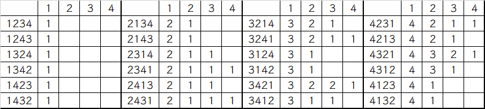

!!! note "Tip"

    这里作一个说明，比如侧边栏的 2314 组合，代表第一位面试者的绝对排名是第2，第二位面试者的绝对排名是第3，第三位面试者的绝对排名是第1，第四位面试者的绝对排名是第4。而上方栏的数字则代表策略 $s$ 里 $s$ 的取值，比如 $s=2$ 时表示从第 $2$ 位招聘者开始录用首次出现的第一位备选者。

    并且我们以 `2314` 的情形为例对结果做一下演示：

    - 当 $s=1$ 时，从第 $1$ 位招聘者开始录用首次出现的第一位备选者，此时录取者是第一位，也即绝对排名第 2 的招聘者
    - 当 $s=2$ 时，从第 $2$ 位招聘者开始录用，由于第 $2$ 位招聘者绝对排名不如已经被 pass 的第 $1$ 位，所以这位不是备选者，我们将继续面试，直至遇到第 $2$ 位招聘者，其绝对排名第 $1$，相对排名自然也是第 $1$，录用
    - 当 $s=3$ 时，从第 $3$ 位招聘者开始录用，第三位的绝对排名第 $1$，相对排名也是第 $1$，录用
    - 当 $s=4$ 时，我们从第 $4$ 位招聘者开始录用，但是第 $4$ 位不是备选者，且此时无人可试，所以本次招聘一位都没有招到。

    通过上述分析我们可以知道，策略 $2$ 在 $24$ 种等可能的面试顺序中有 $11$ 次录用到第 $1$ 名，次数最多，为最优策略。

    事实上，策略 $s$ 做的事情就是从第 $s$ 位开始，向后方找一个小于前方所有数字的数字，找到了就录用，没有找到招聘就失败。

#### 最优策略分析

我们记 $p_n(s)$ 为采用策略 $s$ 录用到第一名的概率，我们尝试将这个问题分为多个子问题，然后再把子问题的结果合并起来，记 $p_{n}^k(s)$ 为采用策略 $s$ 录用第 $k$ 位面试者$(k\geq s)$，且 $A_k=1$ 的概率，则有

$$
p_{n}(s)=\sum_{k=s}^n p_{n}^k(s)
$$
 那么接下来我们任务就是考虑 $p_n^k(s)$，有以下几个分析：

- 由于 $p_n^k(s)$ 代表的时采用策略 $s$ 录用第 $k$ 位面试者的概率，这就意味着第 $s$ 到第 $k-1$ 位均不是备选者，否则我们不会录用第 $k$ 位面试者。
- 前 $k-1$ 位应聘者中的最佳者应当出现在前 $s-1$ 位应聘者中，否则他将先于 $A_k$ 被录用

我们假设目前的第一名在第 $k$ 位，我们考虑前 $k-1$ 人有多少种可能的排列，因为前 $k-1$ 位应聘者中的最佳者必须出现在前 $s-1$ 位应聘者中，所以最佳者的可能位置数为 $s-1$，而其他 $k-2$ 人没有约束条件，有 $(k-2)!$ 种排列，第 $k$ 位之后的人也可以随意排列，其排列数为 $(n-k)!$，所以事件数为
$$
N=C_{n-1}^{k-1}(s-1)(k-2)!(n-k)!=\frac{(n-1)!}{(k-1)!(n-k)!}(s-1)(k-2)!(n-k)!\\
=\frac{s-1}{k-1}(n-1)!
$$
所以我们可以得到 $p_{n}^{k}(s)$
$$
p_n^k(s)=\frac{N}{n!}=\frac{\frac{s-1}{k-1}(n-1)!}{n!}=\frac{s-1}{n(k-1)}
$$
下面我们计算 $p_n(s)$，可以得到
$$
p_n(s)=\sum_{k=s}^np_n^k(s)=\sum_{k=s}^n\frac{s-1}{n(k-1)}=\frac{s-1}{n}\sum_{k=s}^n\frac{1}{k-1}=\frac{s-1}{n}\sum_{k=s-1}^{n-1}\frac{1}{k}
$$
现在我们就得到了 $p_n(s)$ 的表达式，由于我们希望用策略 $s$ 来招聘到第一名的概率是最大的，所以我们需要找到这样的 $s$ 使得 $p_n(s)$ 最大，我们将这样的 $s$ 记为 $s_0$，则会有这样的必要条件
$$
p_n(s_0)\leq p_n(s_0+1)\qquad p_n(s_0)\geq p_n(s_0-1)
$$
事实上，我们可以通过隔项相减的方法近似地找出这样的 $s_0$，会有

$$\begin{aligned}
p_n(s)-p_n(s-1)=\frac{s-1}{n}\sum_{k=s-1}^{n-1}\frac{1}{k}-\frac{s-2}{n}\sum_{k=s-2}^{n-1}\frac{1}{k}\\=\frac{s-1}{n}\sum_{k=s-1}^{n-1}\frac{1}{k}-\frac{s-2}{n}(\frac{1}{s-2}+\sum_{k=s-1}^{n-1}\frac{1}{k})=\frac{1}{n}\sum_{k=s-1}^{n-1}\frac{1}{k}-\frac{1}{n}\\
\\
p_n(s)-p_n(s+1)=\frac{s-1}{n}\sum_{k=s-1}^{n-1}\frac{1}{k}-\frac{s}{n}\sum_{k=s}^{n-1}\frac{1}{k}\\=\frac{s-1}{n}(\frac{1}{s-1}+\sum_{k=s}^{n-1}\frac{1}{k})-\frac{s}{n}\sum_{k=s}^{n-1}\frac{1}{k}=\frac{1}{n}-\frac{1}{n}\sum_{k=s}^{n-1}\frac{1}{k}
\end{aligned}$$

这样我们就得到了以下条件：

$$
\sum_{k=s_0}^{n-1}\frac{1}{k}\leq 1,\qquad \sum_{k=s_0-1}^{n-1}\frac{1}{k}\geq 1
$$

也就是说，$s_0$ 是使得调和 $\sum_{k=s}^{n-1}$ 首次小于或等于 $1$ 的 $s$

#### 最优策略的上下界

可以参考 jiepeng 前辈的笔记，其得到 $s_0$ 的一个上下界
$$
\frac{1}{e}(n-\frac{1}{2})+\frac{1}{2}-\frac{3e-1}{2(2n+3e-1)}<s_0<\frac{1}{e}(n-\frac{1}{2})+\frac{3}{2}
$$
并且有
$$
\lim_{n\to\infty}\frac{s_0}{n}=\frac{1}{e}
$$

#### $p_n(s_0)$ 的渐进性质

$$
\lim_{n\to\infty}p_n(s_0)=\frac{1}{e}
$$

#### 变式

可以参考 jiepeng 前辈的笔记，这里不花时间赘述。

## 安全观演

广场某处正在进行一场露天表演，若干人先后到达附近并选择一个地点观看表演。观众选择地点有如下要求：

- 与舞台中心的距离不小于 $L$
- 与之前到达的任一观众的距离不小于 $r$
- 在满足上述要求的情况下，观众选择与舞台中心距离最近的某个点

观众选择地点的方式有两种：

- 有引导：即在工作人员的引导下到达满足要求的地点
- 无引导：观众自行选择满足要求的地点

问第 $n$ 个到达的观众与舞台中心的距离 $d_n$ 大概是多少？

??? note "阿里巴巴数学竞赛曾也有一道这样的问题"

    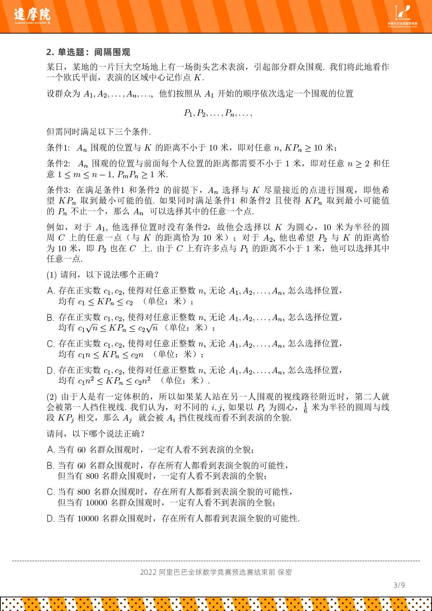

我们记舞台中心为 $O$，以 $O$ 为圆心，半径为 $L$ 的圆为 $C$，记第 $i$ 个到达的观众为 $A_i$，所选位置为 $P_i$，以 $P_i$ 为圆心，$r$ 为半径的圆为 $C_i$，则有以下几个约束条件：

- $d_i=|OP_i|\geq L$
- $P_i$ 不在圆 $C$ 内，也不在圆 $C_1,C_2,\cdots,C_{i-1}$ 内
- $d_1 \leq d_2\leq\cdots\leq d_n$，否则若 $d_i\geq d_{i+1}$，则 $A_i$ 到达时可以选择 $d_{i+1}$，矛盾。

### 观演距离上界

由于观众 $A_n$ 无法选择到与点 $O$ 距离小于 $d_n$ 的点，换个角度理解，也就是说，以 $O$ 为圆心，半径为 $d_n$ 的圆内的所有点都在圆 $C$ 或 $C_1$ 或 $C_2,\cdots,$ 或圆 $C_{n-1}$ 内，且这些圆连接处可能还有空隙，所以我们能得到一个上界：
$$
\pi \cdot d_n^2 \leq \pi L^2+(n-1)\cdot \pi r^2\\
\Rightarrow d_n\leq \sqrt{L^2+(n-1)r^2}
$$

!!! Tip "说明"

    我对这个的合理性和正确性仍持怀疑态度，待求证，但由于是备赛，暂时不求甚解地认为其正确。

    对于阿里巴巴数学竞赛的 $2(1)$ 来说，此时有 $r=1,L=10$，所以有
    $$
    d_n\leq \sqrt{10^2+(n-1)^2}=\sqrt{99+n}\leq \sqrt{100n}=10\sqrt{n}
    $$

### 观演距离下界

!!! tip "说明"

    看jiepeng前辈的笔记吧，用到了再来好好研究

## 差分方程模型

### 差分方程

记 $y(n)=y_n$，是依赖于整数变量 $n=0,\pm1,\pm2,\cdots$ 的函数，我们称 $\Delta y(n)=y(n+1)-y(n)$ 为 $y(n)$ 的**一阶差分**，$\Delta^2y(n)=\Delta[\Delta y(n)]=\Delta y(n+1)-\Delta y(n)$ 为 $y(n)$ 的**二阶差分**。以此类推，$\Delta^k y(n)$ 为 $y(n)$ 的 **$k$ 阶差分**

含有未知数的有限差分的方程称为**差分方程：**
$$
F(n,y_n,\Delta y_n,\Delta^2y_n,\cdots,\Delta^k y_n)=0
$$
如果我们将 $\Delta y_n$ 等同于 $y_{n+1}-y_n$，将 $\Delta^2 y_n$ 等同于 $y_{n+2}-2y_{n+1}+y_n$，以此类推，将 $\Delta^k y_n$ 等同于 $y_{n+k}-ky_{n+k-1}+\cdots+(-1)^k y_n$，则上式可以写为
$$
F(n,y_n,y_{n+1},\cdots,y_{n+k})=0
$$
所以差分方程的本质其实是数列递推

$m$ 阶线性差分方程可以表示为 
$$
a_m(n)y_{n+m}+a_{m-1}(n)y_{n+m-1}+\cdots+a_1(n)y_{n+1}+a_0(n)y_n=f_n
$$
齐次的 $m$ 阶线性差分方程也即 $f_n=0$

常系数的 $m$ 阶线性差分方程即 $a_i(n)=a_i$ 对 $i=0,1,\cdots,m$ 均成立

### 二阶线性常系数齐次差分方程的解

二阶线性常系数齐次差分方程可以表示为
$$
x_{n+2}+a_1 x_{n+1}+a_2x_n=0
$$

!!! note "Tip"

    即高中学的数列二阶线性递推

其特征方程为
$$
\lambda^2+a_1\lambda+a_2=0
$$
特征方程的根我们称为差分方程的**特征根**。

如果特征方程有两个不相等的实根 $\lambda_1$ 和 $\lambda_2$，则 $x_n=c_1\lambda_1^n+c_2\lambda_2^n$ 是差分方程的解

若特征方程有两个相等的实根 $\lambda$，则 $x_n=(c_1+c_2n)\lambda^n$ 是差分方程的解

### 经济学与经济模型

**商品(commodities)：**在社会分工的体系中，经济上相互独立的生产者所生产的、以自己的属性满足人的某种需要、为他人消费、通过交换进入把它当做使用价值的人的手里的劳动产品和服务

**货币(money)：**在商品交换中逐渐分离出来的固定地充当一般等价物的特殊商品，是价值量发展到一般价值形式的产物。

**价格(price)：**市场经济和商品交换中最常用的范畴，是商品与货币交换的比例，直接表明单位商品交换价值的实际货币量

**需求：**一种商品的需求是消费者在一定时期内在各种可能的价格水下，愿意并且能够购买的该商品的数量

决定需求数量的主要因素有商品的价格、消费者的收入水平、相关商品的价格（最基本的因素）、消费者的偏好、消费者对该商品的价格预期。

**需求函数：**需求函数是表示一种商品的需求数量和影响该需求数量的各种因素之间的相互关系（往往是减函数，价格越高，当前需求越少）
$$
Q^d=f(P)
$$
其中 $Q^d$ 表示需求数量，$P$ 表示商品的价格

我们往往用其反函数 $P=f^{-1}(Q^d)$ 来表示需求函数

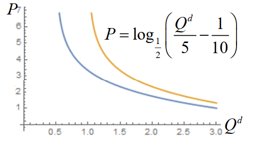

**供给：**一种商品的供给是指生产者在一定时期内在各种可能的价格水平下，愿意并且能够提供出售的该商品的数量。决定供给数量的主要因素有商品的价格、生产的成本、相关商品的价格、生产的技术水平、生产者对未来的价格预期

**供给函数：**供给函数表示一种商品的供给量与影响该商品供给量的各种因素之间的相互关系（往往是增函数，上一期价格越高，当前供给越多）
$$
Q^s=f(P)
$$
其中 $Q^s$ 表示供给数量，$P$ 表示商品的价格

我们往往用其反函数 $P=f^{-1}(Q^s)$ 来表示供给函数

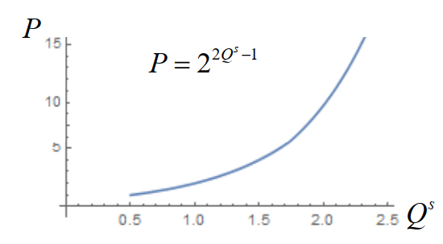

**均衡：**经济学中的均衡指经济系统中变动着的各种力量在相互作用之后所达到的“平衡”状态，也即相对静止状态。如果没有外界扰动因素，这种状态会持续下去

**均衡价格：**均衡价格市场上某种商品的需求量和供给量相等时的价格，均衡价格水平下相等的供求数量称为**均衡数量**

均衡价格是市场上商品的需求和供给这两种相反力量共同作用的结果，是在市场供求力量自发作用下形成的。一旦市场价格偏离均衡价格，需求量和供给量就会出现不一致的非均衡状态，这种非均衡状态在市场机制的作用下会逐步消失，从而恢复到均衡价格水平。

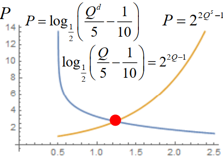

### 动态模型

#### 静态模型与静态分析：

- 变量没有先后时间的差别
- 变量的调整时间被假设为0
- 考察既定条件下变量相互作用下所呈现的状态

#### 动态模型与动态分析：

- 区分变量在时间上的先后差别
- 研究不同时间点变量之间的相互关系
- 考察不同时间点变量的相互作用在状态形成和变化过程中所起的作用和时间变化过程中状态的实际变化过程

#### 动态均衡价格模型

对于生产周期较长的商品，商品的供给量通常由前一生产周期的价格决定（供给滞后性）：
$$
Q_n^s = g(P_{n-1})
$$
但是需求还是由当前价格决定（需求即时性）：
$$
Q_n^d=f(P_n)
$$
因此均衡价格模型为：
$$
Q_n^s=g(P_{n-1})=Q_n^d=f(P_n)
$$
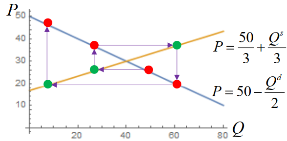

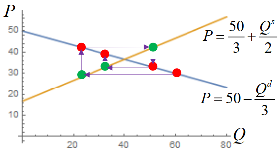

上图长得像蛛网，所以我们将其称之为**蛛网模型**

要看懂蛛网图，关键要看“供给曲线与需求曲线的斜率对比”。蛛网图的波动结果（收敛、发散、循环等等）完全由**供给曲线 $S$ 的斜率**和**需求曲线 $D$ 的斜率绝对值大小**决定。

### 蛛网模型

蛛网模型是研究某些生产周期较长且不易储存的商品均衡价格的动态稳定性的模型

!!! note "Tip"

    可以参考 jiepeng 前辈的笔记

### 种群增长模型

暂时跳过

## 常微分方程模型

### 追逐问题

#### 情形1——均沿直线航行，海盗船后发制人选择航向

一艘商船和一艘海盗船从不同地点同时出发，两船可以实时观测到对方的位置，且两船**均沿直线航行**，海盗船在确定航行方向前可以观测到商船的航行方向（意指商船先确定自己的直线航向，而后海盗船可以根据这一信息再选择一个对自己最有利的直线航向进行追击。），并且两船在航行过程中**速率保持不变**，海盗船的速率是商船的 $k$ 倍，商船能否逃脱海盗船的追逐。

我们可以将海盗船的初始位置作为原点，商船的初始位置记为 $M(m,0)$，建立直角坐标系。

若在某一时刻，海盗船与商船位于同一地点 $A(x,y)$，则由于运动时间相同，会有 $\frac{|AO|}{|AM|}=k$（这正是一个**阿氏圆**），也即
$$
\frac{\sqrt{x^2+y^2}}{\sqrt{(x-m)^2+y^2}}=k
$$
所以 $A$ 点的轨迹是一个以 $Q(\frac{k^2m}{k^2-1},0)$ 为圆心，$r=\frac{km}{|k^2-1|}$ 为半径的圆
$$
(x-\frac{k^2m}{k^2-1})^2+y^2=(\frac{km}{k^2-1})^2
$$
那么接下来我们分析什么时候海盗船可以追上商船。

当 $k>1$ 的时候，点 $O$ 在阿氏圆外，点 $M$ 在阿氏圆内，这时无论商船向任何方向航行，海盗船均可以在一定时间后与商船相遇，如下图所示：

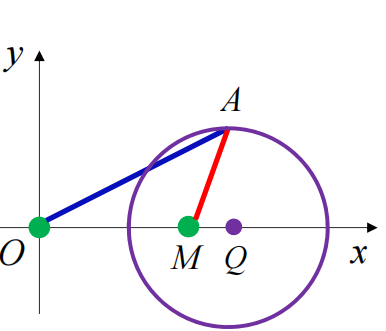

当 $k\leq 1$ 的时候，点 $O$ 在阿氏圆内，点 $M$ 在阿氏圆外，此时如下图所示

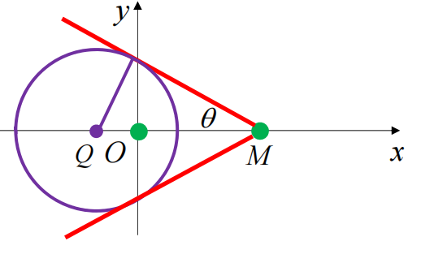

从图中可以看出，仅当商船航向和海盗船的连线的夹角不超过 $\theta$ 的时候，海盗船均能在一定时间后与商船相遇，其中 $\theta$ 角满足
$$
\sin \theta = \frac{\frac{km}{|k^2-1|}}{m-\frac{k^2m}{k^2-1}}
$$

#### 情形2——商船沿垂直于海盗船与商船初始位置连线的方向航行，海盗船任意时刻均朝着商船航行

在这种情况下，商船的航向垂直于链接商船与海盗船初始位置的直线，而任意时刻，海盗船的航行方向都为连接商船与海盗船此时位置的直线的方向。记此时商船和海盗船的速率分别为 $v_m$ 和 $v_p$，满足 $v_m=rv_p,r<1$，两船在航行过程中速率保持不变，求海盗船在与商船相遇前的航行轨迹。

这种情形我们仍然以海盗船的初始位置为原点，将商船的初始位置记为 $M(m,0)$，建立直角坐标系，并设海盗船与商船相遇前的轨迹为函数 $y=f(x)$ 的图形

考虑 $t$ 时刻，此时商船的位置为 $M_t(m,v_mt)$，记海盗船此时的位置为 $P_t(x(t),y(t))$，那么连接海盗船与商船当前位置的直线斜率为 $\frac{y(t)-v_mt}{x(t)-m}=f'(x)$，且海盗船的轨迹自原点至 $P_t$ 的弧长为 
$$
v_pt=\int_0^{x(t)}\sqrt{1+f'^2(z)}dz
$$
所以 $f'(x)$ 满足如下的常微分方程
$$
\frac{1}{v_p}\int_0^x\sqrt{1+f'^2(z)}dz=t=\frac{1}{v_m}[y-f'(x)(x-m)]
$$
两边求导可以得到
$$
\frac{1}{v_p}\sqrt{1+f'^2(x)}=\frac{1}{v_m}[f'(x)-f'(x)-f''(x)(x-m)]=-\frac{1}{v_m}[f''(x)(x-m)]
$$
整理可得
$$
\frac{f''(x)}{\sqrt{1+f'^2(x)}}=\frac{df'(x)}{\sqrt{1+f'^2(x)}}=-\frac{v_m}{v_p(x-m)}dx=-\frac{r}{x-m}dx
$$
可得
$$
\ln |f'(x)+\sqrt{1+f'^2(x)}|\ \big|_0^x=-r\ln |x-m|\ \big|_0^x
$$
也即

$$\begin{aligned}
\ln |f'(x)+\sqrt{1+f'^2(x)}|=-r\ln|1-\frac{x}{m}|\\
\Rightarrow f'(x)+\sqrt{1+f'^2(x)}=(1-\frac{x}{m})^{-r}\\
\text{取倒数则有}f'(x)-\sqrt{1+f'^2(x)}=(1-\frac{x}{m})^r
\end{aligned}$$

解得

$$
f'(x)=\frac{1}{2}[(1-\frac{x}{m})^{-r}-(1-\frac{x}{m})^r]
$$

则有

$$
f(x)=\frac{rm}{1-r^2}+\frac{m-x}{2}[\frac{1}{1+r}(1-\frac{x}{m})^r-\frac{1}{1-r}(1-\frac{x}{m})^{-r}]
$$

### 最速降线问题

给定垂直平面上的两点 $A,B$，一质点以何路径从 $A$ 运动到 $B$，可使用时最短

#### 直线下降

给定垂直平面上的两点 $A,B$，一质点沿连接 $A,B$ 的直线轨道（不妨设斜坡倾角为 $\theta$）从 $A$ 运动到 $B$，求该质点的运动时间 $T$

我们记 $A$ 为坐标原点，设 $B$ 点坐标为 $(x_B,y_B)$，则有
$$
\frac{1}{2}g\sin \theta T^2=x_B^2+y_B^2
$$
可以得到
$$
T=\sqrt{\frac{2(x_B^2+y_B^2)}{g\sin \theta}}
$$
而 $\sin\theta$ 满足
$$
\sin \theta = \frac{y_B}{\sqrt{x_B^2+y_B^2}}
$$
所以有
$$
T=\sqrt{\frac{2(x_B^2+y_B^2)}{gy_B}}
$$

#### 圆弧下降

一质点沿圆心为 $C(0,R)$，半径为 $R$ 的圆弧轨道从 $A(0,0)$ 运动到 $B(R,R)$，求该质点的运动时间 $T$（不计阻力）

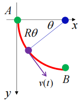

我们记质点开始运动的时刻为 $0$ 时刻，$t$ 时刻质点所在的位置与圆心的连线与 $x$ 轴的夹角为 $\theta(t)$，角速度为 $\omega(t)$，速率为 $v(t)$，则在 $t$ 时刻由能量守恒可得：

$$
mgR\sin \theta(t)=\frac{1}{2}mv^2(t)
$$

则有

$$\begin{aligned}
v(t)=R\omega(t)=R\frac{d\theta(t)}{dt}=\sqrt{2gR\sin\theta(t)}\\
\Rightarrow \frac{d\theta}{\sqrt{\sin \theta}}=\sqrt{\frac{2g}{R}}dt\\
\Rightarrow \int_0^{\frac{\pi}{2}}\frac{d\theta}{\sqrt{\sin\theta}}=\int_0^t\sqrt{\frac{2g}{R}}dt\\
\Rightarrow t=\sqrt{\frac{R}{2g}}\int_0^{\frac{\pi}{2}}\frac{d\theta}{\sqrt{\sin \theta}}\approx 1.8541\sqrt{\frac{R}{g}}
\end{aligned}$$

这是个椭圆积分

#### 最速降线

光的折射有一个费马原理：光沿所需时间最短的路径从一点传播到另一点。

光的折射的 Snell 定律
$$
\frac{\sin \theta_1}{\sin \theta_2}=\frac{v_1}{v_2}
$$
推导如下图所示：

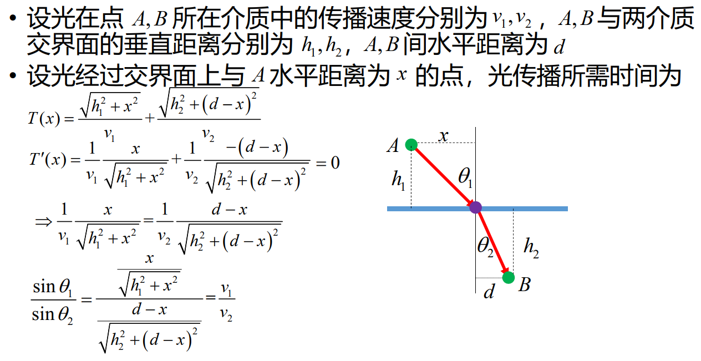

那么下面我们来尝试推导最速降线

我们将平行于 $x$ 轴的直线视作折射率逐渐减小的不同介质的分界面，如下图所示：

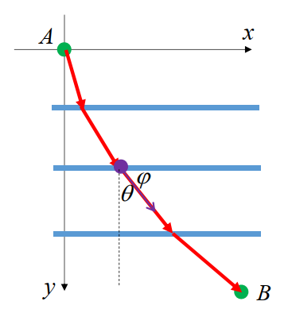

由 Snell 定律我们可以得到 $\frac{\sin \theta}{v}$ 是常数，不妨记 $\frac{\sin \theta}{v}=C$

又因为
$$
\sin \theta = \cos \phi = \frac{1}{\sqrt{1+\tan^2\phi}}=\frac{1}{\sqrt{1+y'^2}}
$$
且由能量守恒有
$$
\frac{1}{2}mv^2=mgy\Rightarrow v=\sqrt{2gy}
$$
所以
$$
\frac{\sin\theta}{v}=\frac{1}{\sqrt{1+y'^2}}\frac{1}{\sqrt{2gy}}=C\\
\Rightarrow y'=\sqrt{\frac{1-2gCy}{2gCy}} \triangleq \sqrt{\frac{C_2-y}{y}}\\
\sqrt{\frac{y}{C_2-y}}dy=dx
$$
我们换元，令 $y=C_2\sin^2\beta$，则有 $2C_2\sin^2\beta d\beta = dx$，则可以得到
$$
dx=C_2(1-\cos2\beta)d\beta
$$
所以有
$$
\begin{cases}
x=R(\gamma-\sin \gamma)
\\
y=R(1-\cos \gamma)
\end{cases}
$$
或者
$$
x=R\arccos(1-\frac{y}{R})-\sqrt{y(2R-y)}
$$
实际上，最速降线就是摆线。

**摆线：**摆线是一个圆沿着一条直线运动时，圆边界上一定点所形成的轨迹，又称圆滚线

## 数学规划

- 若干个变量在满足一些等式或不等式的限制条件下，使得目标函数取得最大值或最小值

一些简单的数学规划的例子可以参考 jiepeng 前辈的笔记。

