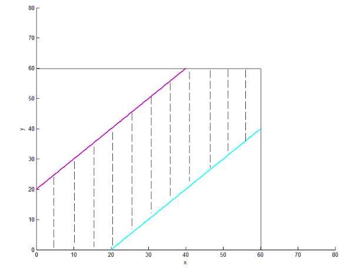
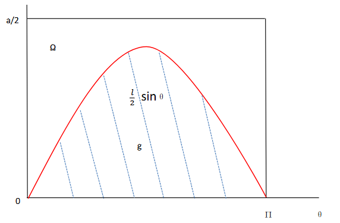

## 随机现象与统计规律性

概率的统计定义：$F_N(A) = \frac{n}{N}$ 为A在N此实验中出现的频率，其中n为事件A出现的频数

**频率的性质**：

- 非负性：$F_N(a) \geq 0$
- 规范性：对必然事件 $\Omega$ ，有$F_n(\Omega) = 1$
- 可加性：若A与B是互斥事件，以A+B记A与B至少有一个发生这一事件，则有$F_N(A+B) = F_N(A) + F_N(B)$，并且该性质可以推广到任意有限个事件

## 古典概型与几何概型

### 古典概型

满足下列两个条件的试验模型被称为古典概型：

- 样本空间有限
- 各样本点的出现等可能

**古典概率**的定义：

设一试验有n个等可能发生的样本点，而事件A包含其中的m个样本点，则事件A发生的概率P（A）定义为

$$
P(A)=\frac{m}{n}=\frac{A包含的样本点个数}{样本空间中的样本点总数}=\frac{card(A)}{card(\Omega)}
$$

   

**古典概率**的性质：

- 非负性：$P(A)\geq0$
- 规范型：对于必然事件$\Omega$，$P(\Omega)=1$
- 可加性：若A与B是互斥事件，以A+B记A与B至少有一个发生这一事件，则有$P(A+B)=P(A)+P(B)$，并且该性质可以推广到任意有限个事件

**古典概型中常用的计数方法**：

1. 从n个不同的元素有放回地抽取每一个，依次抽取m个排成一列，可以得到的不同排列数是$n^m$
2. 从n个不同的元素不放回地抽取m个元素排成一列时，可以得到的排列数是
$$
A_n^m=\frac{n!}{(n-m)!}
$$

3. 从n个不同的元素中不放回地抽取m个元素，不论次序地组成一组，可以得到的组合数是
$$
C_n^m=\frac{n!}{m!(n-m)!}
$$

4. 将n个不同的元素分成有次序的k组（注意**这些组是区分次数的**），不考虑每组中元素的次序，第$i(1 \leq i \leq k)$组恰有$n_i(1 \leq i \leq k)$个不同的元素的结果数是

$$
C_n^{n_1}C_{n-n_1}^{n_2}...C_{n-n_1-...-n_{k-1}}^{n_k}=\frac{n!}{n_1!n_2!...n_k!}
$$

**一些经典例题**

1. 有$n$个球, $N$个格子 ($n \leq N$) , 球与格子都是可以区分的. 每个球落在各个格子内的概率相同(设格子足够大, 可以容纳任意多个球). 将这$n$个球随机地放入$N$个格子, 求: 

      (1) 指定的$n$个格子各有一球的概率; 

      (2) 有$n$格各有一球的概率. 

       

      **解答：** 第一问，我们可以用古典概型来计算，记事件A为指定的格子各有一球，则我们只需要计算出$card(A)$和$card(\Omega)$即可，有

      $$
      card(A)=n!\qquad card(\Omega)=N^n
      $$

      ​这是因为指定的格子各有一球其实相当于在n个格子中放入n个球的全排列，而在计算$\Omega$的时候我们要注意每一个	球都可以放进任意一个格子里去，所以为指数形式，所以最终的答案为$P(A)=\frac{n!}{N^n}$

      对于第二问，仍然可以使用古典概型来计算，我们记B事件为有n格各有一球，这里相对于第一问的A区别在于并非指定的n格，也就是从N个格子中挑选n个格子并排序，故有
      $$
      card(N)=A_N^n\qquad card(\Omega)=N^n
      $$
      所以有
      $$
      P(B)=\frac{A^n_N}{N^n}
      $$
       

2. **(生日问题)** 求n人的班级里至少有2位同学生日相同的概率

       
      
      ​这题可以这么考虑，我们把一年365天看成365个格子，n人看成n个球，如果它们放进了同一个格子，就代表两人的生日在同一天。那么由上一题我们知道，每个格子各有一球的概率是$\frac{A_{365}^n}{365^n}$，而我们需要的是对立事件，是需要某个各自里面至少有两个球的，所以最终的结果是$1-\frac{A_{365}^n}{365^n}$，其实这题看出来是从反面考虑并不难，因为题目要求至少，很明显的提示。**这个结论一定要记住**

       
      ​**变式:** n人的班级，给定第j位同学，剩下的n-1位同学里至少有一位与第j位同学同生日的概率有多大？
      
      答案是$1-(\frac{364}{365})^{n-1}$，因为剩下n-1位同学的生日可以是除第j位同学生日那天外的364天任意一天
       
       

 3. **（摸球问题）** 口袋中有$a$只白球，$b$只黑球，随机地一只只摸球，求：

    1. 若是有放回摸球，求第k次摸得白球的概率
    2. 若是不放回摸球，求第k次摸得白球的概率
       
       

      **解答：** 第一问，$\frac{a}{a+b}$

      第二问，有点难度，我们可以从排列和组合两种角度去考虑（其实就是把同颜色的球视作不同or相同）。

      **排列**：我们先将a只白球和b只黑球都看做是不同的，若把a+b个球排列在一条直线上，则一共有$(a+b)!$种排列方法。第k次为白球，即第k个位置为白球有a种情况（因为这时候我们将白球视作不同的球），其余a+b-1个球排列共有$(a+b-1)!$种情况，故共有$a(a+b-1)!$中情况，则第k次摸得白球的概率为
   
      $$
      \frac{a(a+b-1)!}{(a+b)!}=\frac{a}{a+b}
      $$

      **组合**：我们将同种颜色的球看作是相同的，同时将a+b个球放置在同一条直线上，此时若我们取定b个白球的位置，则黑球的位置也随之确定，故总的方案数为$C_{a+b}^a$，而第k次摸得白球的的方案数为$C_{a+b-1}^{a-1}$，即在剩下a+b-1个位置挑a-1个位置放白球，所以第k次摸得白球的概率为$\frac{C_{a+b-1}^{a-1}}{C_{a+b}^a}=\frac{a}{a+b}$

      我们从这题可以得到一个**非常重要的结论**：摸球与顺序无关，抽签概率等等亦如此。

### 几何概型

几何概率的性质：

- 非负性：$P(A)\geq 0$
- 规范性：对必然事件$\Omega$，$P(\Omega)=1$
- 可加性：若A与B是互斥事件，以A+B记A与B至少有一个发生这一事件，则有$P(A+B)=P(A)+P(B)$，并且该性质可以推广到任意有限个事件

**一些经典例题**

1. **（会面问题）** 两人相约7点到8点在某地会面，先到者等候另一人20分钟，过时离去，求两人能会面的概率<

**​解：** 样本点由甲乙两人各自到达的时刻组成，以7点作为计算时间的起点，设甲乙各在第x分钟和第y分钟到达，则样本空间为$\Omega=\left\{(x,y)|0 \leq x,y\leq60\right\}$，会面的充要条件是$|x-y|\leq20$，如图所示：

则由几何概型可知相应的概率为$\frac{5}{9}$，即面积比
 
 
2. **（蒲丰投针问题）**：平面上画很多平行线，间距为a，向此平面投资长为l(l<a)的针，求此针能与平行线相交的概率。

**解：** 这题我们以针的位置为样本点，而针的位置可以由两个参数决定，针的中点与最接近的平行线之间的距离x，针与平行线的夹角θ。样本空间为：

$$
\Omega=\left\{(\theta,x)|0\leq\theta\leq\pi,0\leq x\leq \frac{a}{2}\right\}
$$
   
容易发现，针与平行线相交的充分必要条件是$x\leq\frac{lsin\theta}{2}$，所以我们可以以$\theta$为横轴，x为纵轴，图示如下：

   

​则可得概率为
$$
\frac{\int_{0}^{\pi}\frac{l}{2}sin\theta d\theta}{\frac{a\pi}{2}}=\frac{2l}{a\pi}
$$

!!! note "Tip"

      事实上，用频率逼近概率，可以得到π的近似值，我们可以重复投针N次，统计与平行线相交的次数n，则$p\approx\frac{n}{N}$，又a与l是可以精确测量的，则可以由蒲丰投针的公式得到π的近似值

## 概率的公理化定义

事件：样本空间$\Omega$的子集

事件的关系：包含、相等、和（并）、积（交）、差事件、互斥、逆（对立、余）

事件的运算：交换律、结合律、分配律、德摩根律

概率空间：三个要素，样本空间、事件域、概率

概率满足的三个条件：

- 非负性：对事件域中的任一事件A，$P(A)\geq0 $

- 规范性：$P(\Omega)=1$

- 可列可加性：若$A_1,…，A_n…$是事件域中两两互不相容的事件，则有
  $$
  P(\sum_{n=1}^{\infty}A_n )=\sum_{n=1}^{\infty}P(A_n)
  $$

### 概率的性质：

- $P(\emptyset)=0$ 
   可以用可列可加性证明：
   $$
   P(\Omega)=P+(\Omega)+P(\emptyset)+P(\emptyset)+…,
   $$
   即可得$P(\emptyset)=0$
 
 
- 有限可加性：若$A_iA_j=\emptyset,i,j=1,2,…,n,i\neq j$，则
   $$
   P(\sum_{i=1}^{n}A_n )=\sum_{i=1}^{n}P(A_n)
   $$
   也可以由可列可加性得，令$A_i=\emptyset,i > n$，结合性质1即可
 
 
- $P(\overline{A})=1-P(A)$ 
   利用有限可加性和$\Omega=A+\overline{A}$即可得
 
 
- 若$B\subset A$，则$P(A\backslash B)=P(A)-P(B)$
      - 推论1：若$B\subset A$，则$P(B) < P(A)$

      - 推论2：对事件域中的任何事件B，均有$P(B)\leq1$
 
 

- $P(A\backslash B)=P(A)-P(AB)$ 
   因为$P(A\backslash B)=P(A-AB)=P(A)-P(AB)$
 
 
- 加法公式：$P(A\cup B)=P(A)+P(B)-P(AB)$，概率版的容斥原理
 
 
- 多还少补定理（容斥原理）
   $$
   \mathrm{P}\Bigl(\bigcup_{i=1}^{n} A_i\Bigr) = \sum_{i=1}^{n} \mathrm{P}(A_i) - \sum_{1 \leq i < j \leq n} \mathrm{P}(A_i A_j) + \sum_{1 \leq i < j < k \leq n} \mathrm{P}(A_i A_j A_k) - \cdots + (-1)^{n-1} \mathrm{P}(A_1 A_2 \cdots A_n)
   $$
 
- 次可加性
   $$
   \mathrm{P}\Bigl(\bigcup_{i=1}^{\infty} A_i\Bigr) \leq \sum_{i=1}^{\infty} \mathrm{P}(A_i)\qquad\mathrm{P}\Bigl(\bigcup_{i=1}^{n} A_i\Bigr) \leq \sum_{i=1}^{n} \mathrm{P}(A_i)
   $$

**我们可以利用概率的定义和性质来求解一下复杂事件的概率**

1. 某城有N辆卡车，车牌号从1到N，有一个外地人到该城去，把遇到的n辆车子的牌号抄下来（可能重复地抄到某些车牌号），求抄到的最大号码正好为k的概率 
**解：** 记$A_k$为抄到的最大号码为k这一事件，$B_k$为抄到的最大号码不超过k这一事件，则有
$$
B_{k-1}\subset B_k,\qquad A_k=B_k-B_{k-1}
$$
且容易知道$P(B_k)=\frac{k^n}{N^n}$，则我们可以得到$P(A_k)=P(B_k)-P(B_{k-1})=\frac{k^n-(k-1)^n}{N^n}$

2. **（匹配问题）：**某班有n个士兵，每人各有一支枪，这些枪外形完全一致，在一次夜里紧急集合中，每人随机取一支步枪，求至少有一人拿到自己的枪的概率

!!! note "Tip"
   
      这题的反面其实是错排公式，每个人都没能拿到自己的枪，我们可以由容斥原理推导出结果

   **解：** 记$A_i=\left\{第i个人拿到自己的枪\right\},i=1,…,n$，则所求概率为$P(\bigcup_{i=1}^{n} A_i)$

​又因为
$$
P(A_i)=\frac{1}{n},P(A_iA_j)=\frac{1}{n(n-1)},…,P(A_1A_2…A_n)=\frac{1}{n!}
$$
由容斥原理有

$$
\begin{align}
p_n &:= \mathrm{P}\Bigl(\bigcup_{i=1}^{n} A_i\Bigr) \\
    &= n \cdot \frac{1}{n} - C_n^2 \cdot \frac{1}{n(n-1)} + C_n^3 \cdot \frac{1}{n(n-1)(n-2)} \\
    &\quad - \cdots + (-1)^{n-1} \cdot \frac{1}{n!} \\
    &= 1 - \frac{1}{2!} + \frac{1}{3!} - \cdots + (-1)^{n-1} \cdot \frac{1}{n!}
\end{align}
$$

!!! note "Tip"

      所以下次要是遇到了错排公式，就可以像这样用容斥原理来推导

#### 概率测度的连续性

给定一概率空间 $(\Omega, \mathscr{F}, \mathrm{P})$，假定 $\{A_n \in \mathscr{F}, n \geq 1\}$ 是一列单调增加的事件序列，即

$$
A_1 \subset A_2 \subset \cdots \subset A_n \subset \cdots,
$$

记 $A = \bigcup_{n=1}^{\infty} A_n$，称 $A$ 为 $A_n$ 的极限。若$\{A_n \in \mathscr{F}, n \geq 1\}$ 是一列单调减少的事件序列，即
$$
A_1 \supset A_2 \supset \cdots \supset A_n \supset \cdots,
$$

记 $A = \bigcap_{n=1}^{\infty} A_n$，称 $A$ 为 $A_n$ 的极限。

那么如何求事件A的概率呢，我们给出如下定义：

如果$\left\{A_n,n\geq1\right\}$是一列单调增加或单调减少的事件序列，且具有极限A，那么有
$$
P(A) = \lim_{n \to \infty} P(A_n)
$$
对单调递增的事件序列 $\{A_n \in \mathscr{F}, n \geq 1\}$，记

$$
\lim_{n \to \infty} A_n = A = \bigcup_{n=1}^{\infty} A_n,
$$

那么上述定理说明

$$
\mathrm{P}(\lim_{n \to \infty} A_n) = \lim_{n \to \infty} \mathrm{P}(A_n),
$$

称之为概率(测度)的下连续性。

而对单调递减的事件序列 $\{A_n \in \mathscr{F}, n \geq 1\}$，记

$$
\lim_{n \to \infty} A_n = A = \bigcap_{n=1}^{\infty} A_n,
$$

那么上述定理说明

$$
\mathrm{P}(\lim_{n \to \infty} A_n) = \lim_{n \to \infty} \mathrm{P}(A_n),
$$

称之为概率(测度)的上连续性。

## 条件概率与事件的独立性

### 条件概率

取定概率空间后，A发生的概率为P(A)，若事件B发生，在这一前提下A发生的概率就不一定是P（A）了，因为样本空间发生了变化，这时样本空间已经被压缩了，只由B中的样本点组成，即在新的试验条件下，B成为样本空间。记B发生条件下A发生的概率为$P(A|B)$，$P(A)$和$P(A|B)$是在两个不同的概率空间里对事件A的概率度量，它们通常不相等。而在求解条件概率的时候，我们既可以在压缩后的样本空间求条件概率，也可以在原来的样本空间中求条件概率。

**条件概率的定义**：对任一事件A和B，若$P(B)\neq 0$，则“在事件B发生的条件下A发生的概率”记作$P(A|B)$，定义为
$$
P(A|B)=\frac{P(AB)}{P(B)}
$$
容易验证其非负性、规范性、可列可加性

由条件概率可以得到**概率的乘法公式：**

- 若$P(B)\neq 0$，则$P(AB)=P(B)P(A|B)$
- 若$P(A)\neq 0$，则$P(AB)=P(A)P(B|A)$
- 若$P(A_1A_2…A_{n-1})\neq 0$，则$P(A_1A_2…A_n)=P(A_1)P(A_2|A_1)P(A_3|A_1A_2)…P(A_n|A_1A_2…A_{n-1})$

**例题：**

1. n张彩票中有一张中奖票。
      1. 已知前面k-1个人没摸到中奖票，求第k人摸到中奖票的概率
      2. 第k人摸到中奖票的概率

**解** 记$A_i = \{\text{第}i\text{人摸到中奖票}\}$

**（1）** 这是求条件概率 

$$ \mathbf{P}(A_k|\bar{A}_1\bar{A}_2\cdots\bar{A}_{k-1})
$$

在压缩后的样本空间里进行计算, 可得

$$
\mathbf{P}(A_k|\bar{A}_1\bar{A}_2\cdots\bar{A}_{k-1}) = \frac{1}{n-k+1}
$$

**（2）** 根据 “摸球与顺序无关” 这一结论, 马上可知所求为$P(A_k) = \frac{1}{n}$，或利用乘法公式得:

$$
\begin{aligned}
P(A_k) &= P(\bar{A}_1\bar{A}_2\cdots\bar{A}_{k-1}A_k) \\
&= P(\bar{A}_1)\times P(\bar{A}_2|\bar{A}_1)\cdots\times P(A_k|\bar{A}_1\bar{A}_2\cdots\bar{A}_{k-1}) \\
&= \frac{n-1}{n}\cdot\frac{n-2}{n-1}\cdots\frac{1}{n-k+1} \\
&= \frac{1}{n}
\end{aligned} 
$$

 
2. 罐中有$b$只黑球及$r$只红球，随机取出一只，把原球放回，并加进与抽出球同色的球$c$只，再摸第二次，这样下去共摸了$n$次。问前面的$n_1$次出现黑球，后面的$n_2 = n - n_1$ 次出现红球的概率是多少 ($c=0$表示有放回摸球，$c=-1$ 表示不放回摸球)?

**解** $A_1$ 表示第一次摸出黑球，$\cdots$，$A_{n_1}$ 表示第 $n_1$ 次摸出黑球，$A_{n_1+1}$ 表示第 $n_1 + 1$ 次摸出红球，$\cdots$，$A_n$ 表示第 $n$ 次摸出红球。则 

$$
\begin{aligned} 
P(A_1) = \frac{b}{b + r}, 
\\
P(A_2 | A_1) = \frac{b + c}{b + r + c}, \\
P(A_3 | A_1 A_2) = \frac{b + 2c}{b + r + 2c}\cdots\\
P(A_{n_1} | A_1 \cdots A_{n_1-1}) = \frac{b + (n_1 - 1)c}{b + r + (n_1 - 1)c}
\\
P(A_{n_1+1} | A_1 \cdots A_{n_1}) = \frac{r}{b + r + n_1 c}\\
P(A_{n_1+2} | A_1 \cdots A_{n_1+1}) = \frac{r + c}{b + r + (n_1 + 1)c}
\\
P(A_n | A_1 \cdots A_{n-1}) = \frac{r + (n_2 - 1)c}{b + r + (n - 1)c}
\end{aligned}
$$

因此 

$$
\begin{aligned}
P(A_1 A_2 \cdots A_n) = \frac{b}{b + r} \times \frac{b + c}{b + r + c} \times \frac{b + 2c}{b + r + 2c}\times
\cdots \times \frac{b + (n_1 - 1)c}{b + r + (n_1 - 1)c} \times \frac{r}{b + r + n_1 c} \times \frac{r + c}{b + r + (n_1 + 1)c}\times
\cdots \times \frac{r + (n_2 - 1)c}{b + r + (n - 1)c}
\end{aligned}
$$

 
3. （三枚银币骗局）某人在街头设一赌局。他向观众出示了放在帽子里的三枚银币（记为甲、乙、丙）。银币甲的两面涂了黑色，银币丙的两面涂了红色，银币乙的一面涂了黑色，另一面涂了红色。游戏规则是：他让一个观众从帽子里随机地取出一枚银币放到桌面上（这里不用“投掷银币”是为了避免暴露银币两面的颜色），然后由设局人猜银币另一面的颜色。如果猜中了，该观众付给他1元钱；如果猜错了，他付给该观众1元钱。
试问：这一赌局是公平的吗？

**解：** 这题其实逻辑比较简单，我们只需要去考虑展示面和反面的情况就行。

$P(反面是黑色|展示面是黑色)=P(\frac{反面是黑色，展示面是黑色}{展示面是黑色})=P(\frac{抽到甲硬币}{展示面是黑色})$，而很明显的是，展示面是黑色的概率为$\frac{1}{2}$，所以这个条件概率的值为$\frac{2}{3}\neq \frac{1}{2}$所以这个赌局是不公平的
 
 
4. 在前面的匹配问题中，已经求得了n个士兵中至少有一个人拿对了自己的枪的概率，现在我们求恰好有k个士兵拿对了自己的枪的概率

**解** 记$n$个士兵中恰好有$k$个士兵拿对了自己的枪的概率为$P_k^{(n)}$。则由匹配问题知
$$
P_0^{(n)} = 1 - \left[ 1 - \frac{1}{2!} + \frac{1}{3!} - \cdots + (-1)^{n-1} \frac{1}{n!} \right] = \frac{1}{2!} - \frac{1}{3!} + \frac{1}{4!} - \cdots + \frac{(-1)^n}{n!}
$$ 
记$A_i$表示第$i$个士兵拿对了自己的枪。为了计算恰好有$k$个士兵拿对了自己的枪的概率，考察一组固定的$k$个士兵，如编号为$\left\{i_1, \cdots, i_k\right\}$的士兵。只有他们拿对了自己的枪的概率为 

$$
\begin{aligned} 
P(A_{i_1} \cdots A_{i_k} \bar{A}_{i_{k+1}} \cdots \bar{A}_{i_n}) = & P(A_{i_1}) P(A_{i_2} | A_{i_1}) \cdots P(A_{i_k} | A_{i_1} \cdots A_{i_{k-1}}) \cdot P(\bar{A}_{i_{k+1}} \cdots \bar{A}_{i_n} | A_{i_1} \cdots A_{i_k}) \\ = & \frac{1}{n} \frac{1}{n-1} \cdots \frac{1}{n-(k-1)} q_{n-k}
\end{aligned} 
$$

其中$q_{n-k}$是在已知这$k$个士兵拿对了自己的枪的条件下其他$n-k$个士兵都没有拿对自己的枪的概率。因此

$$q_{n-k} = P_0^{(n-k)} = \frac{1}{2!} - \frac{1}{3!} + \frac{1}{4!} - \cdots + \frac{(-1)^{n-k}}{(n-k)!}
$$

由于从$n$个士兵中选$k$个士兵共有$C_n^k$种不同的选法，所以所求的概率为 

$$ 
\begin{aligned} P_k^{(n)} &= \sum_{i_1 < \cdots < i_k} P(A_{i_1} \cdots A_{i_k} \bar{A}_{i_{k+1}} \cdots \bar{A}_{i_n}) \\ &= C_n^k \cdot \frac{(n-k)!}{n!} q_{n-k} \\ &= \frac{1}{k!} \left[ \frac{1}{2!} - \frac{1}{3!} + \frac{1}{4!} - \cdots + \frac{(-1)^{n-k}}{(n-k)!} \right]
\end{aligned} 
$$

### 全概率公式、贝叶斯公式

#### 完备事件组

- 若事件组$\left\{A_i,i\geq1\right\}$两两互不相容，且$P(A_i)>0$（不交）

- $$
  \sum_{i=1}^{n}A_i=\Omega（不漏）
  $$

  则称$\left\{A_i,i\geq1\right\}$是$\Omega$的一个完备事件组

#### 全概率公式

若$\left\{A_i,i\geq1\right\}$是$\Omega$的一个完备事件组，则对任意事件B，有$P(B)=\sum_{i=1}^nP(A_i)P(B|A_i)$

这里的部分例题可以参考课件251页例7（敏感问题调查）和例8（赌金分配问题）

解释一下例8赌金分配问题中的递推公式是如何建立的：

下一局的比赛有两种情况：

1. **甲赢下一局**，状态变为$(x+1,y)$
2. **乙赢下一局**，状态变为$(x,y+1)$

由此根据全概率公式建立递推公式：

$$
f_6(x,y)=P(甲赢|下一局甲赢)P(下一局甲赢)+P(甲赢|下一局乙赢)P(下一局乙赢)
$$

即得：

$$
f_6(x,y)=\frac{1}{2}f_6(x+1,y)+\frac{1}{2}f_6(x,u+1)
$$

#### 贝叶斯公式

若$\left\{A_i,i\geq1 \right\}$是$\Omega$的一个完备事件组，则

$$
P(A_i|B)=\frac{P(A_iB)}{P(B)}=\frac{P(A_i)P(B|A_i)}{\sum_{k=1}^\infty P(A_k)P(B|A_k)} \ ,i\geq 1
$$

其中$P(A_i)$是没有进一步信息（不知B是否发生）的情况下人们对于$A_i$发生的可能性大小的认知，称为**先验概率**；现在有了新的信息（知道B发生）人们对$A_i$发生的可能性大小有了新的认知，得到了条件概率$P(A_i|B)$，称为后验概率

### 事件的独立性

#### 两个事件的独立性

$$
P(A|B)=P(A)(或P(B|A)=P(B))
$$

当$P(B)>0(或P(B)>0)$时上式和$P(AB)=P(A)P(B)$等价，但$P(AB)=P(A)P(B)$形式较为对称，便于推广到n个事件，所以采用这个作为事件独立性的定义。

!!! note "Tip"

      由独立性的定义可知，任何事件都与$\emptyset$独立，任何事件都与$\Omega$独立

事件域的相互独立：

两个事件域$\mathscr{F_1}$和$\mathscr{F_2}$，若对于任意的事件$A_1\in\mathscr{F_1}$，$A_2\in\mathscr{F_2}$都有$P(A_1A_2)=P(A_1)P(A_2)$，则称这两个事件域独立

#### 多个事件的独立性

三个事件的独立性：两两相互独立且$P(ABC)=P(A)P(B)P(C)$

也即：
$$
P(AB)=P(A)P(B)\\
P(AC)=P(A)P(C)\\
P(BC)=P(B)P(C)\\
P(ABC)=P(A)P(B)P(C)
$$
则称 $A,B,C$ 相互独立

n个事件的独立性：对于$n$个事件$A_1, A_2, \cdots, A_n$，若对其中的任意$k$ ($2\leq k \leq n$) 个事件$A_{i_1}, A_{i_2}, \cdots, A_{i_k}$，有
$$
P(A_{i_1} A_{i_2} \cdots A_{i_k}) = P(A_{i_1}) P(A_{i_2}) \cdots P(A_{i_k})
$$ 

则称 $n$ 个事件 $A_1, A_2, \cdots, A_n$ 相互独立。

所以要说明n个事件 $A_1, A_2, \cdots, A_n$是相互独立的，需要验证上式中的
$$
C_n^2+C_n^3+...+C_n^n=2^n-n-1
$$
个等式

