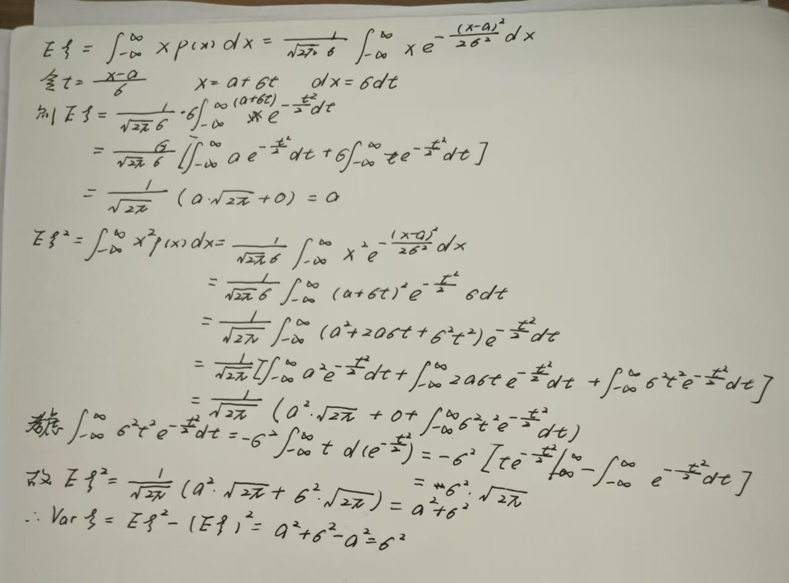
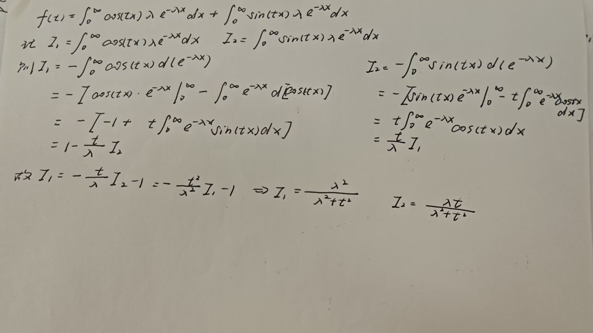
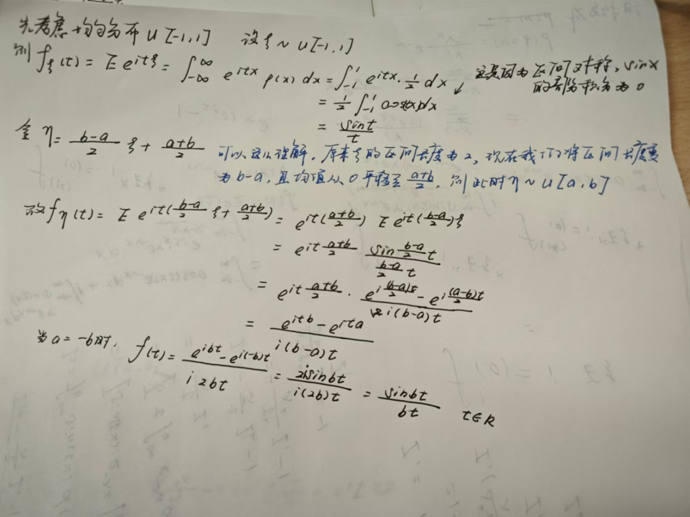

分布函数可以全面地描述一个随机变量的概率分布，但是在实际工作中，完全掌握随机变量的分布函数是比较困难的，同时人们发现某些随机变量服从某类分布，它们的一些参数可以由某些数字特征确定，因此，对这些随机变量，数字特征有更重要的意义

主要的数字特征有：**数学期望**、**方差**、**相关系数（描述两个随机变量之间的线性关系的密切程度）**

## 数学期望

### 离散型随机变量的数学期望

设离散型随机变量 $\xi$ 的分布列为

$$
\begin{array}{c|cccc} \xi & x_1 &\cdot\cdot\cdot & x_k &\cdot\cdot\cdot &x_n \\ \hline \mathbf{P} & p_1 &\cdot\cdot\cdot &p_k &\cdot\cdot\cdot &p_n \end{array} 
$$

如果级数 $\sum_kx_kp_k$ 绝对收敛，即 $\sum_k|x_k|p_k<\infty$，就称 $\sum_kx_kp_k$ 为 $\xi$ 的数学期望或均值，记作
$$
E\xi=E(\xi)=\sum_kx_kp_k
$$

!!! note "Tip"

      在定义中加入了 $\sum_kx_kp_k<\infty$ 这个条件，是为了保证数学期望的值不受求和次序的影响，从而确保了 $E\xi$ 是一个确定的值，若该条件不被满足，则称 $\xi$ 的数学期望不存在

**常见的离散型随机变量的数学期望：**

 
1. **退化分布**$\xi \equiv a$（即 $P(\xi=a)=1$）的数学期望

   绝对收敛性显然满足，根据定义有
   $$
   E\xi=aP(\xi=a)=a
   $$
   即常数的数学期望就是其本身

 
2. **二项分布** $\xi \sim B(n,p)$

   绝对收敛性满足，根据定义有

$$\begin{aligned}
E\xi&=\sum_{k=0}^nkP(\xi=k)=\sum_{k=0}^nkC_n^kp^k(1-p)^{n-k}=np\sum_{k=1}^n\frac{(n-1)!}{(k-1)!(n-k)!}p^{k-1}(1-p)^{n-k}\\&=np\sum_{r=0}^n\frac{(n-1)!}{r!(n-r-1)!}p^r(1-p)^{n-r-1}=np(p+1-p)^r=np
\end{aligned}$$

   特别地，当 $n=1$ 时，可知两点分布 $0-1(p)$ 的数学期望为 $p$

 
3. **泊松分布** $\xi\sim P(\lambda)$，求 $E\xi$

   绝对收敛性满足，根据定义有
   $$
   E\xi=\sum_{k=0}^{\infty}kP(\xi=k)=\sum_{k=0}^{\infty}k\frac{\lambda^k}{k!}e^{-\lambda}=\sum_{k=1}^{\infty}\frac{\lambda^k}{(k-1)!}e^{-\lambda}=\lambda e^{-\lambda}\sum_{r=0}^{\infty}\frac{\lambda^r}{r!}=\lambda e^{-\lambda}e^{\lambda}=\lambda 
   $$
   即泊松分布的数学期望是 $\lambda$

 
4. **几何分布** 设 $\xi$ 服从几何分布，分布列为
   $$
   P(\xi=k)=pq^{k-1},\qquad k=1,2,\cdot\cdot\cdot,\ \ 0<p<1,\ q=1-p
   $$
   绝对收敛性满足，根据定义有

$$
E\xi=\sum_{k=1}^{\infty}kP(\xi=k)=p \sum_{k=1}^{\infty} kq^{k-1}\\=p\sum_{k=1}^{\infty}(x^k)'\big|_{x=q}=p(\sum_{k=1}^{\infty}x^k)'\big|_{x=q}=p\frac{1}{(1-x)^2}\big|_{x=q}=\frac{1}{p}
$$

 
5. $\xi$ 的分布列为
   $$
   P(\xi=(-1)^k2^k/k)=\frac{1}{2^k},\qquad k=1,2,\cdot\cdot\cdot,
   $$
   求 $E\xi$

   **解** 我们验证绝对收敛性
   $$
   \sum_{k=1}^{\infty}|x_k|p_k=\sum_{k=1}^k\frac{2^k}{k}\frac{1}{2^k}=\sum_{k=1}^{\infty}\frac{1}{k}
   $$
   我们知道这个级数是发散的，所以 $E\xi$ 不存在。而如若我们不验证级数的绝对收敛性，就会得到错误的结论：
   $$
   E\xi=\sum_{k=1}^{\infty}x_kp_k=\sum_{k=1}^{\infty}(-1)^k\frac{1}{k}<\infty
   $$

在此我们约定：**后面遇到的离散型随机变量的数学期望都存在，我们不再验证级数的绝对收敛性**

### 连续型随机变量的数学期望

设 $\xi$ 是连续型随机变量，密度函数为 $p(x)$，若 $\int_{-\infty}^{\infty}xp(x)dx$ 绝对收敛，即$\int_{-\infty}^{\infty}|x|p(x)dx<\infty$，则称
$$
E\xi=\int_{-\infty}^{\infty}xp(x)dx
$$
为 $\xi$ 的数学期望，如果 $\int_{-\infty}^{\infty}|x|p(x)dx=\infty$，则称 $\xi$ 的数学期望不存在

**常见的连续型随机变量的数学期望：**

 
1. **均匀分布** $\xi \sim U[a,b]$，求 $E\xi$

   **解** 容易验证积分的绝对收敛性（放缩即可），根据定义
   $$
   E\xi=\int_{-\infty}^{\infty}xp(x)dx=\int_{a}^{b}x\frac{1}{b-a}dx=\frac{a+b}{2}
   $$

 
2. **指数分布** $\xi \sim Exp(\lambda)$，求 $E\xi$

   **解** 容易验证积分的绝对收敛性，根据定义有

$$
E\xi = \int_{-\infty}^{\infty}xp(x)dx=\int_0^{\infty}x\lambda e^{-\lambda x}dx=-[xe^{-\lambda x}\big|_{0}^{\infty}-\int_{0}^{\infty}e^{-\lambda x}]dx=\frac{1}\lambda
$$

 
3. **正态分布** $\xi\ \sim N(a,\sigma^2)$，求 $E\xi$

   **解** 容易验证积分的绝对收敛性，根据定义有
   $$
   E\xi = \int_{-\infty}^{\infty}xp_{\xi}(x)dx=\int_{-\infty}^{\infty}x\frac{1}{\sqrt{2\pi}\sigma}e^{-\frac{(x-a)^2}{2\sigma^2}}dx{\overset{\text{令 } t =\frac{x-a}{\sigma}}{=}}\int_{-\infty}^{\infty}\frac{a}{\sqrt{2\pi}}e^{-\frac{t^2}{2}}dt+\frac{\sigma}{\sqrt{2\pi}}\int_{-\infty}^{\infty}te^{-\frac{t^2}{2}}dt
   $$
   由于$te^{-\frac{t^2}{2}}$是奇函数，等式右边那一项积分为0，所以
   $$
   E\xi=\int_{-\infty}^{\infty}\frac{a}{\sqrt{2\pi}}e^{-\frac{t^2}{2}}dt=a
   $$

 
4. **Cauchy 分布** $\xi$ 服从标准 Cauchy 分布，求 $E\xi$

   **解** 标准 Cauchy 分布即 $p(x)=\frac{1}{\pi(1+x^2)},\ x\in R$

   先验证积分的绝对收敛性

$$\begin{aligned}
\int_{-\infty}^{\infty}|x|\frac{1}{\pi(1+x^2)}dx&=2\int_0^{\infty}x\frac{1}{\pi(1+x^2)}dx\\&=\frac{1}{\pi}[\int_0^{\infty}\frac{1}{(1+x)^2}d(1+x)^2-2\int_0^{\infty}\frac{1}{(1+x)^2}dx]
\end{aligned}
$$

   显然左边的式子是发散的而右边的式子是收敛的，所以其发散，故 $E\xi$ 不存在

我们约定：后面遇到的所有连续型随机变量的数学期望都存在，我们不再验证积分的绝对收敛性

### 数学期望的一般定义（一般随机变量的数学期望）

需要用到斯提尔吉斯积分($Stieltjes$)和离散化思想

**一般随机变量的数学期望**

若随机变量 $\xi$ 的分布函数为 $F(x)$，$Stieltjes$ 积分 $\int_{-\infty}^{\infty}xdF(x)$ 绝对收敛，即 $\int_{-\infty}^{\infty}|x|dF(x)<\infty$，则称
$$
E\xi=\int_{-\infty}^{\infty}xdF(x)
$$
为 $\xi$ 的数学期望，若 $\int_{-\infty}^{\infty}|x|dF(x)=\infty$，则称 $\xi$ 的数学期望不存在

而在离散情形下，$E\xi=\sum_{k}x_kp_k$，在连续情形下，$E\xi=\int_{-\infty}^{\infty}xdF(x)=\int_{-\infty}^{\infty}xp(x)dx$

对于 $Stieltjes$ 积分，有 $F(x)=\int_{-\infty}^xdF(t)$，因此对于任何随机变量 $\xi$，都有 $P(a<\xi \leq b)=F(b)-F(a)=\int_a^bdF(x)$，所以概率 $P(\xi \in B)$ 可以写成 $P(\xi \in B)=\int_BdF(x)$

### 随机变量函数的数学期望

设 $\xi$ 是随机变量，$f(x)$ 是一元Borel函数，记 $\eta = f(\xi)$，$\xi,\eta$ 的分布函数分别是 $F_{\xi}(x)$ 和 $F_{\eta}(y)$，若 $\eta$ 的数学期望存在，则有
$$
E\eta=Ef(\xi)=\int_{-\infty}^{\infty}ydF_{\eta}(y)=\int_{-\infty}^{\infty}f(x)dF_{\xi}(x)
$$
这个公式的意义在于我们无需求出 $\eta$ 的分布函数，而可以直接使用 $\xi$ 的分布函数求得 $\eta$ 的期望。并且其实这个公式的意义我们可以以离散型去理解，这符合我们的直观，$f(x)$ 就是变换后的 $\eta$ 的值，而由于函数 $f(x)$ 之间的映射关系，所以 $f(x)$ 的概率其实就是 $x$ 的概率，因此我们使用 $dF_{\xi}(x)$ 作为密度函数（在连续情形下是密度函数），这样使得其意义更明确，更容易记忆

上述公式在离散情形和连续情形下可化为（$p(x)$ 为 $\xi$ 的密度函数）：
$$
Ef(\xi)=\sum_{k}p_kf(x_k),\qquad Ef(\xi)=\int_{-\infty}^{\infty}f(x)p(x)dx
$$
我们将其推广到** $n$ 维情形和 $n$ 维Borel函数**：

设 $(\xi_1,\cdot\cdot\cdot,\xi_n)$ 的分布函数为 $F(x_1,\cdot\cdot\cdot,x_n)$，而 $f(x_1,\cdot\cdot\cdot,x_n)$ 是 $n$ 元Borel函数，若 $f(\xi_1,\cdot\cdot\cdot,\xi_n)$ 的数学期望存在，则
$$
Ef(\xi_1,\cdot\cdot\cdot,\xi_n)=\int_{-\infty}^{\infty}\cdot\cdot\cdot\int_{-\infty}^{\infty}f(x_1,\cdot\cdot\cdot,x_n)dF(x_1,\cdot\cdot\cdot,x_n)
$$
特别地，有
$$
E\xi_i=\int_{-\infty}^{\infty}\cdot\cdot\cdot\int_{-\infty}^{\infty}x_idF(x_1,\cdot\cdot\cdot,x_n)=\int_{-\infty}^{\infty}x_idF_i(x_i)
$$
其中 $F_i(x)$ 是 $\xi$ 的边际分布函数，对于二元分布函数 $F(x,y)$，有
$$
E\xi\eta=\int_{-\infty}^{\infty}\int_{-\infty}^{\infty}xydF(x,y),\qquad E\xi^2=\int_{-\infty}^{\infty}\int_{-\infty}^{\infty}x^2dF(x,y)
$$
上述结论最好都能记住

下面我们看一些例题

**例1** 设某报童每日的潜在卖报数 $\zeta$ 服从泊松分布 $P(\lambda)$，假设每卖出一份报可得报酬 $a$，卖不掉而退回每份赔偿 $b$，若某日该报童买进 $n$ 份报，求其期望所得

**解** 这题其实不难，首先由报童每日的潜在卖报数服从泊松分布我们可以得到
$$
P(\zeta=k)=\frac{\lambda^k}{k!}e^{-\lambda}
$$
接下来我们只需要搞清楚 $\zeta=k$ 时报童卖报的所得，即可当成离散型随机变量进行期望求解，我们设 $\zeta=k$ 时报童卖报所得为 $q_k$，则当 $k<n$ 时，报童的报卖不完，只能卖潜在卖报数 $k$ 份，可知
$$
q_k=ak-(n-k)b=(a+b)k-nk
$$
而当 $k\geq n$ 时，报童的报能卖完，也就是卖了 $n$ 份，可知
$$
q_k=an
$$
故我们考虑期望所得即考虑 $Eq_k$

$$\begin{aligned}
Eq_k&=\sum_{k=0}^{\infty}q_kP(\xi=k)=\sum_{k=0}^{n-1}q_kP(\xi=k)\sum_{k=n}^{\infty}q_kP(\xi=k)\\&=\sum_{k=0}^{n-1}[(a+b)k-nk]\frac{\lambda^k}{k!}e^{-\lambda}+\sum_{k=n}^{\infty}an\frac{\lambda^k}{k!}e^{-\lambda}
\end{aligned}$$

**例2** 设 $\xi \sim U[a,b]$，求 $\eta = \xi^2$ 的数学期望

**解** 直接算 $f(x)=x^2$
$$
E\xi^3=\int_{-\infty}^{\infty}f(x)p_{\xi}(x)dx=\int_{-\infty}^{\infty}x^2\frac{1}{b-a}dx=\frac{a^2+ab+b^2}{3}
$$

### 数学期望的基本性质

 
1. 若 $a\leq b$，则 $E\xi$ 存在且 $a\leq E\xi \leq b$，特别地，若 $\xi=c$，则 $E\xi=Ec=c$

 
2. 数学期望具有性质量好的线性运算，也即若 $E\xi_1,\cdot\cdot\cdot,E\xi_n$ 都存在，则对任意常数 $c_1,\cdot\cdot\cdot,c_n$ 及 $b,E(\sum_{i=1}^n c_i\xi_i+b)$ 存在，且有
   $$
   E(\sum_{i=1}^nc_i\xi_i+b)=\sum_{i=1}^nc_iE\xi_i+b
   $$
   特别地，有
   $$
   E(\sum_{i=1}^n\xi_i)=\sum_{i=1}^nE\xi_i,\qquad E(c\xi)=cE(\xi)
   $$

!!! note "Tip"

      性质1和性质2共同说明：若$\xi\leq\eta$，则$E\xi \leq E\eta$，证明也非常简单，即
      $$
      E(\xi-\eta)\leq0 \Rightarrow E\xi-E\eta \leq0 \Rightarrow E\xi \leq E\eta
      $$

 
3. **若$\xi_1,\cdot\cdot\cdot,\xi_n$相互独立**，各 $E\xi_i$ 存在，则有
   $$
   E(\xi_1\cdot\cdot\cdot\xi_n)=E\xi_1\cdot\cdot\cdot E\xi_n
   $$
   即相互独立时，乘积的期望等于期望的乘积

可以得到以下几个重要的不等式

- **Markov不等式**：对于随机变量 $\xi$，对任意的 $\varepsilon>0$，都有
  $$
  P(|\xi|\geq \varepsilon)\leq\frac{E|\xi|}{\varepsilon}
  $$
  证明自己看下课件，这里不贴出来了，第三章课件82页

- **Cauchy-Schwarz不等式**：假设 $E\xi^2,E\eta^2,E(\xi\eta)$ 都存在，则有
  $$
  |E(\xi\eta)|\leq\sqrt{E\xi^2\cdot E\eta^2}
  $$
  且等号成立当且仅当 $P(\eta=t_0\xi)=1$，这里 $t_0$ 是某一个常数，也即 $\eta$ 以概率1等于 $\eta$ 的常数倍

- **Jensen不等式**：设 $\xi$ 为随机变量，$g(x)$ 是定义在 $R$ 上的 Borel 函数且是下凸（上凸）的，如果 $E\xi$ 存在，则有
  $$
  g(E\xi)\leq Eg(\xi)\qquad (gE\xi\geq Eg(\xi))
  $$
  若 $g(x)$ 是 $R$ 上的严格下凸（上凸）函数，则等号成立当且仅当
  $$
  P(\xi=E\xi)=1
  $$
  

下面我们看一些例题

**例1** 设 $\xi \sim B(n,p)$，求 $E\xi$

**解** 固然这里可以将其视作离散型随机变量，求和来求解其数学期望。我们也可以将其拆分为n个相互独立的随机变量（因为二项分布本就是n个相互独立的伯努利试验），我们记

$$
\xi = \cases{1, &第i次试验A发生，\\0, &第i次试验A不发生}
$$

此时有 $\xi_i \sim 0-1(p)$ 分布，$p=P(A),E\xi_i=p$ 且 $\xi=\sum_{i=1}^n\xi_i$，所以有

$$
E\xi=\sum_{i=1}^nE\xi_i=np
$$

这题启示我们可以把复杂随机变量分解成简单随机变量之和

**例2** 设 $\xi$ 服从超几何分布，分布列为

$$
P(\xi = m) =\frac{C_M^mC_{N-M}^{n-m}}{C_N^n}，m=max\left\{0,N-M\right\},\cdot\cdot\cdot,min(n,M)
$$

求 $E\xi$

**解** 我们可以设计一个不放回抽样，令 $\xi_i$ 为第 $i$ 次抽取时的废品数，则 $\xi=\sum_{i=1}^n\xi_i$，同时可知
$$
P(\xi_i=1)=\frac{M}{N},\qquad i=1,2,\cdot\cdot\cdot,n
$$
上面结论其实用到了抽签与抽取顺序无关的结论，因此我们可以得到
$$
E\xi=\sum_{i=1}^nE\xi_i=\frac{nM}{N}
$$
**例3** 一个班级有 $n$ 位同学，计算同生日同学的平均对数

**解** 记 $A_{ij}=\left\{第i,j两位同学同生日\right\}$，$1\leq i < j \leq n$，记

$$
\xi_{ij} = 
\begin{cases} 
1, & \text{若 } A_{ij} \text{ 发生}, \\
0, & \text{否则},
\end{cases}
\qquad 1 \leq i < j \leq n.
$$

则

$$
\xi = \sum_{1 \leq i < j \leq n} \xi_{ij},
$$

且

$$
E[\xi] = \sum_{1 \leq i < j \leq n} E[\xi_{ij}] = \sum_{1 \leq i < j \leq n} P(A_{ij}) = \frac{n(n-1)}{2 \times 365}.
$$

!!! note "Tip"

      注意这里 $E_{ij}$ 的值其实就是 $\frac{1}{365}$，两人的生日都有可能是365天中的一天，所以总共的情况有365*365种，而两人生日相同只能是这365天中的1天，所以以古典概型的角度来看，概率就是 $\frac{1}{365}$，而相应地，由于 $P(A_{ij})$ 是一个常数，所以求和的结果就是 $\frac{n(n-1)}{2 * 365}$

### 条件数学期望

第二章第四节中我们引入的条件分布列和条件概率密度函数具有通常的分布列和概率密度函数的一切性质，因此也可以关于它们求数学期望，称为条件数学期望

**离散情形：**设在 $\xi=x_i$ 的条件下，$\eta$ 有条件分布列 $P(\eta=y_j|\xi=x_i),j=1,\cdot\cdot\cdot,n(n<\infty或n=\infty)$，如果级数 $\sum_{j=1}^{\infty}y_jP(\eta=y_j|\xi=x_i)$ 绝对收敛，即 $\sum_{j=1}^{\infty}|y_j|P(\eta=y_j|\xi=x_i)<\infty$，则称
$$
E(\eta|\xi=x_i)=\sum_{j=1}^{\infty}y_jP(\eta=y_j|\xi=x_i)
$$
为 $\xi=x_i$ 时 $\eta$ 的条件数学期望

**连续情形：**设在 $\xi=x$ 的条件下，$\eta$ 有条件概率密度函数 $p_{\eta|\xi}(y|x)$，如果积分 $\int_{-\infty}^{\infty}yp_{\eta|\xi}(y|x)dy$ 绝对收敛，即 $\int_{-\infty}^{\infty}|y|p_{\eta|\xi}(y|x)dy<\infty$，则
$$
E(\eta|\xi=x)=\int_{-\infty}^{\infty}yp_{\eta|\xi}(y|x)dy
$$
为 $\xi=x$ 时 $\eta$ 的条件数学期望

下面我们看一些例题：

**例1** 若 $(\xi,\eta)\sim N(a,b,\sigma_1^2,\sigma_2^2,r)$，求 $E(\eta|\xi=x)$

**解** 本题需要用到二元正态分布的条件密度函数，暂时先搁着吧

若以 $E(\eta|\xi)$ 记 $\xi$ 的如下函数：当 $\xi=x$ 时它取值 $g(x)=E(\eta|\xi=x)$，这样定义的 $g(\xi)=E(\eta|\xi)$ 是一个随机变量，对 $g(\xi)$ 求数学期望，有如下的结论（**双期望公式**）：
$$
E[E(\eta|\xi)]=E(\eta)
$$
当 $\xi$ 是离散型随机变量时，记 $p_i=P(\xi=x_i)$，则上式可以写作
$$
E\eta=Eg(\xi)=\sum_ig(x_i)P(\xi=x_i)=\sum_ip_iE(\eta|\xi=x_i)
$$
称上式为全数学期望公式

连续情形的全数学期望公式为
$$
E\eta=Eg(\xi)=\int_{-\infty}^{\infty}p_{\xi}(x)g(x)dx=\int_{-\infty}^{\infty}E(\eta|\xi=x)p_{\xi}(x)dx
$$
例题 第三章PPT p133

## 方差、协方差与相关系数

### 方差

称 $\xi-E\xi$ 为随机变量 $\xi$ 对于均值 $E\xi$ 的离差，它是一个随机变量，但是由于 $E(\xi-E\xi)$ 恒为0，因此用 $E(\xi-E\xi)$ 来度量 $\xi$ 取值的离散程度是无效的，考虑用 $E(\xi-E\xi)^2$ 来描述 $\xi$ 取值的离散程度，也即方差

若 $E(\xi-E\xi)^2<\infty$，就称它是随机变量 $\xi$ 的方差，记作 $Var\xi$（或 $D\xi$），即
$$
Var\xi=E(\xi-E\xi)^2
$$
而为了统一量纲，我们有时采用 $\sqrt{Var\xi}$，称为 $\xi$ 的标准差

**方差的计算公式**：

一般情形：
$$
Var\xi=\int_{-\infty}^{\infty}(x-E\xi)^2dF_{\xi}(x)
$$
离散情形：
$$
Var\xi=\sum_{i}(x_i-E\xi)^2P(\xi=x_i)
$$
连续情形：
$$
Var\xi=\int_{-\infty}^{\infty}(x-E\xi)^2p_{\xi}(x)dx
$$

!!! note "Tip"

      注意 $E\xi$ 是一个常数

另外，我们还可以如是拆分
$$
Var\xi=E(\xi-E\xi)^2=E(\xi^2-2\xi E\xi+(E\xi)^2)=E(\xi^2)-2(E\xi)^2+(E\xi)^2=E(\xi^2)-(E\xi)^2
$$
也即，方差等于平方的期望减期望的平方

同时我们知道 $E(\xi-E\xi)^2=E(\xi^2)-(E\xi)^2 \geq0$ 这是我们之前运用 Jensen 不等式得到的结论

**一些重要的随机变量的方差**

 
1. **退化分布**： $P(\xi=c)=1$，可以得到 $E\xi=c$，$Var\xi=E(\xi^2)-(E\xi)^2=c^2-c^2=0$

 
2. **两点分布：** 设 $\xi \sim 0-1(p)$ 分布，求 $Var\xi$
   $$
   E\xi=p,\qquad E\xi^2=p,\qquad Var\xi=E(\xi^2)-(E\xi)^2=p-p^2=p(1-p)
   $$

 
3. **泊松分布：** 设 $\xi \sim P(\lambda)$分布，求 $Var \xi$

   先求解 $E\xi$,
   $$
   E\xi=\sum_{k=0}^{\infty}k\frac{\lambda^k}{k!}e^{-\lambda}=\sum_{k=1}^{\infty}k\frac{\lambda^k}{k!}e^{-\lambda}=\lambda e^{-\lambda}\sum_{k=1}^{\infty}\frac{\lambda^{k-1}}{(k-1)!}=\lambda e^{-\lambda}e^{\lambda}=\lambda
   $$
   再求解 $E\xi^2$

$$\begin{aligned}
E\xi^2=\sum_{k=0}^{\infty}k^2\frac{\lambda^k}{k!}e^{-\lambda}=\sum_{k=1}^{\infty}k\frac{\lambda^k}{(k-1)!}e^{-\lambda}=\sum_{k=1}^{\infty}[(k-1)+1]\frac{\lambda^k}{(k-1)!}e^{-\lambda}\\=\lambda e^{-\lambda}(\sum_{k=1}^{\infty}\frac{\lambda^{(k-1)}}{(k-1)!}(k-1)+\sum_{k=1}^{\infty}\frac{\lambda^{(k-1)}}{(k-1)!})=\lambda e^{-\lambda}(\lambda e^{\lambda}+e^{\lambda})=\lambda^2+\lambda
\end{aligned}$$

   则有
   $$
   Var\xi=E(\xi^2)-(E\xi)^2=\lambda^2+\lambda-\lambda^2=\lambda
   $$

 
4. **几何分布：** 设 $\xi$ 服从参数为 $p$ 的几何分布，分布列为
   $$
   P(\xi=k)=pq^{k-1},\qquad k=1,2,...,\ 0<p<1,\ q=1-p
   $$
   求 $Var\xi$

   **解** 先求 $E\xi$

$$\begin{aligned}
E\xi&=\sum_{k=1}^{\infty}kP(\xi=k)=\sum_{k=1}^{\infty}kpq^{k-1}=p\sum_{k=1}^{\infty}kq^{k-1}
=p\sum(kx^k)'\big|_{x=q}\\&=p(\sum kx^k)'\big|_{x=q}=p(\frac{x}{1-x})'\big|_{x=q}=\frac{p}{(1-q)^2}=\frac{p}{p^2}=\frac{1}{p}
\end{aligned}$$

   再求解 $E\xi^2$

$$
E\xi^2=\sum_{k=1}^{\infty}k^2pq^{k-1}=p\sum_{k=1}^{\infty}k^2q^{k-1}=p\sum_{k=1}^{\infty}(kx^k)'\big|_{x=q}=p(\sum_{k=1}^{\infty}kx^k)'\big|_{x=q}
$$

   我们记
   $$
   S=\sum_{k=1}^{\infty}kx^k,\qquad xS=\sum_{k=1}^{\infty}kx^{k+1}
   $$
   通过错位相减可以求得
   $$
   S=\frac{x}{(1-x)^2}
   $$
   记得要在错位相减计算结果时用上$\lim_{n \to \infty}$

!!! note "Tip"

      或者这里其实可以提取一个x出来，变成$x\sum kx^{k-1}$，这样就能用无穷级数求和的结论了
   
   故可以得到
   $$
   E\xi^2=\frac{2-p}{p^2},\qquad Var\xi=\frac{1-p}{p^2}=\frac{q}{p^2}
   $$

    
5. **均匀分布** 设 $\xi \sim U[a,b]$ 分布，求 $Var\xi$

   比较常规
   $$
   E\xi=\int_{-\infty}^{\infty}xp(x)dx=\int_a^bx\frac{1}{b-a}dx=\frac{a+b}{2}
   $$

   $$
   E\xi^2=\int_{-\infty}^{\infty}x^2p(x)dx=\int_a^bx^2\frac{1}{b-a}dx=\frac{a^2+ab+b^2}{3}
   $$

​	故有
$$
Var\xi=\frac{a^2+ab+b^2}{3}-\frac{(a+b)^2}{4}=\frac{(b-a)^2}{12}
$$

 
6. **指数分布** 设 $\xi \sim Exp(\lambda)$ 分布，求 $Var\xi$

   **解** 先计算 $E\xi$

$$\begin{aligned}
E\xi&=\int_{-\infty}^{\infty}\lambda xe^{-\lambda x}dx=-\int_0^{\infty}xd(e^{-\lambda x})\\&=-[xe^{-\lambda x}\big|_0^{\infty}-\int_{0}^{\infty}e^{-\lambda x}dx]=\int_{0}^{\infty}e^{-\lambda x}dx=\frac{1}{\lambda} e^{-\lambda x}\big|_{\infty}^0=\frac{1}{\lambda}
\end{aligned}$$

   再计算 $E\xi^2$

$$\begin{aligned}
E\xi^2&=\int_{-\infty}^{\infty}x^2\lambda e^{-\lambda x}dx=-\int_{0}^{\infty}x^2d(e^{-\lambda x})=-[x^2 e^{-\lambda x}\big|_0^{\infty}-\int_0^{\infty}e^{-\lambda x}2xdx]\\&=\int_0^{\infty}2xe^{-\lambda x}dx=2E\xi=\frac{2}{\lambda}
\end{aligned}$$
   
   故

$$
Var\xi=E(\xi^2)-(E\xi)^2=\frac{1}{\lambda^2}
$$

 
7. **正态分布** 设 $\xi \sim N(a,\sigma^2)$ 分布，求 $Var\xi$

   

 
**切比雪夫不等式（Chebyshev）：**设 $\xi$ 为随机变量，数学期望存在，则对任意给定的 $\varepsilon>0$，恒有
$$
P(|\xi-E\xi|\geq\varepsilon)\leq\frac{Var\xi}{\varepsilon^2}
$$
离差的绝对值大于等于 $\varepsilon$ 的概率小于等于方差除以 $\varepsilon^2$

**证明** 设 $\xi$ 的分布函数为 $F(x)$

$$\begin{aligned}
P(|\xi-E\xi|\geq\varepsilon)&=\int_{|x-E\xi|\geq \varepsilon}dF(x)\leq\int_{|x-E\xi|\geq \varepsilon}\frac{(x-E\xi)^2}{\varepsilon^2}dF(x)\\&\leq \frac{1}{\varepsilon^2}\int_{|x-E\xi|\geq \varepsilon}(x-E\xi)^2dF(x)=\frac{Var\xi}{\varepsilon^2}
\end{aligned}$$

事实上，根据 Markov 不等式可以直接证得 Chevyshev 不等式

**方差的性质：**

- $Var\xi=0$ 的充要条件是 $P(\xi=c)=1$，其中 $c$ 是某个常数

- 设 $b,c$ 都是常数，则 $Var(c\xi+b)=c^2Var(\xi)$

      **证明** 
   $$
   Var(c\xi+b)=E[(c\xi+b-E(c\xi+b))]^2=E[c\xi+b-cE\xi-b]^2=c^2E(\xi-E\xi)^2=c^2Var\xi
   $$

- 若 $c\neq E\xi$，则 $Var\xi < E(\xi-c)^2$，这个性质也可以理解为方差相对于均值的离散程度最小，$E(\xi-c)^2$ 表示方差相对于 $c$ 的离散程度

      **证明** 
      $$
      E(\xi-c)^2=E(\xi-E\xi+E\xi-c)^2=E[(\xi-E\xi)^2+2(E\xi-c)(\xi-E\xi)+(E\xi-c)^2]\\
      =Var\xi+0+(E\xi-c)^2\geq Var\xi
      $$
      等号成立当且仅当 $E\xi=c$
  
      而为什么 $E[(E\xi-c)(\xi-E\xi)]=0$ 呢
      $$
      E[(E\xi-c)(\xi-E\xi)]=E(\xi E\xi-(E\xi)^2-c\xi+cE\xi)=(E\xi)^2-(E\xi)^2-cE\xi+cE\xi=0
      $$
  
- $$
  \text{Var}\left(\sum_{i=1}^{n} \xi_i\right) = \sum_{i=1}^{n} \text{Var}(\xi_i) + 2 \sum_{1 \leq i < j \leq n} E\left[(\xi_i - E[\xi_i])(\xi_j - E[\xi_j])\right].
  $$

      特别地，若 $\xi_1,\cdot\cdot\cdot,\xi_n$ 两两独立(注意这里只要求两两独立，不要求相互独立，因为实际上两两独立就能保证上式的右边的交叉项为0)，则
      $$
      Var(\sum_{i=1}^{n}\xi_i)=\sum_{i=1}^nVar\xi_i
      $$

下面我们看一些例题

**例1** 设 $\xi\sim B(n,p)$，求 $Var \xi$

**解** 这题可以拆成 $n$ 重伯努利试验，记 $\xi_i$ 为第 $i$ 次试验的结果（独立同分布），则 $\xi=\sum_{i=1}^n\xi_i$，且 $\xi_i$ 相互独立，则可以得到
$$
Var\xi=\sum_{i=1}^nVar\xi_i=np(1-p)
$$
**例2** 设随机变量 $\xi_1, \cdots, \xi_n$ 相互独立同分布，$E[\xi_i] = a$，$\text{Var}[\xi_i] = \sigma^2$，$i = 1, \cdots, n$,记 $\bar{\xi} = \frac{1}{n} \sum_{i=1}^{n} \xi_i$,求 $E[\bar{\xi}]$，$\text{Var}[\bar{\xi}]$

**解** 直接算

$$\begin{aligned}
E\xi=E(\frac{1}{n}\sum_{i=1}^n\xi_i)=\frac{1}{n}\sum_{i=1}^nE\xi_i=a \\Var\xi=Var(\frac{1}{n}\sum_{i=1}^n\xi_i)=\frac{1}{n^2}\sum_{i=1}^nVar\xi_i=\frac{\sigma^2}{n}
\end{aligned}$$

这个例子说明，**在独立同分布情形下，$\xi$ 的数学期望与各 $\xi_i$ 的数学期望相同，而方差只有 $\xi_i$ 的 $\frac{1}{n}$ 倍，这一事实在数理统计中有重要意义**

**例3** 设随机变量 $\xi$ 的数学期望和方差都存在，$Var\xi>0$，令
$$
\xi^*=\frac{\xi-E\xi}{\sqrt{Var\xi}}
$$
称它为随机变量 $\xi$ 的标准化，求 $E\xi^*,Var\xi^*$

!!! note "Tip"

      其实正态分布的标准化正符合这个定义，在标准化正态分布中，我们令 $t=\frac{x-a}{\sigma}$，也符合这个定义，我们也可以用正态分布标准化来辅助记忆

**解** 直接计算即可

$$\begin{aligned}
E\xi^*=\frac{1}{\sqrt{Var\xi}}E(\xi-E\xi)=0\\
Var\xi^*=\frac{1}{Var\xi}Var(\xi-E\xi)=\frac{Var\xi}{Var\xi}=1
\end{aligned}$$

!!! note "Tip"

      也即标准化的随机变量期望为0，方差为1，标准化正态分布正是如此

### 协方差

对于随机向量，我们除了关心它的每个分量的情况之外，还希望知道各个分量之间的联系，这光靠数学期望和方差是办不到的，因此我们引入下面的一个概念——协方差

记 $\xi_i$ 和 $\xi_j$ 的联合分布函数为 $F_{ij}(x,y)$，若
$$
E|(\xi_i-E\xi_i)(\xi_j-E\xi_j)|<\infty
$$
就称
$$
E[(\xi_i-E\xi_i)(\xi_j-E\xi_j)]=\int_{-\infty}^{\infty}\int_{-\infty}^{\infty}(x-E\xi_i)(y-E\xi_j)dF_{ij}(x,y)
$$
为 $\xi_i,\xi_j$ 的协方差，记作 $Cov(\xi_i,\xi_j)$

!!! note "Tip"

      并且很显然的是 $Cov(\xi_i,\xi_i)=Var\xi_i$，且方差的性质4可以写作
      $$
      Var(\sum_{i=1}^n\xi_i)=\sum_{i=1}^nVar\xi_i+2\sum_{1\leq i<j\leq n}Cov(\xi_i,\xi_j)
      $$

**协方差的性质**

 
1. $$
   Cov(\xi,\eta)=Cov(\eta,\xi)=E(\xi\eta)-E\xi E\eta
   $$
   **证明** 从协方差的定义出发即可

 
2. 设 $a,b$ 是常数，则 $Cov(a\xi,b\eta)=abCov(\xi,\eta)$

   **证明** 也从定义出发即可
   $$
   Cov(a\xi,b\eta)=E[(a\xi-aE\xi)(b\eta-bE\eta)]=ab[E(\xi\eta)-E\xi E\eta]=abCov(\xi,\eta)
   $$

 
3. $Cov(\sum_{i=1}^n\xi_i,\eta)=\sum_{i=1}^nCov(\xi_i,\eta)$

   **证明** 由定义展开

$$\begin{aligned}
Cov(\sum_{i=1}^n\xi_i,\eta)&=E[(\sum_{i=1}^n\xi_i-\sum_{i=1}^nE\xi_i)(\eta-E\eta)]=E(\sum_{i=1}^n\xi_i\eta-\sum_{i=1}^n\eta E\xi_i-E\eta \sum_{i=1}^n\xi_i+\sum_{i=1}^nE\eta E\xi_i)
\\&=\sum_{i=1}^nE(\xi_i\eta)-\sum_{i=1}^nE\eta E\xi_i=\sum_{i=1}^nCov(\xi_i.\eta)
\end{aligned}$$

   该性质还可以推广到
   $$
   Cov(\sum_{i=1}^n\xi_i,\sum_{j=1}^m\eta_j)=\sum_{i=1}^n\sum_{j=1}^mCov(\xi_i,\eta_j)
   $$
   应用两次性质3即可得，可以理解为双线性

**协方差矩阵**

对于 $n$ 维随机向量 $\boldsymbol{\xi} = (\xi_1, \cdots, \xi_n)'$，定义它的协方差矩阵为

$$
B = \text{Cov}(\boldsymbol{\xi}) = E[(\boldsymbol{\xi} - E\boldsymbol{\xi})(\boldsymbol{\xi} - E\boldsymbol{\xi})']
= \begin{pmatrix}
b_{11} & b_{12} & \cdots & b_{1n} \\
b_{21} & b_{22} & \cdots & b_{2n} \\
\vdots & \vdots & \ddots & \vdots \\
b_{n1} & b_{n2} & \cdots & b_{nn}
\end{pmatrix},
$$

其中 $b_{ij} = \text{Cov}(\xi_i, \xi_j)$。显然 $B$ 是一个对称矩阵，且对任何实数 $t_i \in \mathbb{R}$，$i = 1, \cdots, n$，二次型

$$
\sum_{i=1}^{n} \sum_{j=1}^{n} t_i t_j b_{ij} = \sum_{i=1}^{n} \sum_{j=1}^{n} t_i t_j \mathbb{E}[(\xi_i - \mathbb{E}\xi_i)(\xi_j - \mathbb{E}\xi_j)]= \mathbb{E}\left[\sum_{i=1}^{n} t_i (\xi_i - \mathbb{E}\xi_i)\right]^2 \geq 0.
$$

所以，随机向量 $\boldsymbol{\xi}$ 的协方差矩阵 $\boldsymbol{B}$ 是非负定的。

 
4. 设

$$
\xi = (\xi_1, \cdots, \xi_n)', \qquad 
C = \begin{pmatrix}
c_{11} & \cdots & c_{1n} \\
\vdots & \ddots & \vdots \\
c_{m1} & \cdots & c_{mn}
\end{pmatrix},
$$

   则 $C\xi$ (C为常数矩阵) 的协方差矩阵为 $CBC'$，其中 $B$ 是 $\xi$ 的协方差矩阵。

​	**证明** 
$$
E[C(\xi - E\xi)(C(\xi - E\xi))']
= E[C(\xi - E\xi)(\xi - E\xi)'C']
= C E[(\xi - E\xi)(\xi - E\xi)'] C'
= CBC'.
$$

### 相关系数

协方差虽然在某种意义上表示了两个随机变量间的关系，但 $Cov(\xi,\eta)$ 的取值大小与 $\xi,\eta$ 的量纲有关，而为了避免这一点，我们下面使用 $\xi,\eta$ 的标准化随机变量来探讨

称

$$
r_{\xi\eta}=Cov(\xi^*,\eta^*)=E(\xi^*\eta^*)=\frac{E(\xi-E\xi)(\eta-E\eta)}{\sqrt{Var\xi\cdot Var\eta}}=\frac{Cov(\xi,\eta)}{\sqrt{Var\xi \cdot Var\eta}}
$$

为 $\xi,\eta$ 的相关系数

!!! note "Tip"

      这里 $Cov(\xi^*,\eta^*)=E(\xi^*\eta^*)$ 是因为 $\xi^*,\eta^*$ 都是标准化随机变量，他们的期望为0，而 $Cov(\xi^*,\eta^*)=E(\xi^*\eta^*)-E\xi^*E\eta^*=E(\xi^*\eta^*)$

**相关系数的性质：**

 
1. 对相关系数 $r_{\xi\eta}$，恒有 $|r_{\xi\eta}|\leq1$，$r_{\xi\eta}=1$ 当且仅当

$$
P(\eta^*=\xi^*)=1
$$

   $r_{\xi\eta}=-1$当且仅当

$$
P(\eta^*=-\xi^*)=1
$$

   此性质表明相关系数 $r_{\xi\eta}$ 的取值为 \pm1$ 时，$\xi,\eta$ 以概率1存在着线性关系，另一极端情形是 $r_{\xi\eta}=0$，此时称 $\xi$ 与 $\eta$ 不相关

 
2. 对随机变量 $\xi,\eta$，下列事实等价：

- $Cov(\xi,\eta)=0$

- $\xi,\eta\text{不相关}$

- $E(\xi\eta)=E\xi E\eta$

- $Var(\xi+\eta)=Var\xi+Var\eta$ 

    
3. 若 $\xi,\eta$ 独立，则 $\xi,\eta$ 不相关

   这里我们要弄清楚，独立和不相关并不等价，独立$\Rightarrow$不相关，不相关$\nRightarrow$独立

下面我们来看一些例题

**例1** 设随机变量 $\theta \sim U[0,2\pi],\xi=cos\theta,\eta=sin\theta$，以这个例子说明不相关 $\nRightarrow$ 独立

**解** 首先我们验证 $\xi,\eta$ 不相关

$$\begin{aligned}
E\xi=\int_{-\infty}^{\infty}cosx\frac{1}{2\pi}dx=\int_{0}^{2\pi}cosx\frac{1}{2\pi}dx=0\\
E\eta=\int_{-\infty}^{\infty}sinx\frac{1}{2\pi}dx=\int_{0}^{2\pi}sinx\frac{1}{2\pi}dx=0\\
E(\xi\eta)=\int_{-\infty}^{\infty}sinx\cdot cosx\frac{1}{2\pi}dx=\int_{0}^{2\pi}sinx\cdot cosx\frac{1}{2\pi}dx=0
\end{aligned}$$

故有 $Cov(\xi,\eta)=E(\xi\eta)-E\xi E\eta=0$

下面我们验证其不独立，只需取两个Borel集，有
$$
P(\xi \in B_1,\eta \in B_2)=P(\xi \in B_1)P(\eta \in B_2)
$$
取 $B_1 = B_2 = (0, \frac{1}{2})$，则有 

$$ \{\xi \in B_1\} = \left\{0 < \cos \theta < \frac{1}{2}\right\} = \left\{\frac{\pi}{3} < \theta < \frac{\pi}{2}\right\} \cup \left\{\frac{3\pi}{2} < \theta < \frac{5\pi}{3}\right\}$$ 

$$ \{\eta \in B_2\} = \left\{0 < \sin \theta < \frac{1}{2}\right\} = \left\{0 < \theta < \frac{\pi}{6}\right\} \cup \left\{\frac{5\pi}{6} < \theta < \pi\right\}$$ 

这表明 

$$ \{\xi \in B_1\} \cap \{\eta \in B_2\} = \emptyset$$ 

因此

$$ P(\xi \in B_1) = P(\eta \in B_2) = \frac{1}{6}, \qquad P(\xi \in B_1, \eta \in B_2) = 0
$$ 

所以 $\xi$ 与 $\eta$ 不独立。

!!! note "Tip"

      事实上，$\xi,\eta$ 存在着非线性关系：
      $$
      \xi^2+\eta^2=cos^2\theta+sin^2\theta=1
      $$

综上所述，相关系数 $r_{\xi\eta}$ 是 $\xi,\eta$ 线性相关关系的一种刻画，当 $|r_{\xi\eta}|=1$ 时，$\xi$ 与 $\eta$ 之间以概率1存在线性关系，当 $|r_{\xi\eta}|=0$ 时，$\xi,\eta$ 不相关，它们之间不存在线性关系，但是仍然可能存在其他相依关系，所以并不一定相互独立，但是对于二维正态分布却是一个例外

 
4. 对于二元正态分布，两个分量不相关与相互独立是等价的

   **证明** 要用到二元正态分布的联合密度函数，先暂时搁置着吧

### 矩

数学期望、方差、协方差都是随机变量最常用的数字特征，它们都是某种矩，矩是最广泛使用的一种数字特征，在概率论和数理统计中占有重要地位，最常用的矩有两种：原点矩和中心矩

**原点矩：**对于正整数 $k$（可以拓展到非负实数），称 $m_k=E\xi^k$ 为 $\xi$ 的 $k$ 阶（原点）矩（一阶矩即数学期望）

若高阶矩存在，则低阶矩也存在，即 $E\xi^n$ 存在 $\Rightarrow$ $E\xi^k(0\leq k\leq n)$ 存在，证明如下：

假设 $E|\xi|^n$ 存在（这意味着 $E|\xi|^n < \infty$）。若 $0 \leq k \leq n$，则

$$
\begin{aligned}
E|\xi|^k &= \int_{-\infty}^{\infty} |x|^k \mathrm{d}F(x)= \int_{|x| \leq 1} |x|^k \mathrm{d}F(x) + \int_{|x| > 1} |x|^k \mathrm{d}F(x) \\
&\leq P(|\xi| \leq 1) + \int_{|x| > 1} |x|^n \mathrm{d}F(x) \leq 1 + E|\xi|^n < \infty
\end{aligned}
$$

所以 $E|\xi|^k$ ($0 \leq k \leq n$) 存在（或直接利用 Jensen 不等式证明）

**中心矩：**对正整数 $k$（可以拓展到非负实数），称 $c_k=E(\xi-E\xi)^k$ 为 $\xi$ 的 $k$ 阶中心矩（方差是二阶中心矩）

下面我们看几道例题

**例1** 设 $\xi \sim N(0,\sigma^2)$，此时 $E\xi=0$ 且

$$
m_n=c_n=\frac{1}{\sqrt{2\pi}\sigma}\int_{-\infty}^{\infty}x^n e^{-\frac{x^2}{2\sigma^2}}dx
$$

显然，$n$ 为奇数时，$m_n = 0$；$n$ 为偶数时

$$
\begin{aligned}
m_n &= \sqrt{\frac{2}{\pi}} \int_{0}^{\infty} \frac{x^n}{\sigma} \exp\left\{-\frac{x^2}{2\sigma^2}\right\} \, \mathrm{d}x 
= \sqrt{\frac{2}{\pi}} \sigma^n 2^{\frac{n-1}{2}} \int_{0}^{\infty} z^{\frac{n-1}{2}} e^{-z} \, \mathrm{d}z \\
&= \sqrt{\frac{2}{\pi}} \sigma^n 2^{\frac{n-1}{2}} \Gamma\left(\frac{n+1}{2}\right) = 1 \times 3 \times \cdots \times (n-1) \sigma^n.
\end{aligned}
$$

特别地，$m_4 = c_4 = 3\sigma^4$。因此 $N(0, \sigma^2)$ 分布的偏态系数与峰态系数都为 0。

称 $M_\alpha = E|\xi|^\alpha$ 为 $\xi$ 的 $\alpha$ 阶绝对矩。那么当 $\xi \sim N(0, \sigma^2)$ 时，有

$$
E|\xi|^n = 
\begin{cases}
\sqrt{\frac{2}{\pi}} \sigma^n 2^{\frac{n-1}{2}} \Gamma\left(\frac{n+1}{2}\right) = \sqrt{\frac{2}{\pi}} 2^k k! \sigma^{2k+1}, & n = 2k + 1, \\
1 \times 3 \times \cdots \times (n-1) \sigma^n, & n = 2k.
\end{cases}
$$

**例2** 若 $\xi \sim Exp(\lambda)$，那么对任意的 $k\geq1$
$$
E|\xi|^k=E\xi^k=\int_0^{\infty}x^k \lambda e^{-\lambda x}dx=\frac{k}{\lambda}E\xi^{k-1}=\cdots=\frac{k!}{\lambda^k}E\xi^0=\frac{k!}{\lambda^k}<\infty
$$

所以指数分布的任意阶矩存在

## 特征函数

数字特征只反映了概率分布的某些侧面，一般说来，数字特征不能完全确定随机变量的分布，本节我们将介绍特征函数这个工具，它既能完全决定分布函数而又具有良好的分析性质

### 特征函数的定义

我们首先拓展一下随机变量的概念，引入复随机变量

设 $\xi,\eta$ 为实值随机变量，称 $\zeta=\xi+\mathrm{i}\eta$ 为复随机变量，这里 $\mathrm{i}^2=-1$，同时定义 $E\zeta=E\xi+\mathrm{i}E\eta$ 为 $\zeta$ 的数学期望

!!! note "Tip"

      对复随机变量的研究本质上是对二维随机变量的研究，比如若二维随机变量 $(\xi_1,\eta_1)$ 与 $(\xi_2,\eta_2)$ 是相互独立的，则称复随机变量 $\zeta_1=\xi_1+i\eta_1$ 与 $\zeta_2=\xi_2+i\eta_2$ 是相互独立的；若 $\zeta_1,\cdot\cdot\cdot,\zeta_n$ 是相互独立的，可以证明
      $$
      E(\zeta_1\cdot\cdot\cdot\zeta_n)=E\zeta_1\cdot\cdot\cdot E\zeta_n
      $$

**特征函数：**设 $\xi$ 为实随机变量，称
$$
f(t)=Ee^{it\xi}=\int_{-\infty}^{\infty}e^{itx}dF(x),\ t\in R
$$
为 $\xi$ 的特征函数，这是一个关于t的函数

!!! note "Tip"

      - 对于 $e^{itx}$，我们有时会用欧拉公式来处理
      $$
      e^{itx}=cos(tx)+isin(tx)
      $$

      - 由于 $Ee^{|it\xi|}=1$，所以对一切 $t\in R$，特征函数都是有意义的，也就是说任何随机变量都有相应的特征函数

      - 特征函数只与分布函数有关，因此也称为某一分布函数的特征函数

**离散型随机变量的特征函数**

若 $\xi$ 的分布列为
$$
P(\xi=x_k)=p_k,\qquad k=1,\cdot\cdot\cdot,n(n<\infty或n=\infty)
$$
则
$$
f(t)=Ee^{it\xi}=\sum_{k=1}^ne^{itx_k}p_k
$$

**连续型随机变量的特征函数**

若随机变量 $\xi$ 有密度函数 $p(x)$，则
$$
f(t)=Ee^{it\xi}=\int_{-\infty}^{\infty}e^{itx}p(x)dx=\int_{-\infty}^{\infty}cos(tx)p(x)dx+i\int_{-\infty}^{\infty}sin(tx)p(x)dx
$$
若 $p(x)$ 为偶函数，则该连续型随机变量的特征函数为实函数

下面我们考虑一些重要随机变量/分布的特征函数

 
1. **退化分布** $P(\xi=c)=1$ 的特征函数 $f(t)=e^{itc},\ t\in R$

 
2. **二项分布** $B(n,p)$ 的特征函数为
   $$
   f(t)=\sum_{k=0}^ne^{itk}P(\xi=k)=\sum_{k=0}^ne^{itk}C_n^kp^kq^{n-k}=\sum_{k=0}^nC_n^k(pe^{it})^kq^{n-k}=(pe^{it}+q)^n,\ t\in R
   $$

 
3. **两点分布** $0-1(p)$ 的特征函数为 $f(t)=pe^{it}+q,\ t \in R$，其实就是 $n=1$ 时的二项分布

 
4. **泊松分布** $P(\lambda)$ 的特征函数
   $$
   f(t)=Ee^{it\xi}=\sum_{k=0}^{\infty}e^{itk}\frac{\lambda^k}{k!}e^{-\lambda}=e^{-\lambda}\sum_{k=0}^{\infty}\frac{(\lambda e^{it})^k}{k!}=e^{-\lambda}e^{\lambda e^{it}}=e^{\lambda(e^{it}-1)},\ t \in R
   $$

 
5. **指数分布** $Exp(\lambda)$ 的特征函数

$$\begin{aligned}
f(t)&=Ee^{it\xi}=\int_{-\infty}^{\infty}e^{itx}\lambda e^{-\lambda x}dx=\int_0^{\infty}e^{itx}\lambda e^{-\lambda x}dx\\&=\int_0^{\infty}cos(tx)\lambda e^{-\lambda x}dx+i\int_0^{\infty}sin(tx)\lambda e^{-\lambda x}dx
\end{aligned}$$

故
$$
f(t)=I_1+iI_2=\frac{\lambda(\lambda+it)}{\lambda^2+t^2}=\frac{\lambda}{\lambda-it}=(1-i\frac{t}{\lambda})^{-1}
$$
### 特征函数的性质

 
1. $$
   |f(t)|\leq f(0)=1,\ f(-t)=\overline{f(t)}
   $$

   **证明** 

$$\begin{aligned}
|f(t)|&=|Ee^{it\xi}|=\big|\int_{-\infty}^{\infty}e^{itx}dF(x)\big|\leq\int_{-\infty}^{\infty}|e^{itx}|dF(x)=F(\infty)-F(-\infty)=1\\
\\
f(-t)&=\int_{-\infty}^{\infty}cos(-tx)dF(x)+i\int_{-\infty}^{\infty}sin(-tx)dF(x)\\&=\int_{-\infty}^{\infty}cos(tx)dF(x)-i\int_{-\infty}^{\infty}sin(tx)dF(x)=\overline{f(t)}
\end{aligned}$$

 
2. $f(t)$ 在 $(-\infty,\infty)$ 上一致连续

   **证明** 对任意的 $t \in R$ 和 $\varepsilon >0$

$$\begin{aligned}
\big|f(t+h)-f(t)\big|&=\big|\int_{-\infty}^{\infty}e^{i(t+h)x}-e^{itx}dF(x)\big|
=|e^{itx}||\int_{-\infty}^{\infty}(e^{ihx}-1)dF(x)|\\&=|\int_{-\infty}^{\infty}(e^{ihx}-1)dF(x)|
\leq \int_{-\infty}^{\infty}\big|e^{ihx}-1\big|dF(x)
\end{aligned}$$
   
   这个式子的值已经同 $t$ 无关，我们将其拆分为两块
   $$
   (\int_{|x|\geq A}+\int_{|x| \leq A})|e^{ihx}-1|dF(x)
   $$
   分别记为 $I_1,I_2$

   由 $\int_{-\infty}^{\infty} \mathrm{d}F(x) = 1$ 知，存在充分大的 $A > 0$ 使得：

   $$
   \int_{|x| \geq A} \mathrm{d}F(x) < \frac{\varepsilon}{4}.
   $$

   因此：

   $$
   I_1 \leq \int_{|x| \geq A} (|e^{ihx}| + 1) \mathrm{d}F(x) = 2 \int_{|x| \geq A} \mathrm{d}F(x) < \frac{\varepsilon}{2}.
   $$
   又因为

   $$
   |e^{ihx} - 1| = |e^{ihx/2}| \cdot |e^{ihx/2} - e^{-ihx/2}| = 2|\sin(hx/2)| \leq |hx|,
   $$

   所以对已取定的 $A$，取 $\delta = \varepsilon / (2A)$。当 $|x| < A$ 及 $0 < h < \delta$ 时，有

   $$
   |e^{ihx} - 1| \leq |hx| \leq A\delta = \frac{\varepsilon}{2}.
   $$

   因此

   $$
   I_2 \leq \frac{\varepsilon}{2} \int_{-A}^A \mathrm{d}F(x) \leq \frac{\varepsilon}{2}.
   $$

   所以当 $0<h<\delta$时$\big|f(t+h)-f(t)\big|<\varepsilon$，且 $\delta$ 的选取与 $t$ 无关，所以 $f(t)$ 在$(-\infty,\infty)$ 上一致连续

 
3. $f(t)$ 是非负定的：对任意的正整数 $n$ 及任意实数 $t_1,\cdot\cdot\cdot,t_n$，复数 $\lambda_1,\cdot\cdot\cdot,\lambda_n$，有
   $$
   \sum_{k=1}^n\sum_{j=1}^nf(t_k-t_j)\lambda_k\overline{\lambda_j}\geq 0
   $$
   
$$\begin{aligned}
\sum_{k=1}^n \sum_{j=1}^n f(t_k - t_j) \lambda_k \overline{\lambda_j}
&= \sum_{k=1}^n \sum_{j=1}^n \mathbb{E} e^{i(t_k - t_j) \xi} \lambda_k \overline{\lambda_j}
=E(\sum_{k=1}^ne^{it_k\xi}\lambda_k\sum_{j=1}^ne^{-it_j\xi}\overline{\lambda_j})
\\
&= E \left( \sum_{k=1}^n e^{it_k \xi} \lambda_k \right) \overline{\left( \sum_{j=1}^n e^{it_j \xi} \lambda_j \right)}
= E \left| \sum_{k=1}^n e^{it_k \xi} \lambda_k \right|^2 \geq 0.
\end{aligned}$$

而在考虑完上述三个性质之后，我们引出一个定理，**波赫纳尔-辛钦定理：**

**函数 $f(t)$ 为特征函数的充要条件是 $f(t)$ 非负定、连续且 $f(0)=1$ **

该定理在理论上给出了一个判定特征函数的方法，但是在实际应用中却是不方便使用的，我们倒是可以用其来判断某个函数不是特征函数。

 
4. 若 $\xi_1,\xi_2,\cdot\cdot\cdot,\xi_n$ 相互独立，$\eta=\xi_1+\xi_2+\cdot\cdot\cdot+\xi_n$，$\xi_k$ 的特征函数为 $f_k(t)$，则

$$
f_\eta(t)=f_1(t)f_2(t)\cdot\cdot\cdot f_n(t)
$$

​	根据定义直接进行验证即可，因为 $\xi_1,\cdot\cdot\cdot,\xi_n$ 相互独立，所以 $e^{it\xi_1},\cdot\cdot\cdot,e^{it\xi_n}$ 也相互独立，因此有
$$
Ee^{it\eta}=E(e^{it\xi_1}\cdot\cdot\cdot e^{it\xi_n})=Ee^{it\xi_1}\cdot\cdot\cdot Ee^{it\xi_n}=f_1(t)f_2(t)\cdot\cdot\cdot f_n(t)
$$

 
5. 若 $E\xi^n$ 存在，则 $f(t)$ 是n次可微的，且当 $k\leq n$ 时，

$$
   f^{(k)}(0)=i^kE\xi^k
$$

​	由于对任意的 $t \in R$ 和 $0 \leq k \leq n$，

$$
\int_{-\infty}^{\infty} \left| \frac{\mathrm{d}^k}{\mathrm{d}t^k} e^{itx} \right| \, \mathrm{d}F(x)
= \int_{-\infty}^{\infty} \left| i^k x^k e^{itx} \right| \, \mathrm{d}F(x)
$$

$$
= \int_{-\infty}^{\infty} |x|^k \, \mathrm{d}F(x)
= \mathbb{E} |\xi|^k < \infty,
$$

​	因此 $\int_{-\infty}^{\infty} \frac{\mathrm{d}^k}{\mathrm{d}t^k} e^{itx} \, \mathrm{d}F(x)$ 对 $t$ 一致收敛，故 $f^{(k)}(t)$ 存在。

​	且有
$$
f^{(k)}(t)=\frac{d^k}{dt^k}\int_{-\infty}^{\infty}e^{itx}dF(x)=\int_{-\infty}^{\infty}\frac{d^k}{dt^k}e^{itx}dF(x)=i^k\int_{-\infty}^{\infty}x^k e^{itx}dF(x)
$$
​	
**故有(这个结论要记下来)**

$$f^{(k)}(0)=i^k\int_{-\infty}^{\infty}x^kdF(x)=i^kE\xi^k$$

​	而**由这个性质，我们就可以把期望、方差等数字特征同特征函数联系起来**，例如
$$
E\xi=-if'(0),\qquad E\xi^2=-f''(0),\qquad Var\xi=-f''(0)+[f'(0)]^2
$$

 
6. 设 $\eta=a\xi+b$，$a,b$ 为任意常数，则
$$
   f_{\eta}(t)=e^{itb}f_{\xi}(at)
$$

​	根据定义进行验证即可
$$
f_{\eta}(t)=Ee^{it\eta}=Ee^{it(a\xi+b)}=e^{itb}Ee^{i(at)\xi}=e^{itb}f_{\xi}(at)
$$
而了解了这六个性质之后，我们来看一些均匀分布和正态分布的特征函数

**例1** **均匀分布** $U[a,b]$ 的特征函数为 $f(t)=\frac{e^{itb}-e^{ita}}{(b-a)it},t \in R$，特别地，$U[-b,b]$ 的特征函数为 $f(t)=\frac{sin(bt)}{bt},t \in R$

**解**  这题的思路是，我们首先考虑均匀分布 $U[-1,1]$ 的特征函数，然后通过变量代换求出原来的随机变量的特征函数，后面的正态分布的思路也同样如此。

 
**例2** **正态分布** $N(a,\sigma^2)$ 的特征函数为 $f(t)=e^{iat-\sigma^2t^2/2},t\in R$

**证明** 同均匀分布一样的思路，我们可以先求标准化正态分布 $N(0,1)$ 的特征函数，设 $\xi \sim N(0,1)$，则
$$
f_{\xi}(t)=\frac{1}{\sqrt{2\pi}}\int_{-\infty}^{\infty}e^{itx}e^{-\frac{x^2}{2}}dx=\frac{1}{\sqrt{2\pi}}\int_{-\infty}^{\infty}cos(tx)e^{-\frac{x^2}{2}}dx
$$

但是比较困难的是，这个计算并不能通过分部积分解决，而是需要考虑其导函数并求解微分方程

$$\begin{aligned}
f'_\xi(t) &= - \frac{1}{\sqrt{2\pi}} \int_{-\infty}^{\infty} x \sin(tx) e^{-x^2/2} \, \mathrm{d}x
= \frac{1}{\sqrt{2\pi}} \int_{-\infty}^{\infty} \sin(tx) \, \mathrm{d}e^{-x^2/2}\\
&= - \frac{1}{\sqrt{2\pi}} \int_{-\infty}^{\infty} t \cos(tx) e^{-x^2/2} \, \mathrm{d}x
= - t f_\xi(t).
\end{aligned}$$

求解以上的微分方程得

$$
f_\xi(t) = C e^{-t^2/2}.
$$

又因为 $f_\xi(0) = 1$，所以 $C = 1$，

$$
f_\xi(t) = e^{-t^2/2}.
$$

令

$$
\eta = a + \sigma \xi,
$$

则 $\eta \sim N(a, \sigma^2)$。由性质6，

$$
f_\eta(t) = e^{\mathrm{i}at} f_\xi(\sigma t) = e^{\mathrm{i}at - \sigma^2 t^2/2}.
$$

 
**例3** 若 $\xi \sim N(a,\sigma^2)$，用特征函数方法求解 $E\xi,Var\xi$

**解** $\xi$ 的特征函数为 $f(t)=e^{iat-\frac{\sigma^2t^2}{2}}$

则有

$$\begin{aligned}
f'(t)=(ia-\sigma^2t)e^{iat-\frac{\sigma^2t^2}{2}},\qquad f'(0)=ia
\\f''(t)=[-\sigma^2+(ia-\sigma^2t)^2]e^{iat-\frac{\sigma^2t^2}{2}},\qquad f''(0)=-a^2-\sigma^2
\end{aligned}$$

可得
$$
E\xi=a,\ E\xi^2=a^2+\sigma^2,\ Var\xi=\sigma^2
$$

### 逆转公式与唯一性定理

前面我们已经知道，随机变量的分布函数可以唯一确定它的特征函数；反之，从特征函数是否可以唯一确定相应的分布函数呢？答案是肯定的。

下面有两个引理，无需掌握，了解即可

狄利克雷积分：

$$
\lim_{x \to \infty}\int_{0}^x\frac{sin(au)}{u}du=\frac{\pi}{2}sgn\left\{a\right\}
$$

其中 $sgn\left\{a\right\}$ 是符号函数，当 $a>0$ 时取值为 $1$，当 $a=0$ 时取值为 $0$ ，当 $a<0$ 时取值为 $-1$

逆转公式：设分布函数 $F(x)$ 的特征函数为 $f(t)$，又 $x_1,x_2$ 是 $F(x)$ 的两个连续点，则
$$
F(x_2)-F(x_1)=\lim_{T\to \infty}\frac{1}{2\pi}\int_{-T}^{T}\frac{e^{-itx_1}-e^{-itx_2}}{it}f(t)dt
$$
唯一性定理：分布函数可以由特征函数唯一确定

结合上述定理和特征函数的定义我们可以知道：**分布函数和特征函数相互唯一确定**

!!! warning "注意"

      但是需要注意的是，用唯一性定理和逆转公式计算分布函数是困难的，它的意义主要是理论上的

下面我们介绍如何通过特征函数求解分布函数（或概率密度函数）

**逆Fourier变换**：设 $f(t)$ 是特征函数，且 $\int_{-\infty}^{\infty}\big|f(t)\big|dt<\infty$（$f(t)$ 绝对可积），则分布函数 $F(x)$ 的导数存在且连续，此时
$$
F'(x)=\frac{1}{2\pi}\int_{-\infty}^{\infty}e^{itx}f(t)dt
$$
上式恰与连续性随机变量的特征函数公式 $f(t)=\int_{\infty}^{\infty}e^{itx}p(x)dx$ 恰为一对 $Fourier$ 变换

对于**离散型随机变量**有类似的结果，假设 $\xi$ 是取非负整数值的随机变量，分布列为
$$
P(\xi=k)=p_k, k=0,1,2,\cdot\cdot\cdot
$$
那么其特征函数为
$$
f(t)=\sum_{k=0}^{\infty}e^{itk}p_k
$$
由于

$$
\int_{0}^{2\pi}e^{itn}dt=\begin{cases}
2\pi, & n=0 \\
0, & n \neq 0
\end{cases}
$$

则有
$$
p_k=\frac{1}{2\pi}\int_0^{2\pi}e^{-itk}f(t)dt
$$
下面我们看一些例题

**例1** 求证 $f(t)=cost$ 是某随机变量的特征函数，并求出它的概率分布

**解**
$$
f(t)=cost=\frac{1}{2}(e^{it}+e^{-it})=\frac{1}{2}e^{it}+\frac{1}{2}e^{-it}
$$
这是分布列为

$$
\begin{array}{c|cc}
\xi & -1 & 1 \\
\hline
\mathrm{P} & \frac{1}{2} & \frac{1}{2}
\end{array}
$$

的随机变量的特征函数

一般地，若 $f(t)$ 能写成 $f(t) = \sum_{k=1}^n a_k e^{itx_k}$ 的形式 ($n < \infty$ 或 $n = \infty$ )，其中 $a_k > 0$，$\sum_{k=1}^n a_k = 1$，则 $f(t)$ 是特征函数，相应的随机变量的分布列为

$$
\mathrm{P}(\xi = x_k) = a_k, \quad k = 1, \cdots, n.
$$

 
**例2** 若 $f(t)$ 是某随机变量的特征函数，求证 $\overline{f(t)},|f(t)|^2$ 以及 $f^n(t)(n \in N,n\geq1)$ 都是特征函数

**解** 假设 $f(t)$ 是随机变量 $\xi$ 的特征函数。

易知 $\overline{f(t)} = f(-t)$ 是 $-\xi$ 的特征函数。

设 $\xi_1, \cdots, \xi_n$ 相互独立且与 $\xi$ 具有相同的概率分布。易知 $\eta = \xi_1 - \xi_2$ 的特征函数为

$$
f(t) \cdot \overline{f(t)} = |f(t)|^2.
$$

$f^n(t)$ 显然是 $\zeta = \xi_1 + \cdots + \xi_n$ 的特征函数。

### 分布函数的可加性

在第二章中我们曾用卷积公式来考虑分布函数的可加性，这个性质用特征函数来研究最为方便，下面通过几个例子来说明

**例1** 若 $\xi_j, j = 1, \cdots, k$ 各自服从二项分布 $B(n_j, p)$，且相互独立，则
$$
\sum_{j=1}^k \xi_j \sim B\left( \sum_{j=1}^k n_j, p \right).
$$

**解** $\xi_j$ 的特征函数为
$$
f_j(t) = (pe^{it} + q)^{n_j}, \quad t \in \mathbb{R}. \quad (p + q = 1)
$$

由独立性，可知 $\sum_{j=1}^k \xi_j$ 的特征函数为

$$
\prod_{j=1}^k f_j(t) = (pe^{it} + q)^{\sum_{j=1}^k n_j}, \quad t \in R
$$

根据唯一性定理可知 $\sum_{j=1}^k \xi_j \sim B\left( \sum_{j=1}^k n_j, p \right)$.

 
**例2** 若 $\xi_j, j = 1, \cdots, k$ 各自服从 Poisson 分布 $P(\lambda_j)$，且相互独立，则

$$
\sum_{j=1}^k \xi_j \sim P\left( \sum_{j=1}^k \lambda_j \right).
$$

**解** $\xi_j$ 的特征函数为

$$
f_j(t) = \exp \left\{ \lambda_j (e^{it} - 1) \right\}, \quad t \in \mathbb{R}.
$$

由独立性，可知 $\sum_{j=1}^k \xi_j$ 的特征函数为

$$
\prod_{j=1}^k f_j(t) = \exp \left\{ \sum_{j=1}^k \lambda_j (e^{it} - 1) \right\}, \quad t \in R
$$

根据唯一性定理可知 $\sum_{j=1}^k \xi_j \sim P\left( \sum_{j=1}^k \lambda_j \right)$.

 
**例3** 若 $\xi_j, j = 1, \cdots, k$ 各自服从正态分布 $N(a_j, \sigma_j^2)$，且相互独立，则

$$
\sum_{j=1}^k \xi_j \sim N\left( \sum_{j=1}^k a_j, \sum_{j=1}^k \sigma_j^2 \right).
$$

**解** $\xi_j$ 的特征函数为

$$
f_j(t) = \exp \left\{ \mathrm{i} a_j t - \frac{\sigma_j^2 t^2}{2} \right\}, \quad t \in R.
$$

由独立性，可知 $\sum_{j=1}^k \xi_j$ 的特征函数为

$$
\prod_{j=1}^k f_j(t) = \exp \left\{ \mathrm{i} \left( \sum_{j=1}^k a_j \right) t - \left( \sum_{j=1}^k \sigma_j^2 \right) \frac{t^2}{2} \right\}, \quad t \in R
$$

根据唯一性定理可知 $\sum_{j=1}^k \xi_j \sim N\left( \sum_{j=1}^k a_j, \sum_{j=1}^k \sigma_j^2 \right)$.