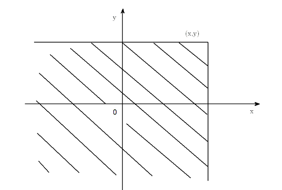
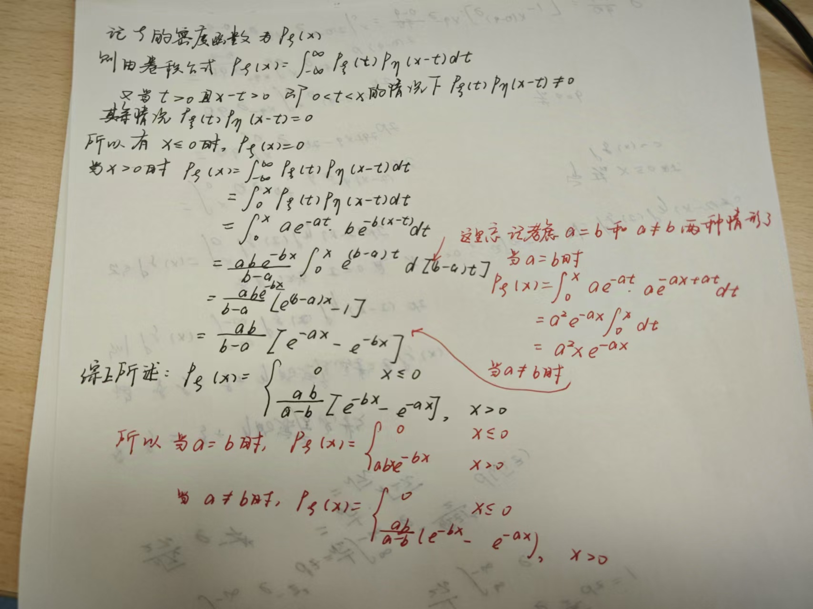
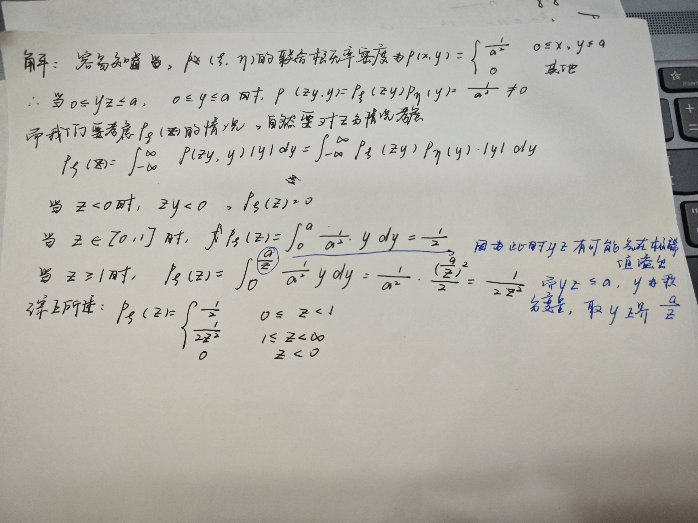
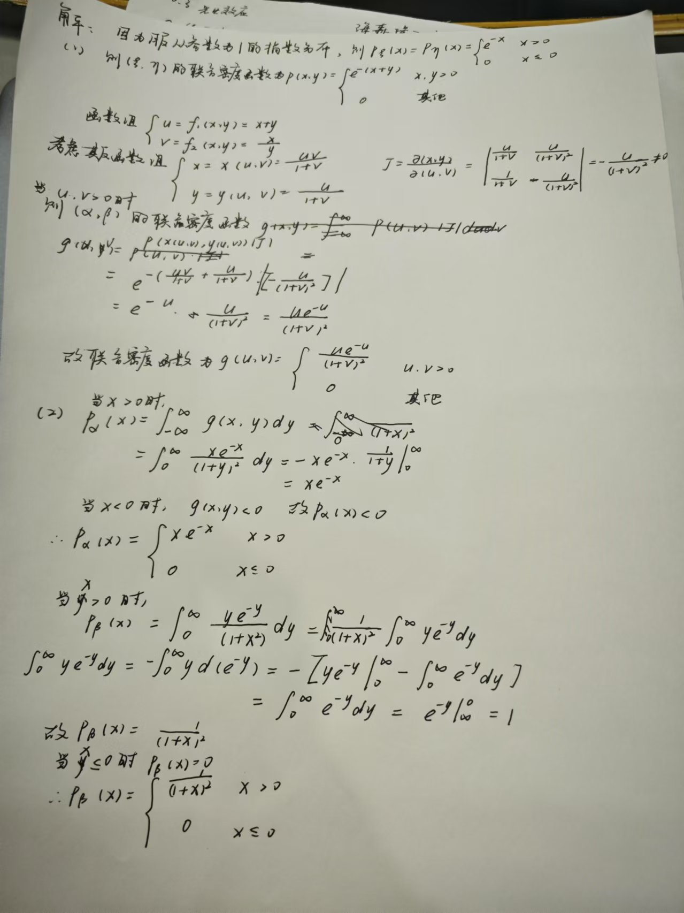
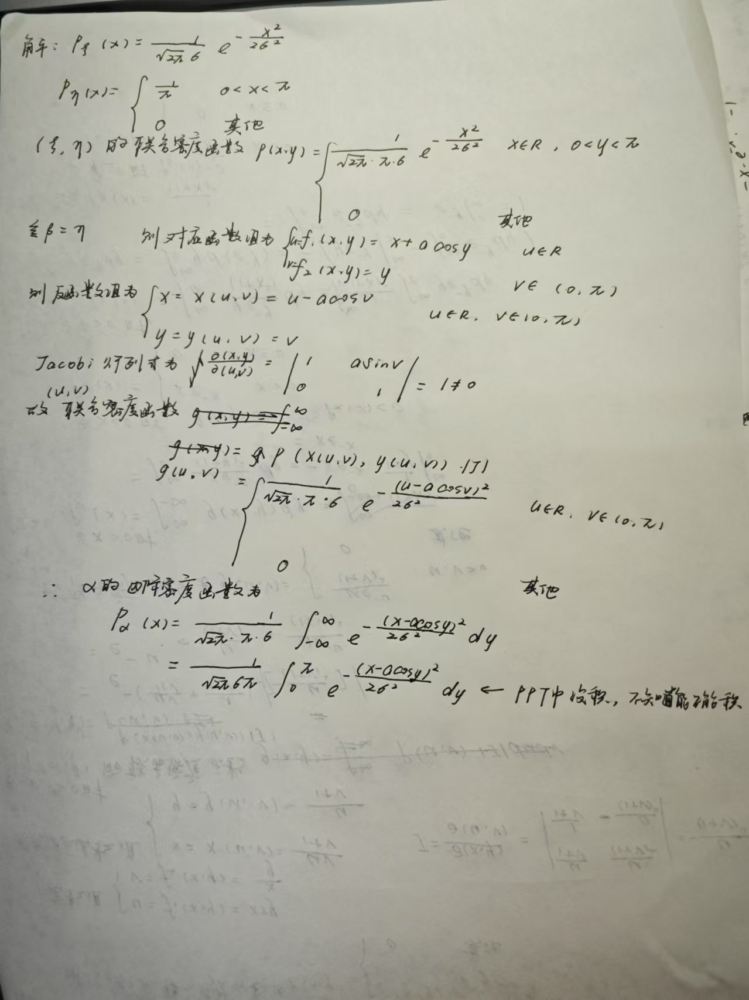

## 离散型随机变量及其分布

分布列的性质：

- 非负性：$p(x_i\geq 0),i=1,2...$
- 规范性：$\sum_{i=1}^{\infty}p(x_i)=1$

**一些例题**

1. 设随机变量$\xi$的分布列为
   $$
   P(\xi=k)=\frac{c\lambda^k}{k!},k=0,1,2...,\lambda>0
   $$
   求常数c的值
   
   **解**：由分布列性质可知
   $$
   \sum_{k=1}^{\infty}p(x_k)=\frac{c\lambda^k}{k!}=ce^{\lambda}=1
   $$
   故c=$e^{-\lambda}$

### 一些常见的、重要的离散型随机变量

1. 退化分布 
   设随机变量$\xi$只取一个常数值c，即$P(\xi=c)=1$，我们称它为退化分布

2. 两点分布 
   若一个随机变量只取两个值$\left\{x_1,x_2\right\}$，且相应的分布列为

$$
\begin{array}{c|cccc} 
\xi & x_1 & x_2 \\ \hline P & q & p  
\end{array} 
$$

   其中$p,q>0,q=1-p$，则称$\xi$服从两点分布

!!! note "Tip"
    伯努利分布，其分布列为：

    $$\begin{array}{c|cc}
    \xi & 0 & 1 \\
    \hline
    P & q & p
    \end{array}$$

      

 
3. 二项分布

   若随机变量$\xi$的分布列为
   $$
   P(\xi=k)=C_n^kp^kq^{n-k}=:b(k;n,p),\qquad k=0,1,2...,n,
   $$
   其中$p,q>0,p+q=1$，则称$\xi$服从参数为$n,p$的二项分布，记作$\xi \sim B(n,p)$，$n=1$时的二项分布即伯努利分布

   **二项分布的几个性质**：

   - $b(k;n,p)=b(n-k;n,1-p)$，挑k个相当于挑n-k个

   - 单调增减性以及最可能成功次数，即计算$\frac{b(k;n,p)}{b(k-1;n,p)}=1+\frac{(n+1)p-k}{k(1-p)}$，因此可以得到以下结论：

     - 当$k<(n+1)p$时，$\frac{b(k;n,p)}{b(k-1;n,p)}=1+\frac{(n+1)p-k}{k(1-p)}>1$，$b(k;n,p)$单调增加
     - 当$k>(n+1)p$时，$\frac{b(k;n,p)}{b(k-1;n,p)}=1+\frac{(n+1)p-k}{k(1-p)}<1$，$b(k;n,p)$单调减少

     需要指出的是，当$(n+1)p$是整数时，$b(k;n,p)=b(k-1;n,p),k=(n+1)p$，此时$(n+1)p$和$(n+1)p-1$都为最可能成功的次数；而当$(n+1)p$不是整数时，由单调性分析可知，$[(n+1)p]$为最有可能成功次数

   - 递推公式：设$\xi \sim B(n,p)$则有$P(\xi=k+1)=\frac{p(n-k)}{q(k+1)}P(\xi=k)$，因此从$P(\xi=0)=q^n$出发可以得到各个$P(\xi=k)$的值

   - $n\to\infty$时的渐进性质：假定 $p$ 与 $n$ 有关，记作$p_n$，则有下列的“二项分布的泊松逼近”

     如果存在正常数$\lambda$，当$n\to\infty$时，有$np_n\to\lambda$，则
     $$
     \lim_{n\to\infty}b(k;n,p_n)=\frac{\lambda^k}{k!}e^{-\lambda},k=0,1,2...
     $$

!!! note "Tip"

      通常，p与n无关，但是当n很大，p很小，且np不很大时，可以近似取$np=\lambda$，且$b(k;n,p)\approx\frac{\lambda^k}{k!}e^{-\lambda}$，它的计算比二项分布的计算容易很多

 
4. 泊松分布

   若随机变量$\xi$的分布列为$P(\xi=k)=\frac{\lambda^k}{k!}e^{-\lambda}(\lambda>0,k=0,1,2...)$，则称$\xi$服从参数为$\lambda$的泊松分布，记作$\lambda\sim P(\lambda)$，这里的$\lambda$其实是$\xi$的平均值

   泊松分布的应用：

   - 二项分布的近似计算
   - 用来描述离散型随机现象，如果n个独立事件$A_n,...,A_n$中每个发生的概率p很小，那么这n个事件发生的次数近似服从泊松分布$P(np)$（这里对事件的独立性要求可以放宽，相互独立或近似相互独立即可）
   - 通常认为单位时间/区间/面积/体积…中的计数过程服从泊松分布

 
5. 几何分布

   若随机变量$\xi$的分布列为
   $$
   P(\xi=k)=q^{k-1}p,\qquad p,q>0,p+q=1,k=1,2...,
   $$
   则称$\xi$服从参数为$p$的几何分布，记为$\xi \sim Geo(p)$

   几何分布的一个性质，**无记忆性**：若伯努利实验中前m次失败，则从第m+1次开始知道首次成功的实验次数也服从几何分布（就像把前m次的失败给忘记了），即
   $$
   P(\xi=m+k|\xi>m)=P(\xi=k)=q^{k-1}p
   $$

   其证明如下：
$$ 
\begin{aligned} 
P(\xi = m + k | \xi > m) &= \frac{P(\xi = m + k, \xi > m)}{P(\xi > m)} = \frac{P(\xi = m + k)}{P(\xi > m)} 
\\\\
&= \frac{q^{m+k-1} p}{\sum_{i=1}^{\infty} P(\xi = m + i)} = \frac{q^{m+k-1} p}{\sum_{i=1}^{\infty} q^{m+i-1} p} = \frac{q^{m+k-1} p}{q^m} = q^{k-1} p = P(\xi = k) 
\end{aligned} 
$$

   主要是要意识到$P(\xi>m)=\sum_{i=1}^{\infty}P(\xi=m+i)$

   反过来则有若$\xi$是取正整数的随机变量，且具有无记忆性，则$\xi$服从几何分布

 
6. 超几何分布

   若随机变量 $\xi$ 的分布列为
   $$
   P(\xi=k)=\frac{C_M^kC_{N-M}^{n-k}}{C_N^n},\qquad n\leq N,M\leq N,k=0,1,...,min(n,M)
   $$
   则称 $\xi$ 服从参数为 $n,M,N$ 的超几何分布，记作 $\xi \sim H(n,M,N)$

   **超几何分布的性质：**

   若 $n,k$ 不变，$N\to\infty,\frac{M}{N}\to p$，则超几何分布可以用二项分布来逼近，即产品充分多时，有放回抽取和无放回抽取没有本质差别

   超几何分布还可以进行推广，假设某N件产品中包含一、二、三级产品各为 $n_1,n_2,N-n_1-n_2$ 件，现从中抽查 $r$ 件，那么包含 $k_1$ 件一级产品，$k_2$ 件二级产品，$r-k_1-k_2$ 件三级产品的概率为
   
$$
\frac{C_{n_1}^{k_1} C_{n_2}^{k_2} C_{N - n_1 - n_2}^{r - k_1 - k_2}}{C_N^r},
$$

   其中 $k_1,k_2$ 满足 
   $\max \left\{0, r - (N - n_1)\right\} \leq k_1 \leq \min \{n_1, r\}$， 
$\max \{0, r - (N - n_2)\} \leq k_2 \leq \min \{n_2, r\}$， 
$\max \{0, r - (n_1 + n_2)\} \leq r - k_1 - k_2 \leq \min \{N - n_1 - n_2, r\}$   

## 分布函数与连续性随机变量

### 分布函数

#### 分布函数的定义

设$\xi$为概率空间$(\Omega, \mathscr{F}, \mathrm{P})$上的随机变量，称
$$
F(x)=P(\xi \leq x), x\in R
$$
为随机变量$\xi$的分布函数

而有了分布函数，对于任意的Borel集B，概率$P(\xi \in B)$都可以用分布函数来表示了，例如：

$$
\begin{aligned}
P(a < \xi \leq b) &= F(b) - F(a); \\
\\
P(\xi < a) &= P(\bigcup_{n=1}^{\infty} \{\xi \leq a - 1/n\}) = \lim_{n \to \infty} P(\xi \leq a - 1/n) = F(a - 0); \\
\\
P(\xi = a) &= P(\xi \leq a) - P(\xi < a) = F(a) - F(a - 0); \\
\\
P(\xi > a) &= 1 - P(\xi \leq a) = 1 - F(a); \\
\\
P(a < \xi < b) &= P(\xi < b) - P(\xi \leq a) = F(b - 0) - F(a).
\end{aligned}
$$

#### 分布函数的性质

1. 单调不减性：若$a\leq b$，则$F(a) \leq F(b)$
2. $F(-\infty):=\lim_{x\to-\infty}F(x)=0,\qquad F(\infty):=\lim_{x\to \infty}F(x)=1$
3. 右连续性：$F(x+0)=\lim_{\epsilon\to0}F(x+\epsilon)=F(x)$

而反过来，函数$F(x)$为随机变量的分布函数的充要条件是它满足分布函数的上述三个性质

**一些例题**

**例1 设随机变量的分布函数如下，试确定常数 $a$ 和 $b$.** 

$$ F(x) =  \begin{cases}  0, & x \leq -1, \\ a + b \arcsin x, & -1 < x \leq 1, \\ 1, & x > 1. \end{cases} 
$$

**解** 利用分布函数的性质来确定常数 $a$ 和 $b$。由右连续性， 

$$ 
\begin{cases} F(-1 + 0) = F(-1), \\ F(1 + 0) = F(1) \end{cases} 
$$ 

即有 

$$ 
\begin{cases} a - b \times \frac{\pi}{2} = 0, \\ a + b \times \frac{\pi}{2} = 1 \end{cases} 
$$ 

解得: $a = \frac{1}{2}, b = \frac{1}{\pi}$.

#### 离散型随机变量的分布函数

**设 $\xi$ 的分布列为** 

$$ 
\begin{array}{c|cccc} \xi & x_1 & x_2 & \cdots & x_n \\ \hline \mathbf{P} & p(x_1) & p(x_2) & \cdots & p(x_n) \end{array} 
$$ 

且 $x_1 < x_2 < \cdots < x_k < \cdots < x_n$，则 $\xi$ 的分布函数为 

$$ 
F(x) =  \begin{cases}  0, & x < x_1, \\ p(x_1), & x_1 \leq x < x_2, \\ \vdots & \vdots \\ \displaystyle \sum_{i \leq k} p(x_i), & x_k \leq x < x_{k+1}, \\ \vdots & \vdots \\ 1, & x \geq x_n \end{cases} 
$$

### 连续型随机变量及其概率密度函数

#### 连续型随机变量

若随机变量 $\xi$ 可取某个区间（有限或无限）中的一切值，并且存在某个非负可积函数 $p(x)$ 使得分布函数 $F(x)$ 满足
$$
F(x)=\int_{-\infty}^xp(y)dy
$$
则称 $\xi$ 为连续型随机变量，称 $p(x)$ 为 $\xi$ 的概率密度函数。连续型随机变量的分布函数是连续的

而连续型随机变量除了具有普通随机变量分布函数的性质外，还具有如下的性质：

 
1. 若 $F(x)$ 是连续函数，在 $p(x)$ 的连续点上 $F(x)$ 可导，且 $F'(x)=p(x)$ ，**这个性质描述了分布函数和概率密度函数的关系**

 
2. $P(a<\xi \leq b)=F(b)-F(a)=\int_{-\infty}^bp(y)dy-\int_{-\infty}^ap(y)dy=\int_a^bp(y)dy$，也即 $P(\xi \in B)=\int_Bp(y)dy$

 
3. 对任意常数c，$p(\xi=c)=0$，因为

$$ 
\begin{aligned} P(\xi = c) &= P(\xi \leq c) - P(\xi < c)= F(c) - F(c - 0) = 0 \\ &= P(\xi \leq c) - P(\bigcup_{n=1}^{\infty} \{\xi \leq c - 1/n\}) = P(\xi \leq c) - \lim_{n \to \infty} P(\xi \leq c - 1/n) \\ &= \int_{-\infty}^{c} p(y) \, dy - \lim_{n \to \infty} \int_{-\infty}^{c - 1/n} p(y) \, dy = \lim_{n \to \infty} \int_{c - 1/n}^{c} p(y) \, dy = 0 
\end{aligned} 
$$

   因此，连续型随机变量等于任何一个常数的概率都为0。但是，尽管$P(\xi=c)=0$，$\left\{\xi=c\right\}$是一个可能发生的事件，所以有$P(A)=0\nRightarrow A=\emptyset$，即概率为零的事件并非就是不可能事件，同理$P(A)=1 \nRightarrow A=\Omega$。而因为连续型随机变量等于任何一个实数的概率为0，即有$P(x<\xi \leq y)=P(x\leq \xi \leq y)=P(x\leq \xi<y)=P(x<\xi<y)$

概率密度函数的性质：

- 非负性：$p(y)\geq0$
- 规范性：$\int_{-\infty}^{\infty}p(y)dy=1$

注意概率密度函数 $p(x)$ 的数值反映的是随机变量 $\xi$ 落在 $x$ 的邻近区域的概率大小

#### 常见的连续型随机变量

 
1. 均匀分布

   **若随机变量 $\xi$ 具有密度函数** 
   $$ 
   p(x) =  \begin{cases}  \frac{1}{b - a}, & a < x < b, \\ 0, & \text{其他}, \end{cases} 
   $$ 
   则称 $\xi$ 服从 $(a, b)$ 上的均匀分布，记为 $\xi \sim U(a, b)$.
   
    
   我们接着考虑均匀分布的**分布函数**：

   当 $x \leq a$ 时，显然 $F(x) = P(\xi \leq x) = 0$; 
   
   当 $a < x < b$ 时， 
   $$ F(x) = \int_{-\infty}^{x} p(y) \, \mathrm{d}y = \int_{a}^{x} \frac{1}{b - a} \, \mathrm{d}y = \frac{x - a}{b - a}
   $$ 
   当 $x \geq b$ 时， 
   $$ F(x) = \int_{-\infty}^{x} p(y) \, \mathrm{d}y = \int_{a}^{b} \frac{1}{b - a} \, \mathrm{d}y = 1
   $$ 
   综上所述，$\xi$ 的分布函数为 

$$
F(x) =  \begin{cases}  0, & x \leq a, \\ \frac{x - a}{b - a}, & a < x < b, \\ 1, & x \geq b \end{cases}
$$

   **均匀分布的性质：** 若 $\xi \sim U(a,b)$，区间 $(c,c+l) \subset (a,b)$，则 $P(c<\xi<c+l)=\int_c^{c+l}\frac{1}{b-a}dy=\frac{l}{b-a}$，与 $c$ 无关。所以，$\xi$ 在 $(a,b)$ 的取值落在某一区间内的概率与这个区间的测度成正比，而与起点和终点无关

 
2. 正态分布

   **随机变量$\xi$的概率密度函数**为
   $$
   P(x)=\frac{1}{\sqrt{(2\pi)}\sigma}e^{-\frac{(x-\mu)^2}{2\sigma^2}}(a\in R,\sigma>0),x\in R
   $$

   则称 $\xi$ 服从参数为 $(a,\sigma^2)$ 的正态分布，记作 $\xi \sim N(a,\sigma^2)$

   下面我们验证 $p(x)$ 是概率密度函数：
   $p(x) \geq 0$ 是显然的。
   
   为了说明
   $$
   \int_{-\infty}^{\infty} p(x) \, \mathrm{d}x = 1
   $$
   我们记 $I = \int_{-\infty}^{\infty} p(x) \, \mathrm{d}x > 0$，则
$$ 
\begin{aligned} I^2 &= (\frac{1}{\sqrt{2\pi}\sigma} \int_{-\infty}^{\infty} e^{-\frac{(x-a)^2}{2\sigma^2}} \, \mathrm{d}x )^2 = ( \frac{1}{\sqrt{2\pi}} \int_{-\infty}^{\infty} e^{-\frac{t^2}{2}} \, \mathrm{d}t )^2 
\end{aligned}
$$

我们令$t = \frac{x - a}{\sigma}$，则有

$$
\begin{aligned}
(\frac{1}{\sqrt{2\pi}} \int_{-\infty}^{\infty} e^{-\frac{t^2}{2}} \, \mathrm{d}t )^2 = \frac{1}{2\pi} \int_{-\infty}^{\infty} \int_{-\infty}^{\infty} e^{-\frac{t^2 + s^2}{2}} \, \mathrm{d}t \, \mathrm{d}s \\
= \frac{1}{2\pi} \int_{0}^{2\pi} \int_{0}^{\infty} e^{-\frac{r^2}{2}} r \, \mathrm{d}r \, \mathrm{d}\theta \quad (\text{极坐标变换}) = \int_{0}^{\infty} e^{-\frac{r^2}{2}} r \, \mathrm{d}r = 1 
\end{aligned} 
$$ 

   所以 $I = 1$.

   **正态分布$N(a,\sigma^2)$的分布函数**：
   $$
   F(x)=\frac{1}{\sqrt{(2\pi)}\sigma} \int_{-\infty}^x e^{-\frac{(t-a)^2}{2\sigma^2}}dt,x\in R
   $$
   **正态分布$N(a,\sigma^2)$的性质**：

   - $p(x)$ 关于直线 $x=a$ 对称
   - 当 $x<a$ 时，$p(x)$ 单调递增，当 $x>a$ 时，$p(x)$ 单调递减；形状呈现钟形（中间高，两头低，左右对称）
   - $x\to\pm\infty$ 时，$p(x)\to\infty$，$x=a$ 时，$p(x)$ 有最大值 $\frac{1}{\sqrt{(2\pi)}\sigma}$
   - $\sigma$ 越大，$p(x)$ 的图像越扁平，$\xi$ 在 $a$ 的远处区域取值的概率也越大；$\sigma$ 越小，$p(x)$ 的图像越陡峭，$\xi$ 取值越集中在 $a$ 点附近（称 $a$ 为位置参数，$\sigma$ 为尺度参数）

   **标准正态分布**：

   称 $a=0,\sigma=1$ 时的正态分布为标准正态分布，记为 $N(0,1)$ ，它的密度函数的图像关于纵轴对称，其密度函数和分布函数被特别记为 $\varphi(x)$ 和 $\Phi(x)$，即

   $$
   \begin{aligned}
   \varphi(x)=\frac{1}{\sqrt{2\pi}\sigma}e^{-\frac{x^2}{2}},x\in R,\qquad 
   \\
   \Phi(x)=\int_{-\infty}^x\varphi(t)dt,x\in R
   \end{aligned}
   $$

   **正态分布的计算：**

   一般是用线性插值法结合查表进行计算，但是表中给出的一般是标准正态分布的相关数据，所以在遇到一般的正态分布的时候我们可以先将其化为标准正态分布.

   1. 当 $\xi \sim N(a,\sigma^2)$ 时，记 $\eta=\frac{\xi-a}{\sigma}$，$\eta$ 的分布函数为
      $$
      P(\eta\leq x)=P(\xi\leq a+\sigma x)=\int_{-\infty}^{a+\sigma x}\frac{1}{\sqrt{2\pi}\sigma}e^{-\frac{(t-a)^2}{2\sigma^2}}dt=\int_{-\infty}^x\frac{1}{\sqrt{2\pi}}e^{-\frac{u^2}{2}}du=\Phi(x)
      $$
      因为 $\eta \sim N(0,1)$，因此对于任意的 $x<y$，有
      $$
      P(x<\xi \leq y)=P(\frac{x-a}{\sigma}<\eta\leq \frac{y-a}{\sigma})=\Phi(\frac{y-a}{\sigma})-\Phi(\frac{x-a}{\sigma})
      $$

   2. 而对于这样的标准正态分布计算，可以通过查正态分布表解决，在 $\xi\sim N(0,1)$ 的情形下：

    - 当 $x\geq0$ 时，我们可以使用线性插值法结合正态分布表，对于 $a<x<b$，有下面的插值公式：

      $$
      \Phi(x)\approx\Phi(a)+\frac{x-a}{b-a}[\Phi(b)-\Phi(a)]
      $$
      
    - 而当$x<0$时，我们可以利用 $\Phi(x)+\Phi(-x)=1$，先查表得到 $\Phi(x)$，然后求得 $\Phi(x)=1-\Phi(-x)$

 
3. 指数分布

   若随机变量 $\xi$ 具有密度函数（需要注意指数分布的密度函数在 $x<0$ 时取值为 $0$）

$$
p(x) =
\begin{cases}
0, & x < 0, \\
\lambda e^{-\lambda x}, & x \geq 0,
\end{cases}
\quad
\begin{aligned}
&(\lambda > 0)
\end{aligned}
$$
   
   则称 $\xi$ 服从参数为 $\lambda$ 的指数分布，记为 $\xi \sim Exp(\lambda)$

   下面我们计算指数分布的分布函数：

   **当 $x < 0$ 时，** 
   $$ 
   P(\xi \leq x) = \int_{-\infty}^{x} 0 \, \mathrm{d}t = 0
   $$ 
   **当 $x \geq 0$ 时，** 
   $$ 
   P(\xi \leq x) = \int_{0}^{x} \lambda e^{-\lambda t} \, \mathrm{d}t = 1 - e^{-\lambda x}
   $$ 

   **所以分布函数为** 

$$ 
F(x) =  \begin{cases}  0, & x < 0, \\ 1 - e^{-\lambda x}, & x \geq 0
\end{cases} 
$$

   并且相对应与离散型随机变量中的几何分布，指数分布同样也具有**无记忆性**：

   设随机变量 $\xi \sim Exp(\lambda)$，则对任意的 $s>0,t>0$，有
   $$
   P(\xi > s + t \mid \xi > s) = \frac{P(\xi > s + t)}{P(\xi > s)} = \frac{e^{-\lambda(s+t)}}{e^{-\lambda s}} = e^{-\lambda t}=P(\xi \geq t)
   $$
   并且指数分布式是具有无记忆性的唯一的连续型分布
 
4. 伽马分布($\Gamma$ 分布)

   这里先空着，等到了解了伽马函数再补上

## 随机向量

在很多随机现象中，对同一个随机试验我们往往需要同时考察若干个随机变量

### 离散型随机向量

若随机向量只取有限组或无穷可列多组值，就称它为离散型随机向量，对于它只需要列出所有各组可能值以及取这些值的概率，就可全面描述其概率分布，因此我们需要引入联合分布列

**联合分布列：** 若二维随机向量 $(\xi,\eta)$ 的所有可能取值为 $\left\{(x_i,x_j),i,j=1,2,...\right\}$，且 $P(\xi=x_i,\eta=y_j)=p_{ij},i,j=1,2,...,$ 则称上式为 $(\xi,\eta)$ 的（联合）分布列

联合分布列也可以用下列的表格表示：

$$ \begin{array}{c|cccccc} \xi \setminus \eta & y_1 & \cdots & y_j & \cdots & y_n \\ \hline x_1 & p_{11} & \cdots & p_{1j} & \cdots & p_{1n} \\ \vdots & \vdots & \ddots & \vdots & \ddots & \vdots \\ x_i & p_{i1} & \cdots & p_{ij} & \cdots & p_{in} \\ \vdots & \vdots & \ddots & \vdots & \ddots & \vdots \\ x_m & p_{m1} & \cdots & p_{mj} & \cdots & p_{mn} 
\end{array} 
$$

n维离散型随机向量的联合分布列$(m_j < \infty ,\text m_j = \infty; j = 1, \cdots, n)$可以写为：
$$
P(\xi_1 = x_{i_1}, \cdots, \xi_n = x_{i_n}) = p_{i_1 \cdots i_n}, \quad i_j = 1, \cdots, m_j; j = 1, \cdots, n
$$

**联合分布列的性质（以二维为例）：**

- $p_{ij}\geq0,\qquad i,j=1,2,...,$

- $$
  \sum_{i=1}^{\infty}\sum_{j=1}^{\infty}p_{ij}=1
  $$

而对于二维随机向量 $(\xi,\eta)$，$\xi,\eta$ 各作为一维随机变量有它们各自的分布列，所以我们引入了边际分布列的概念。

**边际分布列**：对于 $\xi$，它只能取 $\left\{x_1,x_2,...,x_i,...\right\}$ 这些值，且有

$$ \begin{aligned} P(\xi = x_i) &= P(\xi = x_i, \bigcup_{j=1}^{n} \{\eta = y_j\}) = P(\bigcup_{j=1}^{n} \{\xi = x_i, \eta = y_j\}) \\ &= \sum_{j=1}^{n} P(\xi = x_i, \eta = y_j) = \sum_{j=1}^{n} p_{ij} =: p_i, \quad i = 1, \cdots, m. \end{aligned} $$

!!! note "Tip"

      因为交上一个必然事件不会影响概率，然后运用了可列可加性

同理可得 $P(\eta=y_j)=\sum_{i=1}^{\infty}P(\xi=x_i,\eta=y_j)=\sum_{i=1}^{\infty}p_{ij}=:p_{.j},j=1,2,...$

上面两个式子称为 $\xi$ 和 $\eta$ 的边际分布列             

我们也很容易知道，联合分布列可以确定边际分布列，但边际分布列不能确定联合分布列

### 随机向量的分布函数（联合分布函数）

对于任意的 $(x_1,...,x_n)\in R^n$，称n元函数
$$
F(x_1,...,x_n)=P(\xi_1(\omega)\leq x_1,...,\xi_n(\omega)\leq x_n)
$$
为随机向量 $\xi(\omega)=(\xi_1(\omega),...,\xi_n(\omega))$ 的联合分布函数

**二维情形的联合分布函数**：
$$
F(x,y)=P(\xi \leq x,\eta \leq y)
$$

对于(半开半闭)矩形区域$$ I: a_1 < x \leq b_1, \quad a_2 < y \leq b_2, $$
记 $$ A = \{\xi \leq b_1, \eta \leq b_2\}, $$ $$ B = \{\xi \leq b_1, \eta \leq a_2\} \cup \{\xi \leq a_1, \eta \leq b_2\}. $$ 
易知 $$ B \subset A, \quad P(A) = F(b_1, b_2), \quad P(B) = F(a_1, b_2) + F(b_1, a_2) - F(a_1, a_2). $$ 
所以 

$$ \begin{aligned} P((\xi, \eta) \in I) &= P(A - B) = P(A) - P(B) = F(b_1, b_2) - F(a_1, b_2) - F(b_1, a_2) + F(a_1, a_2). \end{aligned} $$

二维联合分布 $F(x,y)$ 的性质

- $F(x,y)$ 对每个变量单调不减

- 对任意的 $(x,y)$，有
  $$
  F(x,-\infty)=F(-\infty,y)=0,\qquad F(\infty,\infty)=1
  $$

- $F(x,y)$ 对于每个变量右连续

- 对任意的 $a_1<b_1,a_2<b_2$，
  $$
  F(b_1,b_2)-F(a_1,b_2)-F(b_1,a_2)+F(a_1,a_2)\geq 0
  $$
  因为上式即 $P(a_1\leq\xi \leq b_1,a_2\leq \xi \leq b_2)$，大于0显然成立

离散型随机变量有联合分布列，边际分布列，而相应地，有联合分布函数，就自然有**边际分布函数**。

$\xi,\eta$ 作为随机变量，有自己的分布函数，他们的分布函数被称为边际分布函数，联合分布函数和边际分布函数具有以下关系： 

$$
\begin{aligned}
F_\xi(x)=P(\xi\leq x)=P(\xi\leq x,\eta<\infty)=P(\bigcup_{n=1}^{\infty}\left\{\xi\leq x,\eta\leq n\right\})\\ =\lim_{n\to\infty}P(\xi\leq x,\eta \leq n)=F(x,\infty)\\
\end{aligned}
$$

同理有 $F_\eta(y)=P(\eta \leq y)=F(\infty,y)$

上面我们总结了离散型随机向量和联合分布函数、边际分布函数，有了分布函数这一利器，我们就能很好地描述连续型随机向量了。

### 连续型随机向量

#### 连续型随机向量及其联合概率密度函数

若存在 $n$ 元的非负可积函数 $p(x_1,...x_n)$，使得n元分布函数可以表示为
$$
F(x_1,...,x_n)=\int_{-\infty}^{x_1}...\int_{-\infty}^{x_n}p(y_1,y_2,...,y_n)dy_1...dy_n
$$
则称所对应的随机向量为 $n$ 维连续型随机向量，称 $p(y_1,...y_n)$ 为相应的（联合）概率密度函数，简称（联合）密度函数

**联合密度函数 $p(y_1,y_2,...,y_n)$ 的性质**

- 非负性：$p(y_1,y_2,...,y_n)\geq0$
- 规范性：$\int_{-\infty}^{\infty}...\int_{-\infty}^{\infty}p(y_1,y_2,...,y_n)dy_1...dy_n=1$

同样，与一维情形类似，除了一个零测集外，我们还可以对联合分布函数求导得到联合密度函数，即

***注*** (1) 与一维情形类似, (联合)分布函数关于每一个变量都是连续的; 除了一个零测集外, 可以对(联合)分布函数求导得到(联合)密度函数
$$
\frac{\partial^n F(x_1, \cdots, x_n)}{\partial x_1 \cdots \partial x_n} = p(x_1, \cdots, x_n)
$$
  (2) 对任一 $n$ 维 Borel 集 $B^n \in \mathcal{B}^n$ ($n$ 维 Borel 域)有
$$
P(\xi \in B^n) = \int \cdots \int_{(x_1, \cdots, x_n) \in B^n} p(x_1, \cdots, x_n) \, \mathrm{d}x_1 \cdots \mathrm{d}x_n
$$
	特别地，若 $B^n$ 的测度为0，则 $P(\xi(\omega)\in B^n)=0$

引入了联合密度函数，就要接着引入边际密度函数，先引入Fubini定理

**Fubini定理：** 设 $D$ 是 $\mathbb{R}^n$ 的子区域, $f(x_1, \cdots, x_n)$ 是 $D$ 上的非负函数或者满足 $$ \int \cdots \int_D |f(x_1, \cdots, x_n)| \, \mathrm{d}x_1 \cdots \mathrm{d}x_n < \infty, $$ 则对区域 $D$ 上的 $n$ 重积分 $$ \int \cdots \int_D f(x_1, \cdots, x_n) \, \mathrm{d}x_1 \cdots \mathrm{d}x_n, $$ 可以进行累次积分计算, 且积分的次序可以交换.

接下来我们就考虑**联合密度函数和边际密度函数**的关系，以二维为例：

设 $(\xi,\eta)$ 的密度函数为 $p(x,y)$，分布函数为 $F(x,y)$，则 $\xi$ 的边际分布函数为
$$
F_{\xi}(x)=F(x,\infty)=\int_{-\infty}^x\int_{-\infty}^{\infty}p(u,v)dudv=\int_{-\infty}^x(\int_{-\infty}^{\infty}p(u,v)dv)du
$$
那么由一维连续型随机变量及其密度函数的定义可以知道，$\xi$ 的边际密度函数为
$$
p_{\xi}(x)=\frac{dF_{\xi}(x)}{dx}=\int_{-\infty}^{\infty}p(x,y)dy,x\in R
$$
同理，也会有：
$$
P_{\eta}(y)=\int_{-\infty}^{\infty}p(x,y)dx
$$
下面我们来看**两个重要的连续型随机向量**：

 
1. $n$ 维均匀分布

   若 $n$ 维随机向量 $\boldsymbol{\xi}$ 具有联合密度函数 
   
$$ p(x_1, \cdots, x_n) =  \begin{cases}  1 / S_G, & (x_1, \cdots, x_n) \in G, \\ 0, & \text{其他}, \end{cases} 
$$ 

   其中, $G$ 是 $\mathbb{R}^n$ 中的一个 Borel 集, $S_G$ 为 $G$ 的测度 (二维时, $S_G$ 表示 $G$ 的面积; 三维时, $S_G$ 表示 $G$ 的体积; $\cdots$), 则称 $\xi$ 服从 $G$ 上的均匀分布.

    
   一个例子：$(\xi,\eta)$ 在圆形区域 $x^2+y^2\leq1$ 上服从均匀分布，求 $\xi,\eta$ 的边际密度函数
    
	**解** 联合密度函数为 

$$ p(x, y) =  \begin{cases}  1/\pi, & x^2 + y^2 \leq 1, \\ 0, & \text{其他} \end{cases} 
$$ 

   当 $|x| > 1$ 时, $p(x, y) = 0$, 所以此时 $p_\xi(x) = 0$ 
   
   当 $|x| \leq 1$ 时 $$ p_\xi(x) = \int_{-\infty}^{\infty} p(x, y) \, \mathrm{d}y = \int_{-\sqrt{1-x^2}}^{\sqrt{1-x^2}} \frac{1}{\pi} \, \mathrm{d}y = \frac{2}{\pi} \sqrt{1 - x^2}. $$ 综上所述, $\xi$ 的边际密度函数为 
   
$$ p_\xi(x) =  \begin{cases}  \frac{2}{\pi} \sqrt{1 - x^2}, & |x| \leq 1, \\ 0, & |x| > 1. \end{cases} 
$$ 
   同理可得，$\eta$ 的边际密度函数为 

$$ p_\eta(y) =  \begin{cases}  \frac{2}{\pi} \sqrt{1 - y^2}, & |y| \leq 1, \\ 0, & |y| > 1. \end{cases}
$$

 
2. $n$ 维正态分布（这个似乎不要求掌握，但是二维正态分布是要求掌握的，先暂时搁着）

   二维正态分布的边际分布仍然是正态分布，但反过来不一定正确，即 $(\xi,\eta)$ 的边际分布都是正态分布，其联合分布未必是二维正态分布

## 随机变量的独立性

我们把随机变量 $\xi,\eta$ 的独立性定义为：对一切的 $x,y \in R$，事件 $\left\{\xi \leq x\right\}$ 与 $\left\{\eta \leq y\right\}$ 相互独立，即：

设 $\xi,\eta$ 为定义在同一概率空间上的随机变量，若对一切 $x,y\in R$，都有
$$
P(\xi \leq x,\eta \leq y)=P(\xi \leq x)P(\eta \leq y)\\
\text{即}\ F(x,y)=F_{\xi}(x)F_{\eta}(y),\qquad \forall x,y \in R
$$
则称随机变量 $\xi,\eta$ 相互独立，否则称随机变量 $\xi,\eta$ 相依

注意 $F(x,y)=F_{\xi}(x)F_{\eta}(y)$ 是对一般的随机变量相互独立的定义，而对于特殊的随机变量，如离散型随机变量，连续性随机变量，其定义可以特殊化如下：

- **离散型随机变量（以二维为例）**：
  $$
  P(\xi=x_i,\eta=y_j)=P(\xi=x_i)P(\eta=y_j),\qquad \forall i,j=1,2,...
  $$
  即等价于$p_{ij}=p_{i.}p_{.j},\qquad \forall i,j=1,2,...$

- **连续型随机变量（以二维为例）**
  $$
  p(x,y)=p_{\xi}(x)p_{\eta}(y)
  $$
  也即联合密度函数等于边际密度函数的乘积

!!! warning "注意"

      而对于**一般的随机变量**，比如一个变量是离散的，一个变量是连续的，我们就需要回归定义去考察**分布函数**

我们知道联合概率分布可以决定边际概率分布，但边际概率分布不一定能决定联合概率分布；现在我们可以知道，**当两个随机变量相互独立的时候，边际概率分布和联合概率分布是互相决定的**

**例1** 设 $(\xi, \eta) \sim N(a, b, \sigma_1^2, \sigma_2^2, r)$，求 $\xi, \eta$ 相互独立的充要条件。 

**解** 因为 $\xi \sim N(a, \sigma_1^2)$, $\eta \sim N(b, \sigma_2^2)$，所以 $\xi, \eta$ 独立  $\iff p(x, y) = p_\xi(x) p_\eta(y) a.e.$

$$\begin{aligned}
   \iff \frac{1}{2\pi \sigma_1 \sigma_2 \sqrt{1 - r^2}} \cdot  \exp \left\{ -\frac{1}{2(1 - r^2)} \left[ \frac{(x - a)^2}{\sigma_1^2} - \frac{2r (x - a)(y - b)}{\sigma_1 \sigma_2} + \frac{(y - b)^2}{\sigma_2^2} \right] \right\} \\ = \frac{1}{\sqrt{2\pi} \sigma_1} \exp \left\{ -\frac{(x - a)^2}{2 \sigma_1^2} \right\} \cdot \frac{1}{\sqrt{2\pi} \sigma_2} \exp \left\{ -\frac{(y - b)^2}{2 \sigma_2^2} \right\}, \quad a.e. \\ 
   \\
   \iff r = 0. 
\end{aligned}
$$

上面谈到的是二维情形下的随机变量的独立性，接下来我们考虑**n个随机变量的独立性**：

假设 $F(x_1,x_2,...,x_n),F_1(x_1),...,F_n(x_n)$ 分别为 $\xi_1,...,\xi_n$ 的联合分布函数和边际分布函数，则当
$$
F(x_1,...,x_n)=F_1(x_1)\cdot \cdot \cdot F_n(x_n),\qquad \forall x_1,..,x_n \in R
$$
时称 $\xi_1,...,\xi_n$ 相互独立

推论：若 $\xi_1,...,\xi_n$ 相互独立，则其中任意 $r(2\leq r\leq n)$ 个也相互独立

证明 对任意的 $x_{i_1}, \cdots, x_{i_r} \in \mathbb{R}$, 

$$
 \begin{aligned} P(\xi_{i_1} \leq x_{i_1}, \cdots, \xi_{i_r} \leq x_{i_r}) = P(\xi_{i_1} \leq x_{i_1}, \cdots, \xi_{i_r} \leq x_{i_r}, \xi_{i_{r+1}} < \infty, \cdots, \xi_{i_n} < \infty) \\ = P(\xi_{i_1} \leq x_{i_1}) \cdots P(\xi_{i_r} \leq x_{i_r}) \cdot 1 \cdots 1 = P(\xi_{i_1} \leq x_{i_1}) \cdots P(\xi_{i_r} \leq x_{i_r}), \end{aligned} 
$$

下面我们考虑可列个随机变量 $\left\{\xi_i,i\geq1\right\}$ 的独立性

对于可列个随即变量 $\left\{\xi_i,i\geq1\right\}$，若其中任意有限个随机变量都是相互独立的，则称 $\left\{\xi_i,i\geq1\right\}$ 相互独立

**例2** 设 $\xi$ 是只取常数 $a$ 的退化分布，求证：对于任意随机变量 $\eta,\xi$，有 $\xi,\eta$ 相互独立

**证明** 易知 $\xi$ 的分布函数为 

$$ F_\xi(x) =  \begin{cases}  0, & x < a, \\ 1, & x \geq a. \end{cases} $$ 

当 $x < a$ 时， $$ \{\xi \leq x\} = \phi, \quad F_\xi(x) = 0. $$ 所以，对任意的 $y \in \mathbb{R}$, $$ F(x, y) = P(\xi \leq x, \eta \leq y) = 0 = F_\xi(x) F_\eta(y); $$
当 $x \geq a$ 时， $$ \{\xi \leq x\} = \Omega, \quad F_\xi(x) = 1. $$ 因此，对任意的 $y \in \mathbb{R}$, $$ F(x, y) = P(\xi \leq x, \eta \leq y) = P(\eta \leq y) = F_\eta(y) = F_\xi(x) F_\eta(y). $$ 
综上所述，对任意的 $x, y \in \mathbb{R}$，均有 $$ F(x, y) = F_\xi(x) F_\eta(y). $$ 所以，$\xi$ 与 $\eta$ 相互独立.

## 条件分布

在 Chatpter1 中我们曾讨论过事件的条件概率，这里同样我们也可以考虑一个随机变量的条件分布，其条件与另一个随机变量的取值有关

### 离散型的情形

以二维情形为例：设 $(\xi,\eta)$ 是离散型随机向量，分布列为

$$
P(\xi=x_i,\eta=y_j)=p_{ij},\qquad i,j=1,2,...
$$

若已知 $\xi=x_i$ 且 $P(\xi=x_i)>0$，则
$$
P(\eta=y_j|\xi=x_i)=\frac{P(\xi=x_i,\eta=y_j)}{P(\xi=x_i)}=\frac{p_{ij}}{p_{i\cdot}},\qquad j=1,2,... \tag{2.5.1}
$$
显然，上式满足分布列的两个条件：

- 非负性：$\frac{p_{ij}}{p_{i\cdot}}\geq0,\qquad j=1,2,...$

- 规范性：
  $$
  \sum_{j=1}^{\infty}\frac{p_{ij}}{p_{i\cdot}}=\frac{p_{i\cdot}}{p_{i\cdot}}=1
  $$

所以(2.5.1)式为在 $\xi=x_i$ 的条件下 $\eta$ 的条件概率分布列，简称为条件分布（列），记作 $p_{\eta|\xi}(y_j|x_i)$，称
$$
P(\eta \leq y|\xi=x_i)=\sum_{j:y_j\leq y}p_{\eta|xi}(y_j|x_i),\qquad y\in R
$$
为在 $\xi=x_i$ 的条件下 $\eta$ 的条件分布函数

同理，若已知 $\eta=y_j$ 且 $P(\eta = y_j)>0$，那么在 $\eta=y_j$ 的条件下 $\xi$ 的条件分布列为
$$
P_{\xi|\eta}(x_i|y_j)=P(\xi=x_i|\eta=y_j)=\frac{P(\xi=x_i,\eta=y_j)}{P(\eta=y_j)}=\frac{p_{ij}}{p_{\cdot j}},\qquad i=1,2,...
$$
称
$$
P(\xi\leq x |\eta =y_j)=\sum_{i:x_i\leq x}p_{\xi|\eta}(x_i|y_j)\qquad x\in R
$$
为 $\eta=y_j$ 的条件下 $\xi$ 的条件分布函数

**一些例题：**

**例题1** 在独立重复Bernoulli实验中，记 $p$ 为每次实验“成功”的概率，$S_n$ 表示第 $n$ 次成功时的试验次数，求：
（1）在 $S_n=t$ 的条件下 $S_{n+1}$ 的条件概率分布
（2）在 $S_{n+1}=w$ 的条件下 $S_n$ 的条件概率分布

**解** ：（1）第一问 $S_{n+1}=t+1,t+2,...$，且情况是前 $t-1$ 次实验中有 $n-1$ 次成功，第 $n$ 次成功，$n+1$ 次到 $k-1$ 次均失败，第 $k$ 次成功

$$\begin{aligned}
P(S_{n+1}=k|S_n=t)=\frac{P(S_{n+1}=k,S_n=t)}{P(S_n=t)}=\frac{P(S_{n+1}=k)}{P(S_n=t)}\\=\frac{C_{t-1}^{n-1}p^{n+1}q^{k-n-1}}{C_{t-1}^{n-1}p^{n}q^{t-n}}=pq^{k-t-1},\qquad k=t+1,...
\end{aligned}$$

且 $P(S_{n+1}=k|S_n=t)=P(S_{n+1}-S_n=k-t|S_n=t)$，也就是说在 $S_n=t$ 的条件下 $S_{n+1}-S_n$ 服从参数为 $p$ 的几何分布

（2）第二问，直接运用条件分布列

$$
P(S_n=t|S_{n+1}=w)=\frac{P(S_n=t,S_{n+1}=w)}{P(S_{n+1}=w)}=\frac{C_{t-1}^{n-1}p^{n+1}q^{w-n-1}}{C^{n}_{w-1}p^{n+1}q^{w-n-1}}=\frac{C_{t-1}^{n-1}}{C^{n}_{w-1}},\qquad t=n,...,w-1
$$

可以发现，这一条件概率分布不依赖于 $p$

### 连续型的情形

设随机变量 $(\xi,\eta)$ 有联合密度函数 $p(x,y)$ 和联合分布函数 $F(x,y)$，因为对于任何 $x$，都有 $P(\xi = x)=0$，条件概率 $P(\eta \leq y | \xi = x)$ 没有定义（因为测度为零），只能借助于密度函数进行定义

若$p_{\xi}(x)>0$，定义

$$
\begin{aligned}
\mathbf{P}(\eta \leq y | \xi = x) &= \lim_{\Delta x \to 0} \mathbf{P}(\eta \leq y | x < \xi \leq x + \Delta x) 
= \lim_{\Delta x \to 0} \frac{\mathbf{P}(x < \xi \leq x + \Delta x, \eta \leq y)}{\mathbf{P}(x < \xi \leq x + \Delta x)} \\
&= \lim_{\Delta x \to 0} \frac{F(x + \Delta x, y) - F(x, y)}{F_\xi(x + \Delta x) - F_\xi(x)} 
= \lim_{\Delta x \to 0} \frac{\frac{F(x + \Delta x, y) - F(x, y)}{\Delta x}}{\frac{F_\xi(x + \Delta x) - F_\xi(x)}{\Delta x}} \\
&= \frac{\frac{\partial F(x, y)}{\partial x}}{F'_\xi(x)} = \frac{\int_{-\infty}^y p(x, v) \, \mathrm{d}v}{p_\xi(x)} 
= \int_{-\infty}^y \frac{p(x, v)}{p_\xi(x)} \, \mathrm{d}v, \quad y \in \mathbb{R}.
\end{aligned}
$$

显然$\frac{p(x,v)}{p_{\xi}(x)}$满足概率密度函数的两个条件：

- $\frac{p(x,v)}{p_{\xi}(x)}\geq0$
- $\int_{-\infty}^{\infty}\frac{p(x,v)}{p_{\xi}(x)}dv=1$

下面我们正式给出连续情形的**条件分布函数**和**条件概率密度函数**：

设 $(\xi,\eta)$ 有联合密度函数 $p(x,y)$，$\xi$ 有边际密度函数 $p_{\xi}(x)=\int_{-\infty}^{\infty}p(x,y)dy$，若在 $x$ 处，$p_{\xi}(x)>0$，则称
$$
P(\eta \leq y | \xi = x)=\int_{-\infty}^{y}\frac{p(x,v)}{p_{\xi}(x)}dv,\qquad y\in R
$$
为在 $\xi=x$ 的条件下，$\eta$ 的条件分布函数，简称为条件分布，记作 $F_{\eta|\xi}(y|x)$，称
$$
p_{\eta|\xi}(y|x)=\frac{p(x,y)}{p_{\xi}(x)},\qquad y\in R
$$
为在 $\xi=x$ 的条件下，$\eta$ 的条件概率密度函数，简称为条件密度函数

同理，若 $p_{\eta}(y)>0$，我们定义 $\eta=y$ 时 $\xi$ 的条件概率密度函数为 $p_{\xi|\eta}(x|y)=\frac{p(x,y)}{p_{\eta}(y)},x\in R$

由条件概率密度公式可得
$$
p(x,y)=p_{\xi}(x)p_{\eta|\xi}(y|x)=p_{\xi}(y)p_{\xi|\eta}(x|y)
$$
从而有
$$
p_{\eta|\xi}(y|x)=\frac{p_{\xi|\eta(x|y)}p_{\eta}(y)}{\int_{-\infty}^{\infty}p_{\xi|\eta(x|v)}p_{\eta}(v)dv}
$$
我们应该能注意到，其实这就是**连续情形下的贝叶斯公式**，上面的条件概率密度公式也和离散情形的条件概率十分相像。

### 一般情形

一般地，设 $(\xi,\eta)$ 为二维随机向量，对于给定的 $x \in R$，如果极限
$$
\lim_{\varepsilon \to 0^+} \frac{\mathbf{P}(\eta \leq y, x < \xi \leq x + \varepsilon)}{\mathbf{P}(x < \xi \leq x + \varepsilon)}
$$
对任意的 $y \in R$ 均存在，则称此极限
$$
F_{\eta|\xi}(y|x) := \lim_{\varepsilon \to 0^+} \frac{\mathbf{P}(\eta \leq y, x < \xi \leq x + \varepsilon)}{\mathbf{P}(x < \xi \leq x + \varepsilon)}
$$

为在 $\xi=x$ 的条件下 $\eta$ 的条件分布函数，简称为条件分布

- 如果存在 $y_j$，$j = 1, \cdots, n$ ($n < \infty$ 或 $n = \infty$)，使得 $F_{\eta|\xi}(y|x)$ 能表示为 $$ F_{\eta|\xi}(y|x) = \sum_{j: y_j \leq y} p_{\eta|\xi}(y_j|x), \quad y \in \mathbb{R}, $$ 则称 $p_{\eta|\xi}(y_j|x)$，$j = 1, \cdots, n$ 为 $\xi = x$ 时 $\eta$ 的条件分布列。 

- 如果 $F_{\eta|\xi}(y|x)$ 能表示为 $$ F_{\eta|\xi}(y|x) = \int_{-\infty}^y p_{\eta|\xi}(v|x) \, \mathrm{d}v, \quad y \in R, $$ 则称 $p_{\eta|\xi}(y|x)$ 为 $\xi = x$ 时 $\eta$ 的条件密度函数。

其实就是对应离散情形和连续情形

## 随机变量的函数及其分布

这里其实可以回想一下我们之前高中学到的类似的，比如 $x\sim B(n,p)$，可能就会问 $y=ax+b$ 服从什么样的分布，这种就是一个随机变量的函数，我们高中是学过类似的离散情形的，但是现在我们需要把情况拓展到连续情形乃至一般情形

我们不妨先做一个背景介绍：

假设 $\xi$ 是一个随机变量，$y=g(x)$ 是一个实函数，那么 $\eta=g(\xi)$ 是 $\xi$ 的函数，那么我们有两个问题：

- $\eta=g(\xi)$ 是随机变量吗？ 是，似乎要用到实变函数的内容，这里我就懒得管了
- 如果 $\eta$ 是随机变量，那么 $\eta$ 的概率分布与 $\xi$ 的概率分布有何关系？

结论如下：若 $\xi$ 是定义在概率空间 $(\Omega, \mathscr{F}, \mathrm{P})$ 上的随机变量，函数 $f(x)$ 是一元Borel函数，则 $\eta=f(\xi)$ 是随机变量；类似地，可以定义 $n$ 元Borel函数，若 $f(x_1,..,x_n)$ 是n元Borel函数，则 $\eta = f(\xi_1,...,\xi_n)$ 就是随机变量

### 离散型随机变量的函数

就高中学的东西，以几道例题引入：

**例题1** **（二项分布的可加性）** 设 $\xi \sim B(n_1,p),\eta \sim B(n_2,p)$，$\xi,\eta$ 相互独立，求 $\zeta=\xi+\eta$ 的概率分布

**解：** 易知，$\zeta$ 的所有可能取值为 $1,2,...,n_1+n_2$，对应的概率为

$$
\begin{aligned}
P(\zeta = r) &= \sum_{k=0}^{r} P(\xi = k, \eta = r - k)
= \sum_{k=0}^{r} P(\xi = k) P(\eta = r - k) \\
&= \sum_{k=0}^{r} C_{n_1}^k p^{k} q^{n_1 - k} C_{n_2}^{r-k} p^{r-k} q^{n_2 - (r-k)}
= p^r q^{n_1 + n_2 - r} \sum_{k=0}^{r} C_{n_1}^k C_{n_2}^{r-k} \\
&= C_{n_1 + n_2}^r p^r q^{n_1 + n_2 - r}, \quad r = 0, 1, \cdots, n_1 + n_2.
\end{aligned}
$$

这里其实用到了组合数的一个性质
$$
\sum_{k=0}^rC_{n_1}^kC_{n_2}^{r-k}=C_{n_1+n_2}^{r}
$$
这个性质可以这么理解，从 $n_1$ 中挑选k个，从 $n_2$ 中挑选 $r-k$ 个求和的所有情形，即在 $n_1+n_2$ 中挑选 $r$ 个，下面我们给出详细的证明：
$$
\sum_{k=0}^{r} C_{n_1}^k C_{n_2}^{r-k} = C_{n_1 + n_2}^r \\
$$
我们考虑使用二项式定理进行构造:
$$
(1+x)^{n_1+n_2} = (1+x)^{n_1} (1+x)^{n_2} = \sum_{r=0}^{n_1+n_2} C_{n_1+n_2}^r x^r
$$
展开可得：
$$
(1+x)^{n_1} (1+x)^{n_2} = \left( \sum_{k=0}^{n_1} C_{n_1}^k x^k \right) \left( \sum_{j=0}^{n_2} C_{n_2}^j x^j \right)
$$
比较两边的系数知，$x^r$ 的系数在两边必须相等：
$$
\sum_{k=0}^{r} C_{n_1}^k C_{n_2}^{r-k} = C_{n_1+n_2}^r
$$
所以我们得到了一个很重要的结论** $\zeta=\xi+\eta \sim B(n_1+n_2,p)$ **，这个性质称为**二项分布的再生性/可加性**

并且由此我们得到了著名的**离散卷积公式**

$$
P(\xi+\eta=r)=\sum_{k=0}^rP(\xi=k,\eta=r-k)=\sum_{k=0}^rP(\xi=k)P(\eta=r-k)
$$

!!! warning "注意"

      注意最右边的式子在 $\xi,\eta$ 相互独立时才成立

**例2** **（泊松分布的可加性）**设 $\xi \sim P(\lambda_1),\eta \sim P(\lambda_2)$，$\xi,\eta$ 相互独立，求 $\zeta = \xi+\eta$ 的概率分布

**解** 首先泊松分布的分布列为
$$
P(\xi = k)=\frac{\lambda^k}{k!}e^{-\lambda}
$$
$\zeta$ 的取值范围为 $0,1,2,\cdots$

运用离散卷积公式：

$$\begin{aligned}
P(\zeta =r )&=\sum_{k=0}^rP(\xi=k,\eta=r-k)=\sum_{k=0}^rP(\xi=k)P(\eta=r-k)\\
&=\sum_{k=0}^r\frac{\lambda_1^k}{k!}e^{-\lambda_1}\frac{\lambda_2^{r-k}}{(r-k)!}e^{-\lambda_2}\\
&=\frac{e^{-(\lambda_1+\lambda_2)}}{r!}\sum_{k=0}^r\frac{r!}{k!(r-k)!}\lambda_1^k\lambda_2^{r-k}=\frac{(\lambda_1+\lambda_2)^r}{r!}e^{-(\lambda_1+\lambda_2)}
\end{aligned}$$

!!! note "Tip"

      其中第二行到第三行，我们提取了一个 $r!$ 出来凑二项式定理。

所以我们可以知道 $\zeta \sim P(\lambda_1+\lambda_2)$，即**泊松分布也具有再生性/可加性**

### 一维连续型随机变量的函数的分布

一般理论：设 $\xi$ 的密度函数为 $p(x)$，$\eta = f(\xi)$，$G(y)$ 是 $\eta$ 的分布函数，即
$$
G(y)=P(\eta \leq y)=P(f(\xi)\leq y)
$$
而 $f(x) \leq y$ 对应了一个关于 $x$ 的Borel集，我们将其记为 $B$ ，则
$$
G(y)=P(\xi \in B)=\int_{B}p(x)dx
$$

!!! note "Tip"

      在一般情形下，我们无法确定 $\eta$ 也是连续型随机变量，但在一些特殊的场景下，我们不但可以确定 $\eta$ 是连续性随机变量，还可以直接导出 $\eta$ 的密度函数。

我们有如下定理：假设 $\xi$ 有密度函数 $p(x)$；$f(x)$ 严格单调，反函数 $f^{-1}(y)$ 在其定义域内有连续的导函数，则 $\eta=f(\xi)$ 是连续型随机变量，密度函数为

$$
g(y) = 
\begin{cases} 
p(f^{-1}(y)) |(f^{-1}(y))'|, & y \in f(x) \text{的值域}, \\
0, & \text{其他}.
\end{cases}
$$

!!! note "Tip"

      这里 $p(f^{-1}(y))$ 即将 $f^{-1}(y)$ 代入 $\xi$ 的密度函数 $p(x)$，$|(f^{-1}(y))^{'}|$ 表示 $f^{-1}(y)$ 的导数的绝对值

即**光滑可逆变换情形**，应用时需要验证下述三个条件

- 连续型条件：$\xi$ 是连续型随机变量
- 可逆条件：Borel函数 $f(x)$ 严格单调
- 光滑条件：反函数 $f^{-1}(y)$ 在其定义域内有连续的导函数

该定理还可以拓展到**分段光滑可逆变换情形**

假设 $\xi$ 有密度函数 $p(x)$；$y=f(x)$ 在不相重叠的区间 $I_1,I_2,\cdot\cdot\cdot$ 上逐段严格单调；在各段的反函数 $h_1(y),h_2(y),\cdot\cdot\cdot$ 在其定义域内都有连续的导函数，则 $\eta=f(\xi)$ 是连续型随机变量，且密度函数为
$$
g(y)=\sum_ig_i(y)
$$

其中

$$
g_i(y) = 
\begin{cases} 
p(h_i(y)) |h_i'(y)|, & y \in h_i(y) \text{的定义域}, \\
0, & \text{其他}.
\end{cases}
$$

下面我们看一些例题：

**例1** 设 $\xi \sim N(a,\sigma^2)$，求 $\eta=k\xi+b$ 的密度函数($k \neq0$)

**解** 比较简单，就是公式的应用

首先我们验证一下三个条件，$\xi$ 是连续型随机变量，满足；$y=f(x)=kx+b$ 是严格单调的，满足；$x=f^{-1}(y)=\frac{y-b}{k}$ 在其定义域内有连续的导函数，满足；

故由定理可得 $\xi$ 的密度函数为：

$$\begin{aligned}
g(y)=p(f^{-1}(y))|(f^{-1}(y))^{'}|=
\frac{1}{\sqrt{2\pi}\sigma} \exp \left\{ -\frac{\left( \frac{y-b}{k} - a \right)^2}{2\sigma^2} \right\} \cdot \left| \frac{1}{k} \right|
\\= \frac{1}{\sqrt{2\pi}|k|\sigma} \exp \left\{ -\frac{(y - ka - b)^2}{2k^2\sigma^2} \right\}, \quad y \in R
\end{aligned}$$

即 $\eta \sim N(k a + b, k^2 \sigma^2)$（正态分布的非退化线性替换仍然服从正态分布）

!!! note "Tip"

      而如若 $\eta=\frac{\xi-a}{\sigma}$，则有 $\eta \sim N(0,1)$，若 $\eta=-\xi$，则 $\eta \sim N(-a,\sigma^2)$

**例2** $\xi \sim N(0,1)$，求 $\eta = \xi^2$ 的密度函数

**解** 这题考虑的就是分段光滑可逆变换情形，因为Borel函数 $y=f(x)=x^2$ 并不在其定义域上单调，而是分段严格单调的。

$\xi$ 是连续型随机变量，密度函数为 $$ p(x) = \frac{1}{\sqrt{2\pi}} e^{-\frac{x^2}{2}}, \quad x \in R. $$ $y = f(x) = x^2$ ($x \in \mathbb{R}$) 是分段严格单调的： 

- 在 $I_1 = (-\infty, 0]$ 上严格单调递减，函数 $f$ 的值域为 $[0, \infty)$; 
- 在 $I_2 = (0, \infty)$ 上严格单调递增，函数 $f$ 的值域为 $(0, \infty)$. 

对于 $I_1$: $y = f(x)$ 的反函数 $x = h_1(y) = -\sqrt{y}$ 在定义域 $[0, \infty)$ 内有连续的导函数（除了 $y = 0$ 这一点，但在该点的密度函数可以随意定义）: $$ -\frac{1}{2\sqrt{y}} $$ 对于 $I_2$: $y = f(x)$ 的反函数 $x = h_2(y) = \sqrt{y}$ 在定义域 $(0, \infty)$ 内有连续的导函数: $$ \frac{1}{2\sqrt{y}} $$

所以

$$ g_1(y) =  \begin{cases}  p(h_1(y)) |h_1'(y)|, & y > 0, \\ 0, & y \leq 0, \end{cases} = \begin{cases}  \frac{1}{2\sqrt{2\pi y}} \exp\left\{-\frac{y}{2}\right\}, & y > 0, \\ 0, & y \leq 0. \end{cases} $$ 

$$ g_2(y) =  \begin{cases}  p(h_2(y)) |h_2'(y)|, & y > 0, \\ 0, & y \leq 0, \end{cases} = \begin{cases}  \frac{1}{2\sqrt{2\pi y}} \exp\left\{-\frac{y}{2}\right\}, & y > 0, \\ 0, & y \leq 0. \end{cases} $$

因此，$\eta$ 的密度函数为 

$$ g(y) = g_1(y) + g_2(y) = \begin{cases}  \frac{1}{\sqrt{2\pi y}} \exp\left\{-\frac{y}{2}\right\}, & y > 0, \\ 0, & y \leq 0 \end{cases} $$

**例3** 设 $\xi$ 有连续的分布函数 $F(x)$，求 $\theta=F(\xi)$ 的分布

### 连续型随机向量的函数

**这里随机向量的函数，变换前的是随机向量，但是变换后就变成了标量，这和下一部分的随机向量之间的变换是不同的**

一般理论：设 $(\xi_1,\cdot\cdot\cdot\xi_n)$ 为连续型随机向量，其密度函数为 $p(x_1,\cdot\cdot\cdot,x_n)$，又设 $\eta=f(\xi_1,\cdot\cdot\cdot\xi_n)$。则 $\eta$ 的分布函数为
$$
F_{\eta}(y)=P(f(\xi_1,\cdot\cdot\cdot,\xi_n)\leq y)=\int\cdot\cdot\cdot\int_{B^n}p(x_1,\cdot\cdot\cdot,x_n)dx_1\cdot\cdot\cdot dx_n
$$
其中 $B^n=\left\{(x_1,\cdot\cdot\cdot,x_n):f(x_1,\cdot\cdot\cdot,x_n)\leq y \right\}$

我们来考虑一些特殊的 $f$ 函数：

#### 和型

$\zeta=f(\xi,\eta)=\xi+\eta$，$(\xi,\eta)$ 为连续型随机向量，密度函数为 $p(x,y)$，则 $\zeta$ 的分布函数为
$$
F_{\zeta}(z)=\int\int_{x+y \leq z}p(x,y)dxdy=\int_{-\infty}^{\infty}(\int_{-\infty}^{z-x}p(x,y)dy)dx
$$

我们令 $y=u-x$，则
$$
\int_{-\infty}^{\infty}(\int_{-\infty}^{z-x}p(x,y)dy)dx=\int_{-\infty}^{\infty}(\int_{-\infty}^{z}p(x,u-x)du)dx=\int_{-\infty}^z(\int_{-\infty}^{\infty}p(x,u-x)dx)du
$$
所以我们可以得到：$\zeta$ 是连续型随机变量，且其密度函数为
$$
p_{\zeta}(z)=\int_{-\infty}^{\infty}p(x,z-x)dx
$$
同理，有
$$
p_{\eta}(z)=\int_{-\infty}^{\infty}p(z-y,y)dy
$$
更近一步，若 $\xi,\eta$ 相互独立，则有
$$
p_{\zeta}(z)=\int_{-\infty}^{\infty}p_{\xi}(x)p_{\eta}(z-x)dx=\int_{-\infty}^{\infty}p_{\xi}(z-y)p_{\eta}(y)dy
$$
这就是**连续情形下的卷积公式**，我们其实可以这么去理解，由于要求的是 $\xi+\eta$ 而 $\xi+\eta \leq z$，所以两个的和是 $z$，那么就是 $\xi=x,\eta=z-x$，这同离散情形下的卷积公式其实是类似的

接下来我们举一个例子：

**例1** 设 $\xi,\eta$ 相互独立，都服从 $N(0,1)$，求 $\zeta=\xi+\eta$ 的密度函数

**解** $\xi,\eta$ 的密度函数为
$$
p_{\xi}(x)=p_{\eta}(x)=\frac{1}{\sqrt{2\pi}}e^{-\frac{x^2}{2}}
$$
记 $\zeta$ 的密度函数为 $g(x)$，则由卷积公式

$$\begin{aligned}
g_{\zeta}(x)&=\int_{-\infty}^{\infty}p_{\xi}(t)p_{\eta}(x-t)dt=\int_{-\infty}^{\infty}\frac{1}{2\pi}e^{-\frac{t^2}{2}-\frac{(x-t)^2}{2}}dt\\&=\frac{1}{2\pi}e^{-\frac{x^2}{4}}\int_{-\infty}^{\infty}e^{-(t+\frac{x}{2})^2}dt{\overset{\text{令 } z = t + \frac{x}{2}}{=}} \frac{1}{2\pi}e^{-\frac{x^2}{4}}\int_{-\infty}^{\infty}e^{-z^2}dz
\end{aligned}$$

考虑$\int_{-\infty}^{\infty}e^{-z^2}dz$
$$
\int_{-\infty}^{\infty}e^{-z^2}dz=\frac{1}{\sqrt{2}}\int_{-\infty}^{\infty}e^{-\frac{(\sqrt{2z})^2}{2}}d(\sqrt{2}z)=\frac{\sqrt{2\pi}}{\sqrt{2}}=\sqrt{\pi}
$$
故
$$
g_{\zeta}(x)=\frac{1}{\sqrt{2\pi}\sqrt{2}}e^{-\frac{x^2}{2(\sqrt{2})^2}}
$$
所以我们可以得到如下结论：
$$
\zeta=\xi+\eta \sim N(0,2)
$$
事实上，我们利用卷积公式，可以得到一个一般的结论，这里不给出计算过程，在第三章中我们用更简单的方法进行证明：设 $\xi,\eta$ 相互独立，$\xi\sim N(a_1,\sigma_1^2),\eta \sim N(a_2,\sigma_2^2)$，则
$$
\zeta=\xi+\eta \sim N(a_1+a_2,\sigma_1^2+\sigma_2^2)
$$
更一般的，若 $\xi_i\sim N(a_i,\sigma_i^2),i=1,\cdot\cdot\cdot,n,$ 且 $\xi_1,\cdot\cdot\cdot,\xi_n$ 相互独立，则
$$
\sum_{i=1}^n\xi_i\sim N(\sum_{i=1}^na_i,\sum_{i=1}^n\sigma_i^2)
$$
所以我们可以知道，**正态分布具有再生性/可加性**

**例2**  设 $\xi$ 与 $\eta$ 相互独立，密度函数分别为 $$ p_\xi(x) =  \begin{cases}  ae^{-ax}, & x > 0, \\ 0, & x \leq 0, \end{cases} \quad (a > 0) $$ $$ p_\eta(x) =  \begin{cases}  be^{-bx}, & x > 0, \\ 0, & x \leq 0. \end{cases} \quad (b > 0) $$ 求 $\zeta = \xi + \eta$ 的密度函数。

**解** 太难敲了，手写

#### 商型

$\zeta =f(\xi,\eta)=\frac{\xi}{\eta}$，$(\xi,\eta)$ 为连续型随机向量，密度函数为 $p(x,y)$

则 $\zeta$ 的分布函数为
$$
F_{\zeta}(z)=P(\frac{\xi}{\eta}\leq z)=\int\int_{\frac{x}{y}\leq z}p(x,y)dxdy
$$
这里在变成累次积分的时候有点讲究，因为$\frac{x}{y}\leq z$我们不能贸然地把 $y$ 乘过去，因为 $y$ 的正负还不知道，所以我们得对 $y$ 分正负转化为累次积分

$$\begin{aligned}
\int\int_{\frac{x}{y}\leq z}p(x,y)dxdy&=\int_0^{\infty}(\int_{-\infty}^{yz}p(x,y)dx)dy+\int_{-\infty}^0(\int_{yz}^{\infty}p(x,y)dx)dy\\&{\overset{\text{令 } x = uy}{=}}\int_{-\infty}^z(\int_0^{\infty}p(uy,y)ydy-\int_{-\infty}^0p(uy,y)ydy)du=\int_{-\infty}^z(\int_{-\infty}^{\infty}p(uy,y)|y|dy)du
\end{aligned}$$

上式说明，$\zeta=\frac{\xi}{\eta}$ 是连续型随机变量，其密度函数为
$$
p_{\zeta}(z)=\int_{-\infty}^{\infty}p(zy,y)|y|dy
$$

!!! note "Tip"

      这个可能真的得记一下，我也想不到很好的能够解释这个公式的理解

来个例题：

**例10** 设 $\xi,\eta$ 相互独立，都服从 $U[0,a]$，求 $\zeta=\frac{\xi}{\eta}$ 的密度函数

**解** 如下，懒得敲

                              

#### 次序统计量的分布

这一部分也挺重要的，常见的例子比如，随机变量 $\xi$ 服从某某分布，随机变量 $\eta$ 服从某某分布，$\xi,\eta$ 相互独立，则 $min\left\{\xi,\eta\right\},max\left\{\xi,\eta\right\}$ 服从什么分布

设 $\xi_1,\xi_2,\cdot\cdot\cdot,\xi_n$ 独立同分布，分布函数为 $F(x)$，把 $\xi_1,\xi_2,\cdot\cdot\cdot,\xi_n$ 的每一组取值 $\xi_1(\omega),\xi_2(\omega),\cdot\cdot\cdot,\xi_n(\omega)(\omega \in \Omega)$ 都按大小次序排列，得到随机变量 $\xi_1^*,\xi_2^*,\cdot\cdot\cdot,\xi_n^*$，称其为次序统计量，次序统计量满足

$$
\xi_1^*\leq\xi_2^*\leq\cdot\cdot\cdot\leq\xi_n^*
$$

且由定义可以知道

$$
\xi_1^*=min\left\{\xi_1,\xi_2,\cdot\cdot\cdot,\xi_n\right\}\qquad\xi_n^*=max\left\{\xi_1,\xi_2,\cdot\cdot\cdot,\xi_n\right\}
$$

下面我们求 $\xi_1^*,\xi_n^*$ 以及 $(\xi_1^*,\xi_2^*)$ 的分布，这在数理统计中是有用的

- 对于 $\xi_n^*=max\left\{\xi_1,\xi_2,\cdot\cdot\cdot,\xi_n\right\}$，其分布函数如下：

  $$
  P(\xi_n^* \leq x)=P(\xi_1 \leq x,\xi_2 \leq x,\cdot\cdot\cdot,\xi_n \leq x)=P(\xi_1\leq x)P(\xi_2\leq x)\cdot\cdot\cdot P(\xi_n \leq x)=[F(x)]^n
  $$

- 对于 $\xi_1^*=min\left\{\xi_1,\xi_2,\cdot\cdot\cdot,\xi_n\right\}$，其分布函数可以如下求解：
  $$
  P(\xi_1^*>x)=P(\xi_1>x,\xi_2>x,\cdot\cdot\cdot,\xi_n>x)
  =P(\xi_1>x)P(\xi_2>x)\cdot\cdot\cdot P(\xi_n>x)=[1-F(x)]^n
  $$
  所以$P(\xi_1^* \leq x)=1-[1-F(X)]^n$

- 对于 $(\xi_1^*,\xi_n^*)$ 的分布函数，可以这样考虑

    $$
    \begin{align}
    F(x,y)&=P(\xi_1^* \leq x,\xi_n^* \leq y)=P(\xi_n^* \leq y)-P(\xi_1^* >x,\xi_n^* \leq y)=[F(y)]^n-P(\bigcap_{i=1}^n\left\{x <\xi_i \leq y\right\})\\&=\begin{cases}[F(y)]^n-[F(y)-F(x)]^n&x < y \\
    [F(y)]^n&x\geq y\end{cases}
    \end{align}
    $$
  

### 随机向量的变换

这里和2.7.3是不同的，这里的变换是**从随机向量变换到随机向量**   

先考虑一般理论：设 $(\xi_1,\cdot\cdot\cdot\xi_n)$ 的密度函数为 $p(x_1,\cdot\cdot\cdot,x_n)$，现有 $m$ 个Borel函数：
$$
\eta_1=f_1(\xi_1,\cdot\cdot\cdot,\xi_n),\cdot\cdot\cdot,\eta_m=f_m(\xi_1,\cdot\cdot\cdot,\xi_n)
$$
   则 $(\eta_1,\cdot\cdot\cdot,\eta_m)$ 是随机向量，其联合分布函数为

$$\begin{aligned}
G(y_1, \cdots, y_m) &= P(\eta_1 \leq y_1, \cdots, \eta_m \leq y_m)= P((\xi_1, \cdots, \xi_n) \in B^n)
\\&= \int \cdots \int_{B^n} p(x_1, \cdots, x_n) \, dx_1 \cdots dx_n,
\end{aligned}$$

其中，$B^n$ 是 $n$ 维 Borel 集：

$$
\{(x_1, \cdots, x_n) : f_1(x_1, \cdots, x_n) \leq y_1, \cdots, f_m(x_1, \cdots, x_n) \leq y_m\}.
$$
我们考虑一种特殊情形（光滑可逆变换情形）：$(\eta_1,\cdot\cdot\cdot,\eta_m)$ 与 $(\xi_1,\cdot\cdot\cdot,\xi_n)$有一一对应的变换关系（此时 $m=n$），且向量变换
$$
y_j=f_j(x_1,\cdot\cdot\cdot,x_n),\qquad j=1,\cdot\cdot\cdot,n
$$
的反函数组
$$
x_j=x_j(y_1,\cdot\cdot\cdot,y_n),\qquad j=1,\cdot\cdot\cdot,n
$$
在其定义域内都有连续的偏导数则有**如下定理**：

假设 $(\xi_1, \cdots, \xi_n)$ 有联合密度函数 $p(x_1, \cdots, x_n)$; 函数组 $y_j = f_j(x_1, \cdots, x_n), \quad j = 1, \cdots, n$ 有唯一的反函数组: $x_j = x_j(y_1, \cdots, y_n), \quad j = 1, \cdots, n$ 且坐标变换的Jacobi行列式 

$$
J = \frac{\partial (x_1, \cdots, x_n)}{\partial (y_1, \cdots, y_n)} = \begin{vmatrix} \frac{\partial x_1}{\partial y_1} & \cdots & \frac{\partial x_1}{\partial y_n} \\ \vdots & \ddots & \vdots \\ \frac{\partial x_n}{\partial y_1} & \cdots & \frac{\partial x_n}{\partial y_n} \end{vmatrix} \neq 0
$$

反函数组 $\{x_j = x_j(y_1, \cdots, y_n), \, j = 1, \cdots, n\}$ 在其定义域内都有连续的偏导数. 则 $(\eta_1, \cdots, \eta_n)$ 是连续型随机向量, 密度函数为 

$$
g(y_1, \cdots, y_n) = \begin{cases}  p(x_1(y_1, \cdots, y_n), \cdots, x_n(y_1, \cdots, y_n)) \cdot |J|, & (y_1, \cdots, y_n) \in (f_1, \cdots, f_n) 的值域, \\ 0, & 其他 \end{cases}
$$

其实这也是验证几个条件：

- 连续条件：$(\xi_1, \cdots, \xi_n)$ 是连续型随机向量
- 光滑条件：反函数组 $\{x_j = x_j(y_1, \cdots, y_n), \, j = 1, \cdots, n\}$ 在其定义域内都有连续的偏导数
- 可逆条件：雅克比行列式不为 $0$

并且尽管这里考虑的是 $n$ 维随机向量到 $n$ 维随机向量的变换，但是它跟一维情形是十分类似的，将反函数组带回原来的联合密度函数，并且乘了雅可比行列式的绝对值（一维情形下是将反函数代回了密度函数，并且乘反函数导数的绝对值）

下面我们看一道例题：

**例1** $(\xi,\eta)$ 为连续型随机向量，设 $\xi,\eta$ 相互独立，都服从参数为 $1$ 的指数分布，求：

1. $\alpha=\xi+\eta$ 与 $\beta=\xi/\eta$ 的联合密度函数
2. 分别求 $\xi+\eta$ 与 $\xi/\eta$ 的边际密度函数

**解** 懒得敲

我们可以看出，$\alpha$ 与 $\beta$ 是相互独立的

由这个例子我们可以得到一些启发：

- 要判断随机向量的几个函数 $(\eta_1,\cdot\cdot\cdot,\eta_n)$ 是否相互独立，可用随机向量变换公式来求得它们的联合分布，以及相应的边际分布，然后利用独立性的各种充要条件来判断。
- 为求随机向量的一个函数的分布，有时我们可以适当地补充几个函数，先求它们的联合分布，而原来要求的随机向量的函数分布可以作为其边际分布得到

**例2** $\xi,\eta$ 相互独立，并且 $\xi \sim N(0,\sigma^2),\eta\sim U(0,\pi)$，求 $\alpha=\xi+a\ cos\eta$ 的密度函数，其中 $a$ 为常数

**解** 懒得敲

**例3** $\xi,\eta$ 独立同分布，都服从 $N(0,1)$ 分布，$\xi=\rho cos\varphi,\eta = \rho sin \varphi$，求证：$\rho=\rho(\xi,\eta),\varphi=\varphi (\xi,\eta)$ 相互独立

**例4** 假设随机变量 $X,Y$ 相互独立，并且 $Z$ 是 $X$ 的函数，$W$ 是 $Y$ 的函数：$Z=g(X),W=h(Y)$，其中 $g$ 和 $h$ 都是Borel函数，证明：$Z$ 和 $W$ 相互独立

**证明** 感觉有点抽象

对于任意给定的实数 $z$ 和 $w$，定义

$$
A=\left\{x:g(x)\leq z\right\},\qquad B=\left\{y:h(y)\leq w\right\}
$$

则 $A$ 和 $B$ 都是Borel集（因为 $g$ 和 $h$ 是Borel函数），又因为 $X$ 和 $Y$ 相互独立，所以
$$
P(X\in A,Y \in B)=P(X\in A)P(Y\in B)
$$
由此可知对任意的实数$z,w \in R$

$$\begin{aligned}
P(Z\leq z,W\leq w )&=P(g(X)\leq z,h(Y)\leq w)=P(x\in A,Y\in B)\\&=P(X \in A)P(Y\in B)
=P(Z\leq z)P(W\leq w)
\end{aligned}$$

所以 $W$ 和 $Z$ 相互独立

关于**随机变量函数的独立性**，其实还有更一般的结论

令 $1 \leq n_1 < n_2 < \cdots < n_k = n$; $f_1$ 是 $n_1$ 个变量的 Borel 函数, $f_2$ 是 $n_2 - n_1$ 个变量的 Borel 函数, $\cdots$, $f_k$ 是 $n_k - n_{k-1}$ 个变量的 Borel 函数. 如果 $X_1, X_2, \cdots, X_n$ 是独立随机变量, 则 $f_1(X_1, \cdots, X_{n_1}), f_2(X_{n_1+1}, \cdots, X_{n_2}), \cdots, f_k(X_{n_{k-1}+1}, \cdots, X_{n_k})$ 是相互独立的.