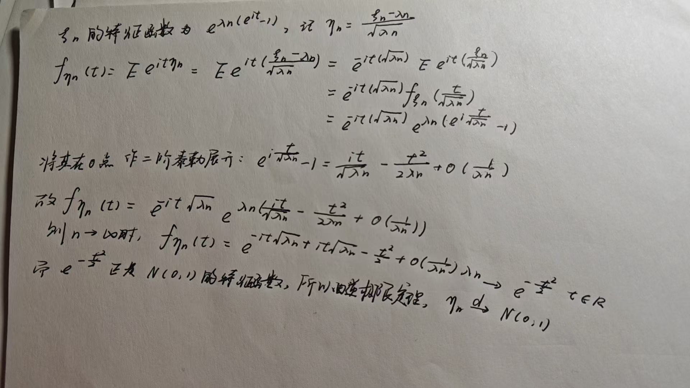

## 极限定理

### 依分布收敛与中心极限定理

#### 随机变量依分布收敛、分布函数弱收敛、特征函数逐点收敛

我们之前提到，分布函数可以刻画随机变量的全部概率性质，下面我们首先来研究分布函数的极限行为

**分布函数弱收敛**

!!! warning "注意"

    分布函数逐点收敛得到的极限函数未必是分布函数，例如：

    $$
    F_n(x) = 
    \begin{cases}
    0, & x < n \\
    1, & x \ge n
    \end{cases}
    $$

    对任意的 $x \in R$，$F_n(x) \to 0$，但极限函数 $G(x)$ 恒等于 0，不是分布函数，因为分布函数满足 $F(\infty) = 1$，$F(-\infty) = 0$。

**随机变量依分布收敛**

设 $\xi$ 为一随机变量，$\left\{\xi_n,n\geq1\right\}$ 是一列随机变量，如果 $\xi_n$ 的分布函数弱收敛于 $\xi$ 的分布函数，则称 $\xi_n$ 依分布收敛于 $\xi$，记作 $\xi_n\xrightarrow{d}\xi$

**Helly第一定理（了解即可）**

设 $\{F_n, n \geq 1\}$ 是一列分布函数，那么存在一个单调不减右连续的函数 $F$ (不一定是分布函数)，$0 \leq F(x) \leq 1$ ($x \in R$)，和一子列 $\{F_{n_k}, k \geq 1\}$，使得对 $F$ 的每个连续点 $x$，$F_{n_k}(x) \to F(x)$ ($k \to \infty$)。

**Helly第二定理（掌握第一条）**

(1) 设 $F$ 是一**分布函数**，$\{F_n, n \geq 1\}$ 是一列**分布函数**，$F_n \xrightarrow{w} F$. 如果 $g(x)$ 是 $R$ 上的**有界连续函数**，则

$$
\int_{-\infty}^{\infty} g(x) \, \mathrm{d}F_n(x) \to \int_{-\infty}^{\infty} g(x) \, \mathrm{d}F(x).
$$

(2) 设 $F$ 和 $F_n$ 是单调不减右连续函数（不一定是分布函数），并且对 $F$ 的任一连续点 $x$ 有 $F_n(x) \to F(x)$，如果 $a < b$ 是 $F$ 的连续点，$g(x)$ 是 $[a, b]$ 上的连续函数，则

$$
\int_{a}^{b} g(x) \, \mathrm{d}F_n(x) \to \int_{a}^{b} g(x) \, \mathrm{d}F(x).
$$

若在Helly第二定理中取 $g(x)=e^{itx}$，则可得到下面的Levy连续性定理（正极限定理）

**Levy连续型定理（正极限定理）**

设 $F$ 是一分布函数，$\{F_n, n \geq 1\}$ 是一列分布函数，且 $F_n \xrightarrow{w} F$. 则相应的特征函数 $\{f_n(t), n \geq 1\}$ 收敛于 $F$ 的特征函数 $f(t)$，且在 $t$ 的任一有限区间内收敛是一致的。

而在第三章中，我们已经知道特征函数和分布函数可以相互唯一确定，同样地，Levy 连续性定理的逆命题同样成立

**逆极限定理**

设 $\{f_n(t), n \geq 1\}$ 是分布函数 $\{F_n(x), n \geq 1\}$ 的特征函数。若对每一 $t \in \mathbb{R}$，有 $f_n(t) \to f(t)$，且 $f(t)$ 在 $t = 0$ 处连续，则 $f(t)$ 一定是某个分布函数 $F$ 的特征函数，且 $F_n \xrightarrow{w} F$

!!! note "Tip"

      这里如果我们知道 $\{f_n(t), n \geq 1\}$ 收敛于某个特征函数的话，则可以直接得出结论，因为特征函数在 $(-\infty,\infty)$ 上是一致收敛的

而根据上述几个定理，我们可以得到以下的等价关系

$$
F_n\xrightarrow{w}F\iff\xi_n\xrightarrow{d}\xi\iff f_{n}(t)\to f(t),\qquad \forall t\in R
$$

!!! note "Tip"

      也就是说，当我们想要证明某个随机变量依分布收敛的时候，我们可以证明分布函数弱收敛，也可以证明特征函数逐点收敛，我们用的比较多的是特征函数逐点收敛

下面我们看一些例题：

**例1** 用特征函数方法证明二项分布的 Possion 逼近定理

**证明** 设 $\xi_n \sim B(n,p_n)$，且 $\lim_{n\to \infty}np_n=\lambda$，$\xi_n$ 的特征函数为

$$
f_n(t)=(p_ne^{it}+q_n)^n,\qquad t\in R
$$

因此对任意的 $t \in R$

$$
\lim_{n\to \infty}f_n(t)=\lim_{n\to \infty}\big[1+\frac{np_n(e^{it}-1)}{n}\big]^n=e^{\lambda(e^{it}-1)}
$$

这正是 $\xi \sim P(\lambda)$ 的特征函数，所以由逆极限定理，$\xi_n$ 依分布收敛于 $\xi$

!!! note "Tip"

      这里用到了一个重要极限
      $$
      \lim_{n\to \infty}(1+\frac{x}{n})^n=e^x
      $$

 
**例2** 设 $\xi_n \sim P(\lambda_n)$，且 $\lambda_n \to \infty$，证明
$$
\frac{\xi_n-\lambda_n}{\sqrt{\lambda_n}} \xrightarrow{d}N(0,1)
$$
这里的 $N(0,1)$ 是指标准正态随机变量

**证明** 

**分布函数弱收敛的性质**

 
1. 设 {$F_{n},n\geq1$} 是一列分布函数，如果 $F_n\xrightarrow{w}F$,$F$ 是一连续的分布函数，则 $F_n$ 在R上一致收敛于 $F$

 
2. 设 $\xi$ 是一随机变量，{$\xi_n,n\geq1$} 是一列随机变量，$g(x)$ 是 $R$ 上的连续函数，如果 $\xi_n \xrightarrow{d} \xi$，则 $g(\xi_n)\xrightarrow{d}g(\xi)$

​	  **证明** 假设 $\xi$ 和 $\{\xi_n, n \geq 1\}$ 的分布函数分别为 $F$ 和 $\{F_n, n \geq 1\}$。若 $\xi_n \xrightarrow{d} \xi$，则 $F_n \xrightarrow{w} F$。由 Helly 第二定理知

$$
\int_{-\infty}^{\infty} e^{itg(x)} \, \mathrm{d}F_n(x) \to \int_{-\infty}^{\infty} e^{itg(x)} \, \mathrm{d}F(x), \quad \forall t \in R.
$$

​	上式将 $e^{itg(x)}$ 视作 Helly 第二定理要求的有界连续函数，由逆极限定理可知 $g(\xi_n)$ 的分布函数弱收敛于 $g(\xi)$ 的分布函数（上式是特征函数逐点收敛），即可得到随机变量弱收敛

$$
g(\xi_n) \xrightarrow{d} g(\xi).
$$

 
3. 设 {$a_n,n\geq1$} 和 {$b_n,n\geq1$} 是两列常数，$F$ 是一分布函数，{$F_n,n\geq1$} 是一列分布函数，如果有 $a_n \to a,b_n\to b,F_n\xrightarrow{w}F$，则
   $$
   F_n(a_nx+b_n)\to F(ax+b)
   $$
   其中 $x$ 使得 $ax+b$ 是 $F$ 的连续点

​	**证明**  令 $\varepsilon > 0$ 使得 $F$ 在 $ax + b \pm \varepsilon$ 处连续（因为 $F$ 的连续点在 $R$ 上是稠密的）。显然 $a_n x + b_n \to ax + b$，因此对充分大的 $n$ 有
$$
ax + b - \varepsilon \leq a_n x + b_n \leq ax + b + \varepsilon.
$$

​	因此

$$
F_n(ax + b - \varepsilon) \leq F_n(a_n x + b_n) \leq F_n(ax + b + \varepsilon).
$$
​	由于 $F_n \xrightarrow{w} F$，则

$$
F(ax + b - \varepsilon) \leq \liminf_{n \to \infty} F_n(a_n x + b_n)
\leq \limsup_{n \to \infty} F_n(a_n x + b_n)
\leq F(ax + b + \varepsilon).
$$

​	令 $\varepsilon \to 0$，由于 $F$ 在 $ax + b$ 处连续，所以结论得证。

​**推论**：若 $\xi_n\xrightarrow{d}\xi,a_n\to a,b_n \to b$，则 $a_n\xi_n+b_n \xrightarrow{d} a\xi+b$，其中 $a\neq0$

​**证明** 不妨假设 $a > 0$ ($a < 0$ 情形类似可证). 由于 $a_n \to a$，所以当 $n$ 充分大时，$a_n > 0$. 此时，对于任意的使得 $\frac{x - b}{a}$ 为 $F$ 的连续点的实数 $x$，根据性质3，有
$$
P(a_n \xi_n + b_n \leq x) = F_n\left(\frac{x - b_n}{a_n}\right) \to F\left(\frac{x - b}{a}\right) = P(a \xi + b \leq x).
$$

​	所以 $a_n \xi_n + b_n \xrightarrow{d} a \xi + b$.

#### 中心极限定理

考虑一个 $n$ 重伯努利试验，每次试验成功的概率为 $p(0<p<1)$，记 $S_n$ 为 $n$ 重伯努利试验中成功的总次数，它是 $n$ 个相互独立的 $0-1(p)$ 随机变量的和，显然有
$$
S_n \sim B(n,p)
$$
人们往往对下列的概率大小感兴趣
$$
P(\alpha \leq S_n \leq \beta)=\sum_{\alpha \leq k \leq \beta}C_n^kp^k(1-p)^{n-k}
$$
其中 $\alpha,\beta$ 是非负整数，直接计算上述和式是比较困难的，如何找到近似计算的公式呢？

**棣莫弗-拉普拉斯定理**

设 $\Phi(x)$ 为标准正态随机变量的分布函数，则对 $x \in R$，有
$$
\lim_{n\to \infty}P(\frac{S_n-np}{\sqrt{npq}}\leq x)=\Phi(x)
$$
其中 $q=1-p$

!!! note "Tip"

      事实上，$\frac{S_n-np}{\sqrt{npq}}$ 是 $S_n$ 的标准化随机变量，棣莫弗-拉普拉斯定理告诉我们，当 $n$ 充分大时，可以将 $\frac{S_n-np}{\sqrt{npq}}$ 近似为标准正态随机变量 $N(0,1)$

所以我们在计算上述的概率是可以借用标准正态分布随机变量的分布函数
$$
P(\alpha\leq S_n \leq \beta)=P(\frac{\alpha-np}{\sqrt{npq}}\leq\frac{S_n-np}{\sqrt{npq}}\leq\frac{\beta-np}{\sqrt{npq}})\approx\Phi(\frac{\beta-np}{\sqrt{npq}})-\Phi(\frac{\alpha-np}{\sqrt{npq}})
$$

!!! note "Tip"

    棣莫弗-拉普拉斯定理与我们第二章中提到的二项分布的泊松逼近定理并无矛盾。在泊松逼近定理中，我们要求 $np_n \to \lambda$，而棣莫弗-拉普拉斯定理中要求 $p$ 是常数。

    在实际应用中，当 $n$ 很大时：
    
    - 若 $p$ 大小适中，就用正态分布逼近二项分布；
    - 若 $p$ 接近 $0$ 或者 $1$，且 $np$ 较小或较大，此时二项分布的图像偏斜度太大，宜用泊松分布去逼近二项分布。

    并且在实际计算中，如果 $n$ 不是很大，我们通常会将上式修正为：

    $$
    \Phi\left(\frac{\beta + 0.5 - np}{\sqrt{npq}}\right) - \Phi\left(\frac{\alpha - 0.5 - np}{\sqrt{npq}}\right)
    $$

    因为由于 $\alpha, \beta$ 是非负整数，有如下关系：

    $$
    \begin{aligned}
    P(\alpha \leq S_n \leq \beta) &\approx \Phi\left(\frac{\beta - np}{\sqrt{npq}}\right) - \Phi\left(\frac{\alpha - np}{\sqrt{npq}}\right) \\
    P(\alpha \leq S_n \leq \beta) &= P(\alpha - 1 < S_n < \beta + 1) \\
    &= \Phi\left(\frac{\beta + 1 - np}{\sqrt{npq}}\right) - \Phi\left(\frac{\alpha - 1 - np}{\sqrt{npq}}\right)
    \end{aligned}
    $$

    因此折中一下，加减 $0.5$ 是合理的。

下面我们看一道例题

**例1** 抛一枚质量均匀的硬币，需要抛多少次才能保证出现正面的频率在 $(0.4,0.6]$ 之间的概率不小于 $90\%$

**解** 令 $n$ 为抛掷次数，$S_n$ 为出现正面的次数，则 $S_n \sim B(n,0.5)$，由题意，需要求 $n$ 使得
$$
P(0.4<S_n/n\leq0.6)\geq0.9
$$
且 $ES_n=0.5n,VarS_n=n/4$，利用棣莫弗-拉普拉斯定理则有

$$\begin{aligned}
P(0.4<S_n/n\leq0.6)&=P(\frac{0.4n-0.5n}{\sqrt{n/4}}<\frac{S_n-0.5n}{\sqrt{n/4}}\leq\frac{0.6n-0.5n}{\sqrt{n/4}})\\
&\approx\Phi(0.2\sqrt{n})-\Phi(-0.2\sqrt{n})=2\Phi(0.2\sqrt{n})-1
\end{aligned}$$

那么现在问题即转化为求 $n$ 使得

$$
2\Phi(0.2\sqrt{n})-1\geq0.9
$$

我们知道 $0.95$ 介于 $\Phi(1.64),\Phi(1.65)$ 之间，因此我们认为 $\Phi(1.645)=0.95$，易知当 $n\geq69$ 时满足要求

!!! note "Tip"

      注意理解出现正面的频率在 $(0.4,0.6]$ 之间的概率不小于 $90\%$，怎么把它转化为某个事件的概率？

**中心极限定理**

设 {$\xi_n,n\geq1$} 是一列随机变量，如果存在常数列 {$B_n>0,n\geq1$} 以及 {$A_n,n\geq1$} 使得
$$
\frac{\sum_{k=1}^n\xi_k-A_n}{B_n}\xrightarrow{d}N(0,1)
$$
则称 $\left\{\xi_n,n\geq1 \right\}$ 满足中心极限定理，通常我们称 $A_n$ 为中心化因子，$B_n$ 为正则化因子，称 $\sum_{k=1}^n\xi_k$ 为部分和

**林德贝格-列维中心极限定理**

设 {$\xi_n,n\geq1$} 是一列**独立同分布**的随机变量序列，记
$$
S_n=\sum_{k=1}^n\xi_k,\qquad E\xi_1=a,\qquad Var\xi_1=\sigma^2 \in (0,\infty)
$$
则中心极限定理成立，也即
$$
\frac{S_n-na}{\sqrt{n\sigma^2}}\xrightarrow{d}N(0,1)
$$

!!! note "Tip"

      我们需要注意的是，定理中给出的都是单个随机变量的期望和方差，而对于 $S_n$ 来说，其期望是 $na$，方差是 $n\sigma^2$，所以其实上式也是标准化后的 $S_n$ 依分布收敛于标准正态随机变量。并且林德贝格-列维中心极限定理要求这一列随机变量独立同分布

**证明** 利用特征函数来证明此定理，记 $f^k(t)$ 与 $f_n(t)$ 分别为 $\xi_k-a$ 与 $\frac{S_n-na}{\sqrt{n}\sigma}$ 的特征函数，因为序列 {$\xi_n,n\geq1$} 是独立同分布的，有

$$\begin{aligned}
f_n(t)&=Ee^{it\frac{S_n-na}{\sqrt{n}\sigma}}=Ee^{it\frac{\sum_{k=1}^n(\xi_k-a)}{\sqrt{n}\sigma}}=Ee^{\frac{it}{\sqrt{n}\sigma}\sum_{k=1}^n(\xi_k-a)}\\&=\prod_{k=1}^nEe^{\frac{it}{\sqrt{n}\sigma}(\xi_k-a)}=\prod_{k=1}^n f^k(\frac{t}{\sqrt{n}\sigma})=[f(\frac{t}{\sqrt{n}\sigma})]^n
\end{aligned}$$

又因为 $E\xi_1=a,Var\xi_1=\sigma^2$，所以 $f(t)$ 有二阶连续导数且有下列的 Taylor 展开式
$$
f(x)=f(0)+f'(0)x+\frac{1}{2}f''(0)x^2+o(x^2),\qquad x\to0
$$
因为
$$
f'(0)=iE(\xi_1-a)=0,\qquad f''(0)=i^2E(\xi_1-a)^2=-\sigma^2
$$
故
$$
\forall t \in R,f(\frac{t}{\sqrt{n}\sigma})=1-\frac{t^2}{2n}+o(\frac{1}{n})\qquad(n\to \infty)
$$
从而
$$
\forall t\in R,f_{n}(t)=[f(\frac{t}{\sqrt{n}\sigma})]^n=\lim_{n\to \infty}(1+\frac{-\frac{t^2}{2}}{n})^n=e^{-\frac{t^2}{2}}\qquad (n\to \infty)
$$
即有其特征函数逐点收敛于标准正态分布的特征函数，所以随机变量依分布收敛于标准正态随机变量

下面我们看一道例题

**例1** 当辐射的强度超过每小时0.5毫伦琴(mr)时，辐射会对人的健康造成伤害。设一台彩电工作时的平均辐射强度是0.036mr/h，方差是0.0081，则家庭中一台彩电的辐射一般不会对人造成健康伤害。但是彩电销售店同时有多台彩电工作时，辐射可能对人造成健康伤害。现在有16台彩电同时工作，问这16台彩电的辐射量可以对人造成健康伤害的概率。

**解** 用 $\xi_k$ 表示第 $k$ 台彩电的辐射量 (mr/h)，则
$$
\mathrm{E}\xi_k = 0.036, \quad \mathrm{Var}\xi_k = 0.0081,
$$

并且 $S_{16} = \sum_{k=1}^{16} \xi_k$ 是 $n = 16$ 台彩电的辐射量。题目要求 $P(S_{16} > 0.5)$。认为 $\{\xi_k, k \geq 1\}$ 是 $i.i.d.$ 的，由 Lindeberg–Lévy CLT 知：

$$
\frac{S_{16} - 16 \times 0.036}{\sqrt{16 \times 0.09}} \sim N(0, 1).
$$

所以

$$
\begin{aligned}
\mathrm{P}(S_{16} > 0.5) &= \mathrm{P}\left(\frac{S_{16} - 16 \times 0.036}{\sqrt{16 \times 0.09}} > \frac{0.5 - 16 \times 0.036}{\sqrt{16 \times 0.09}}\right) \\
&= \mathrm{P}\left(\frac{S_{16} - 16 \times 0.036}{\sqrt{16 \times 0.09}} > -0.211\right) \\
&\approx \Phi(0.211) = 0.58.
\end{aligned}
$$

林德贝格-列维中心极限定理要求各 $\xi_k$ 同分布，事实上这一条件可以放宽，即在和式
$$
\frac{\sum_{k=1}^n\xi_k-E(\sum_{k=1}^n\xi_k)}{\sqrt{\sum_{k=1}^nVar\xi_k}}
$$
中，只要被加项
$$
\frac{\xi_k-E(\xi_k)}{\sqrt{\sum_{k=1}^nVar\xi_k}}
$$
均匀的小，则中心极限定理仍然成立

下面**两个定理了解即可**

**林德贝格-费勒中心极限定理**

设 $\{\xi_k, k \geq 1\}$ 是独立随机变量序列，则

$$
\lim_{n \to \infty} \frac{\max_{1 \leq k \leq n} \operatorname{Var} \xi_k}{\sum_{k=1}^n \operatorname{Var} \xi_k} = 0 \quad (\text{Feller 条件})
$$

和

$$
\frac{S_n - E S_n}{\sqrt{\operatorname{Var} S_n}} = \frac{\sum_{k=1}^n \xi_k - E \left( \sum_{k=1}^n \xi_k \right)}{\sqrt{\sum_{k=1}^n \operatorname{Var} \xi_k}} \xrightarrow{d} N(0, 1)
$$

成立的充要条件是 Lindeberg 条件被满足:

$$
\frac{1}{\sum_{k=1}^n \operatorname{Var} \xi_k} \sum_{k=1}^n \int_{\frac{|x - E \xi_k|}{\sqrt{\sum_{k=1}^n \operatorname{Var} \xi_k}} \geq \tau} (x - E \xi_k)^2 \mathrm{d} F_k(x) \to 0, \quad \forall \tau > 0.
$$
**李雅普诺夫中心极限定理**

若对独立随机变量序列 $\{\xi_k, k \geq 1\}$ 存在常数 $\delta > 0$，使得当 $n \to \infty$ 时有
$$
\frac{1}{\left( \sum_{k=1}^n \operatorname{Var} \xi_k \right)^{1 + \delta/2}} \sum_{k=1}^n \mathbb{E} |\xi_k - \mathbb{E} \xi_k|^{2 + \delta} \to 0,
$$

则CLT成立，即

$$
\frac{S_n - E S_n}{\sqrt{\operatorname{Var} S_n}} = \frac{\sum_{k=1}^n \xi_k - E \left( \sum_{k=1}^n \xi_k \right)}{\sqrt{\sum_{k=1}^n \operatorname{Var} \xi_k}} \xrightarrow{d} N(0, 1).
$$

!!! note "Tip"

      这两个定理不要求随机变量同分布，当我们遇到随机变量独立但不同分布的时候，可以考虑使用这两个定理

### 依概率收敛与弱大数定律

#### 依概率收敛

分布函数可以完整地描述随机变量取值的分布规律，但是分布函数的收敛性并不能反应**随机变量序列取值的接近程度**

举例如下：我们向区间 $[0,1]$ 上随机等可能投点，样本点 $\omega$ 表示落点的位置，定义

$$
\xi(\omega) = 
\begin{cases} 
1, & \omega \in [0, 0.5], \\
0, & \omega \in (0.5, 1],
\end{cases}\qquad
\eta(\omega) = 
\begin{cases} 
0, & \omega \in [0, 0.5], \\
1, & \omega \in (0.5, 1].
\end{cases}
$$

则 $\xi,\eta$ 具有相同的分布函数

$$
F(x)=\begin{cases}
0,&x=0,\\
\frac{1}{2},&0\leq x<1,\\
1,&x\geq1
\end{cases}
$$

即两个不同的随机变量可以有相同的分布函数，若定义 $\xi_n=\xi,n\geq1$，则 $\xi_n \xrightarrow{d}\eta$，但 $|\xi_n-\eta|=|\xi-\eta| \equiv1$

所以我们需要引入另外的收敛性来度量随机变量取值的接近程度

**依概率收敛** 设 $\xi$ 和 {$\xi_n,n>1$} 是定义在同一概率空间上的随机变量序列，如果对任意的 $\varepsilon>0$，有
$$
\lim_{n\to \infty}P(|\xi_n-\xi|\geq0)=0
$$
或
$$
\lim_{n\to \infty}P(|\xi_n-\xi|<\varepsilon)=1
$$
则称 {$\xi_n,n\geq1$} 依概率收敛于 $\xi$，记作 $\xi_n \xrightarrow{P}\xi$

!!! note "Tip"

      $\xi_n \xrightarrow{P}\xi$可以直观地理解为：除去极小的可能性，只要 $n$ 充分大，$\xi$ 和 $\xi_n$ 的取值可以任意接近；并且**依分布收敛不能推出依概率收敛**

关于**依分布收敛和依概率收敛的关系**有如下定理：

设 $\xi$ 和 $\xi_n,n\geq1$ 是定义在同一概率空间上的随机变量，则

- 如果 $\xi_n \xrightarrow{P}\xi$，则 $\xi_n \xrightarrow{d}\xi$
- 如果 $\xi_n \xrightarrow{d}c$，$c$ 是常数，则 $\xi_n \xrightarrow{P}c$

即依概率收敛可以推出依分布收敛；而若某个随机变量依分布收敛到某个常数，则可以推出依概率收敛

**证明** 对**第一条**，设 $F,F_n$ 分别是 $\xi,\xi_n$ 的分布函数，$x$ 为 $F$ 的连续点，任意给定 $\varepsilon>0$，有

$$
\left\{\xi\leq x-\varepsilon\right\}=\left\{\xi\leq x-\varepsilon,\xi_n\leq x\right\}\bigcup\left\{\xi\leq x-\varepsilon,\xi_n >x\right\}\subset(\left\{\xi_n\leq x\right\}\bigcup\left\{\xi_n-\xi \geq \varepsilon\right\})
$$

这里由 $\left\{\xi\leq x-\varepsilon,\xi_n >x\right\}$ 放大到 $\left\{\xi_n-\xi \geq \varepsilon\right\}$

取其概率有

$$
P(\xi \leq x-\varepsilon)\leq P(\left\{\xi_n\leq x\right\}\bigcup\left\{\xi_n-\xi \geq \varepsilon\right\})\leq P(\xi_n \leq x)+P(\xi_n-\xi \geq \varepsilon)
$$

也即
$$
F(x-\varepsilon)\leq F_n(x)+P(\xi_n-\xi\geq \varepsilon)
$$
又有$\xi_n \xrightarrow{P}\xi$，所以
$$
P(\xi_n-\xi \geq \varepsilon)\leq P(|\xi_n-\xi|\geq\varepsilon)\to0
$$
从而有
$$
F(x-\varepsilon)\leq \lim_{n\to \infty}infF_n(x)
$$
类似地有

$$
\begin{aligned}
\left\{\xi_n \leq x\right\} &= \left\{\xi_n \leq x, \xi \leq x + \varepsilon\right\} \cup \left\{\xi_n \leq x, \xi > x + \varepsilon\right\} \subset \left\{\xi \leq x + \varepsilon\right\} \cup \left\{\xi - \xi_n \geq \varepsilon\right\},
\end{aligned}
$$

从而

$$
F_n(x) \leq F(x + \varepsilon) + \mathbb{P}(\xi - \xi_n \geq \varepsilon).
$$

因此

$$
\limsup_{n \to \infty} F_n(x) \leq F(x + \varepsilon)
$$
所以我们可以得到对任意的 $\varepsilon>0$，有
$$
F(x-\varepsilon)\leq\lim_{n\to \infty}inf F_n(x)\leq\lim_{n \to \infty}supF_n(x)\leq F(x+\varepsilon)
$$
由于 $x$ 是 $F$ 的连续点，令 $\varepsilon \to 0$ 得
$$
\lim_{x\to \infty}F_n(x) = F(x)
$$
得到分布函数弱收敛，故可以得到随机变量依分布收敛，即$\xi_n \xrightarrow{d}\xi$

对**第二条**，如果 $\xi_n \xrightarrow{d}c$，则当 $x\neq c$ 时，

$$
\lim_{n\to \infty}F_{n}(x)=\begin{cases}0,&x>c\\1,&x<c\end{cases}
$$

!!! warning "注意"

      这里本来对于 $c$ 的分布函数来说是有 $x\leq c$ 的，但是 $x=c$ 是不连续点，我们将其剔除，才符合分布函数弱收敛的定义

因此对任意的 $\varepsilon>0$ 有

$$\begin{aligned}
P(|\xi_n-c|\geq\varepsilon)&=P(\xi_n \geq c+\varepsilon)+P(\xi_n \leq c- \varepsilon)\\&=1-P(\xi_n<c+\varepsilon)+P(\xi_n \leq c-\varepsilon)=1-F_n(c+\varepsilon-0)+F_n(c-\varepsilon)\to0
\end{aligned}$$

!!! note "Tip"

      这是因为 $c+\varepsilon-0>c$，分布函数在这点的值趋向于 $1$ ，而 $c-\varepsilon<c$，分布函数在这点的值趋向于 $0$

所以有$\xi_n \xrightarrow{P}c$

!!! note "Tip"

      我们不管要证明什么，都从其定义或结论的式子和结果去尝试观察一下，不然光干瞪眼也做不出来

**Slutsky引理**

如果 $\xi_n \xrightarrow{d}\xi$，$\eta_n \xrightarrow{d} c$，则 $\xi_n+\eta_n \xrightarrow{d} \xi +c$

!!! warning "注意"

      注意这里的其中一个随机变量是依分布收敛到**非退化随机变量**，而另一个随机变量是依分布收敛到**退化随机变量（常数）**，如果两个都收敛到非退化随机变量的话，就需要 $\xi_n,\eta_n$ 相互独立，否则在一般情况下无法得到 $\xi_n+\eta_n \xrightarrow{d} \xi +\eta$

下面我们看一道例题

**例1** 设 {$\xi_n,n\geq1$} 独立同分布，都为 $[0,a]$ 上的均匀分布，$\eta_n = max_{1\leq k\leq n}\xi_k$，求证 $\eta_n \xrightarrow{P}a$

**证明** 只需证明 $\eta_n \xrightarrow{d}a$，因为依概率收敛到一个常数，只需依分布收敛即可证得

这里我们通过证明分布函数弱收敛来证明随机变量依分布收敛，易知 $\xi_k$ 的分布函数为

$$
F(x)=\begin{cases}
0,&x<0,\\
x/a, &0\leq x<a,\\
1,&x\geq a
\end{cases}
$$

所以 $\eta_n$ 的分布函数 $G_n(x)$ 为

$$
G_n(x)=[F(x)]^n=\begin{cases}
0,&x<0,\\
(x/a)^n,&0\leq x<a,
\\1,&x\geq a
\end{cases}
\ \ \to 
\begin{cases}
0,&x<a\\
1,&x\geq a
\end{cases}
$$

而后者正是在 $a$ 点退化的分布函数，于是我们得到了分布函数弱收敛，自然有随机变量依分布收敛到常数，从而得到依概率收敛

关于依概率收敛，有如下的重要结论：

设 $\xi$ 与 {$\xi_n,n\geq1$} 是定义在同一概率空间上的随机变量序列，则有

- 若 $\xi_n \xrightarrow{P} \xi,\xi_n \xrightarrow{P}\eta$，则 $P(\xi=\eta)=1$
- 若 $\xi_n \xrightarrow{P}\xi$，g是 $(-\infty,\infty)$上的连续函数，则 $g(\xi_n)\xrightarrow{P}g(\xi)$

**证明** 

对**第一条**，其证明如下：我们想要证明对任意的 $\varepsilon>0$，$P(|\xi-\eta|>\varepsilon)=0$

考虑事件 {$|\xi-\eta| \geq \varepsilon$}，我们希望利用上两个依概率收敛的条件，所以我们利用绝对值不等式构造出 $\xi_n-\xi,\xi_n-\eta$ 两个结构

$$
\left\{|\xi-\eta|\geq\varepsilon \right\}=\left\{|\xi-\xi_n+\xi_n-\eta|\geq \varepsilon\right\} \subset \left\{|\xi_n-\xi|\geq \varepsilon/2\right\}\bigcup\left\{|\xi_n-\eta| \geq \varepsilon/2\right\}
$$

这里有一个概率论中很常用的手法，如果有事件 $A,B$ 满足 $A\subset B$，那么对于它们的概率就会有 $P(A) \leq P(B)$

所以就会有
$$
P(|\xi-\eta| \geq \varepsilon)=P(|\xi -\xi_n+\xi_n-\eta| \geq \varepsilon)\leq P(|\xi_n-\xi| \geq \varepsilon/2)+P(|\xi_n-\eta|\geq \varepsilon/2)
$$
而由于 $\xi_n \xrightarrow{P} \xi,\xi_n \xrightarrow{P}\eta$，令 $n\to \infty$
$$
P(|\xi-\eta|\geq\varepsilon) \leq \lim_{n\to \infty}[P(|\xi_n-\xi| \geq \varepsilon/2)+P(|\xi_n-\eta|\geq \varepsilon/2)]=0
$$
现在我们再考虑事件 {$|\xi-\eta|>0$}，有
$$
P(|\xi-\eta|>0)=P(\bigcup_{n=1}^{\infty}|\xi-\eta|\geq1/n)\leq\sum_{n=1}^{\infty}P(|\xi-\eta|\geq1/n)=0
$$
所以有 $P(\xi=\eta)=1$

对**第二条**，首先因为 $g(x)$ 在 $R$ 上连续，所以其在 $R$ 上的任意一个闭区间上一致连续。那么就会有对任意的 $M>0$，$g(x)$ 在 $[-M,M]$ 上一致连续，即有当 $|x|\leq M,|y| \leq M$ 时，对给定的 $\varepsilon>0$，存在 $\delta>0$ 使得当 $|x-y|<\delta$ 时，$|g(x)-g(y)|<\varepsilon$

所以有

$$
\begin{aligned}
P(|g(\xi_n) - g(\xi)| \geq \varepsilon) 
\leq & P(|g(\xi_n) - g(\xi)| \geq \varepsilon, |\xi_n| \leq M, |\xi| \leq M) 
 + P(|\xi_n| > M) + P(|\xi| > M) \\
\leq & P(|\xi_n - \xi| \geq \delta, |\xi_n| \leq M, |\xi| \leq M)  + P(|\xi_n - \xi + \xi| > M) + P(|\xi| > M) \\
\leq & P(|\xi_n - \xi| \geq \delta) + P(|\xi_n - \xi| > M/2) + P(|\xi| > M/2) + P(|\xi| > M). 
\end{aligned}
$$

而对固定的 $M>0$，我们令 $n \to \infty$，就可以得到
$$
\lim_{n \to \infty}P(|g(\xi_n)-g(\xi)|\geq \varepsilon)\leq P(|\xi|>M/2)+P(|\xi|>M)
$$
再由 $M$ 的任意性，令 $M \to \infty$，就可以得到

$$
\lim_{n \to \infty}P(|g(\xi_n)-g(\xi)|\geq \varepsilon)\leq \lim_{M\to \infty}[ P(|\xi|>M/2)+P(|\xi|>M)]=0
$$

所以可以得到 $g(\xi_n)\xrightarrow{P}g(\xi)$

**依概率收敛的Slutsky引理**

- 若 $\xi_n \xrightarrow{P}\xi,\eta_n \xrightarrow{P} \eta$，则 $\xi_n \pm \eta_n \xrightarrow{P} \xi \pm \eta$
- 若 $\xi_n \xrightarrow{P} \xi, \eta_n \xrightarrow{P}\eta$，则 $\xi_n\eta_n\xrightarrow{P}\xi\eta$
- 若 $\xi_n \xrightarrow{P} \xi, \eta_n \xrightarrow{P}c$，$c$ 为一常数，假设 $\eta_n$ 与 $c$ 都不为 $0$，则有 $\frac{\xi_n}{\eta_n} \xrightarrow{P} \frac{\xi}{\eta}$

!!! warning "注意"

      因为以概率收敛的条件比依分布收敛的条件更强，所以Slutsky引理的结论也更强，对于加减乘三种运算，两列随机变量都可以以概率分布收敛到随机变量，但是对于除法，其中一个随机变量必须以概率收敛到退化随机变量（常数）；而依分布收敛则需要 $\xi_n,\eta_n$ 相互独立

**广义Markov（马尔科夫）不等式**

设 $\xi$ 是定义在概率空间 $(\Omega, \mathcal{F}, P)$ 上的随机变量，$g(x)$ 是 $[0, \infty)$ 上**非负单调不减**函数。则对任意的 $x > 0$，

$$
P(|\xi| \geq x) \leq \frac{E g(|\xi|)}{g(x)}.
$$
**证明** 
$$
P(|\xi|\geq x)\leq P(g(|\xi|\geq g(x))\leq\frac{Eg(|\xi|)}{g(x)})
$$
这里左边的不等式是因为 $g(x)$ 是非负单调不减函数，$|\xi| \geq x \Rightarrow g(|\xi|) \geq g(x)$，事件是包含关系，那么反映到概率上就是小于等于关系；等式右边则是用到了第三章中提及的马尔科夫不等式

由马尔科夫不等式我们可以得到一个定理，其反映了随机变量序列依概率收敛的充分必要条件：
$$
\xi_n \xrightarrow{P} \xi \iff E\frac{|\xi_n-\xi|^2}{1+|\xi_n-\xi|^2}\to 0
$$
**证明** 充分性：我们取 $f(x)=\frac{x^2}{1+x^2}$，这个函数在 $[0,\infty)$ 上是非负单调不减的函数，所以对任意的 $\varepsilon>0$，由 Markov 不等式可以知道
$$
P(|\xi_n-\xi|\geq \varepsilon) \leq \frac{1+\varepsilon^2}{\varepsilon^2}E\frac{|\xi_n -\xi|^2}{1+|\xi_n-\xi|^2}\to0
$$
所以 $\xi_n \xrightarrow{P}\xi$

必要性：设 $F_n(x)$ 为 $\xi_n-\xi$ 的分布函数，对任意的 $\xi>0$，有

$$\begin{aligned}
E\frac{|\xi_n-\xi|^2}{1+|\xi_n-\xi|^2}=\int_{-\infty}^{\infty}\frac{x^2}{1+x^2}dF_n(x)=\int_{|x|<\varepsilon}\frac{x^2}{1+x^2}dF_n(x)+\int_{|x|\geq \varepsilon}\frac{x^2}{1+x^2}dF_n(x)\\
\leq \frac{\varepsilon^2}{1+\varepsilon^2}\int_{|x|\leq \varepsilon}dF_n(x)+\int_{|x|\geq \varepsilon}dF_n(x)=\frac{\varepsilon^2}{1+\varepsilon^2}P(|\xi_n-\xi|<\varepsilon)+P(|\xi_n-\xi|\geq \varepsilon)\\\leq \frac{\varepsilon^2}{1+\varepsilon^2}+P(|\xi_n-\xi|\geq \varepsilon)
\end{aligned}$$

!!! note "Tip"

      这里第一行到第二行，是由于$f(x) \leq f(\varepsilon)$和$f(x) \leq 1$两个放缩

因为 $\xi_n \xrightarrow{P}\xi$，先令 $n \to \infty$，再令 $\varepsilon \to 0$，就可以得到
$$
E\frac{|\xi_n -\xi|^2}{1+|\xi_n-\xi|^2}\to 0
$$

#### 弱大数定律

设 {$\xi_n,n\geq1$} 是定义在概率空间 $(\Omega, \mathcal{F}, P)$ 上的随机变量序列，如果存在常数列 {$a_n,n\geq1$} 和 {$b_n ,n\geq1$} 使得
$$
\frac{1}{a_n}\sum_{k=1}^n\xi_k-b_n \xrightarrow{P}0
$$
则称 {$\xi_n,n \geq 1$} 服从弱大数定律，简称 {$\xi_n,n\geq1$} 服从大数定律

**伯努利大数定律**

设 {$\xi_n ,n\geq1$} 是一列独立同分布（服从两点分布）的随机变量序列
$$
P(\xi_k=1)=p,\ P(\xi_k=0)=1-p,\ 0<p<1
$$
记 $S_n=\sum_{k=1}^n \xi_k$，则
$$
\frac{S_n}{n}\xrightarrow{P}p
$$
伯努利大数定律是切比雪夫大数定律的特例

**切比雪夫大数定律**

设 {$\xi_n,n \geq 1$} 是一列**独立**随机变量序列(不要求同分布)，$E\xi_k = \mu_k, Var\xi_k =\sigma_k^2$，如果
$$
\frac{1}{n^2}\sum_{k=1}^n \sigma_k^2 \to 0  \qquad 也即\frac{1}{n^2}\sum_{k=1}^n Var\xi_k \to 0
$$
则 {$\xi_n,n\geq1$} 服从大数定律，即
$$
\frac{1}{n}\sum_{k=1}^n\xi_k-\frac{1}{n}\sum_{k=1}^n \mu_k \xrightarrow{P}0
$$
部分和序列-期望依概率收敛到 $0$

!!! note "Tip"

      若把条件中的 $\frac{1}{n^2}\sum_{k=1}^n \sigma_k^2 \to 0$ 改成 $\frac{1}{n^2}Var(\sum_{k=1}^n \xi_k)$，此时不需要假设 {$\xi_n,n \geq 1$} 是独立随机变量序列，则定理的结论仍然成立，成为 Markov 大数定律

**证明（对切比雪夫大数定律）** 
$$
E(\frac{1}{n}\sum_{k=1}^n\xi_k)=\frac{1}{n}\sum_{k=1}^n \mu_k,\ Var(\frac{1}{n}\sum_{k=1}^n \xi_k)=\frac{1}{n^2}\sum_{k=1}^nVar \xi_k
$$
由切比雪夫不等式可知，对任意的 $\varepsilon>0$
$$
P(|\frac{1}{n}\sum_{k=1}^n\xi_k-\frac{1}{n}\sum_{k=1}^n \mu_k|\geq \varepsilon)\leq \frac{1}{\varepsilon^2}Var(\frac{1}{n}\sum_{k=1}^n \xi_k)=\frac{1}{\varepsilon^2}\cdot\frac{1}{n^2}\sum_{k=1}^n\sigma_k^2 \to 0
$$
所以结论成立

若 {$\xi_n,n \geq 1$} 不仅独立，而且同分布，可以把切比雪夫大数定律改进到下面的辛钦大数定律（这是最经典的大数定律）

**辛钦大数定律**

设 {$\xi_n ,n \geq 1$} 是一列独立同分布随机变量序列，$E|\xi_1|<\infty$，记 $E\xi_1=\mu$，$S_n = \sum_{k=1}^n \xi_k$，则 {$\xi_n ,n \geq 1$} 服从大数定律，即
$$
\frac{S_n}{n}\xrightarrow{P}\mu
$$

!!! warning "注意"

      辛钦大数定律不能用切比雪夫不等式进行证明，因为条件只给出了数学期望存在，也即一阶矩存在，而方差是否存在我们并不知道

**证明** 因为要证 $\frac{S_n}{n}$ 依概率收敛到某个常数，我们可以证明其依分布收敛到该常数，也即 $\frac{S_n}{n}\xrightarrow{d} \mu$，我们采用特征函数进行证明

分别令 $f(t),f_n(t)$ 为 $\xi_1,\frac{S_n}{n}$ 的特征函数，因为 {$\xi_n,n \geq 1$} 是独立同分布的随机变量序列，所以

$$
f_n(t)=Ee^{it\frac{S_n}{n}}=\prod_{k=1}^nEe^{it\frac{\xi_k}{n}}=[f(\frac{t}{n})]^n
$$
又由于 $E\xi_1=\mu$，所以 $f'(0)=i\cdot E\xi_1=i\mu$，从而
$$
f(x)=1+f'(0)x+o(x)=1+i\mu x+o(x)\qquad (x\to0)
$$
因此对任意的 $t \in R$，有
$$
f_n(t)=[1+i\mu t/n+o(1/n)]^n \to e^{i\mu t}\qquad (n \to \infty)
$$
后者正是恒等于 $\mu$ 的退化随机变量的特征函数，所以由逆极限定理可以知道 $\frac{S_n}{n} \xrightarrow{d} \mu$，即 $\frac{S_n}{n} \xrightarrow{P} \mu$

下面我们看一些例题

**例1** 设 {$\xi_k ,k \geq1$} 有分布列 $P(\xi_k = \pm k^s)=1/2,s < 1/2$ 为正常数，且 ${\xi_k,k\geq 1}$ 相互独立，试证 {$\xi_k , k\geq 1$} 服从大数定律

**证明** 因为 $\xi_k$ 独立但不一定同分布，我们使用切比雪夫大数定律来证明
$$
E\xi_k = 0,\ \ \  Var \xi_k = k^{2s} 
$$
所以当 $0<s<1/2$ 时
$$
\frac{1}{n^2}\sum_{k=1}^nVar\xi_k=\frac{1}{n^2}\sum_{k=1}^nk^{2s}<\frac{1}{n^2}\sum_{k=1}^nn^{2s}=n^{2s-1} \to 0
$$
所以 {$\xi_k ,k \geq 1$} 服从大数定律：
$$
\frac{\sum_{k=1}^n\xi_k}{n} \xrightarrow{P}0
$$
**例2** （矩估计的相合性）假定总体 $\xi$ 的一阶矩（即数学期望）$m_1$ 存在（隐含 $E|\xi<\infty|$）但未知，通常的做法是对 $\xi$ 进行 $n$ 次独立重复观测，得到样本 $\xi_1,\cdot\cdot\cdot,\xi_n$，并以它们的算术平均（也称为样本的1阶矩）$A_1=\frac{1}{n}\sum_{j=1}^n \xi_j$ 作为 $m_1$的估计量，这种做法的依据就是辛钦大数定律
$$
A_1 \xrightarrow{P}m_1
$$
更重要的是，根据辛钦大数定律，若总体的 $k$ 阶矩 $m_k=E\xi^k$ 存在（隐含 $E|\xi|^k<\infty$），这时样本的 $k$ 阶矩 $A_k =\frac{1}{n}\sum_{j=1}^n \xi_j^k$ 可作为 $m_k$ 的估计量，依据是
$$
A_k \xrightarrow{P} m_k
$$
